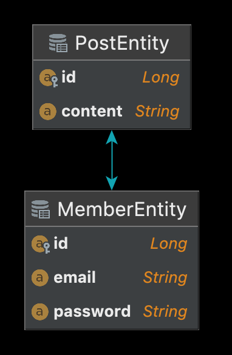

# Table of Contents
[[toc]]

## N+1 문제
1번의 쿼리를 날렸을 때 의도하지 않은 N번의 쿼리가 추가적으로 실행되는 것을 의미한다. 두 엔티티 사이에 연관관계가 있을 떄 발생한다.

## 예제 살펴보기
`N+1 문제` 예제를 살펴보기 위해 다음과 같이 데이터베이스 스키마를 설계한다. `member` 테이블은 다음과 같다.
```
CREATE TABLE member (
    id          bigint auto_increment primary key,
    email       varchar(255) null,
    password    varchar(255) null
)
```
`post` 테이블은 다음과 같다.
```
CREATE TABLE post
(
    id          bigint auto_increment primary key,
    content     varchar(255) null,
    writer_id   bigint       null,
    foreign key (writer_id) references member (id)
)
```
그리고 테스트 데이터를 삽입하자.
```
INSERT INTO member(id, email, password) VALUES(1, 'paul@gmail.com', '1234');
INSERT INTO post(content, writer_id) VALUE('content1', 1);
INSERT INTO post(content, writer_id) VALUE('content2', 1);
INSERT INTO post(content, writer_id) VALUE('content3', 1);

INSERT INTO member(id, email, password) VALUES(2, 'john@gmail.com', '1234');
INSERT INTO post(content, writer_id) VALUE('content4', 2);
INSERT INTO post(content, writer_id) VALUE('content5', 2);
INSERT INTO post(content, writer_id) VALUE('content6', 2);

INSERT INTO member(id, email, password) VALUES(3, 'smith@gmail.com', '1234');
INSERT INTO post(content, writer_id) VALUE('content7', 3);
INSERT INTO post(content, writer_id) VALUE('content8', 3);
INSERT INTO post(content, writer_id) VALUE('content9', 3);
```


## FetchType.EAGER 에서의 N+1 문제
다음과 같이 엔티티를 설계한다. `MemberEntity`와 `PostEntity`은 `1:N 관계`다.
``` java
@Entity
@Table(name = "member")
@Getter
@NoArgsConstructor
public class MemberEntity {
    @Id
    @Column(name = "id")
    @GeneratedValue(strategy = GenerationType.IDENTITY)
    private Long id;

    @Column
    private String email;

    @Column
    private String password;

    @OneToMany(mappedBy = "writer", fetch = FetchType.EAGER)
    private List<PostEntity> posts = new ArrayList<PostEntity>();

    @Builder
    public MemberEntity(String email, String password) {
        this.email = email;
        this.password = password;
    }
}
```
``` java
@Entity
@Table(name = "post")
@Getter
@NoArgsConstructor
public class PostEntity {

    @Id
    @Column(name="id")
    @GeneratedValue(strategy = GenerationType.IDENTITY)
    private Long id;

    @Column
    private String content;

    @ManyToOne
    @JoinColumn(name = "writer_id")
    private MemberEntity writer;

    @Builder
    public PostEntity(String content) {
        this.content = content;
    }
}
```



이제 `Spring Data JPA`의 쿼리 메소드로 `MemberEntity`를 조회해보자.
``` java
@DataJpaTest
@AutoConfigureTestDatabase(replace = AutoConfigureTestDatabase.Replace.NONE)
class Test {

    @Autowired
    private MemberRepository memberRepository;

    @Test
    void test() {
        List<MemberEntity> members = memberRepository.findAll();
    }
}
```
Spring Data JPA의 쿼리 메소드는 `JPQL`로 변환되어 실행된다. 실제 출력되는 로그를 확인해보자. 
```
Hibernate: 
    select
        memberenti0_.id as id1_0_,
        memberenti0_.email as email2_0_,
        memberenti0_.password as password3_0_ 
    from
        member memberenti0_
Hibernate: 
    select
        posts0_.writer_id as writer_i3_1_0_,
        posts0_.id as id1_1_0_,
        posts0_.id as id1_1_1_,
        posts0_.content as content2_1_1_,
        posts0_.writer_id as writer_i3_1_1_ 
    from
        post posts0_ 
    where
        posts0_.writer_id=?
Hibernate: 
    select
        posts0_.writer_id as writer_i3_1_0_,
        posts0_.id as id1_1_0_,
        posts0_.id as id1_1_1_,
        posts0_.content as content2_1_1_,
        posts0_.writer_id as writer_i3_1_1_ 
    from
        post posts0_ 
    where
        posts0_.writer_id=?
Hibernate: 
    select
        posts0_.writer_id as writer_i3_1_0_,
        posts0_.id as id1_1_0_,
        posts0_.id as id1_1_1_,
        posts0_.content as content2_1_1_,
        posts0_.writer_id as writer_i3_1_1_ 
    from
        post posts0_ 
    where
        posts0_.writer_id=?
```
한 번의 쿼리 메소드를 실행했는데 세 개의 추가적인 JPQL 쿼리가 실행되었다. 그렇다면 `FetchType.LAZY`에서는 N+1 문제가 발생할까?


## FetchType.LAZY 에서의 N+1 문제
``` java
@Entity
@Table(name = "member")
@Getter
@NoArgsConstructor
public class MemberEntity {
    @Id
    @Column(name = "id")
    @GeneratedValue(strategy = GenerationType.IDENTITY)
    private Long id;

    @Column
    private String email;

    @Column
    private String password;

    @OneToMany(mappedBy = "writer", fetch = FetchType.LAZY)
    private List<PostEntity> posts = new ArrayList<PostEntity>();

    @Builder
    public MemberEntity(String email, String password) {
        this.email = email;
        this.password = password;
    }
}
```
``` java
@DataJpaTest
@AutoConfigureTestDatabase(replace = AutoConfigureTestDatabase.Replace.NONE)
class Test {

    @Autowired
    private MemberRepository memberRepository;

    @Test
    void test() {
        List<MemberEntity> members = memberRepository.findAll();
        members.forEach(member -> {
            List<PostEntity> posts = member.getPosts();
            posts.forEach(post -> {
                System.out.println("Content: " + post.getContent());
            });
        });
    }
}
```
`FetchType.LAZY`에서도 프록시 객체에 접근할 때 N+1 문제가 발생한다.
``` java
Hibernate: 
    select
        memberenti0_.id as id1_0_,
        memberenti0_.email as email2_0_,
        memberenti0_.password as password3_0_ 
    from
        member memberenti0_
Hibernate: 
    select
        posts0_.writer_id as writer_i3_1_0_,
        posts0_.id as id1_1_0_,
        posts0_.id as id1_1_1_,
        posts0_.content as content2_1_1_,
        posts0_.writer_id as writer_i3_1_1_ 
    from
        post posts0_ 
    where
        posts0_.writer_id=?
Content: content1
Content: content2
Content: content3
Hibernate: 
    select
        posts0_.writer_id as writer_i3_1_0_,
        posts0_.id as id1_1_0_,
        posts0_.id as id1_1_1_,
        posts0_.content as content2_1_1_,
        posts0_.writer_id as writer_i3_1_1_ 
    from
        post posts0_ 
    where
        posts0_.writer_id=?
Content: content4
Content: content5
Content: content6
Hibernate: 
    select
        posts0_.writer_id as writer_i3_1_0_,
        posts0_.id as id1_1_0_,
        posts0_.id as id1_1_1_,
        posts0_.content as content2_1_1_,
        posts0_.writer_id as writer_i3_1_1_ 
    from
        post posts0_ 
    where
        posts0_.writer_id=?
Content: content7
Content: content8
Content: content9
```

## 원인
쿼리 메소드는 내부적으로 `JPQL`로 변환되어 실행된다. JPQL은 특정 엔티티, 그리고 연관관계에 있는 엔티티를 조회할 때 특정 엔티티만을 먼저 조회한다. 그 후 패치 전략을 적용하여 연관관계에 있는 엔티티들을 즉시 로딩 또는 지연 로딩한다. 이 때문에 추가적인 쿼리가 발생하게 된다.

## 해결방법
`JPQL`이나 `Query DSL`의 `페치 조인(Fetch Join)`을 사용하면 N+1 문제를 해결할 수 있다.

JPA에서 일반적인 조인은 연관된 엔티티는 함께 조회하지 않는다. 대상 엔티티를 먼저 조회한 후 패치 전략에 따라 연관된 엔티티를 즉시 로딩 또는 지연로딩하기 때문이다. 반면 `JPQL`이나 `Query DSL`의 `페치 조인(Fetch Join)`을 사용하면 연관된 엔티티들도 하나의 쿼리로 한꺼번에 조인하여 가져온다.

다음은 JPQL을 통한 페치 조인 예제다.
``` java
public interface MemberRepository extends JpaRepository<MemberEntity, Long> {
    @Query("select distinct m from MemberEntity m join fetch m.posts")
    public List<MemberEntity> findAllMemberWithFetchJoin()
}
```

페치 조인은 페이징 API를 사용할 수 없다는 단점이 있다.