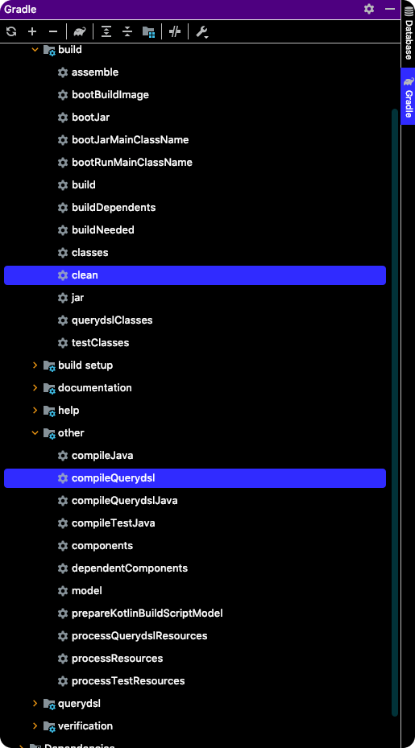
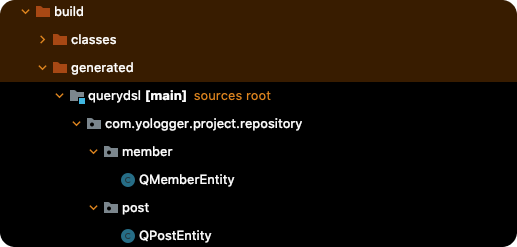

# Table of Contents
[[toc]]

# Query DSL
`Hibernate`는 복잡한 쿼리 또는 조인을 처리하기 위해 `JPQL`을 제공한다. 그러나 `JPQL`은 큰 단점이 하나 있다. `JPQL` 예제를 살펴보자.

``` java {1}
String jpql = "select m from MemberEntity as m";
List<MemberEntity> members = entityManager.createQuery(jpql, MemberEntity.class).getResultList();
```
`JPQL`은 <u>문자열</u>로 작성한다. 따라서 문법적 오류가 있어도 코드 작성 시점이나 컴파일 타임에 알아낼 수 없다. 

`Spring Data JPA`의 `Query Method`도 비슷한 한계가 있다.
``` java {6}
import org.springframework.data.jpa.repository.JpaRepository;
import org.springframework.data.jpa.repository.Query;
import org.springframework.data.repository.query.Param;

public interface MemberRepository extends JpaRepository<MemberEntity, Long> {
    @Query("select m from MemberEntity where m.email = :email and m.name = :name")
    List<MemberEntity> findByEmailAndName(@Param("email") String email, @Param("name") String name);
```

이러한 문제를 해결하기 위해 <b>`Query DSL(Domain Specific Language)`</b>가 등장했다. <b>`Query DSL`</b>은 다음과 같은 장점이 있다.
- 문자열이 아닌 코드로 작성한다.
- 문법적 오류를 컴파일 단계에서 탐지할 수 있다.
- 동적 쿼리
- 쿼리 결과를 엔티티가 아닌 사용자 정의 객체로 받을 수 있다.

이제 `Query DSL`에 대해 알아보자.

## 의존성 추가
`Spring Boot`, `Gradle` 버전에 따라 `Query DSL`의 설정 방법이 조금씩 다르다. 이 포스트에서는 다음 버전을 기준으로 한다.
- `Gradle 7.1.1`
- `Spring Boot 2.5.3`

`build.gradle`를 작성하자. 어두운 부분이 `Query DSL`과 관련된 설정이다.

``` groovy {5,14,21-41}
plugins {
    id 'org.springframework.boot' version '2.5.3'
    id 'io.spring.dependency-management' version '1.0.11.RELEASE'
    id 'java'
    id "com.ewerk.gradle.plugins.querydsl" version "1.0.10"
}

// 생략 ...

dependencies {
    // 생략 ...

    // QueryDSL
    implementation "com.querydsl:querydsl-jpa"
}

tasks.named('test') {
    useJUnitPlatform()
}

def querydslDir = "$buildDir/generated/querydsl"

querydsl {
    jpa = true
    querydslSourcesDir = querydslDir
}

sourceSets {
    main.java.srcDir querydslDir
}

configurations {
    compileOnly {
        extendsFrom annotationProcessor
    }
    querydsl.extendsFrom compileClasspath
}

compileQuerydsl {
    options.annotationProcessorPath = configurations.querydsl
}
```

## Q 클래스 생성하기
`Query DSL`은 컴파일 시점에 <u>엔티티에 접두사`Q`를 붙인 클래스</u>를 생성한다. 만약 엔티티의 클래스 이름이 `MemberEntity`라면 `QMemberEntity`라는 `Q 클래스`가 생성된다.

엔티티 클래스 `MemberEntity`를 다음과 같이 정의하자.
``` java
@Entity
@Table(name= "member")
@Getter
@NoArgsConstructor
public class MemberEntity {

    @Id
    @Column(name="id")
    @GeneratedValue(strategy = GenerationType.IDENTITY)
    private Long id;

    @Column(nullable = false, unique = true)
    private String email;

    @Column(nullable = false)
    private String name;

    @Column
    private Integer age;

    @Column
    private String nation;

    @Column
    private String gender;

    @Column(nullable = false)
    private String password;

    @OneToMany(mappedBy = "writer")
    private List<PostEntity> posts;

    @Builder
    public MemberEntity(String email, String name, Integer age, String nation, String gender, String password) {
        this.email = email;
        this.name = name;
        this.age = age;
        this.nation = nation;
        this.gender = gender;
        this.password = password;
    }
}
```
`PostEntity`클래스도 정의하자.
``` java
@Entity
@Table(name = "post")
@Getter
@NoArgsConstructor
public class PostEntity {

    @Id
    @Column(name="id")
    @GeneratedValue(strategy = GenerationType.IDENTITY)
    private Long id;

    @Column
    private String content;

    @ManyToOne
    @JoinColumn(name = "writer_id")
    private MemberEntity writer;

    @Builder
    public PostEntity(Long id, String content) {
        this.id = id;
        this.content = content;
    }
}
```

이제 `Q 클래스`를 생성하자. `Gradle > Tasks > build > clean`과 `Gradle > Tasks > other > compileQuerydsl`을 순서대로 클릭하여 실행한다.



물론 터미널에서도 실행할 수 있다.
```
./gradlew clean
./gradlew compileQuerydsl
```

그러면 다음 경로에 `QMemberEntity`와 `QPostEntity`클래스가 생성된다.



``` java
// QMemberEntity.java
@Generated("com.querydsl.codegen.EntitySerializer")
public class QMemberEntity extends EntityPathBase<MemberEntity> {

    private static final long serialVersionUID = 955017021L;

    public static final QMemberEntity memberEntity = new QMemberEntity("memberEntity");

    public final NumberPath<Integer> age = createNumber("age", Integer.class);

    public final StringPath email = createString("email");

    public final StringPath gender = createString("gender");

    public final NumberPath<Long> id = createNumber("id", Long.class);

    public final StringPath name = createString("name");

    public final StringPath nation = createString("nation");

    public final StringPath password = createString("password");

    public final ListPath<com.yologger.project.repository.post.PostEntity, com.yologger.project.repository.post.QPostEntity> posts = this.<com.yologger.project.repository.post.PostEntity, com.yologger.project.repository.post.QPostEntity>createList("posts", com.yologger.project.repository.post.PostEntity.class, com.yologger.project.repository.post.QPostEntity.class, PathInits.DIRECT2);

    public QMemberEntity(String variable) {
        super(MemberEntity.class, forVariable(variable));
    }

    public QMemberEntity(Path<? extends MemberEntity> path) {
        super(path.getType(), path.getMetadata());
    }

    public QMemberEntity(PathMetadata metadata) {
        super(MemberEntity.class, metadata);
    }

}
```
``` java
// QPostEntity.java
@Generated("com.querydsl.codegen.EntitySerializer")
public class QPostEntity extends EntityPathBase<PostEntity> {

    private static final long serialVersionUID = 1109069309L;

    private static final PathInits INITS = PathInits.DIRECT2;

    public static final QPostEntity postEntity = new QPostEntity("postEntity");

    public final StringPath content = createString("content");

    public final NumberPath<Long> id = createNumber("id", Long.class);

    public final com.yologger.project.repository.member.QMemberEntity writer;

    public QPostEntity(String variable) {
        this(PostEntity.class, forVariable(variable), INITS);
    }

    public QPostEntity(Path<? extends PostEntity> path) {
        this(path.getType(), path.getMetadata(), PathInits.getFor(path.getMetadata(), INITS));
    }

    public QPostEntity(PathMetadata metadata) {
        this(metadata, PathInits.getFor(metadata, INITS));
    }

    public QPostEntity(PathMetadata metadata, PathInits inits) {
        this(PostEntity.class, metadata, inits);
    }

    public QPostEntity(Class<? extends PostEntity> type, PathMetadata metadata, PathInits inits) {
        super(type, metadata, inits);
        this.writer = inits.isInitialized("writer") ? new com.yologger.project.repository.member.QMemberEntity(forProperty("writer")) : null;
    }

}
```

개발 과정에서 `Q 클래스`가 필요하므로 위와 같은 방법으로 생성해준다. 다만 빌드 과정에 `Q 클래스` 생성 작업이 포함되기에 굳이 `git`에 포함시킬 필요는 없다.

## Query DSL 구성파일 만들기
`Query DSL`을 위한 구성파일을 다음과 같이 작성한다.
``` java
import com.querydsl.jpa.impl.JPAQueryFactory;
import org.springframework.context.annotation.Bean;
import org.springframework.context.annotation.Configuration;

import javax.persistence.EntityManager;
import javax.persistence.PersistenceContext;

@Configuration
public class QueryDslConfiguration {

    @PersistenceContext
    private EntityManager entityManager;

    @Bean
    public JPAQueryFactory jpaQueryFactory() {
        return new JPAQueryFactory(entityManager);
    }
}
```
`@PersistenceContext` 어노테이션을 추가하면 `Hibernate`의 `EntityManager`가 주입된다. 이 `EntityManager`를 인자로 받는 `JPAQueryFactory`를 빈으로 등록한다.


## 데이터 조회
빈으로 등록한 `JpaQueryFactory` 객체로 복잡한 데이터 조회 및 조인 작업이 가능하다. 간단하게 `MemberEntity`의 모든 데이터를 조회해보자.

### selectFrom(), fetch()
`selectFrom()`으로 엔티티를 지정하고 `fetch()`를 호출하면 모든 데이터가 조회된다.
``` java{3,38}
// 생략 ...

import static com.yologger.project.repository.member.QMemberEntity.memberEntity;

@SpringBootTest
class MemberEntityTest {

    @Autowired
    MemberRepository memberRepository;

    @Autowired
    JPAQueryFactory jpaQueryFactory;

    @AfterEach
    public void tearDown() {
        memberRepository.deleteAll();
    }

    @Test
    public void test() {

        List<MemberEntity> dummyMembers = Arrays.asList(
                MemberEntity.builder().email("paul@gmail.com").name("paul").age(34).nation("usa").password("1234").build(),
                MemberEntity.builder().email("john@gmail.com").name("john").age(23).nation("usa").password("1234").build(),
                MemberEntity.builder().email("smith@gmail.com").name("smith").age(60).nation("usa").password("1234").build(),
                MemberEntity.builder().email("jane@gmail.com").name("jane").age(45).nation("usa").password("1234").build(),
                MemberEntity.builder().email("ross@gmail.com").name("ross").age(15).nation("korea").password("1234").build(),
                MemberEntity.builder().email("kane@gmail.com").name("kane").age(51).nation("korea").password("1234").build(),
                MemberEntity.builder().email("monica@gmail.com").name("monica").age(39).nation("korea").password("1234").build(),
                MemberEntity.builder().email("ramos@gmail.com").name("ramos").age(51).nation("korea").password("1234").build(),
                MemberEntity.builder().email("chandler@gmail.com").name("chandler").age(60).nation("france").password("1234").build(),
                MemberEntity.builder().email("rachel@gmail.com").name("rachel").age(72).nation("france").password("1234").build(),
                MemberEntity.builder().email("messi@gmail.com").name("messi").age(22).nation("france").password("1234").build()
        );

        memberRepository.saveAll(dummyMembers);

        List<MemberEntity> list = jpaQueryFactory.selectFrom(memberEntity).fetch();

        assertThat(list.size()).isEqualTo(11);
    }
}
```
로그에 출력되는 실제 SQL 쿼리는 다음과 같다.
```
Hibernate: 
    select
        memberenti0_.id as id1_0_,
        memberenti0_.age as age2_0_,
        memberenti0_.email as email3_0_,
        memberenti0_.gender as gender4_0_,
        memberenti0_.name as name5_0_,
        memberenti0_.nation as nation6_0_,
        memberenti0_.password as password7_0_ 
    from
        member memberenti0_
```
`fetch()` 외에도 데이터를 조회하는 다양한 메소드가 있다.
- `fetch()`: 모든 데이터를 조회
- `fecthOne()`: 데이터 한개 조회
- `fetchFirst()`: 첫 번째 데이터 조회
- `fetchCount()`: 데이터 개수 반환

### where()
`where()`로 조건을 추가할 수 있다.

#### eq()
``` java
List<MemberEntity> dummyMembers = Arrays.asList(
    MemberEntity.builder().email("paul@gmail.com").name("paul").age(34).nation("usa").password("1234").build(),
    MemberEntity.builder().email("john@gmail.com").name("john").age(23).nation("usa").password("1234").build(),
    MemberEntity.builder().email("smith@gmail.com").name("smith").age(60).nation("usa").password("1234").build(),
    MemberEntity.builder().email("jane@gmail.com").name("jane").age(45).nation("usa").password("1234").build(),
    MemberEntity.builder().email("ross@gmail.com").name("ross").age(15).nation("korea").password("1234").build(),
    MemberEntity.builder().email("kane@gmail.com").name("kane").age(51).nation("korea").password("1234").build(),
    MemberEntity.builder().email("monica@gmail.com").name("monica").age(39).nation("korea").password("1234").build(),
    MemberEntity.builder().email("ramos@gmail.com").name("ramos").age(51).nation("korea").password("1234").build(),
    MemberEntity.builder().email("chandler@gmail.com").name("chandler").age(60).nation("france").password("1234").build(),
    MemberEntity.builder().email("rachel@gmail.com").name("rachel").age(72).nation("france").password("1234").build(),
    MemberEntity.builder().email("messi@gmail.com").name("messi").age(22).nation("france").password("1234").build()
);

memberRepository.saveAll(dummyMembers);

List<MemberEntity> result = jpaQueryFactory
    .selectFrom(memberEntity)
    .where(memberEntity.nation.eq("korea"))
    .fetch();
```
실행되는 SQL 쿼리는 다음과 같다.
```
Hibernate: 
    select
        memberenti0_.id as id1_0_,
        memberenti0_.age as age2_0_,
        memberenti0_.email as email3_0_,
        memberenti0_.gender as gender4_0_,
        memberenti0_.name as name5_0_,
        memberenti0_.nation as nation6_0_,
        memberenti0_.password as password7_0_ 
    from
        member memberenti0_ 
    where
        memberenti0_.nation=?
```

#### gt()
``` java
List<MemberEntity> dummyMembers = Arrays.asList(
    MemberEntity.builder().email("paul@gmail.com").name("paul").age(34).nation("usa").password("1234").build(),
    MemberEntity.builder().email("john@gmail.com").name("john").age(23).nation("usa").password("1234").build(),
    MemberEntity.builder().email("smith@gmail.com").name("smith").age(60).nation("usa").password("1234").build(),
    MemberEntity.builder().email("jane@gmail.com").name("jane").age(45).nation("usa").password("1234").build(),
    MemberEntity.builder().email("ross@gmail.com").name("ross").age(15).nation("korea").password("1234").build(),
    MemberEntity.builder().email("kane@gmail.com").name("kane").age(51).nation("korea").password("1234").build(),
    MemberEntity.builder().email("monica@gmail.com").name("monica").age(39).nation("korea").password("1234").build(),
    MemberEntity.builder().email("ramos@gmail.com").name("ramos").age(51).nation("korea").password("1234").build(),
    MemberEntity.builder().email("chandler@gmail.com").name("chandler").age(60).nation("france").password("1234").build(),
    MemberEntity.builder().email("rachel@gmail.com").name("rachel").age(72).nation("france").password("1234").build(),
    MemberEntity.builder().email("messi@gmail.com").name("messi").age(22).nation("france").password("1234").build()
);

memoRepository.saveAll(dummyMembers);

List<MemberEntity> result = jpaQueryFactory
    .selectFrom(memberEntity)
    .where(memberEntity.age.gt(40))
    .fetch();
```

#### gte()
``` java
List<MemberEntity> result = jpaQueryFactory
        .selectFrom(memberEntity)
        .where(memberEntity.age.gt(30))
        .fetch();
```
```
Hibernate: 
    select
        memberenti0_.id as id1_0_,
        memberenti0_.age as age2_0_,
        memberenti0_.email as email3_0_,
        memberenti0_.gender as gender4_0_,
        memberenti0_.name as name5_0_,
        memberenti0_.nation as nation6_0_,
        memberenti0_.password as password7_0_ 
    from
        member memberenti0_ 
    where
        memberenti0_.age>?
```

#### lt()
``` java
List<MemberEntity> result = jpaQueryFactory
        .selectFrom(memberEntity)
        .where(memberEntity.age.lt(30))
        .fetch();
```

#### lte()
``` java
List<MemberEntity> result = jpaQueryFactory
        .selectFrom(memberEntity)
        .where(memberEntity.age.lte(30))
        .fetch();
```

#### between()
``` java
List<MemberEntity> result = jpaQueryFactory
    .selectFrom(memberEntity)
    .where(memberEntity.age.between(20, 40))
    .fetch();
```
```
Hibernate: 
    select
        memberenti0_.id as id1_0_,
        memberenti0_.age as age2_0_,
        memberenti0_.email as email3_0_,
        memberenti0_.gender as gender4_0_,
        memberenti0_.name as name5_0_,
        memberenti0_.nation as nation6_0_,
        memberenti0_.password as password7_0_ 
    from
        member memberenti0_ 
    where
        memberenti0_.age between ? and ?
```

#### startWith()
``` java
List<MemberEntity> result = jpaQueryFactory
    .selectFrom(memberEntity)
    .where(memberEntity.name.startsWith("j"))
    .fetch();
```
```
Hibernate: 
    select
        memberenti0_.id as id1_0_,
        memberenti0_.age as age2_0_,
        memberenti0_.email as email3_0_,
        memberenti0_.gender as gender4_0_,
        memberenti0_.name as name5_0_,
        memberenti0_.nation as nation6_0_,
        memberenti0_.password as password7_0_ 
    from
        member memberenti0_ 
    where
        memberenti0_.name like ? escape '!'
```

#### endWith()
``` java
List<MemberEntity> result = jpaQueryFactory
    .selectFrom(memberEntity)
    .where(memberEntity.name.endWith("an"))
    .fetch();
```

#### contains()
``` java
List<MemberEntity> result = jpaQueryFactory
    .selectFrom(memberEntity)
    .where(memberEntity.name.contains("an"))
    .fetch();
```

#### in()
``` java
List<MemberEntity> result = jpaQueryFactory
    .selectFrom(memberEntity)
    .where(memberEntity.nation.in("usa, korea"))
    .fetch();
```
```
Hibernate: 
    select
        memberenti0_.id as id1_0_,
        memberenti0_.age as age2_0_,
        memberenti0_.email as email3_0_,
        memberenti0_.gender as gender4_0_,
        memberenti0_.name as name5_0_,
        memberenti0_.nation as nation6_0_,
        memberenti0_.password as password7_0_ 
    from
        member memberenti0_ 
    where
        memberenti0_.nation in (
            ? , ?
        )
```

#### notIn()
``` java
List<MemberEntity> result = jpaQueryFactory
    .selectFrom(memberEntity)
    .where(memberEntity.nation.notIn("usa, korea"))
    .fetch();
```

``` java
List<MemberEntity> result = jpaQueryFactory
    .selectFrom(memberEntity)
    .where(memberEntity.nation.notIn("usa, korea"))
    .fetch();
```

#### and()
``` java
List<MemberEntity> result = jpaQueryFactory
    .selectFrom(memberEntity)
    .where(memberEntity.nation.eq("usa").and(memberEntity.nation.eq("korea")))
    .fetch();
```


#### or()
``` java
List<MemberEntity> result = jpaQueryFactory
    .selectFrom(memberEntity)
    .where(memberEntity.nation.eq("usa").or(memberEntity.nation.eq("korea")))
    .fetch();
```


### orderBy()
`orderBy()`로 결과값을 정렬할 수 있다.
``` java
List<MemberEntity> result = jpaQueryFactory
    .selectFrom(memberEntity)
    .orderBy(memberEntity.nation.asc(), memberEntity.age.desc())
    .fetch();
```
```
Hibernate: 
    select
        memberenti0_.id as id1_0_,
        memberenti0_.age as age2_0_,
        memberenti0_.email as email3_0_,
        memberenti0_.name as name4_0_,
        memberenti0_.nation as nation5_0_,
        memberenti0_.password as password6_0_ 
    from
        member memberenti0_ 
    order by
        memberenti0_.nation asc,
        memberenti0_.age desc
```

### Paging
`offset()`과 `limit()`를 사용하면 페이징 처리를 할 수 있다.
``` java
List<MemberEntity> result = jpaQueryFactory
    .selectFrom(memberEntity)
    .offset(1) 
    .limit(3)
    .fetch();
```
```
Hibernate: 
    select
        memberenti0_.id as id1_0_,
        memberenti0_.age as age2_0_,
        memberenti0_.email as email3_0_,
        memberenti0_.name as name4_0_,
        memberenti0_.nation as nation5_0_,
        memberenti0_.password as password6_0_ 
    from
        member memberenti0_ limit ? offset ?
```
실제 페이징 처리를 하려면 전체 데이터 개수를 알아야한다. 이때는 `fetchResults()` 메소드와 `QueryResults`클래스를 사용한다.
``` java
QueryResults<MemberEntity> result = jpaQueryFactory
    .selectFrom(memberEntity)
    .offset(1)
    .limit(3)
    .fetchResults();

Long total = result.getTotal();     // 전체 데이터 수
Long limit = result.getLimit();
Long offset = result.getOffset();
List<MemberEntity> members = result.getResults();   // 실제 데이터

assertThat(members.size()).isEqualTo(3);
```

### Projection
SELECT 절에 조회 컬럼을 지정하는 것을 `Projection`이라고 한다. 이 때는 `select()`와 `from()`을 사용한다.

조회 컬럼이 하나라면 해당 타입을 반환한다.
``` java
List<MemberEntity> dummyMembers = Arrays.asList(
    MemberEntity.builder().email("paul@gmail.com").name("paul").age(34).nation("usa").gender("man").password("1234").build(),
    MemberEntity.builder().email("john@gmail.com").name("john").age(23).nation("usa").gender("man").password("1234").build(),
    MemberEntity.builder().email("smith@gmail.com").name("smith").age(60).nation("usa").gender("man").password("1234").build(),
    MemberEntity.builder().email("jane@gmail.com").name("jane").age(45).nation("usa").gender("woman").password("1234").build(),
    MemberEntity.builder().email("ross@gmail.com").name("ross").age(15).nation("korea").gender("man").password("1234").build(),
    MemberEntity.builder().email("kane@gmail.com").name("kane").age(51).nation("korea").gender("man").password("1234").build(),
    MemberEntity.builder().email("monica@gmail.com").name("monica").age(39).nation("korea").gender("woman").password("1234").build(),
    MemberEntity.builder().email("ramos@gmail.com").name("ramos").age(51).nation("korea").gender("man").password("1234").build(),
    MemberEntity.builder().email("chandler@gmail.com").name("chandler").age(60).nation("france").gender("man").password("1234").build(),
    MemberEntity.builder().email("rachel@gmail.com").name("rachel").age(72).nation("france").gender("woman").password("1234").build(),
    MemberEntity.builder().email("messi@gmail.com").name("messi").age(22).nation("france").gender("man").password("1234").build()
);
memberRepository.saveAll(dummyMembers);

List<String> emails = jpaQueryFactory
    .select(memberEntity.email)
    .from(memberEntity)
    .fetch();
```

조회 컬럼이 여러 개일 때는 `Tuple`을 사용한다.
``` java
List<Tuple> tuples = jpaQueryFactory
    .select(memberEntity.email, memberEntity.age)
    .from(memberEntity)
    .fetch();

for (Tuple tuple: tuples) {
    String email = tuple.get(memberEntity.email);
    Integer age = tuple.get(memberEntity.age);
} 
```

쿼리 결과를 특정 객체로도 받을 수 있다.
``` java
@NoArgsConstructor
@Getter
public class MemberDTO {
    private String email;
    private Integer age;
    private String nation;
    private String gender;

    @Builder
    public MemberDTO(String email, Integer age, String nation, String gender) {
        this.email = email;
        this.age = age;
        this.nation = nation;
        this.gender = gender;
    }
}
```
``` java
List<MemberDTO> members = jpaQueryFactory
    .select(Projections.constructor(MemberDTO.class, memberEntity.email, memberEntity.age, memberEntity.nation, memberEntity.gender))
    .from(memberEntity)
    .fetch();
```

### Grouping
결과를 그룹화하고 결과를 제한할 때는 `groupBy()`와 `having()`을 사용한다.
``` java
@NoArgsConstructor
@Getter
public class NationCountDTO {
    private String nation;
    private Integer count;
}
```
``` java
List<MemberEntity> dummyMembers = Arrays.asList(
    MemberEntity.builder().email("paul@gmail.com").name("paul").age(34).nation("usa").gender("man").password("1234").build(),
    MemberEntity.builder().email("john@gmail.com").name("john").age(23).nation("usa").gender("man").password("1234").build(),
    MemberEntity.builder().email("smith@gmail.com").name("smith").age(60).nation("usa").gender("man").password("1234").build(),
    MemberEntity.builder().email("jane@gmail.com").name("jane").age(45).nation("usa").gender("woman").password("1234").build(),
    MemberEntity.builder().email("ross@gmail.com").name("ross").age(15).nation("korea").gender("man").password("1234").build(),
    MemberEntity.builder().email("kane@gmail.com").name("kane").age(51).nation("korea").gender("man").password("1234").build(),
    MemberEntity.builder().email("monica@gmail.com").name("monica").age(39).nation("korea").gender("woman").password("1234").build(),
    MemberEntity.builder().email("ramos@gmail.com").name("ramos").age(51).nation("korea").gender("man").password("1234").build(),
    MemberEntity.builder().email("chandler@gmail.com").name("chandler").age(60).nation("france").gender("man").password("1234").build(),
    MemberEntity.builder().email("rachel@gmail.com").name("rachel").age(72).nation("france").gender("woman").password("1234").build(),
    MemberEntity.builder().email("messi@gmail.com").name("messi").age(22).nation("france").gender("man").password("1234").build()
);
memberRepository.saveAll(dummyMembers);

List<NationCountDTO> members = jpaQueryFactory
    .select(Projections.constructor(NationCountDTO.class, memberEntity.nation, memberEntity.id.count()))
    .from(memberEntity)
    .groupBy(memberEntity.nation)
    .having(memberEntity.id.count().gt(3))
    .fetch();
```

### Subquery
Subquery를 구현할 때는 `JPAExpressions`을 사용한다.
``` java
List<MemberEntity> members = jpaQueryFactory
    .selectFrom(memberEntity)
    .where(memberEntity.nation.eq(
        JPAExpressions
                .select(memberEntity.nation)
                .from(memberEntity)
                .where(memberEntity.name.eq("kane"))
    ))
    .fetch();
```

### Join
#### Inner join
``` java
List<Tuple> tuples = jpaQueryFactory
        .select(memberEntity.email, postEntity.content)
        .from(memberEntity)
        .join(postEntity)
        .on(memberEntity.id.eq(postEntity.writer.id))
        .fetch();

assertThat(0).isEqualTo(8);
```
#### Left join
``` java
List<Tuple> tuples = jpaQueryFactory
        .select(memberEntity.email, postEntity.content)
        .from(memberEntity)
        .leftJoin(postEntity)
        .on(memberEntity.id.eq(postEntity.writer.id))
        .fetch();
```
#### Right join
``` java
List<Tuple> tuples = jpaQueryFactory
        .select(memberEntity.email, postEntity.content)
        .from(memberEntity)
        .rightJoin(postEntity)
        .on(memberEntity.id.eq(postEntity.writer.id))
        .fetch();
```

## 데이터 수정
`QueryDSL`도 수정을 위한 배치 쿼리를 지원한다. `QueryDSL`을 통한 수정 작업은 영속성 컨텍스트를 무시하고 데이터베이스에 직접 적용한다는 점에 유의하자.

## 데이터 삭제
`QueryDSL`도 삭제를 위한 배치 쿼리를 지원한다. `QueryDSL`을 통한 삭제 작업 또한 영속성 컨텍스트를 무시하고 데이터베이스에 직접 적용한다는 점에 유의하자.

## Repository와 함께 사용하기
``` java
public interface PostCustomRepository {
    List<PostEntity> findAllPostsOrderByCreatedAtDescExceptBlocking(Long memberId, int offset, int limit);
    List<PostEntity> findAllByWriterId(Long memberId, int offset, int limit);
}
```
``` java
@RequiredArgsConstructor
public class PostCustomRepositoryImpl implements PostCustomRepository {

    private final JPAQueryFactory jpaQueryFactory;

    @Override
    public List<PostEntity> findAllPostsOrderByCreatedAtDescExceptBlocking(Long memberId, int page, int size) {
        return jpaQueryFactory.selectFrom(postEntity)
                .where(postEntity.writer.id.notIn(
                        JPAExpressions
                                .select(blockEntity.blocking.id)
                                .from(blockEntity)
                                .where(blockEntity.member.id.eq(memberId))
                ))
                .offset(page*size)
                .limit(size)
                .orderBy(postEntity.createdAt.desc())
                .fetch();
    }

    @Override
    public List<PostEntity> findAllByWriterId(Long memberId, int page, int size) {
        return jpaQueryFactory.selectFrom(postEntity)
                .where(postEntity.writer.id.eq(memberId))
                .offset(page*size)
                .limit(size)
                .orderBy(postEntity.createdAt.desc())
                .fetch();
    }
}
```
``` java
public interface PostRepository extends JpaRepository<PostEntity, Long>, PostCustomRepository {
    
}
```
