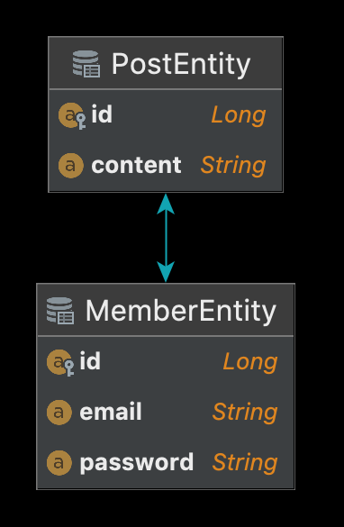

# Table of Contents
[[toc]]

## 일반 조인, 패치 조인
JPA의 일반 조인은 RDBMS의 조인과는 다르게 동작한다. 

예제를 살펴보기 위해 엔티티와 연관관계를 다음과 같이 설정한다.
``` java
@Entity
@Table(name = "member")
@Getter
@NoArgsConstructor
public class MemberEntity {
    @Id
    @Column(name = "id")
    @GeneratedValue(strategy = GenerationType.IDENTITY)
    private Long id;

    @Column
    private String email;

    @Column
    private String password;

    @OneToMany(mappedBy = "writer", fetch = FetchType.LAZY)
    private List<PostEntity> posts = new ArrayList<PostEntity>();

    @Builder
    public MemberEntity(Long id, String email, String password) {
        this.id = id;
        this.email = email;
        this.password = password;
    }
}
```
``` java
@Entity
@Table(name = "post")
@Getter
@NoArgsConstructor
public class PostEntity {

    @Id
    @Column(name="id")
    @GeneratedValue(strategy = GenerationType.IDENTITY)
    private Long id;

    @Column
    private String content;

    @ManyToOne
    @JoinColumn(name = "writer_id")
    private MemberEntity writer;

    @Builder
    public PostEntity(String content, MemberEntity writer) {
        this.content = content;
        this.writer = writer;
    }
}
```
JPQL로 JPA의 일반 조인을 실행해보자.
``` java {25,26}
@Test
@Transactional
public void test() {

    MemberEntity member = MemberEntity.builder()
            .email("james@gmail.com")
            .password("1234")
            .build();
    entityManager.persist(member);

    PostEntity post1 = PostEntity.builder()
            .writer(member)
            .content("content1")
            .build();
    entityManager.persist(post1);

    PostEntity post2 = PostEntity.builder()
            .writer(member)
            .content("content2")
            .build();
    entityManager.persist(post2);

    entityManager.flush();

    List<PostEntity> posts = entityManager.createQuery("SELECT p FROM PostEntity p JOIN p.writer w", PostEntity.class)
            .getResultList();
}
```
데이터베이스에서 실제로 실행되는 조인 구문은 다음과 같다.
``` {3-5}
Hibernate: 
    select
        postentity0_.id as id1_1_,
        postentity0_.content as content2_1_,
        postentity0_.writer_id as writer_i3_1_ 
    from
        post postentity0_ 
    inner join
        member memberenti1_ 
            on postentity0_.writer_id=memberenti1_.id
```
쿼리를 보면 알 수 있듯이, `PostEntity`에 대한 컬럼은 모두 조회하나 `MemberEntity`에 대한 컬럼은 ID 만을 조회하고 있다. 이는 프록시 객체와 JPA의 지연로딩 때문이다.

JPA의 패치 조인을 사용하면 데이터베이스 레벨에서부터 연관된 테이블의 컬럼을 모두 조회할 수 있다. JPQL에서 패치 조인은 다음과 같이 사용한다.
``` java {24,25}
@Test
@Transactional
public void test() {
    MemberEntity member = MemberEntity.builder()
            .email("james@gmail.com")
            .password("1234")
            .build();
    entityManager.persist(member);

    PostEntity post1 = PostEntity.builder()
            .writer(member)
            .content("content1")
            .build();
    entityManager.persist(post1);

    PostEntity post2 = PostEntity.builder()
            .writer(member)
            .content("content2")
            .build();
    entityManager.persist(post2);

    entityManager.flush();

    List<PostEntity> posts = entityManager.createQuery("SELECT p FROM PostEntity p JOIN FETCH p.writer w", PostEntity.class)
            .getResultList();
}
```
데이터베이스에 실제 실행되는 쿼리를 확인해보자. 데이터베이스 레벨에서 연관된 테이블의 컬럼도 모두 조회해오는 것을 확인할 수 있다.
``` {3-8}
Hibernate: 
    select
        postentity0_.id as id1_1_0_,
        memberenti1_.id as id1_0_1_,
        postentity0_.content as content2_1_0_,
        postentity0_.writer_id as writer_i3_1_0_,
        memberenti1_.email as email2_0_1_,
        memberenti1_.password as password3_0_1_ 
    from
        post postentity0_ 
    inner join
        member memberenti1_ 
            on postentity0_.writer_id=memberenti1_.id
```


## N+1 문제
쿼리 1개의 결과가 N개일 때 N번의 쿼리가 더 실행되는 문제다. `N+1 문제`는 두 엔티티 사이에 연관관계가 있을 떄 발생한다.

### 예제 구성하기
`N+1 문제` 예제를 살펴보기 위해 다음과 같이 데이터베이스 스키마를 설계한다. `member` 테이블은 다음과 같다.
```
CREATE TABLE member (
    id          bigint auto_increment primary key,
    email       varchar(255) null,
    password    varchar(255) null
)
```
`post` 테이블은 다음과 같다.
```
CREATE TABLE post
(
    id          bigint auto_increment primary key,
    content     varchar(255) null,
    writer_id   bigint       null,
    foreign key (writer_id) references member (id)
)
```
그리고 테스트 데이터를 삽입하자.
```
INSERT INTO member(id, email, password) VALUES(1, 'paul@gmail.com', '1234');
INSERT INTO post(content, writer_id) VALUE('content1', 1);
INSERT INTO post(content, writer_id) VALUE('content2', 1);
INSERT INTO post(content, writer_id) VALUE('content3', 1);

INSERT INTO member(id, email, password) VALUES(2, 'john@gmail.com', '1234');
INSERT INTO post(content, writer_id) VALUE('content4', 2);
INSERT INTO post(content, writer_id) VALUE('content5', 2);
INSERT INTO post(content, writer_id) VALUE('content6', 2);

INSERT INTO member(id, email, password) VALUES(3, 'smith@gmail.com', '1234');
INSERT INTO post(content, writer_id) VALUE('content7', 3);
INSERT INTO post(content, writer_id) VALUE('content8', 3);
INSERT INTO post(content, writer_id) VALUE('content9', 3);
```

### 즉시 로딩과 N+1 문제
우선 즉시 로딩에서 N+1 문제가 발생하는지 알아보자.
``` java{17}
@Entity
@Table(name = "member")
@Getter
@NoArgsConstructor
public class MemberEntity {
    @Id
    @Column(name = "id")
    @GeneratedValue(strategy = GenerationType.IDENTITY)
    private Long id;

    @Column
    private String email;

    @Column
    private String password;

    @OneToMany(mappedBy = "writer", fetch = FetchType.EAGER)
    private List<PostEntity> posts = new ArrayList<PostEntity>();

    @Builder
    public MemberEntity(String email, String password) {
        this.email = email;
        this.password = password;
    }
}
```
``` java
@Entity
@Table(name = "post")
@Getter
@NoArgsConstructor
public class PostEntity {

    @Id
    @Column(name="id")
    @GeneratedValue(strategy = GenerationType.IDENTITY)
    private Long id;

    @Column
    private String content;

    @ManyToOne
    @JoinColumn(name = "writer_id")
    private MemberEntity writer;

    @Builder
    public PostEntity(String content) {
        this.content = content;
    }
}
```



이제 `Spring Data JPA`의 쿼리 메소드로 `MemberEntity`를 조회해보자.
``` java
@DataJpaTest
@AutoConfigureTestDatabase(replace = AutoConfigureTestDatabase.Replace.NONE)
class Test {

    @Autowired
    private MemberRepository memberRepository;

    @Test
    void test() {
        List<MemberEntity> members = memberRepository.findAll();
    }
}
```
Spring Data JPA의 쿼리 메소드는 `JPQL`로 변환되어 실행된다. 실제 출력되는 로그를 확인해보자. 
``` {9-19,21-31,33-43}
Hibernate: 
    select
        memberenti0_.id as id1_0_,
        memberenti0_.email as email2_0_,
        memberenti0_.password as password3_0_ 
    from
        member memberenti0_

Hibernate: 
    select
        posts0_.writer_id as writer_i3_1_0_,
        posts0_.id as id1_1_0_,
        posts0_.id as id1_1_1_,
        posts0_.content as content2_1_1_,
        posts0_.writer_id as writer_i3_1_1_ 
    from
        post posts0_ 
    where
        posts0_.writer_id=?

Hibernate: 
    select
        posts0_.writer_id as writer_i3_1_0_,
        posts0_.id as id1_1_0_,
        posts0_.id as id1_1_1_,
        posts0_.content as content2_1_1_,
        posts0_.writer_id as writer_i3_1_1_ 
    from
        post posts0_ 
    where
        posts0_.writer_id=?

Hibernate: 
    select
        posts0_.writer_id as writer_i3_1_0_,
        posts0_.id as id1_1_0_,
        posts0_.id as id1_1_1_,
        posts0_.content as content2_1_1_,
        posts0_.writer_id as writer_i3_1_1_ 
    from
        post posts0_ 
    where
        posts0_.writer_id=?
```
한 번의 쿼리 메소드를 실행했는데 세 개의 추가적인 JPQL 쿼리가 실행되었다. 이처럼 즉시 로딩에서도 JPQL을 실행할 때 N+1 문제가 발생할 수 있다. 

### 지연 로딩과 N+1 문제
글로벌 페치 전략이 `FetchType.LAZY`일 때 N+1 문제가 발생하는지 알아보자.

다음과 같이 엔티티를 설계한다. `MemberEntity`와 `PostEntity`은 `1:N 관계`다.
``` java {17}
@Entity
@Table(name = "member")
@Getter
@NoArgsConstructor
public class MemberEntity {
    @Id
    @Column(name = "id")
    @GeneratedValue(strategy = GenerationType.IDENTITY)
    private Long id;

    @Column
    private String email;

    @Column
    private String password;

    @OneToMany(mappedBy = "writer", fetch = FetchType.LAZY)
    private List<PostEntity> posts = new ArrayList<PostEntity>();

    @Builder
    public MemberEntity(String email, String password) {
        this.email = email;
        this.password = password;
    }
}
```
``` java
@DataJpaTest
@AutoConfigureTestDatabase(replace = AutoConfigureTestDatabase.Replace.NONE)
class Test {

    @Autowired
    private MemberRepository memberRepository;

    @Test
    void test() {
        List<MemberEntity> members = memberRepository.findAll();
        members.forEach(member -> {
            List<PostEntity> posts = member.getPosts();
            posts.forEach(post -> {
                System.out.println("Content: " + post.getContent());
            });
        });
    }
}
```
`FetchType.LAZY`에서도 프록시 객체에 접근할 때 N+1 문제가 발생한다.
``` {9-22,24-37,39-52}
Hibernate: 
    select
        memberenti0_.id as id1_0_,
        memberenti0_.email as email2_0_,
        memberenti0_.password as password3_0_ 
    from
        member memberenti0_

Hibernate: 
    select
        posts0_.writer_id as writer_i3_1_0_,
        posts0_.id as id1_1_0_,
        posts0_.id as id1_1_1_,
        posts0_.content as content2_1_1_,
        posts0_.writer_id as writer_i3_1_1_ 
    from
        post posts0_ 
    where
        posts0_.writer_id=?
Content: content1
Content: content2
Content: content3

Hibernate: 
    select
        posts0_.writer_id as writer_i3_1_0_,
        posts0_.id as id1_1_0_,
        posts0_.id as id1_1_1_,
        posts0_.content as content2_1_1_,
        posts0_.writer_id as writer_i3_1_1_ 
    from
        post posts0_ 
    where
        posts0_.writer_id=?
Content: content4
Content: content5
Content: content6

Hibernate: 
    select
        posts0_.writer_id as writer_i3_1_0_,
        posts0_.id as id1_1_0_,
        posts0_.id as id1_1_1_,
        posts0_.content as content2_1_1_,
        posts0_.writer_id as writer_i3_1_1_ 
    from
        post posts0_ 
    where
        posts0_.writer_id=?
Content: content7
Content: content8
Content: content9
```

### 원인
쿼리 메소드는 내부적으로 `JPQL`로 변환되어 실행된다. JPQL은 특정 엔티티와 연관된 엔티티를 조회할 때 먼저 특정 엔티티만을 조회한다. 그 후 패치 전략을 적용하여 연관관계에 있는 엔티티들을 즉시 로딩 또는 지연 로딩한다. 이 때문에 추가적인 쿼리가 발생하게 된다.

### 해결방법
JPQL이나 Query DSL의 <b>`페치 조인(Fetch Join)`</b>을 사용하면 N+1 문제를 해결할 수 있다.

JPA에서 `일반 조인`은 연관된 엔티티는 함께 조회하지 않는다. 대상 엔티티를 먼저 조회한 후 글로벌 패치 전략에 따라 연관된 엔티티를 즉시 로딩 또는 지연 로딩하기 때문이다. 반면 JPQL이나 Query DSL의 `패치 조인(Fetch Join)`을 사용하면 연관된 엔티티들도 하나의 쿼리로 한꺼번에 조인하여 가져온다.

다음은 JPQL을 통한 페치 조인 예제다.
``` java
public interface MemberRepository extends JpaRepository<MemberEntity, Long> {
    @Query("select distinct m from MemberEntity m join fetch m.posts")
    public List<MemberEntity> findAllMemberWithFetchJoin()
}
```
페치 조인을 사용할 때는 `DISTINCT`를 사용하여 중복을 제거하는 것이 좋다. 다만 페치 조인은 페이징 API를 사용할 수 없다는 단점이 있다.