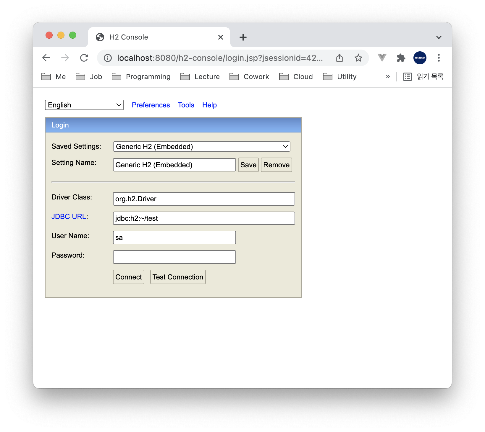
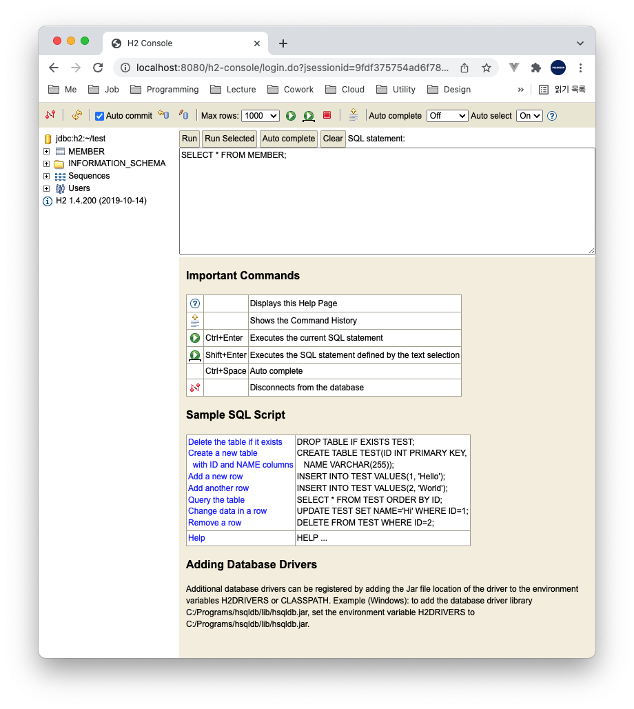

# Table of Contents
[[toc]]

# H2 데이터베이스
`H2`의 인메모리 데이터베이스를 사용하면 쉽게 데이터베이스를 테스트할 수 있다. 

## 환경설정
다음 의존성을 추가한다.
``` groovy
// build.gradle
dependencies {
    // H2
    implementation 'com.h2database:h2'
}
```
그 다음 `application.properties`에 `H2` 관련 설정을 추가한다. `Spring Data JPA`와 관련된 설정은 생략한다.
``` properties
## H2 설정
spring.h2.console.enabled=true
spring.h2.console.path=/h2-console

## datasource 설정
spring.datasource.url=jdbc:h2:~/test;
spring.datasource.driverClassName=org.h2.Driver
spring.datasource.username=sa
spring.datasource.password=
spring.jpa.database-platform=org.hibernate.dialect.H2Dialect
```

## 사용법
이제 어플리케이션을 시작한 상태에서 `http://localhost:포트/h2-console`에 접속하면 다음과 같은 화면을 볼 수 있다.



`Connect` 버튼을 누르면 `H2 Console`에 접속된다. 이 곳에서 스키마를 확인할 수 있고 SQL문을 직접 실행할 수 도 있다.



## 단위테스트에 H2 활용하기
필자는 로컬 환경에서는 `MySQL`, 단위 테스트 환경에서는 `H2`를 사용한다. 이러한 환경은 다음과 같이 구성할 수 있다.
``` groovy
// build.gradle
dependencies {
    // implementation 'com.h2database:h2'
    testImplementation 'com.h2database:h2'
}
```
`src/main/resources`의 `application.properties`는 다음과 같이 구성하여 `MySQL`을 사용하도록 한다.
``` properties
## src/main/resources/application.properties
spring.datasource.driver-class-name=com.mysql.cj.jdbc.Driver
spring.datasource.url=jdbc:mysql://localhost:3306/mydb
spring.datasource.username=root
spring.datasource.password=root
```
`src/test/resources`의 `application.properties`는 다음과 같이 구성하여 `H2`을 사용하도록 한다.
``` properties
## src/test/resources/application.properties
spring.datasource.url=jdbc:h2:~/test;
spring.datasource.driverClassName=org.h2.Driver
spring.datasource.username=sa
spring.datasource.password=
spring.jpa.database-platform=org.hibernate.dialect.H2Dialect
```

이제 `JUnit`을 사용하여 단위테스트를 진행할 수 있다.
``` java
@DataJpaTest
class MemberRepositoryTest {

    @Autowired
    MemberRepository memberRepository;
    
    @AfterEach
    void tearDown() {
        memberRepository.deleteAll();
    }

    @Test
    void test() {
        MemberEntity memberEntity = MemberEntity.builder()
                .email("paul@gmail.com")
                .password("1234")
                .build();

        MemberEntity saved = memberRepository.save(memberEntity);

        assertThat(saved.getEmail()).isEqualTo("paul@gmail.com");
    }
}
```