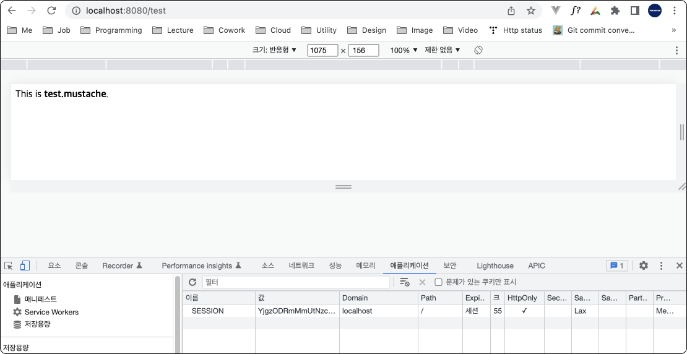

# Redis를 Session Store로 사용하기
프로젝트 의존성은 다음과 같다.
``` groovy {2,3}
dependencies {  
	implementation 'org.springframework.boot:spring-boot-starter-data-redis'
	implementation 'org.springframework.session:spring-session-data-redis'
	implementation 'org.springframework.boot:spring-boot-starter-mustache'
	implementation 'org.springframework.boot:spring-boot-starter-security'
    // 생략 ...
}
```

스프링 시큐리티 설정은 다음과 같다.
- 모든 URL을 개방한다.
- 쿠키-세션 방식을 사용한다.
``` java
// SecurityConfig.java
@EnableWebSecurity
public class SecurityConfig extends WebSecurityConfigurerAdapter {

    @Override
    protected void configure(HttpSecurity http) throws Exception {
        http
            .sessionManagement().sessionCreationPolicy(SessionCreationPolicy.ALWAYS).and()
            .authorizeHttpRequests()
                .anyRequest().permitAll();
    }
}
```

레디스 구성 클래스는 다음과 같다. 반드시 `@EnableRedisHttpSession` 어노테이션을 붙여야한다.
``` java {2}
@Configuration
@EnableRedisHttpSession
public class RedisConfig {

    @Value("${spring.redis.host}")
    public String host;

    @Value("${spring.redis.port}")
    public int port;


    @Bean
    public RedisTemplate<String, Object> redisTemplate(RedisConnectionFactory connectionFactory) {
        RedisTemplate<String, Object> redisTemplate = new RedisTemplate<>();
        redisTemplate.setKeySerializer(new StringRedisSerializer());
        redisTemplate.setValueSerializer(new GenericJackson2JsonRedisSerializer());
        redisTemplate.setConnectionFactory(connectionFactory);
        return redisTemplate;
    }

    @Bean
    public RedisConnectionFactory redisConnectionFactory() {
        return new LettuceConnectionFactory(host, port);
    }
}
```
`application.properties` 파일은 다음과 같다. 
``` properties
spring.session.store-type=redis
spring.redis.host=localhost
spring.redis.port=6379
```
- `spring.session.store-type`: 세션 스토어로 레디스를 지정
- `spring.redis.host`: 레디스 서버 주소
- `spring.redis.port`: 레디스 서버 포트

테스트를 위한 컨트롤러와 뷰는 다음과 같다.
``` java
// TestController.java
@Controller
public class TestController {

    @GetMapping("/test")
    public String test() {
        return "test";
    }
}
```
``` html
// test.mustache
<!DOCTYPE HTML>
<html>
<head>
    <title>Test</title>
    <meta http-equiv="Content-Type" content="text/html; charset=UTF-8" />
</head>
<body>
    This is <b>test.mustache</b>.
</body>
</html>
```
이제 애플리케이션을 구동하고 `http://localhost:8080/test`로 접속해보자. 브라우저에 쿠키가 생성된 것을 확인할 수 있다.



레디스 서버에는 다음과 같은 형태로 세션이 저장된다.
```
> KEYS *
1) "spring:session:expirations:1654747800000"
2) "spring:session:sessions:b8384f2e-778a-4417-877d-0aa5001939df"
3) "spring:session:sessions:expires:b8384f2e-778a-4417-877d-0aa5001939df"
```
```
> TYPE spring:session:expirations:1654747800000
set

> SMEMBERS spring:session:expirations:1654747800000
1) "\xac\xed\x00\x05t\x00,expires:b8384f2e-778a-4417-877d-0aa5001939df"
```

```
> TYPE spring:session:sessions:b8384f2e-778a-4417-877d-0aa5001939df
hash

> HGETALL spring:session:sessions:b8384f2e-778a-4417-877d-0aa5001939df
1) "creationTime"
2) "\xac\xed\x00\x05sr\x00\x0ejava.lang.Long;\x8b\xe4\x90\xcc\x8f#\xdf\x02\x00\x01J\x00\x05valuexr\x00\x10java.lang.Number\x86\xac\x95\x1d\x0b\x94\xe0\x8b\x02\x00\x00xp\x00\x00\x01\x81F\x8b\xc0P"
3) "lastAccessedTime"
4) "\xac\xed\x00\x05sr\x00\x0ejava.lang.Long;\x8b\xe4\x90\xcc\x8f#\xdf\x02\x00\x01J\x00\x05valuexr\x00\x10java.lang.Number\x86\xac\x95\x1d\x0b\x94\xe0\x8b\x02\x00\x00xp\x00\x00\x01\x81F\x8b\xc0P"
5) "maxInactiveInterval"
6) "\xac\xed\x00\x05sr\x00\x11java.lang.Integer\x12\xe2\xa0\xa4\xf7\x81\x878\x02\x00\x01I\x00\x05valuexr\x00\x10java.lang.Number\x86\xac\x95\x1d\x0b\x94\xe0\x8b\x02\x00\x00xp\x00\x00\a\b"
```
```
> TYPE spring:session:sessions:expires:b8384f2e-778a-4417-877d-0aa5001939df
string

> GET spring:session:sessions:expires:b8384f2e-778a-4417-877d-0aa5001939df
""
```

