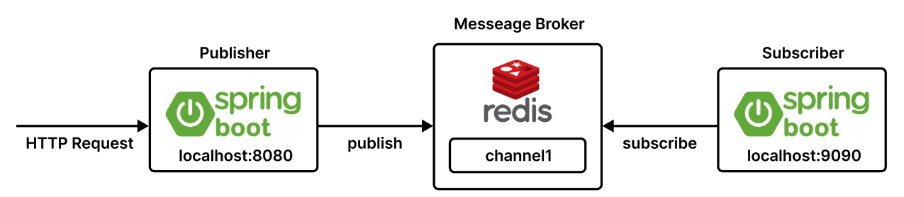
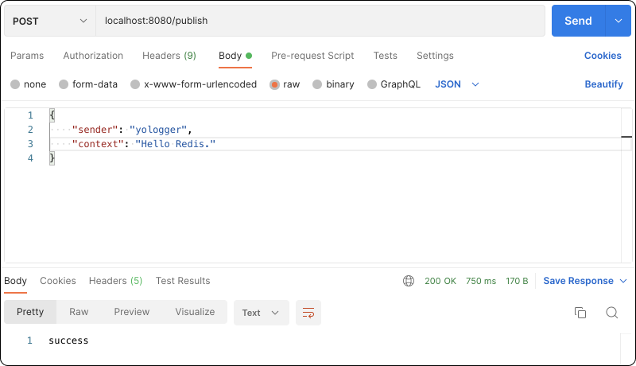
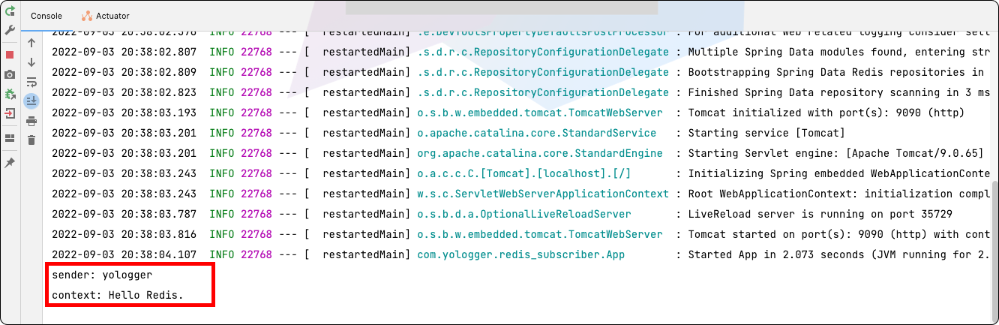

# Spring Boot with Redis Pub/Sub
Spring Boot 프로젝트에서 `Redis Pub/Sub`을 사용하는 방법에 대해 정리한다. 예제는 다음과 같이 두 개의 프로젝트로 구성된다.



우선 Redis 서버를 구동하자.
```
$ brew services start redis
```
```
$ brew services list
Name                  Status  User     File
redis                 started yologger ~/Library/LaunchAgents/homebrew.mxcl.redis.plist
```

## Subscriber
채널을 구독하는 `Subscriber` 프로젝트는 다음과 같다.
``` yml
# application.yml
server:
  port: 9090
spring:
  redis:
    host: localhost
    port: 6379
```
`MessageListener`의 구현체는 채널을 구독하는 컴포넌트다.
``` java
import com.fasterxml.jackson.databind.ObjectMapper;
import lombok.RequiredArgsConstructor;
import org.springframework.data.redis.connection.Message;
import org.springframework.data.redis.connection.MessageListener;
import org.springframework.stereotype.Service;

import java.io.IOException;

@Service
@RequiredArgsConstructor
public class RedisSubscriber implements MessageListener {
    @Override
    public void onMessage(Message message, byte[] pattern) {
        try {
            ObjectMapper mapper = new ObjectMapper();
            ChatMessage chatMessage = mapper.readValue(message.getBody(), ChatMessage.class);
            System.out.println("sender: " + chatMessage.getSender());
            System.out.println("context: " + chatMessage.getContext());
        } catch (IOException e) {
            e.printStackTrace();
        }
    }
}
```
이제 Redis 구성파일에 `MessageListener`의 구현체를 등록한다.
``` java
import org.springframework.context.annotation.Bean;
import org.springframework.context.annotation.Configuration;
import org.springframework.data.redis.connection.RedisConnectionFactory;
import org.springframework.data.redis.connection.lettuce.LettuceConnectionFactory;
import org.springframework.data.redis.core.RedisTemplate;
import org.springframework.data.redis.listener.ChannelTopic;
import org.springframework.data.redis.listener.RedisMessageListenerContainer;
import org.springframework.data.redis.listener.adapter.MessageListenerAdapter;
import org.springframework.data.redis.serializer.StringRedisSerializer;

@Configuration
public class RedisConfig {

    @Bean
    public RedisConnectionFactory redisConnectionFactory() {
        return new LettuceConnectionFactory();
    }

    @Bean
    public RedisTemplate<String, Object> redisTemplate() {
        RedisTemplate<String, Object> redisTemplate = new RedisTemplate<>();
        redisTemplate.setConnectionFactory(redisConnectionFactory());
        redisTemplate.setKeySerializer(new StringRedisSerializer());
        return redisTemplate;
    }

    // 채널 등록
    @Bean
    ChannelTopic topic() {
        return new ChannelTopic("channel1");
    }

    // MessageListener의 구현체 등록
    @Bean
    public MessageListenerAdapter messageListenerAdapter(RedisSubscriber redisSubscriber) {
        return new MessageListenerAdapter(redisSubscriber);
    }

    // MessageListener의 구현체와 채널 연결
    @Bean
    public RedisMessageListenerContainer redisMessageListenerContainer(RedisConnectionFactory redisConnectionFactory, MessageListenerAdapter messageListenerAdapter, ChannelTopic topic) {
        RedisMessageListenerContainer container = new RedisMessageListenerContainer();
        container.setConnectionFactory(redisConnectionFactory);
        container.addMessageListener(messageListenerAdapter, topic);
        return container;
    }
}
```

## Publisher
채널로 메시지를 발행하는 `Publisher` 프로젝트는 다음과 같다.
``` yml
# application.yml
server:
  port: 8080
spring:
  redis:
    host: localhost
    port: 6379
```
Redis 구성파일은 다음과 같다.
``` java 
// RedisConfig.java
import org.springframework.context.annotation.Bean;
import org.springframework.context.annotation.Configuration;
import org.springframework.data.redis.connection.RedisConnectionFactory;
import org.springframework.data.redis.connection.lettuce.LettuceConnectionFactory;
import org.springframework.data.redis.core.RedisTemplate;
import org.springframework.data.redis.serializer.Jackson2JsonRedisSerializer;
import org.springframework.data.redis.serializer.StringRedisSerializer;

@Configuration
public class RedisConfig {

    @Bean
    public RedisConnectionFactory redisConnectionFactory() {
        return new LettuceConnectionFactory();
    }

    @Bean
    public RedisTemplate<String, Object> redisTemplate() {
        RedisTemplate<String, Object> redisTemplate = new RedisTemplate<>();
        redisTemplate.setConnectionFactory(redisConnectionFactory());
        redisTemplate.setKeySerializer(new StringRedisSerializer());
        redisTemplate.setValueSerializer(new Jackson2JsonRedisSerializer<>(ChatMessage.class));
        return redisTemplate;
    }
}
```
메시지로 사용할 데이터 클래스는 다음과 같다.
``` java
@Getter
@NoArgsConstructor
@AllArgsConstructor
public class ChatMessage {
    private String sender;
    private String context;
}
```
채널로 메시지를 전송하는 서비스 컴포넌트는 다음과 같이 구현한다.
``` java
// RedisPublisher.java
import lombok.RequiredArgsConstructor;
import org.springframework.data.redis.core.RedisTemplate;
import org.springframework.stereotype.Service;

@Service
@RequiredArgsConstructor
public class RedisPublisher {
    private final RedisTemplate<String, Object> redisTemplate;

    public void sendMessage(ChatMessage chatMessage) {
        redisTemplate.convertAndSend("channel1", chatMessage);
    }
}
```
마지막으로 클라이언트를 위한 REST API 엔드포인트를 다음과 같이 구성한다.
``` java
// RedisController.java
import lombok.RequiredArgsConstructor;
import org.springframework.web.bind.annotation.PostMapping;
import org.springframework.web.bind.annotation.RequestBody;
import org.springframework.web.bind.annotation.RestController;

@RestController
@RequiredArgsConstructor
public class RedisController {
    private final RedisPublisher redisPublisher;

    @PostMapping("/publish")
    public String publish(@RequestBody ChatMessage chatMessage) {
        redisPublisher.sendMessage(chatMessage);
        return "success";
    }
}
```

## 결과 확인
이제 HTTP Client(Postman)로 Publisher에 요청을 보내보자.



Subscriber 로그에 메시지가 출력되는 것을 확인할 수 있다.


