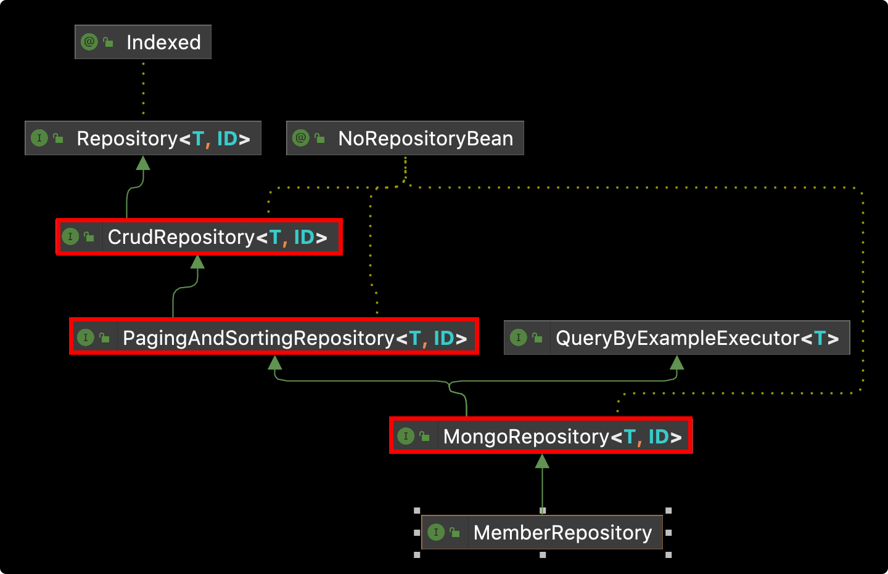

# Table of Contents
[[toc]]


## 의존성 추가
`Spring Data MongoDB`를 사용하려면 다음 의존성을 추가해야한다.
``` groovy
// build.gradle
implementation 'org.springframework.boot:spring-boot-starter-data-mongodb'
```

## 환경 설정
`application.properties` 파일에 설정 값을 추가한다.
``` properties
spring.data.mongodb.host=localhost 
spring.data.mongodb.port=27017
spring.data.mongodb.username=
spring.date.mongodb.password=
```

## Document 정의
### @Document
객체에 `@Document`를 추가하여 도큐먼트로 지정한다.

``` java
@Document
public class MemberDocument {
    // ... 
}
```

`@Document`의 `collection` 속성으로 콜렉션 이름을 지정할 수 있다.

``` java
@Document(collection = "member")
public class MemberDocument {
    // ... 
}
```

### @id
`@id` 어노테이션으로 `_id` 필드를 지정하지 않으면 데이터를 삽입할 때 자동으로 `ObjectId`가 할당된다.

``` java {5,6}
@Document(collection = "member")
@Getter
public class MemberEntity {

    // @Id
    // private Long id;

    @Field
    private String email;

    @Field
    private String name;

    @Field
    private Boolean isMarried;

    @Field
    private Integer age;

    @Field
    private Double weight;

    // ..
}
```
이 경우 `_id` 필드에 `ObjectId` 타입의 데이터가 자동으로 생성된다.
``` {3}
> db.member.find().pretty()
{
	"_id" : ObjectId("625beebf086eef0b837f3a57"),
	"email" : "Paul@gmai.com",
	"name" : "Paul",
	"isMarried" : true,
	"age" : 25,
	"weight" : 170.3,
	"_class" : "com.yologger.spring_mongodb.data.MemberEntity"
}
```
물론 명시적으로 `_id` 필드를 지정할 수 있다. 이 경우도 `_id` 필드에 `ObjectId` 타입의 데이터가 자동으로 생성된다.

``` java {5,6,7}
@Document(collection = "member")
@Getter
public class MemberEntity {

    @Id
    @Field("_id", targetType = FieldType.OBJECT_ID)
    private ObjectId id;

    @Field
    private String email;

    @Field
    private String name;

    @Field
    private Boolean isMarried;

    @Field
    private Integer age;

    @Field
    private Double weight;

    // ...                                 
}
```

다른 데이터 타입을 `id` 필드로 사용할 수 있다. 이 경우 `_id`필드가 자동으로 생성되지 않으므로 직접 구현해야한다.
``` java {5,6}
@Document(collection = "member")
@Getter
public class MemberEntity {

    @Id
    private String id;

    // ...                                 
}
```

### @Field
`@Field`를 사용하여 필드를 지정할 수 있다.
``` java {5,8,11,14,17}
@Document(collection = "member")
@Getter
public class MemberDocument {

    @Field
    private String email;

    @Field
    private String name;

    @Field
    private Boolean isMarried;

    @Field
    private Integer age;

    @Field
    private Double weight;

    // ...
}
```

필드 이름을 직접 지정할 수 있다.
``` java
@Document(collection = "member")
@Getter
public class MemberDocument {

    @Field("is_married")
    private Boolean isMarried;

    // ...
}
```

### @CreatedDate, @LastModifiedDate
`@CreatedDate`를 추가하면 도큐먼트가 생성된 날짜와 시간을 추가할 수 있다. `@LastModifiedDate`를 추가하면 마지막으로 도큐먼트가 변경된 날짜와 시간을 추가할 수 있다.

이를 위해 먼저 구성 클래스에 `@EnableMongoAuditing` 어노테이션을 추가해야한다.
``` java {2}
@Configuration
@EnableMongoAuditing
public class MongoConfig {
}
```
그 다음 도큐먼트 클래스를 다음과 같이 정의하면 된다.
``` java {23-25,27-29}
@Document(collection = "member")
@Getter
public class MemberDocument {

    @Id
    private ObjectId id;

    @Field
    private String email;

    @Field
    private String name;

    @Field(name="is_married")
    private Boolean isMarried;

    @Field
    private Integer age;

    @Field
    private Double weight;

    @CreatedDate
    @Field
    private LocalDateTime createdAt;

    @LastModifiedDate
    @Field
    private LocalDateTime updatedAt;

    @Builder
    public MemberDocument(String email, String name, Boolean isMarried, Integer age, Double weight) {
        this.email = email;
        this.name = name;
        this.isMarried = isMarried;
        this.age = age;
        this.weight = weight;
    }
}
```

보통 베이스 클래스를 정의하고 이를 상속하는 형태로 구현한다.
``` java {3-5,7-9}
public class BaseDocument {

    @CreatedDate
    @Field
    private LocalDateTime createdAt;

    @LastModifiedDate
    @Field
    private LocalDateTime updatedAt;
}
```
``` java{3}
@Document(collection = "member")
@Getter
public class MemberDocument extends BaseDocument {

    // ...
}
```

## CRUD 작업 실행하기
`Spring Data MongoDB`는 `MongoDB`에 접근하기 위한 두 가지 방법을 제공한다.
- `MongoTemplate`
- `MongoRepository`


### MongoTemplate
`MongoTemplate`는 Mongo DB CRUD 작업을 위한 메소드를 제공하는 클래스다.
``` java{7}
import org.springframework.data.mongodb.core.MongoTemplate;

@DataMongoTest
class MemberRepositoryTest {

    @Autowired
    private MongoTemplate mongoTemplate;

    @Test
    public void test() {

        MemberDocument member1 = MemberDocument.builder()
            .email("Son@gmai.com")
            .name("Son")
            .age(25)
            .isMarried(true)
            .weight(170.3)
            .build();

        MemberDocument member2 = MemberDocument.builder()
            .email("Kane@gmai.com")
            .name("Kane")
            .age(33)
            .isMarried(false)
            .weight(150.8)
            .build();

        mongoTemplate.insert(member1, "member");
        mongoTemplate.insert(member2, "member");

        assertThat(mongoTemplate.findAll(MemberDocument.class, "member").size()).isEqualTo(2);
    }
}
```

데이터베이스에 저장된 Document는 다음과 같다.
```
> db.member.find().pretty()
{
	"_id" : ObjectId("62786ada2e2278137ac8b3bd"),
	"email" : "Paul@gmai.com",
	"name" : "Paul",
	"is_married" : true,
	"age" : 25,
	"weight" : 170.3,
	"createdAt" : ISODate("2022-05-09T01:14:02.368Z"),
	"updatedAt" : ISODate("2022-05-09T01:14:02.368Z"),
	"_class" : "com.yologger.spring_mongodb.data.MemberDocument"
}
{
	"_id" : ObjectId("62786ada2e2278137ac8b3be"),
	"email" : "Monica@gmai.com",
	"name" : "Monica",
	"is_married" : false,
	"age" : 33,
	"weight" : 150.8,
	"createdAt" : ISODate("2022-05-09T01:14:02.487Z"),
	"updatedAt" : ISODate("2022-05-09T01:14:02.487Z"),
	"_class" : "com.yologger.spring_mongodb.data.MemberDocument"
} 
```


`MongoTemplate`는 정말 많은 메소드를 제공한다. [공식 문서](https://docs.spring.io/spring-data/mongodb/docs/current/api/org/springframework/data/mongodb/core/MongoTemplate.html)에서 다양한 기능을 확인할 수 있다.


### MongoRepository

`MongoRepository`은 더욱 추상화된 방법을 제공한다.

``` java
public interface MemberRepository extends MongoRepository<MemberDocument, ObjectId> {
}
```
`MongoRepository`는 다음과 같은 상속 관계를 갖는다.



따라서 `CrudRepository`, `PagingAndSortingRepository`가 제공하는 메소드를 모두 사용할 수 있다.
``` java
@DataMongoTest
class MemberRepositoryTest {

    @Autowired
    private MemberRepository memberRepository;

    @Test
    void test() {
        MemberDocument member1 = MemberDocument.builder()
                .email("Paul@gmai.com")
                .name("Paul")
                .age(25)
                .isMarried(true)
                .weight(170.3)
                .build();

        MemberDocument member2 = MemberDocument.builder()
                .email("Monica@gmai.com")
                .name("Monica")
                .age(33)
                .isMarried(false)
                .weight(150.8)
                .build();

        memberRepository.save(member1);
        memberRepository.save(member2);

        List<MemberDocument> members = memberRepository.findAll();

        assertThat(members.size()).isEqualTo(2);
    }
}
```

## 단위 테스트
Spring Data MongoDB는 `@DataMongoTest` 어노테이션을 제공한다. 이 어노테이션을 추가하면 Mongo DB와 관련된 컴포넌트만 Spring IoC Container에 등록한다. 
``` java
import org.springframework.boot.test.autoconfigure.data.mongo.DataMongoTest;

@DataMongoTest
class MemberRepositoryTest {

    @Autowired
    private MemberRepository memberRepository;

    @Test
    void test() {
        MemberDocument member1 = MemberDocument.builder()
                .email("Paul@gmai.com")
                .name("Paul")
                .age(25)
                .isMarried(true)
                .weight(170.3)
                .build();

        MemberDocument member2 = MemberDocument.builder()
                .email("Monica@gmai.com")
                .name("Monica")
                .age(33)
                .isMarried(false)
                .weight(150.8)
                .build();

        memberRepository.save(member1);
        memberRepository.save(member2);

        assertThat(memberRepository.count()).isEqualTo(2);
    }
}
```