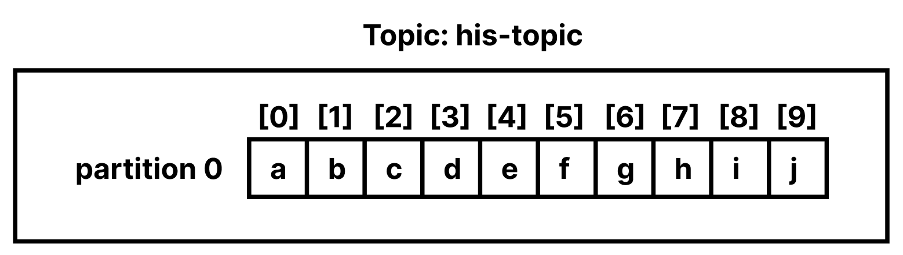
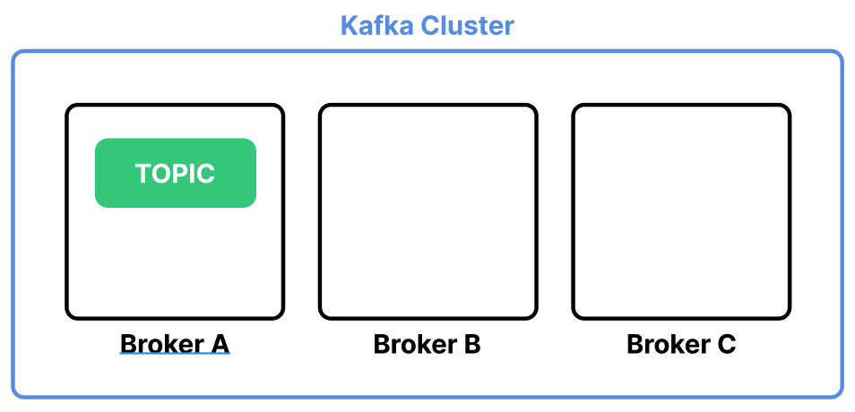
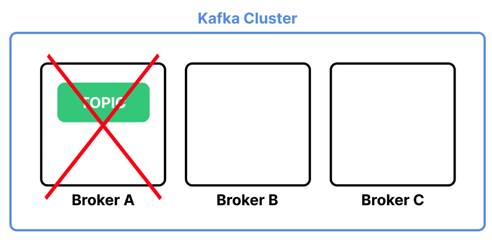
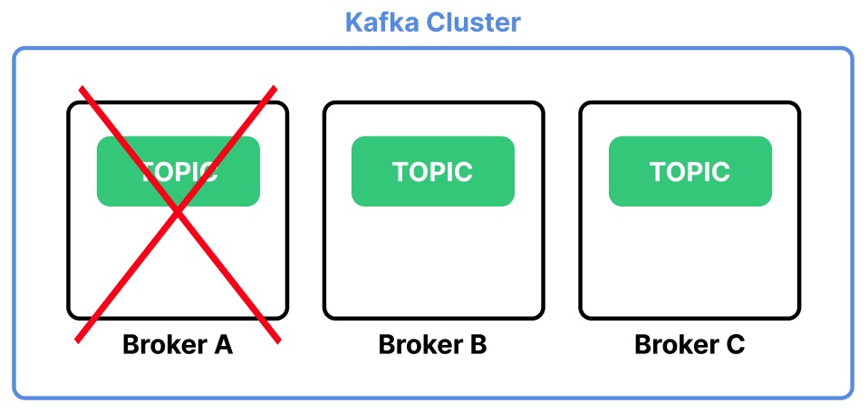
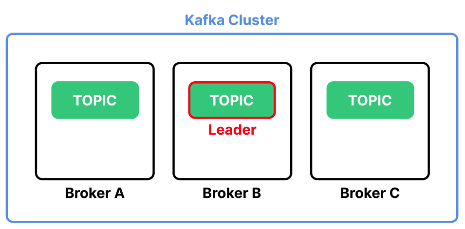
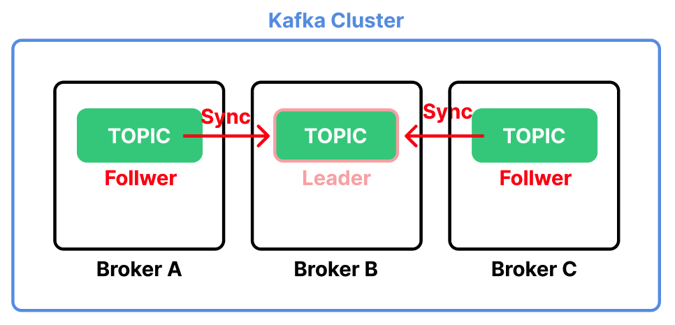
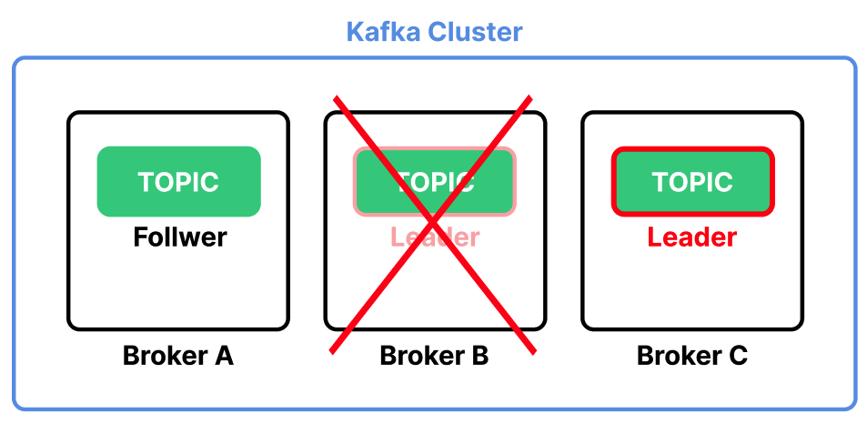

# Table of Contents
[[toc]]

:: warning 
미완성된 포스트입니다.
::

# Apache Kafka
`Apache Kafka`는 아파치 재단이 개발한 `메시지 브로커(Message Broker)`다. Kafka에 대해 자세히 알아보기 전 간단한 예제를 살펴보면서 메시지 브로커가 무엇인지 알아보자.

## Zookeeper, Kafka 서버 구축
Kafka를 사용하려면 먼저 `Zookeeper`서버와 `Kafka` 서버를 구축해야한다. 도커 컴포즈를 사용하면 이 둘을 쉽게 구축할 수 있다.
```  yml
# docker-compose.yml
version: '2'
services:
  zookeeper:
    image: wurstmeister/zookeeper
    container_name: zookeeper
    ports:
      - "2181:2181"
  kafka:
    image: wurstmeister/kafka
    container_name: kafka
    ports:
      - "9092:9092"
    environment:
      KAFKA_ADVERTISED_HOST_NAME: 127.0.0.1
      KAFKA_ZOOKEEPER_CONNECT: zookeeper:2181
```
도커 컴포스를 실행한다.
```
$ docker-compose up -d
```
생성된 컨테이너를 확인해보자. Zookeeper는 `2181`포트, Kafka는 `9092` 포트를 사용한다.
```
$ docker-compose ps 
  Name                 Command               State                         Ports                       
-------------------------------------------------------------------------------------------------------
kafka       start-kafka.sh                   Up      0.0.0.0:9092->9092/tcp                            
zookeeper   /bin/sh -c /usr/sbin/sshd  ...   Up      0.0.0.0:2181->2181/tcp, 22/tcp, 2888/tcp, 3888/tcp
```
```
$ docker ps 
CONTAINER ID   IMAGE                                    COMMAND                  CREATED         STATUS         PORTS                                                NAMES
a18bb010ab3e   wurstmeister/zookeeper                   "/bin/sh -c '/usr/sb…"   3 minutes ago   Up 3 minutes   22/tcp, 2888/tcp, 3888/tcp, 0.0.0.0:2181->2181/tcp   zookeeper
f17107e94596   wurstmeister/kafka                       "start-kafka.sh"         3 minutes ago   Up 3 minutes   0.0.0.0:9092->9092/tcp                               kafka
```
참고로 다 사용한 컨테이너는 다음과 같이 종료할 수 있다.
```
$ docker-compose down
```

## Kafka CLI 설치
`Kafka CLI`는 Zookeeper, Kafka 서버를 제어하기 위한 다양한 실행파일을 제공한다. Mac OS 환경에서는 `Homebrew`로 쉽게 설치할 수 있다.
```
$ brew install kafka
```
`brew info kafka` 명령어로 Kafka 설치 경로를 확인할 수 있다.
``` {5}
$ brew info kafka
kafka: stable 3.1.0 (bottled)
Open-source distributed event streaming platform
https://kafka.apache.org/
/usr/local/Cellar/kafka/3.1.0 (198 files, 84.2MB) *
  Poured from bottle on 2022-05-04 at 13:36:01
From: https://github.com/Homebrew/homebrew-core/blob/HEAD/Formula/kafka.rb
...
```
설치 경로의 `bin` 폴더에서 다양한 실행 파일을 확인할 수 있다.
```
$ cd /usr/local/Cellar/kafka/3.1.0/bin

$ ls
connect-distributed             kafka-console-consumer          kafka-features                  kafka-reassign-partitions       kafka-topics                    zookeeper-server-stop
connect-mirror-maker            kafka-console-producer          kafka-get-offsets               kafka-replica-verification      kafka-transactions              zookeeper-shell
connect-standalone              kafka-consumer-groups           kafka-leader-election           kafka-run-class                 kafka-verifiable-consumer
kafka-acls                      kafka-consumer-perf-test        kafka-log-dirs                  kafka-server-start              kafka-verifiable-producer
kafka-broker-api-versions       kafka-delegation-tokens         kafka-metadata-shell            kafka-server-stop               trogdor
kafka-cluster                   kafka-delete-records            kafka-mirror-maker              kafka-storage                   zookeeper-security-migration
kafka-configs                   kafka-dump-log                  kafka-producer-perf-test        kafka-streams-application-reset zookeeper-server-start
```

## Kafka 사용해보기
이제 Kafka의 메시지 브로커 기능을 사용해보자. 우선 `Topic`이라는 것을 생성해야한다. Zookeeper, Kafka 서버가 구동되고 있는 상태에서 다음과 같이  test-topic 이라는 이름의 Topic을 생성한다.
```
$ kafka-topics --bootstrap-server localhost:9092 --topic test-topic --create
Created topic test-topic.
```
그리고 Consumer를 실행한다. `Consumer`는 <u>Producer가 생성한 데이터를 소비한다.</u>
```
$ kafka-console-consumer --bootstrap-server localhost:9092 --topic test-topic
```

그 다음 새로운 터미널을 열고 Producer를 실행한다. `Producer`는 <u>데이터를 생성하여 메시지 브로커에 전달한다.</u>
```
$ kafka-console-producer --bootstrap-server localhost:9092 --topic test-topic
> Hello Kafka.
> Nice to meet you.
> See you again.
```
이제 Consumer를 확인해보자. Producer가 생성한 데이터가 소비되는 것을 확인할 수 있다.
```
$ kafka-console-consumer --bootstrap-server localhost:9092 --topic test-topic
Hello World!
Nice to meet you.
See you again~
```

## Message Broker
이처럼 <b>`메시지 브로커(Message Broker)`</b>는 <u>Producer가 생성한 데이터를 Consumer에게 전달하는 시스템이다.</u> 메시지 브로커는 `메시지 큐(Message Queue)`라고도 하며, 제품군에는 `Apache Kafka` 외에도 RabbitMQ, Active MQ, Redis 등이 있다.

## Kafka의 구성요소
Kafka의 구성요소에 대해 정리한다.

### Kafka 서버
`Kafka 서버`는 메시지 브로커 기능을 제공하며, `Broker 서버`라고도 한다. ZooKeeper 1대, Broker 서버 1대로 이루어진 클러스터는 다음과 같이 구축할 수 있다.

```  yml {12-19}
# docker-compose.yml
version: '2'
services:
  # Zookeeper
  zookeeper:
    image: wurstmeister/zookeeper
    container_name: zookeeper
    ports:
      - "2181:2181"

  # Kafka
  kafka:
    image: wurstmeister/kafka
    container_name: kafka
    ports:
      - "9092:9092"
    environment:
      KAFKA_ADVERTISED_HOST_NAME: 127.0.0.1
      KAFKA_ZOOKEEPER_CONNECT: zookeeper:2181
```

### Kafka 클러스터
트래픽이 많을 경우 하나의 Broker 서버로 감당하기 힘들 수 있다. Kafka 서버 여러 대를 하나로 묶어 `Kafka 클러스터`를 구축하면 더 많은 트래픽을 견딜 수 있다.

`ZooKeeper` 1대, `Broker 서버` 3대로 이루어진 클러스터는 다음과 같이 구축할 수 있다.
``` yml {10-21,23-34,36-47}
# docker-compose.yml
version: '2'
services:
  zookeeper:
    image: wurstmeister/zookeeper
    container_name: zookeeper
    ports:
      - "2181:2181"
      
  kafka1:
    image: wurstmeister/kafka
    container_name: kafka1
    ports:
      - "9092:9092"
    environment:
      KAFKA_ADVERTISED_HOST_NAME: 127.0.0.1
      KAFKA_ZOOKEEPER_CONNECT: zookeeper:2181
      KAFKA_BROKER_ID: 1
    volumes:
      - ./kafka1/data:/var/lib/kafka/data:/var/run/docker.sock   
    depends_on:
      - zookeeper  
      
  kafka2:
    image: wurstmeister/kafka
    container_name: kafka2
    ports:
      - "9093:9093"
    environment:
      KAFKA_ADVERTISED_HOST_NAME: 127.0.0.1
      KAFKA_ZOOKEEPER_CONNECT: zookeeper:2181
      KAFKA_BROKER_ID: 2
    volumes:
      - ./kafka2/data:/var/lib/kafka/data:/var/run/docker.sock   
    depends_on:
      - zookeeper  

  kafka3:
    image: wurstmeister/kafka
    container_name: kafka3
    ports:
      - "9094:9094"
    environment:
      KAFKA_ADVERTISED_HOST_NAME: 127.0.0.1
      KAFKA_ZOOKEEPER_CONNECT: zookeeper:2181
      KAFKA_BROKER_ID: 3
    volumes:
      - ./kafka4/data:/var/lib/kafka/data:/var/run/docker.sock   
    depends_on:
      - zookeeper  
```


### Zookeeper
`Zookeeper`는 카프카 클러스터를 관리하고 조정하는 역할을 한다.

### Topic
카프카는 전송되는 메시지를 `Topic`이라는 개념으로 분류한다. 

`Topic`은 다음과 같이 생성할 수 있다.
```
$ kafka-topics --bootstrap-server localhost:9092 --topic <TOPIC 이름> --create
```
두 개의 `Topic`을 생성해보자.
```
$ kafka-topics --bootstrap-server localhost:9092 --topic my-topic --create

$ kafka-topics --bootstrap-server localhost:9092 --topic your-topic --create
```
`Topic` 목록을 확인할 수도 있다.
```
$ kafka-topics --bootstrap-server localhost:9092 --list
__consumer_offsets
my-topic
your-topic
```

`Topic`을 삭제할 수도 있다.
```
$ kafka-topics --bootstrap-server localhost:9092 --topic <TOPIC 이름> --delete
```

### Producer
`Producer`는 메시지를 생산하는 주체다. 다음과 같이 Producer를 실행하고 특정 Topic으로 메시지를 전달할 수 있다.
```
$ kafka-console-producer --bootstrap-server localhost:9092 --topic <TOPIC 이름>
```
```
$ kafka-console-producer --bootstrap-server localhost:9092 --topic test-topic
> Hello Kafka.
> Nice to meet you.
> See you again.
```

### Consumer
`Consumer`는 메시지를 소비하는 주체다. 다음과 같이 Consumer를 실행하고 특정 Topic으로 들어온 메시지를 소비할 수 있다.
```
$ kafka-console-consumer --bootstrap-server localhost:9092 --topic <TOPIC 이름>
```
```
$ kafka-console-consumer --bootstrap-server localhost:9092 --topic test-topic
Hello World!
Nice to meet you.
See you again~
```

주의할 점은 이 명령어로 Consumer를 실행한 이후에 생성된 메시지만을 읽어온다. 모든 메시지를 읽어오려면 `--from-beginning` 옵션을 사용한다.

```
$ kafka-console-consumer --bootstrap-server localhost:9092 --topic test-topic --from-beginning
```

`Producer`와 `Consumer`는 서로의 존재를 알지 못한다. 그저 `Broker 서버`를 통해 메시지를 주고 받을 수 있다.


### Offset
`Topic`을 생성하면 `Partition`이라는 큐에 메시지가 저장된다. `his-topic` 이라는 Topic을 생성한 후 Producer에서 데이터를 생성해보자.
```
$ kafka-topics --bootstrap-server localhost:9092 --topic his-topic --create
```
```
$ kafka-console-producer --bootstrap-server localhost:9092 --topic his-topic                          
>a
>b
>c
>d
>e
>f
>g
>h
>i
>j
```
`Partition`에는 다음과 같이 데이터가 저장되어있다. 데이터 하나하나를 `레코드(Record)`라고 한다.



`Offset`은 <u>Consumer가 어떤 레코드까지 읽었는지를 나타내는 정수값</u>이다.

아래 명령어로 Kafka를 구독해보자.
```
$ kafka-console-consumer --bootstrap-server localhost:9092 --topic his-topic
```
아무 레코드도 출력되지 않는 것을 확인할 수 있다. 이 명령어는 명령어가 실행되기 전 발행된 레코드를 이미 읽었다고 간주하며, 이후 발행된 레코드가 없기 때문에 아무 결과가 출력되지 않는 것이다.

`--offset` 옵션을 사용하면 특정 지점 이후에 발행된 레코드를 소비할 수 있다.
```
$ kafka-console-consumer --bootstrap-server localhost:9092 --topic his-topic --partition 0 --offset 4
e
f
g
h
i
j
```

`--from-beginning` 옵션으로 Partition의 모든 레코드도 확인할 수 있다.
```
$ kafka-console-consumer --bootstrap-server localhost:9092 --topic his-topic --partition 0 --from-beginning
a
b
c
d
e
f
g
h
i
j
```

### Partition

```
$ kafka-topics --bootstrap-server localhost:9092 --topic <TOPIC 이름> --partitions 1 --replication-factor 1 --create
```

### Consumer Group

### Replication
세 개의 Broker 서버로 구성된 Kafka 클러스터가 있다고 가정하자. Topic은 Broker A 서버에 위치한다.



만약 Broker A 서버에 장애가 생기면 Topic이 모두 유실된다.



`Replication`을 사용하면 <u>여러 Broker 서버에 Topic의 복사본을 저장하여 데이터 유실을 방지할 수 있다.</u>



Replication 기능은 Topic을 생성할 때 `--replication-factor` 옵션으로 지정할 수 있다.

```
$ kafka-topics --bootstrap-server localhost:9092 --topic <TOPIC 이름> --replication-factor 1 --create
```

Replication은 여러 Topic 중 하나를 Leader로 지정한다. 모든 메시지는 Leader를 통해서만 전달된다.



Leader를 제외한 나머지는 Follwer가 된다. Follwer는 Leader의 상태가 변했을 때 이를 동기화하여 동일한 상태를 유지한다.



만약 Leader가 위치한 Broker 서버가 다운되면 Kafka는 Follewer 중 하나를 Leader로 승격시킨다.




# Kafka Web UI(Kafdrop)