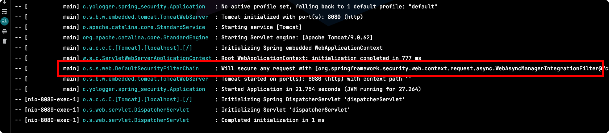
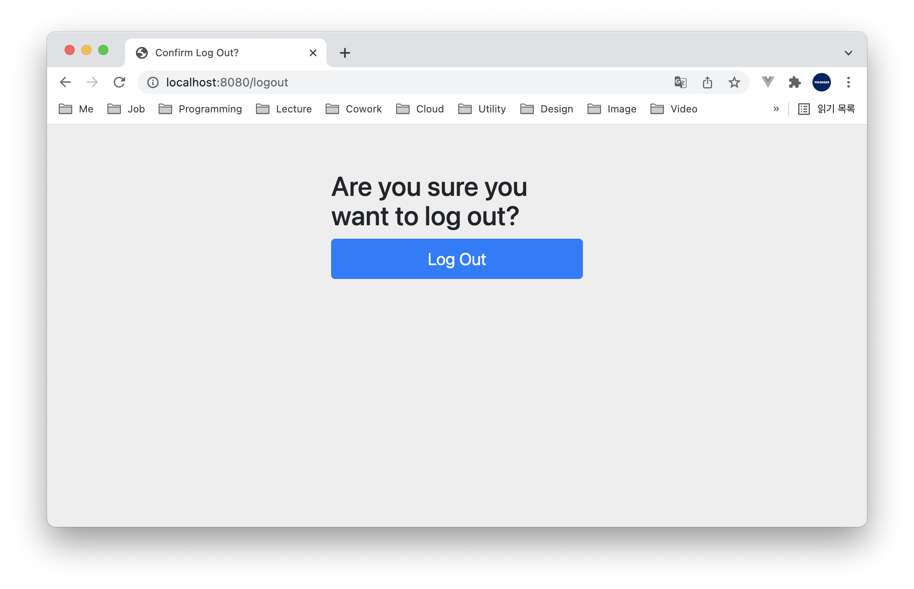

# Table of Contents
[[toc]]

# Spring Security
`Spring Security`에 대해 정리한다.

## 의존성 설정
`Spring Security`를 사용하기 위해서 다음 의존성을 추가한다.
``` groovy {6,7}
// build.gradle
dependencies {
    // ...
    implementation 'org.springframework.boot:spring-boot-starter-web'
    implementation 'org.springframework.boot:spring-boot-starter-mustache'
    implementation 'org.springframework.boot:spring-boot-starter-security'
    testImplementation 'org.springframework.security:spring-security-test'
    testImplementation 'org.springframework.boot:spring-boot-starter-test'
}
```
예제를 위해 `Mustache`를 뷰 템플릿으로 설정해놨다.

## Security Filter
스프링 시큐리티는 `Servlet Filter`를 기반으로 동작한다. 



프로젝트에 의존성을 추가하기만 하면 스프링 시큐리티는 기본적으로 <u><b>모든 HTTP 엔드포인트 접근을 차단</b></u>한다.

예제를 살펴보자. 다음과 같은 컨트롤러가 있다. 컨트롤러는 `test.mustache` 뷰를 보여준다.
``` java
// TestController.java

@Controller
@RequestMapping("/test")
public class TestController {

    @GetMapping("/test1")
    public String test1() {
        return "test1";     // test1.mustache
    }
}
```
`test1.mustache`는 다음과 같다.
``` html
<!DOCTYPE HTML>
<html>
<head>
    <title>test1.mustache</title>
    <meta http-equiv="Content-Type" content="text/html; charset=UTF-8" />
</head>
<body>
<h1>This is test1.mustache</h1>
</body>
</html>
```

이제 웹 브라우저에서 `http://localhost:8080/test/test1`로 접근해보자. `test1.mustache`를 보여주지 않고 `http://localhost:8080/login`로 리다이렉트되는 것을 확인할 수 있다. <u><b>스프링 시큐리티가 모든 엔드포인트에 대해 인증되지 않는 접근을 차단하기 때문이다.</b></u>


인증을 하려면 로그인을 해야한다. 별도의 설정을 하지 않았다면 Username은 `user`이며, Password는 애플리케이션을 시작할 때 로그에 출력된다.


이제 Username과 Password를 입력하여 로그인 해보자. 그리고 `http://localhost:8080/test/test1`로 접근하면 `test1.mustache`가 랜더링되는 것을 확인할 수 있다.


`http://localhost:8080/logout`으로 접근하면 로그아웃 할 수 있다.



스프링 시큐리티는 기본적으로 `Cookie-Session` 방식으로 인증 정보를 관리한다. 따라서 로그인 후 웹 브라우저에서 `Cookie`를 확인할 수 있다.


세션은 기본적으로 메모리에 저장된다. 따라서 애플리케이션을 재시작하면 세션 정보가 사라지게 된다. 물론 쿠키와 세션을 데이터베이스에 저장할 수 있다.


## 구성 클래스
스프링 시큐리티와 관련된 설정을 커스터마이징하려면 구성 클래스를 정의해야한다. 구성 클래스는 `WebSecurityConfigurerAdapter`를 상속하며, `@EnableWebSecurity`어노테이션을 추가해야한다.

``` java
import org.springframework.security.config.annotation.web.builders.HttpSecurity;
import org.springframework.security.config.annotation.web.configuration.EnableWebSecurity;
import org.springframework.security.config.annotation.web.configuration.WebSecurityConfigurerAdapter;

@Configuration
@EnableWebSecurity
public class SecurityConfig extends WebSecurityConfigurerAdapter {
    // ...
}
```
이 구성 클래스에서 스프링 시큐리티와 관련된 설정을 커스터마이징 할 수 있다.

## SecurityContext
스프링 시큐리티는 인증, 접근 권한 등 보안과 관련된 정보를 유지하고 있다. `SecurityContext` 인터페이스를 사용하면 이 정보에 접근할 수 있다. 

``` java
SecurityContext securityContext = SecurityContextHolder.getContext();
```

## Authentication
`SecurityContext`에는 현재 스레드에서 인증된 사용자에 대한 데이터를 `Authentication` 객체에 유지하고 있다.
``` java
SecurityContext context = SecurityContextHolder.getContext();
Authentication authentication = context.getAuthentication();
```
`Authentication` 객체에서 인증된 사용자에 대한 다양한 정보를 확인할 수 있다.
``` java
boolean authenticated = authentication.isAuthenticated();
String username = authentication.getName();
Object principal = authentication.getPrincipal();
Collection<? extends GrantedAuthority> authorities = authentication.getAuthorities();
Object credentials = authentication.getCredentials();
```

## SecurityContextHolder
<b>`SecurityContextHolder`</b>는 `SecurityContext`를 래핑하고 있다.


`SecurityContextHolder`는 `SecurityContext`와 스레드를 연결하는 역할을 한다. 좀 더 자세히 설명하자면 `SecurityContextHolder`를 통해 `SecurityContext`가 어떤 스레드에서 유효할지 설정할 수 있으며, 이를 `전략(Strategy)`라고 한다.

`Strategy`는 스프링 시큐리티 구성 클래스에서 다음과 같이 설정할 수 있다.
``` java{8}
@Configuration
@EnableWebSecurity
public class SecurityConfig extends WebSecurityConfigurerAdapter {

    @Override
    protected void configure(HttpSecurity http) throws Exception {
        // ...
        SecurityContextHolder.setStrategyName(SecurityContextHolder.MODE_GLOBAL);
    }
}
```

가능한 설정 값은 다음과 같다.
- `MODE_THREADLOCAL`: 현재 스레드에서만 SecurityContext를 공유한다.
- `MODE_INHERITABLETHREADLOCAL`: 현재 스레드와 하위 스레드에서 SecurityContext를 공유한다.
- `MODE_GLOBAL`: 모든 스레드가 `SecurityContext`를 공유한다.


## 인증 절차 설정하기
`WebSecurityConfigurerAdapter`의 `configure(HttpSecurity http)`메소드를 오버라이드하여 인증 절차를 설정할 수 있다.

인증 방법을 커스터마이징하기 전에 디폴트 설정에 대해 알아볼 필요가 있다. 디폴트 설정은 다음과 같다.
``` java
public abstract class WebSecurityConfigurerAdapter {
	private void configure(HttpSecurity http) throws Exception {
		http
            .authorizeRequests()
                .anyRequest().authenticated().and()
		    .formLogin().and()
		    .httpBasic().and()
            .logout();
	}    
}
```
- `authorizeRequests().anyRequest().authenticated()`: 모든 요청에 대해서 인증을 요구한다.
- `formLogin()`: 폼 기반 인증을 활성화한다.
- `httpBasic()`:  HTTP 기본 인증을 활성화한다.
- `logout()`: 로그아웃 기능을 지원한다.

[`폼 기반 인증(Form-based Authentication)`](https://docs.oracle.com/cd/E19798-01/821-1841/6nmq2cpki/index.html)은 다음과 같이 HTML Form 태그로 사용자를 인증하는 방식이다.
``` html
<form name="LoginForm" method="post" action="/auth/login">
  <input type="text" name="username"/>
  <input type="password" name="password"/>
</form>
```
스프링 시큐리티는 기본 로그인 페이지를 제공한다.


물론 사용자가 직접 로그인 페이지를 정의할 수 있다.
``` java{9}
public class SecurityConfig extends WebSecurityConfigurerAdapter {

    @Override
    protected void configure(HttpSecurity http) throws Exception {
        http
            .authorizeRequests()
                .anyRequest().authenticated().and()
            .formLogin()
                .loginPage("/login.html")  // 사용자 정의 로그인 페이지
            // ...
    }
}       
```
그 외에도 다음과 같이 여러 설정을 커스터마이징할 수 있다.
``` java
public class SecurityConfig extends WebSecurityConfigurerAdapter {

    @Override
    protected void configure(HttpSecurity http) throws Exception {
        http
            .authorizeRequests()
                .anyRequest().authenticated().and()
            .formLogin()
                .loginPage("/login.mustache")  // 사용자 정의 로그인 페이지
                .defaultSuccessUrl("/home")  // 로그인 성공 후 이동 페이지
                .failureUrl("/login")  // 로그인 실패 후 이동 페이지
                .usernameParameter("userId")  // 아이디 파라미터명 설정
                .passwordParameter("passwd")  // 패스워드 파라미터명 설정
                .loginProcessingUrl("/login")  // 로그인 Form Action Url
                .successHandler(new AuthenticationSuccessHandler() {
                    // 로그인 성공 후 핸들러
                })
                .failureHandler(new AuthenticationFailureHandler() {
                    // 로그인 실패 후 핸들러
                }).and()
            // ...
    }
}
```

[`HTTP 기본 인증(Http basic authentication)`](https://developer.mozilla.org/ko/docs/Web/HTTP/Authentication)은 다음 절차를 준수하는 인증 방법을 의미한다.

1. 서버는 클라이언트의 인증이 실패했을 때 `WWW-Authenticate` 헤더를 추가하여 `401(Unauthorized)` 응답을 보낸다.
2. 클라이언트는 `Authorization` 헤더에 인코딩된 비밀번호를 추가하여 인증을 요청한다.
3. 인증이 완료되면 서버는 `200(OK)` 응답을 보낸다.

HTTP 기본 인증은 `HttpSecurity.httpBasic()` 메소드로 활성화할 수 있다.
``` java {6}
public abstract class WebSecurityConfigurerAdapter {
	private void configure(HttpSecurity http) throws Exception {
		http
            // ...
		    .httpBasic();
	}    
}
```


`HttpSecurity.logout()`은 기본 로그아웃 기능을 지원한다. 이 덕분에 `/logout` 경로로 이동하면 다음과 같이 기본 로그아웃 페이지에 접근할 수 있다.


물론 다음과 같이 로그아웃과 관련된 기능을 커스터마이징할 수도 있다.
``` java
public class SecurityConfig extends WebSecurityConfigurerAdapter {

    @Override
    protected void configure(HttpSecurity http) throws Exception {
        http
            // ...
            .logout()
                .logoutUrl("/auth/logout.mustache")
                .logoutSuccessUrl("/auth/login.mustache")
                .logoutSuccessHandler(...)
                .invalidateHttpSession(true)  // 서버 세션 삭제하기
                .deleteCookies("JSESSIONID").and()  // 클라이언트 쿠키 삭제하기
            // ...
    }
}
```

각 기능은 `and()` 대신 <b>`disable()`</b>을 사용하여 비활성화할 수 있다.
``` java
@Configuration
@EnableWebSecurity
public class SecurityConfig extends WebSecurityConfigurerAdapter {

    @Override
    protected void configure(HttpSecurity http) throws Exception {
        http
            .authorizeRequests()
                .anyRequest().authenticated().and()
            .formLogin().disable()
            .httpBasic().disable()
            .logout().disable();
    }
}
```

## BCryptPasswordEncoder
회원가입 또는 인증 시 비밀번호를 암호화할 필요가 있다. 이를 위해 스프링 시큐리티는 `BCryptPasswordEncoder`클래스를 제공한다. 이 객체는 다음과 같이 빈으로 등록하여 사용할 수 있다.
``` java
import org.springframework.security.crypto.bcrypt.BCryptPasswordEncoder;

@EnableWebSecurity
public class SecurityConfig extends WebSecurityConfigurerAdapter {

    @Bean
    PasswordEncoder passwordEncoder() {
        return new BCryptPasswordEncoder();
    }
}
```

## Access Control
특정 자원에 권한이 있는 사용자만 접근할 수 있도록 하는 것을 `접근 제어(Access Control)`라고 한다. 스프링 시큐리티는 Access Control을 위해 `권한(Authority)`과 `역할(Role)`이라는 개념을 사용한다.

### Authority
<b>`권한(Authority)`</b>는 어떤 자원에 대해 접근할 수 있는 권한을 의미한다. 

예를 들어 `member` 테이블에 대한 읽기, 쓰기, 삭제 권한은 다음과 같이 선언할 수 있다.
- AUTHORITY_READ_MEMBER
- AUTHORITY_WRITE_MEMBER
- AUTHORITY_DELETE_MEMBER

권한은 작명에 제한이 없으며, `Privilege`라는 용어를 사용하기도 한다.
- PRIVILEGE_READ_MEMBER
- PRIVILEGE_WRITE_MEMBER
- PRIVILEGE_DELETE_MEMBER

작명에 제한이 없기 때문에 다음과 같이 선언할 수도 있다.
- READ_MEMBER
- WRITE_MEMBER
- DELETE_MEMBER

Authority, Role 모두를 반드시 사용할 필요는 없으며, 비즈니스에 따라 적절하게 사용하면 된다.

### Role
`역할(Role)`은 관련있는 `Authority`를 묶어 하나의 권한처럼 관리할 수 있다. 예를 들어 일반 사용자 역할은 다음 권한을 포함할 수 있다.

- ROLE_USER
    - AUTHORITY_READ_MEMBER
    - AUTHORITY_WRITE_MEMBER

관리자 역할은 다음 권한을 포함할 수 있다.
- ROLE_ADMIN
    - AUTHORITY_READ_MEMBER
    - AUTHORITY_WRITE_MEMBER
    - PRIVILEGE_DELETE_MEMBER

Role의 이름은 반드시 `ROLE_`로 시작해야한다.

### 접근 제어 설정하기
접근 제어는 구성 클래스의 `configure(HttpSecurity http)`메소드에서 `HttpSecurity.authorizeRequests()` 메소드로 설정한다.

모든 요청에 대해 자유로운 접근 권한을 부여하려면 `anyRequest()`와 `permitAll()`을 사용하면 된다.
``` java
@EnableWebSecurity
public class WebSecurityConfig extends WebSecurityConfigurerAdapter {

    @Override
	protected void configure(HttpSecurity http) throws Exception {
		http
			.authorizeRequests()
				.anyRequest().permitAll();
	}
}
```

모든 요청에 대해 인증을 요구할 때는 `authenticated()`를 사용한다.
``` java
@EnableWebSecurity
public class WebSecurityConfig extends WebSecurityConfigurerAdapter {

    @Override
	protected void configure(HttpSecurity http) throws Exception {
		http
			.authorizeRequests()
				.anyRequest().authenticated();
	}
}
```

특정 URL에 대해서만 접근 제어를 적용할 수 있다. 이 때는 `antMatchers()`를 사용한다.
``` java
@EnableWebSecurity
public class WebSecurityConfig extends WebSecurityConfigurerAdapter {

    @Override
	protected void configure(HttpSecurity http) throws Exception {
		http
			.authorizeRequests()
				.antMatchers("/join", "/login").permitAll();
	}
}
```
다음과 같이 URL에 따라 다른 접근 제어를 적용할 수 있다.
``` java
@EnableWebSecurity
public class WebSecurityConfig extends WebSecurityConfigurerAdapter {

    @Override
	protected void configure(HttpSecurity http) throws Exception {
		http
			.authorizeRequests()
				.antMatchers("/join", "/login").permitAll()
				.anyRequest().authenticated()
	}
}
```
`Authority`에 따른 접근 제어를 할 수도 있다.
``` java
@EnableWebSecurity
public class WebSecurityConfig extends WebSecurityConfigurerAdapter {

    @Override
	protected void configure(HttpSecurity http) throws Exception {
		http
            .authorizeRequests()
                .antMatchers("/post").hasAuthority("AUTHORITY_WRITE_POST")
                .antMatchers("/member").hasAnyAuthority("AUTHORITY_READ_MEMBER", "AUTHORITY_WRITE_MEMBER");
	}
}
```
`Role`에 따른 접근 제어도 가능하다.
``` java
@EnableWebSecurity
public class WebSecurityConfig extends WebSecurityConfigurerAdapter {

    @Override
	protected void configure(HttpSecurity http) throws Exception {
		http
            .authorizeRequests()
                .antMatchers("/admin").hasRole("ADMIN")
                .antMatchers("/member").hasAnyRole("MEMBER", "USER");
	}
}
```
`hasRole()` 또는 `hasAnyRole()`의 인자에 Role을 전달할 때는 문자열 `ROLE_`을 붙이지 않아야 한다.

## 인증 방법 커스터마이징
별도의 설정이 없다면 로그에 출력된 비밀번호, `user`로 인증할 수 있다.


`configure(AuthenticationManagerBuilder auth)`메소드를 통해 인증 방식을 직접 구현할 수도 있다.
``` java
@EnableWebSecurity
public class SecurityConfig extends WebSecurityConfigurerAdapter {

    @Override
    protected void configure(AuthenticationManagerBuilder auth) throws Exception {
        // ...
    }
}
```

### 인메모리 방식으로 인증 방법 구현하기
우선 인메모리 방식으로 인증을 커스터마이징해보자.
``` java
@Configuration
@EnableWebSecurity
public class SecurityConfig extends WebSecurityConfigurerAdapter {

    @Bean
    PasswordEncoder passwordEncoder() {
        return new BCryptPasswordEncoder();
    }

    @Override
    protected void configure(HttpSecurity http) throws Exception {
        http
            .authorizeRequests()
                .antMatchers("/test/test1").hasRole("USER").and()
            .formLogin().and()
            .httpBasic().and()
            .logout();
    }

    @Override
    protected void configure(AuthenticationManagerBuilder auth) throws Exception {
        auth
                .inMemoryAuthentication()
                .withUser("yologger")
                .password(passwordEncoder().encode("1234"))
                .roles("USER"); 
    }
}
```
위 코드는 Username은 `yologger`, Password는 `1234`인 사용자를 인메모리에 생성한 후 `roles()`메소드로 역할을 부여하고 있다. `roles()` 의 인자에는 문자열 `ROLE_`을 붙이지 않아야 하며, 이 메소드가 자동으로 `ROLE_`을 추가해준다.

이제 해당 정보로 인증할 수 있게 된다.


인증에 성공하면 `Authentication` 객체에 인증 정보들이 저장된다.


Role을 사용하지 않고 Authority만 사용하는 경우 다음과 같이 구현할 수도 있다.
``` java
@Configuration
@EnableWebSecurity
public class SecurityConfig extends WebSecurityConfigurerAdapter {

    @Override
    protected void configure(HttpSecurity http) throws Exception {
        http
            .authorizeRequests()
                // .antMatchers("/test/test1").hasRole("USER").and()
                .antMatchers("/test/test1").hasAuthority("CREATE_POST").and()
            .formLogin().and()
            .httpBasic().and()
            .logout();
    }

    @Bean
    PasswordEncoder passwordEncoder() {
        return new BCryptPasswordEncoder();
    }

    @Override
    protected void configure(AuthenticationManagerBuilder auth) throws Exception {
        auth
                .inMemoryAuthentication()
                .withUser("yologger")
                .password(passwordEncoder().encode("1234"))
                // .roles("USER");
                .authorities("CREATE_POST");
    }
}
```

### 회원 가입 구현 & 데이터베이스 사용하기
일반적인 서비스는 회원 가입 후 사용자 정보를 데이터베이스에 저장한다. 그리고 사용자가 로그인할 때 데이터베이스에 저장된 사용자 정보와 비교하여 인증을 진행한다. 

회원 가입 시 고려해야할 사항 중 하나는 `Role`과 `Authority`의 사용 유무다. `Role`과 `Authority` 사용 유무에 따라서 데이터 클래스 설계가 달라지기 때문이다. 

`Cookie-Session 기반 인증`의 경우 `Role`과 `Authority`를 사용해야한다. 하지만 사용자 분류가 다양하지 않다면 둘 중 하나만 사용해도 무방하다.

반면 `Token 기반 인증`의 경우 대부분 `JWT`를 사용하기 때문에 `Role`, `Authority`를 사용하지 않고도 회원 가입 기능을 구현할 수 있다. 하지만 `JWT`를 발행하고 검증하는 기능을 추가적으로 구현해야한다.

## 어노테이션으로 접근 권한 제어하기
지금까지는 스프링 시큐리티 구성 파일의 `configure(HttpSecurity http)`로 접근 제어를 설정했다.
``` java
@EnableWebSecurity
public class WebSecurityConfig extends WebSecurityConfigurerAdapter {

    @Override
	protected void configure(HttpSecurity http) throws Exception {
		http
			.authorizeRequests()
				.antMatchers("/join", "/login").permitAll();
	}
}
```
스프링 시큐리티는 클래스나 메소드에 어노테이션을 붙여 접근을 제어할 수도 있다.

### @Secured
`@Secured` 어노테이션으로 특정 역할을 가진 사용자만 접근할 수 있도록 제어할 수 있다.
``` java{7}
import org.springframework.security.access.annotation.Secured;

@RestController
@RequestMapping("/test")
public class TestController {

    @Secured({"ROLE_USER"})
    @GetMapping("/test1")
    public String test1() {
        return "test1";
    }
}
```
`@Secured`를 활성화하려면 시큐리티 설정 클래스에 `@EnableGlobalMethodSecurity`을 붙인 후 `securedEnabled` 속성을 `true`로 설정해야한다.
``` java {5}
import org.springframework.security.config.annotation.method.configuration.EnableGlobalMethodSecurity;

@Configuration
@EnableWebSecurity
@EnableGlobalMethodSecurity(securedEnabled = true)
public class SecurityConfig extends WebSecurityConfigurerAdapter {

    @Override
    protected void configure(HttpSecurity http) throws Exception {
        http
            .authorizeRequests()
                .anyRequest().authenticated().and()
            .formLogin().and()
            .httpBasic().and()
            .logout();
    }
}
```
테스트 코드를 작성해보자. 
``` java
@WebMvcTest
class TestControllerTest {

    @Autowired
    private MockMvc mvc;

    @Test
    @WithMockUser(roles = "USER")
    public void test() throws Exception {
        mvc.perform(get("/test/test1"))
                .andExpect(content().string("test1"));

    }
}
```

### @PreAuthorize
`@PreAuthorize`을 사용하면 `SPEL`이라는 표현식을 사용하여 더욱 정교하게 접근을 제어할 수 있다. `@PreAuthorize`는 어노테이션이 붙은 메소드를 실행하기 전에 인증을 진행한다.
``` java
import org.springframework.security.access.prepost.PreAuthorize;

@RestController
@RequestMapping("/test")
public class TestController {

    @PreAuthorize("isAuthenticated() and hasRole('ROLE_USER')")
    @GetMapping("/test1")
    public String test1() {
        return "test1";
    }
}
```
이 어노테이션을 활성화하려면 `@EnableGlobalMethodSecurity`의 `prePostEnabled`속성를 `true`로 설정해야한다.
``` java {3}
@Configuration
@EnableWebSecurity
@EnableGlobalMethodSecurity(prePostEnabled = true)
public class SecurityConfig extends WebSecurityConfigurerAdapter {

    @Override
    protected void configure(HttpSecurity http) throws Exception {
        http
            .authorizeRequests()
                .anyRequest().authenticated().and()
            .formLogin().and()
            .httpBasic().and()
            .logout();
    }
}
```
인증에 성공한 경우 다음과 같이 메소드의 파라미터로 인증 정보를 바인딩할 수 있다. 바인딩되는 데이터의 타입은 `UserDetails`인터페이스 또는 `User`구현체다.

``` java
import org.springframework.security.core.annotation.AuthenticationPrincipal;
import org.springframework.security.core.userdetails.User;
import org.springframework.security.core.userdetails.UserDetails;

@RestController
@RequestMapping("/test")
public class TestController {

    @PreAuthorize("isAuthenticated() and hasRole('ROLE_USER')")
    @GetMapping("/test1")
    public String test1(@AuthenticationPrincipal User user) {
        return "test1";
    }
}
```

SPEL 표현식과 관련된 자세한 내용은 [이 곳](https://docs.spring.io/spring-security/reference/servlet/authorization/expression-based.html#el-common-built-in)에서 확인할 수 있다.
### @PostAuthorized
`@PostAuthorized`는 이 어노테이션이 붙은 메소드가 실행된 후에 인증을 시도한다.