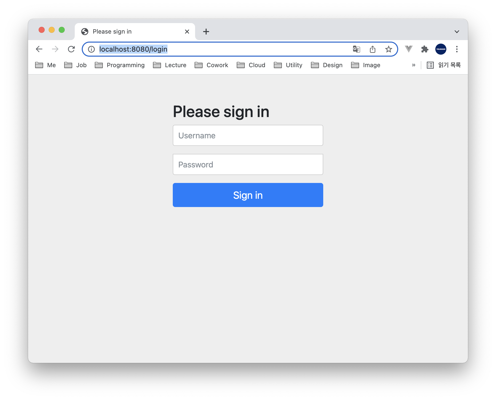

# Table of Contents
[[toc]]

# Cookie-Session 기반 인증 구현

## 의존성 설정
`Spring Security` 의존성을 추가한다.
``` groovy
// build.gradle
dependencies {
    implementation 'org.springframework.boot:spring-boot-starter-security'
    testImplementation 'org.springframework.security:spring-security-test'
    // 생략 ...
}
```

## 스프링 시큐리티 기본 설정
프로젝트에 의존성을 추가하면 스프링 시큐리티는 기본적으로 <u>쿠키-세션 기반</u>으로 동작한다.

예제를 살펴보자. 다음과 같은 컨트롤러가 있다. 이 컨트롤러는 `home.mustache` 뷰를 보여준다.
``` java
// HomeController.java
@RestController
public class MainController {

    @GetMapping
    public String home() {
        return "home";
    }
} 
```
`home.mustache`는 다음과 같다.
``` html
<!DOCTYPE HTML>
<html>
<head>
    <title>home</title>
    <meta http-equiv="Content-Type" content="text/html; charset=UTF-8" />
</head>
<body>
<h1>This is Home</h1>
</body>
</html>
```
이제 웹 브라우저에서 `http://localhost:8080`로 접근해보자. 웹 브라우저에 쿠키가 저장된 것을 확인할 수 있다.


쿠키-세션 방식은 스프링 시큐리티 구성파일에서 다음과 같이 비활성화할 수 있다.

``` java
@EnableWebSecurity
public class SecurityConfig extends WebSecurityConfigurerAdapter {

    @Override
    protected void configure(HttpSecurity http) throws Exception {
        http
            .sessionManagement().sessionCreationPolicy(SessionCreationPolicy.STATELESS);
    }
}
```

이 경우 웹 브라우저에 어떠한 쿠키도 저장되지 않는다.


프로젝트에 의존성만을 추가하면 스프링 시큐리티는 기본적으로 <u>모든 엔드포인트에 대한 HTTP 요청을 차단</u>한다. 따라서 `http://localhost:8080/test`로 접근하면 `home.mustache`를 보여주지 않고 `http://localhost:8080/login`로 리다이렉트된다. 스프링 시큐리티는 기본적으로 모든 엔드포인트에 대해서 인증되지 않은 접근을 차단하기 때문이다. 또한 스프링 시큐리티의 기본 설정은 다음과 같이 로그인 페이지를 자동으로 제공한다.



인증을 위해 로그인을 해보자. 스프링 시큐리티 기본 설정에서 Username은 `user`이며, Password는 어플리케이션을 구동할 때 로그에 출력된다.


인증에 성공한 후 `http://localhost:8080`에 다시 접속해보자. 


스프링 시큐리티는 기본적으로 `Cookie-Session` 방식으로 인증한다. 따라서 로그인 후 웹 브라우저에서 `Cookie`를 확인할 수 있다.


스프링 시큐리티는 인증 정보를 `SecurityContext`에서 관리한다. 이 객체는 서블릿의 `HttpSession` 안에 저장된다.


인증에 성공하면`SecurityContext`안 <b>`Authentication`</b> 객체에 인증 정보들이 저장된다.


참고로 세션 정보는 컨트롤러에서 다음과 같이 바인딩할 수 있다.

``` java
import javax.servlet.http.HttpSession;

@RestController
public class MainController {

    @GetMapping
    public String home(HttpSession httpSession) {
        // ...
    }
}
```

스프링 시큐리티 기본 설정값은 로그아웃을 위한 페이지도 제공한다. `http://localhost:8080/logout`으로 접근하면 된다.


이처럼 프로젝트에 스프링 시큐리티를 추가하기만 하면 <u>모든 엔드포인트에 대한 HTTP 요청을 차단</u>하는데 이는 스프링 시큐리티의 기본 설정이 적용되기 때문이다. 기본 설정은 `SecurityAutoConfiguration` 클래스에 정의되어있다.
``` java
@AutoConfiguration
@ConditionalOnClass(DefaultAuthenticationEventPublisher.class)
@EnableConfigurationProperties(SecurityProperties.class)
@Import({ SpringBootWebSecurityConfiguration.class, SecurityDataConfiguration.class })
public class SecurityAutoConfiguration {

	@Bean
	@ConditionalOnMissingBean(AuthenticationEventPublisher.class)
	public DefaultAuthenticationEventPublisher authenticationEventPublisher(ApplicationEventPublisher publisher) {
		return new DefaultAuthenticationEventPublisher(publisher);
	}

}
```
`SecurityAutoConfiguration`는 내부적으로 `SpringBootWebSecurityConfiguration` 구성 클래스를 임포트한다.
``` java {12-15}
@Configuration(proxyBeanMethods = false)
@ConditionalOnWebApplication(type = Type.SERVLET)
class SpringBootWebSecurityConfiguration {

	@Configuration(proxyBeanMethods = false)
	@ConditionalOnDefaultWebSecurity
	static class SecurityFilterChainConfiguration {

		@Bean
		@Order(SecurityProperties.BASIC_AUTH_ORDER)
		SecurityFilterChain defaultSecurityFilterChain(HttpSecurity http) throws Exception {
			http.authorizeRequests().anyRequest().authenticated();  // 접근 제어
			http.formLogin();   // 폼 기반 인증 활성화
			http.httpBasic();   // HTTP 기본 인증 활성화
			return http.build();
		}
	}
    // 생략 ...
}
```
`SpringBootWebSecurityConfiguration`에서 설정하는 설정값은 다음과 같다. 
- `authorizeRequests().anyRequest().authenticated()`: 모든 요청에 대해서 인증을 요구한다.
- `formLogin()`: 폼 기반 인증을 활성화한다.
- `httpBasic()`:  HTTP 기본 인증을 활성화한다.

[`폼 기반 인증(Form-based Authentication)`](https://docs.oracle.com/cd/E19798-01/821-1841/6nmq2cpki/index.html)은 다음과 같이 HTML Form 태그로 사용자를 인증하는 방식이다.
``` html
<form name="LoginForm" method="post" action="/auth/login">
  <input type="text" name="username"/>
  <input type="password" name="password"/>
</form>
```
스프링 시큐리티는 기본 로그인 페이지를 제공한다.


[`HTTP 기본 인증(Http basic authentication)`](https://developer.mozilla.org/ko/docs/Web/HTTP/Authentication)은 다음 절차를 준수하는 인증 방법을 의미한다.

1. 서버는 클라이언트의 인증이 실패했을 때 `WWW-Authenticate` 헤더를 추가하여 `401(Unauthorized)` 응답을 보낸다.
2. 클라이언트는 `Authorization` 헤더에 인코딩된 비밀번호를 추가하여 인증을 요청한다.
3. 인증이 완료되면 서버는 `200(OK)` 응답을 보낸다.


스프링 시큐리티 기본 설정은 다음과 같이 비활성화할 수 있다.
``` java {1}
@SpringBootApplication(exclude = { SecurityAutoConfiguration.class })
public class SpringSecuritySampleApplication {
 
    public static void main(String[] args) {
        SpringApplication.run(SpringSecuritySampleApplication.class, args);
    }
}
```

기본 설정은 커스텀 구성 클래스를 정의해도 비활성화된다.

## 스프링 시큐리티 설정 커스터마이징
스프링 시큐리티와 관련된 설정을 커스터마이징하려면 구성 클래스를 정의해야한다. 구성 클래스는 `WebSecurityConfigurerAdapter`를 상속하며, `@EnableWebSecurity`어노테이션을 추가해야한다.
``` java
import org.springframework.security.config.annotation.web.configuration.EnableWebSecurity;
import org.springframework.security.config.annotation.web.configuration.WebSecurityConfigurerAdapter;

@Configuration
@EnableWebSecurity
public class SecurityConfig extends WebSecurityConfigurerAdapter {
    // ...
}
```

`WebSecurityConfigurerAdapter`의 `configure(HttpSecurity http)`메소드를 오버라이드하여 인증 절차를 설정할 수 있다. 

다음과 같이 사용자가 직접 로그인 페이지를 정의할 수 있다.
``` java{9}
public class SecurityConfig extends WebSecurityConfigurerAdapter {

    @Override
    protected void configure(HttpSecurity http) throws Exception {
        http
            .authorizeRequests()
                .anyRequest().authenticated().and()
            .formLogin()
                .loginPage("/login.html")  // 사용자 정의 로그인 페이지
            // ...
    }
}       
```
그 외에도 다음과 같이 여러 설정을 커스터마이징할 수 있다.
``` java
public class SecurityConfig extends WebSecurityConfigurerAdapter {

    @Override
    protected void configure(HttpSecurity http) throws Exception {
        http
            .authorizeRequests()
                .anyRequest().authenticated().and()
            .formLogin()
                .loginPage("/login.mustache")  // 사용자 정의 로그인 페이지
                .loginProcessingUrl("/login")  // 인증을 요청할 URL, POST 메소드를 사용해야한다.
                .defaultSuccessUrl("/home")  // 로그인 성공 후 이동 페이지
                .failureUrl("/login")  // 로그인 실패 후 이동 페이지
                .usernameParameter("userId")  // 아이디 파라미터명 설정
                .passwordParameter("passwd")  // 패스워드 파라미터명 설정
                .loginProcessingUrl("/login")  // 로그인 Form Action Url
                .successHandler(new AuthenticationSuccessHandler() {
                    // 로그인 성공 후 핸들러
                })
                .failureHandler(new AuthenticationFailureHandler() {
                    // 로그인 실패 후 핸들러
                }).and()
            // ...
    }
}
```
`HttpSecurity.logout()`메소드로 로그아웃 관련 설정을 할 수도 있다.
``` java
public class SecurityConfig extends WebSecurityConfigurerAdapter {

    @Override
    protected void configure(HttpSecurity http) throws Exception {
        http
            // ...
            .logout()
                .logoutUrl("/auth/logout.mustache")
                .logoutSuccessUrl("/auth/login.mustache")
                .logoutSuccessHandler(...)
                .invalidateHttpSession(true)  // 서버 세션 삭제하기
                .deleteCookies("JSESSIONID").and()  // 클라이언트 쿠키 삭제하기
            // ...
    }
}
```
사용할 `UserDetailsService` 구현체를 다음과 같이 지정할 수도 있다.
``` java
public class SecurityConfig extends WebSecurityConfigurerAdapter {

    @Override
    protected void configure(HttpSecurity http) throws Exception {
        http
            // ...
            .userDetailsService(userDetailsServiceImpl);
            // ...
    }
}
```

## 인증방법 커스터마이징 - 인메모리 방식
지금까지 `user`와 스프링부트 구동 시 출력되는 비밀번호로 인증을 진행했다.


인메모리 방식으로 인증방법을 커스터마이징할 수 있다.
``` java
@Configuration
@EnableWebSecurity
public class SecurityConfig extends WebSecurityConfigurerAdapter {

    @Bean
    PasswordEncoder passwordEncoder() {
        return new BCryptPasswordEncoder();
    }

    @Override
    protected void configure(AuthenticationManagerBuilder auth) throws Exception {
        auth
                .inMemoryAuthentication()
                .withUser("yologger")
                .password(passwordEncoder().encode("1234"))
                .authorities("AUTHORITY_USER");
    }
}
```

## 인증방법 커스터마이징 - 온디스크 데이터베이스 방식
대부분의 서비스는 회원가입 시 사용자 정보를 받아 데이터베이스에서 저장한다. 그리고 인증 시 데이터베이스에서 사용자 정보를 조회하여 비교한 후 인증 여부를 결정한다.

온디스크 데이터베이스를 사용하여 인증을 구현해보자. 영속성 계층 클래스는 다음과 같다.
``` java
public enum AuthorityType {

    ADMIN("ADMIN"),
    USER("USER");

    private String description;

    AuthorityType(String description) {
        this.description = description;
    }

    public String getDescription() {
        return description;
    }
}
```
``` java
@Entity
@Table(name = "user")
@NoArgsConstructor
@Getter
public class UserEntity {

    @Id
    @GeneratedValue(strategy = GenerationType.IDENTITY)
    private Long id;

    @Column
    private String name;

    @Column
    private String password;

    @Enumerated(EnumType.STRING)
    private AuthorityType authority;

    @Builder
    public UserEntity(String name, String password, AuthorityType authority) {
        this.name = name;
        this.password = password;
        this.authority = authority;
    }
}
```
``` java
public interface UserRepository extends JpaRepository<UserEntity, Long> {
    public Optional<UserEntity> findOneByName(String name);
}
```
서비스 계층은 다음과 같다. 회원가입 로직이 포함되어있다.
``` java
@Service
@RequiredArgsConstructor
public class UserService {

    PasswordEncoder passwordEncoder;

    private final UserRepository userRepository;

    public Long register(RegistrationDto request) {
        UserEntity user = UserEntity.builder()
                .name(request.getName())
                .authority(AuthorityType.USER)
                .password(passwordEncoder.encode(request.getPassword()))
                .build();

        UserEntity saved = userRepository.save(user);
        return saved.getId();
    }
}
```
컨트롤러 계층은 다음과 같다. 회원가입 페이지를 보여주는 메소드, 회원가입을 진행하는 메소드가 정의되어있다.
``` java
@Controller
@RequiredArgsConstructor
public class UserController {

    private final UserService userService;

    // 회원가입 페이지
    @GetMapping("/user/registration")
    public String registrationPage() {
        return "registration";
    }

    // 회원가입 로직
    @PostMapping("/user/registration")
    public String registration(RegistrationDto request) {
        userService.register(request);
        return "redirect:/login";
    }
}
```
``` java
@Getter
public class RegistrationDto {
    private String name;
    private String password;

    @Builder
    public RegistrationDto(String name, String password) {
        this.name = name;
        this.password = password;
    }
}
```
`registration.mustache`는 다음과 같다.
``` html
<!DOCTYPE HTML>
<html>
<head>
    <title>home</title>
    <meta http-equiv="Content-Type" content="text/html; charset=UTF-8" />
</head>
<body>
<div>
    <form method="post" action="/user/registration">
        <div>
            <input id="name" type="text" name="name"/>
            <label for="name">Name</label>
        </div>
        <div>
            <input id="password" type="password" name="password"/>
            <label for="password">Password</label>
        </div>
        <input type="submit" value="회원가입" />
    </form>
</div>
</body>
</html>
```
스프링 시큐리티 인증과 관련된 클래스는 다음과 같다.
``` java
@Service
@RequiredArgsConstructor
public class UserDetailsServiceImpl implements UserDetailsService {

    private final UserRepository userRepository;

    @Override
    public UserDetails loadUserByUsername(String username) throws UsernameNotFoundException {
        UserEntity user = userRepository.findOneByName(username)
                .orElseThrow(() -> new UsernameNotFoundException(username));

        return org.springframework.security.core.userdetails.User.builder()
                .username(user.getName())
                .password(user.getPassword())
                // .roles("USER")
                .authorities(new SimpleGrantedAuthority(user.getAuthority().getDescription()))
                .build();
    }
}
```
스프링 시큐리티 구성 클래스는 다음과 같다.
``` java
@Configuration
@EnableWebSecurity
@RequiredArgsConstructor
public class SecurityConfig extends WebSecurityConfigurerAdapter {

    private final UserDetailsServiceImpl userDetailsService;

    @Override
    protected void configure(HttpSecurity http) throws Exception {
        http
            .formLogin()
                .defaultSuccessUrl("/").and()
            .csrf().disable()
            .cors().disable()
            .authorizeRequests((authorize) -> {
                authorize.antMatchers(HttpMethod.GET, "/user/registration").permitAll();
                authorize.antMatchers(HttpMethod.POST, "/user/registration").permitAll();
                authorize.anyRequest().authenticated();
            });
    }

    @Bean
    PasswordEncoder passwordEncoder() {
        return new BCryptPasswordEncoder();
    }

    @Override
    protected void configure(AuthenticationManagerBuilder auth) throws Exception {
        auth.userDetailsService(userDetailsService)
                .passwordEncoder(passwordEncoder());
    }
}
```