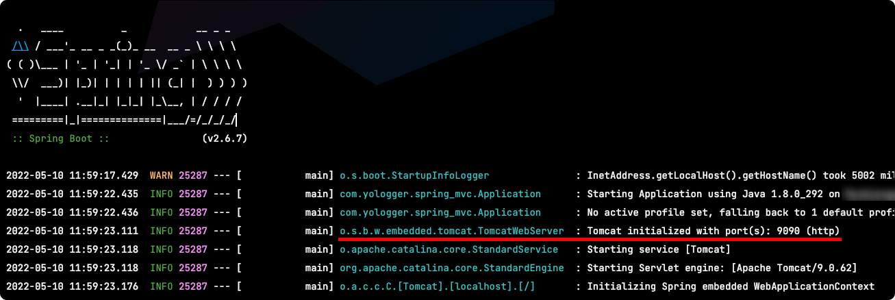
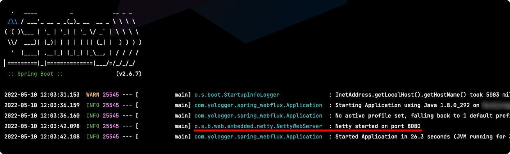

# Table of Contents
[[toc]]


## 의존성 추가
Spring MVC의 경우 Servlet 기반의 Tomcat을 사용한다.
``` groovy
dependencies {
    // Spring Boot + Spring MVC
    implementation 'org.springframework.boot:spring-boot-starter-web'
    testImplementation 'org.springframework.boot:spring-boot-starter-test'
}
```
따라서 내장 Tomcat에서 애플리케이션이 구동된다. 



반면 Spring WebFlux는 Netty를 사용한다.
``` groovy 
// build.gradle
dependencies {
    // Spring Boot + Spring WebFlux
    implementation 'org.springframework.boot:spring-boot-starter-webflux'
    testImplementation 'io.projectreactor:reactor-test'
}
```



## 사용법
Spring WebFlux는 두 가지 방식으로 API Endpoint를 정의할 수 있다.
- 기존 Spring MVC 어노테이션 방식
- 함수형 모델

## 기존 Spring MVC 어노테이션 방식
Spring MVC는 Servlet Container가 제공하는 `HttpServletRequest`, `HttpServletResponse`로 요청과 응답을 처리한다.
``` java
import javax.servlet.http.HttpServletRequest;
import javax.servlet.http.HttpServletResponse;

@RestController
public class TestController {

    @GetMapping("/test1")
    public void test1(HttpServletRequest request, HttpServletResponse response) throws IOException {
        String name = request.getParameter("name");
        response.getOutputStream().print("response: " + name);
    }

    @PostMapping("/test2")
    public void test2(HttpServletRequest request, HttpServletResponse response) throws IOException {
        // ...
    }
}
```
물론 `HttpServletRequest`, `HttpServletResponse` 대신 Spring MVC가 제공하는 다양한 어노테이션과 Converter로 <u><b>바인딩</b></u>할 수 있다.
``` java
import javax.servlet.http.HttpServletRequest;
import javax.servlet.http.HttpServletResponse;

@RestController
public class TestController {

    @GetMapping("/test1")
    public String test1(@RequestParam(value="name") String name) {
        return "response:" + name;
    }

    @PostMapping("/test2")
    public String test2(@RequestBody TestRequest request) {
        // ...
    }
}
```

Spring WebFlux도 Spring MVC와 유사한 방식으로 요청과 응답을 처리할 수 있다. 다만 HttpServletRequest, HttpServletResponse 대신 `ServerRequest`, `ServerResponse`를 사용한다. 또한 응답을 `Mono` 또는 `Flux`로 래핑해야한다.
``` java
import org.springframework.web.reactive.function.server.ServerRequest;
import org.springframework.web.reactive.function.server.ServerResponse;
import reactor.core.publisher.Mono;
import reactor.core.publisher.Flux;

@Controller
public class TestController {

    @GetMapping("/test1")
    public Mono<ServerResponse> test1(ServerRequest request) {
        // ...
    }

    @PostMapping("/test2")
    public Mono<ServerResponse> test2(ServerRequest request) {
        // ...
    }
}
```
또한 Spring MVC처럼 바인딩도 사용할 수 있다.
``` java
@RestController
public class TestController {

    @GetMapping("/test1")
    public Mono<String> test1(@RequestParam("name") String name) {
        return Mono.just("response: " + name);
    }

    @PostMapping("/test2")
    public Mono<ServerResponse> test2(@RequestBody TestRequest request) {
        // ...
    }
}
```
요청을 받을 때도 `Mono`로 래핑할 수 있다. 이 경우 Reactive Stream API가 제공하는 다양한 Operator로 더욱 Reactive하게 코드를 작성할 수 있다.
``` java
@RestController
public class TestController {

    // ...

    @PostMapping("/test2")
    public Mono<ServerResponse> test2(@RequestBody Mono<TestRequest> request) {
        return request
            .map(req -> ... )
    }
}
```

## 함수형 모델
함수형 모델은 두 가지의 함수형 인터페이스를 사용하여 구현한다.
- `HandlerFunction`: 요청을 처리하고 응답을 반환한다.
- `RouterFunction`: 요청을 라우팅해준다.

요청을 처리하고 응답을 반환하는 핸들러는 다음과 같이 정의할 수 있다.
``` java
import org.springframework.stereotype.Component;
import org.springframework.web.reactive.function.server.ServerRequest;
import org.springframework.web.reactive.function.server.ServerResponse;
import reactor.core.publisher.Mono;

import static org.springframework.web.reactive.function.BodyInserters.fromValue;
import static org.springframework.web.reactive.function.server.ServerResponse.ok;


@Component
public class TestHandler {

    public Mono<ServerResponse> test1(ServerRequest request) {
        return ok().body(fromValue("response 1: " + request.queryParam("name").get()));
    }

    public Mono<ServerResponse> test2(ServerRequest request) {
        return ok().body(fromValue("response 2: " + request.queryParam("name").get()));
    }
}
```
요청을 라우팅해주는 핸들러는 다음과 같이 정의할 수 있다.
``` java
import org.springframework.context.annotation.Bean;
import org.springframework.context.annotation.Configuration;
import org.springframework.web.reactive.function.server.RequestPredicates;
import org.springframework.web.reactive.function.server.RouterFunction;
import org.springframework.web.reactive.function.server.RouterFunctions;
import org.springframework.web.reactive.function.server.ServerResponse;

@Configuration
public class TestRouter {

    @Autowired TestHandler handler;

    @Bean
    public RouterFunction<ServerResponse> testRoute() {
        return RouterFunctions
            .route(RequestPredicates.GET("/test1"), handler::test1)
            .andRoute(RequestPredicates.GET("/test2"), handler::test2);
    }
}
```
