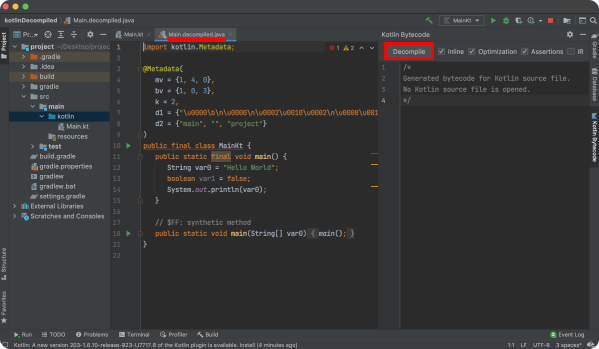

# Table of Contents
[[toc]]

`IntelliJ`를 사용하면 Kotlin을 Java로, 또는 반대로 쉽게 변환할 수 있다. IntelliJ 기반의 Android Studio에서도 방법이 유사하다.

# Kotlin을 Java로 변환하기
IntelliJ에서 `Tools > Kotlin > Show Bytecode`를 클릭한다.

`Kotlin Bytecode`탭에서 Bytecode를 확인할 수 있다.

`Decompile`버튼을 누르면 Java 파일을 확인할 수 있다.
