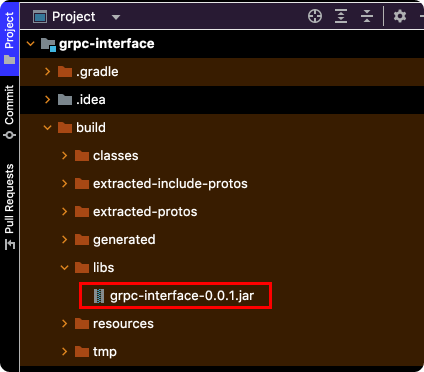
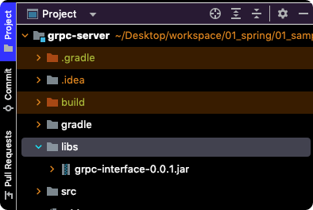
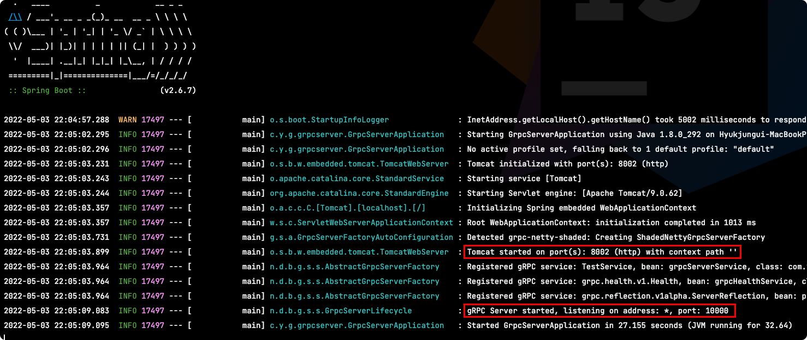
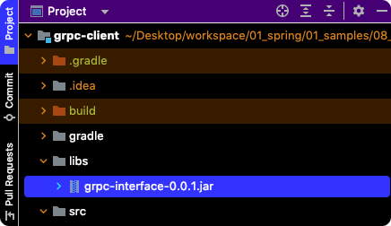
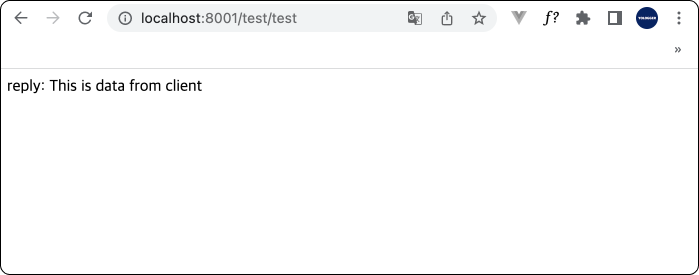

# Table of Contents
[[toc]]

# gRPC
`gRPC(google Remote Procedure Call)`을 사용하면 다른 서버의 메서드를 로컬 메서드처럼 직접 호출할 수 있다.

## 프로젝트 구성
예제는 총 세 개의 프로젝트로 구성된다.
- `grpc-interface`
- `grpc-server`
- `grpc-client`  

## grpc-interface
`grpc-interface`는 클라이언트와 서버가 공통으로 사용하는 프로젝트다. 이 프로젝트에 다음과 같은 의존성을 추가하자.
``` groovy{4-6,12,25,26,27,30-48}
// build.gradle
buildscript {
    ext {
        protobufVersion = '3.14.0'
        protobufGradlePluginVersion = '0.8.14'
        grpcVersion = '1.35.0'
    }
}

plugins {
    id 'java'
    id 'com.google.protobuf' version "${protobufGradlePluginVersion}"
}

group 'com.yologger.grpc'
version '0.0.1'
sourceCompatibility = '1.8'
targetCompatibility = '1.8'

repositories {
    mavenCentral()
}

dependencies {
    implementation "io.grpc:grpc-protobuf:${grpcVersion}"
    implementation "io.grpc:grpc-stub:${grpcVersion}"
    compileOnly 'jakarta.annotation:jakarta.annotation-api:1.3.5'
}

protobuf {
    protoc {
        artifact = "com.google.protobuf:protoc:${protobufVersion}"
    }
    generatedFilesBaseDir = "$projectDir/src/generated"
    clean {
        delete generatedFilesBaseDir
    }
    plugins {
        grpc {
            artifact = "io.grpc:protoc-gen-grpc-java:${grpcVersion}"
        }
    }
    generateProtoTasks {
        all()*.plugins {
            grpc{}
        }
    }
}

test {
    useJUnitPlatform()
}
```

그 다음 `main` 폴더 안에 `proto` 폴더를 생성한다.
```{7}
$ tree
.
├── ...
└── src
    ├── main
    │   ├── java
    │   ├── proto
    │   └── resources
    └── test
        ├── java
        └── resources
```
그 다음 `.proto` 확장자의 파일을 생성한다. 여기서는 `MyService.proto`라고 명명했다. (자세한 문법과 사용법은 [이 곳](https://developers.google.com/protocol-buffers/docs/proto3)에서 확인할 수 있다.)
``` proto
syntax = "proto3";

option java_multiple_files = true;
option java_package = "com.yologger.grpc.service";

service TestService {
  rpc doTest (TestRequest) returns (TestReply) {
  }
}

message TestRequest {
  string data = 1;
}

message TestReply {
  string message = 1;
}
```
마지막으로 프로젝트를 빌드한다.
```
$ ./gradlew clean build
```
빌드에서 성공하면 `build/libs` 경로에 JAR 파일이 생성된다.



## grpc-server
`grpc-server`는 RPC을 제공하는 프로젝트다. 

먼저 프로젝트에 `libs` 디렉토리를 만들고 위에서 생성한 JAR 파일을 포함시킨다.



그 다음 위에서 추가한 JAR 파일과 `gRPC Server`을 의존성으로 추가한다.
``` groovy{16,17}
plugins {
    id 'org.springframework.boot' version '2.6.7'
    id 'io.spring.dependency-management' version '1.0.11.RELEASE'
    id 'java'
}

group = 'com.yologger.grpc'
version = '0.0.1'
sourceCompatibility = '1.8'

repositories {
    mavenCentral()
}

dependencies {
    implementation 'net.devh:grpc-server-spring-boot-starter:2.12.0.RELEASE'
    implementation files('libs/grpc-interface-0.0.1.jar')
    implementation 'org.springframework.boot:spring-boot-starter-web'
    testImplementation 'org.springframework.boot:spring-boot-starter-test'
}

tasks.named('test') {
    useJUnitPlatform()
}
```

이제 다음과 같이 서비스를 구현한다.
``` java
// GrpcServerService.java
import com.yologger.grpc.service.TestReply;
import com.yologger.grpc.service.TestRequest;
import com.yologger.grpc.service.TestServiceGrpc;
import io.grpc.stub.StreamObserver;
import net.devh.boot.grpc.server.service.GrpcService;

@GrpcService
public class GrpcServerService extends TestServiceGrpc.TestServiceImplBase {

    @Override
    public void doTest(TestRequest request, StreamObserver<TestReply> responseObserver) {

        TestReply reply = TestReply.newBuilder()
                .setMessage("reply: " + request.getData())
                .build();

        responseObserver.onNext(reply);
        responseObserver.onCompleted();;
    }
}
```
마지막으로 gRPC 서버를 위한 포트를 설정한다.
``` properties {7}
# application.properties

# Spring MVC server
server.port=8002  

# Spring gRPC server
grpc.server.port=10000
```

어플리케이션을 실행하면 두 개의 서버가 구동되는 것을 확인할 수 있다.




## grpc-client
`grpc-server`는 RPC을 사용하는 프로젝트다. 

이 프로젝트에도 `libs` 디렉토리를 만들고 위에서 생성한 JAR 파일을 포함시킨다.



그 다음 위에서 추가한 JAR 파일과 `gRPC Client`을 의존성으로 추가한다.
``` groovy{16,17}
plugins {
    id 'org.springframework.boot' version '2.6.7'
    id 'io.spring.dependency-management' version '1.0.11.RELEASE'
    id 'java'
}

group = 'com.yologger.grpc'
version = '0.0.1'
sourceCompatibility = '1.8'

repositories {
    mavenCentral()
}

dependencies {
    implementation 'net.devh:grpc-client-spring-boot-starter:2.12.0.RELEASE'
    implementation files('libs/grpc-interface-0.0.1.jar')
    implementation 'org.springframework.boot:spring-boot-starter-web'
    testImplementation 'org.springframework.boot:spring-boot-starter-test'
}

tasks.named('test') {
    useJUnitPlatform()
}
```

그리고 서비스를 구현한다.
``` java
import com.yologger.grpc.service.TestReply;
import com.yologger.grpc.service.TestRequest;
import com.yologger.grpc.service.TestServiceGrpc;
import io.grpc.StatusRuntimeException;
import net.devh.boot.grpc.client.inject.GrpcClient;
import org.springframework.stereotype.Service;

@Service
public class GrpcClientService {
    @GrpcClient("test")
    private TestServiceGrpc.TestServiceBlockingStub stub;

    public String doTest(String data) {
        try {
            TestRequest request = TestRequest.newBuilder().setData(data).build();
            TestReply reply = stub.doTest(request);
            return reply.getMessage();
        } catch (StatusRuntimeException e) {
            e.printStackTrace();
            return "FAILED with " + e.getStatus().getCode().name();
        }
    }
}
```
그 다음 컨트롤러를 구현한다.
```
@RestController
@RequestMapping("/test")
public class TestController {

    @Autowired GrpcClientService service;

    @GetMapping("/test")
    String doTest() {
        return service.doTest("This is data from client");
    }
}
```
마지막으로 `application.properties`을 다음과 같이 작성한다.
``` properties
server.port=8001
grpc.client.test.address=static://127.0.0.1:10000
grpc.client.test.negotiation-type=plaintext
```
`grpc.client` 다음의 <b>`test`</b>는 개발자가 자유롭게 설정할 수 있다. 또한 스텁을 만들 때 추가한 어노테이션의 값과 일치시켜야한다.
``` java {4}
@Service
public class GrpcClientService {

    @GrpcClient("test")
    private TestServiceGrpc.TestServiceBlockingStub stub;

    // ...
}
```
이제 외부에서 `클라이언트IP:8001/test/test`로 접근해보자.

