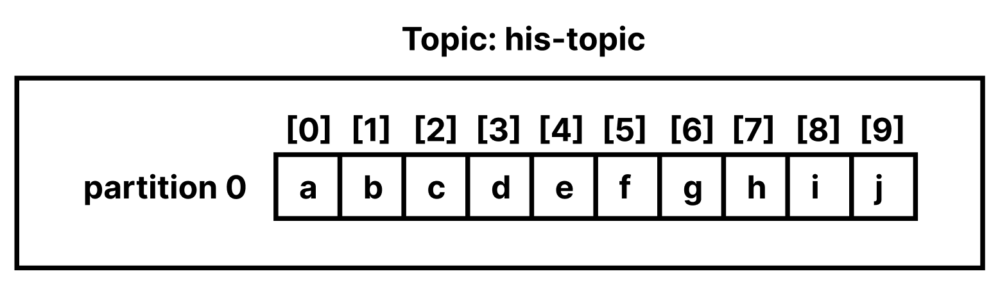

# Table of Contents
[[toc]]

# Apache Kafka
`Apache Kafka`는 아파치 재단의 오픈소스 `메시지 브로커(Message Broker)`다.

## Zookeeper, Kafka 서버 구축
먼저 도커 컴포즈를 사용하여 `Zookeeper`서버와 `Kafka` 서버를 구축해보자.
```  yml
# docker-compose.yml
version: '2'
services:
  zookeeper:
    image: wurstmeister/zookeeper
    container_name: zookeeper
    ports:
      - "2181:2181"
  kafka:
    image: wurstmeister/kafka
    container_name: kafka
    ports:
      - "9092:9092"
    environment:
      KAFKA_ADVERTISED_HOST_NAME: 127.0.0.1
      KAFKA_ZOOKEEPER_CONNECT: zookeeper:2181
```
다음 명령어로 도커 컴포스를 백그라운드로 실행할 수 있다.
```
$ docker-compose up -d
```
다음 명령어로 포그라운드로 시작하면 로그를 실시간으로 확인할 수 있다.
```
$ docker-compose up
```
생성된 컨테이너를 확인해보자. Zookeeper는 `2181`포트, Kafka는 `9092` 포트를 사용한다.
```
$ docker-compose ps 
  Name                 Command               State                         Ports                       
-------------------------------------------------------------------------------------------------------
kafka       start-kafka.sh                   Up      0.0.0.0:9092->9092/tcp                            
zookeeper   /bin/sh -c /usr/sbin/sshd  ...   Up      0.0.0.0:2181->2181/tcp, 22/tcp, 2888/tcp, 3888/tcp
```
```
$ docker ps 
CONTAINER ID   IMAGE                                    COMMAND                  CREATED         STATUS         PORTS                                                NAMES
a18bb010ab3e   wurstmeister/zookeeper                   "/bin/sh -c '/usr/sb…"   3 minutes ago   Up 3 minutes   22/tcp, 2888/tcp, 3888/tcp, 0.0.0.0:2181->2181/tcp   zookeeper
f17107e94596   wurstmeister/kafka                       "start-kafka.sh"         3 minutes ago   Up 3 minutes   0.0.0.0:9092->9092/tcp                               kafka
```
참고로 다 사용한 컨테이너는 다음과 같이 종료할 수 있다.
```
$ docker-compose down
```

## Kafka 클라이언트 설치
`Kafka 클라이언트`는 Zookeeper, Kafka 서버 제어를 위한 실행파일들을 제공한다. Mac OS 환경에서 `Homebrew` Kafka를 설치하면 Kafka 클라이언트도 포함되어있다.
```
$ brew install kafka
```
`brew info kafka` 명령어로 Kafka 설치 경로를 확인할 수 있다.
``` {5}
$ brew info kafka
kafka: stable 3.1.0 (bottled)
Open-source distributed event streaming platform
https://kafka.apache.org/
/usr/local/Cellar/kafka/3.1.0 (198 files, 84.2MB) *
  Poured from bottle on 2022-05-04 at 13:36:01
From: https://github.com/Homebrew/homebrew-core/blob/HEAD/Formula/kafka.rb
...
```
설치 경로의 `bin` 폴더에서 다양한 실행 파일을 확인할 수 있다.
```
$ cd /usr/local/Cellar/kafka/3.1.0/bin

$ ls
connect-distributed             kafka-console-consumer          kafka-features                  kafka-reassign-partitions       kafka-topics                    zookeeper-server-stop
connect-mirror-maker            kafka-console-producer          kafka-get-offsets               kafka-replica-verification      kafka-transactions              zookeeper-shell
connect-standalone              kafka-consumer-groups           kafka-leader-election           kafka-run-class                 kafka-verifiable-consumer
kafka-acls                      kafka-consumer-perf-test        kafka-log-dirs                  kafka-server-start              kafka-verifiable-producer
kafka-broker-api-versions       kafka-delegation-tokens         kafka-metadata-shell            kafka-server-stop               trogdor
kafka-cluster                   kafka-delete-records            kafka-mirror-maker              kafka-storage                   zookeeper-security-migration
kafka-configs                   kafka-dump-log                  kafka-producer-perf-test        kafka-streams-application-reset zookeeper-server-start
```

## Kafka 사용해보기
이제 Kafka의 메시지 브로커 기능을 사용해보자. 우선 `Topic`이라는 것을 생성해야한다. Zookeeper, Kafka 서버가 구동되고 있는 상태에서 다음과 같이  test-topic 이라는 이름의 Topic을 생성해보자. `--bootstrap-server` 옵션에는 Kafka 서버 주소, `--topic` 옵션에는 생성할 Topic의 이름을 전달한다.
```
$ kafka-topics --bootstrap-server localhost:9092 --topic test-topic --create
Created topic test-topic.
```
그리고 Consumer를 실행한다. `Consumer`는 <u>Producer가 생성한 데이터를 소비한다.</u>
```
$ kafka-console-consumer --bootstrap-server localhost:9092 --topic test-topic
```

그 다음 새로운 터미널을 열고 Producer를 실행한다. `Producer`는 <u>데이터를 생성하여 메시지 브로커에 전달한다.</u>
```
$ kafka-console-producer --bootstrap-server localhost:9092 --topic test-topic
> Hello Kafka.
> Nice to meet you.
> See you again.
```
이제 Consumer를 확인해보자. Producer가 생성한 데이터가 소비되는 것을 확인할 수 있다.
```
$ kafka-console-consumer --bootstrap-server localhost:9092 --topic test-topic
Hello World!
Nice to meet you.
See you again~
```

## Message Broker
이처럼 <b>`메시지 브로커(Message Broker)`</b>는 <u>Producer가 생성한 데이터를 Consumer에게 전달하는 시스템이다.</u> 메시지 브로커는 `메시지 큐(Message Queue)`라고도 하며 Apache Kafka, Redis, Rabbit MQ, Active MQ 등의 제품군이 있다.

Apache Kafka에서 Producer와 Consumer는 서로의 존재를 알지 못한다. Producer는 그저 Kafka에 메시지를 전송한다. Kafka는 메시지가 들어오면 해당 Topic을 구독 중인 Consumer에게 메시지를 전달한다. 이러한 점에서 Apache Kafka의 메시지 전달 방식을 `Publish/Subscribe` 모델이라고도 한다.

## Kafka의 구성요소

### Kafka 서버
`Kafka 서버`는 메시지 브로커 기능을 제공하며, `Broker 서버`라고도 한다. ZooKeeper 1대, Broker 서버 1대로 이루어진 클러스터는 다음과 같이 구축할 수 있다.

```  yml {12-19}
# docker-compose.yml
version: '2'
services:
  # Zookeeper
  zookeeper:
    image: wurstmeister/zookeeper
    container_name: zookeeper
    ports:
      - "2181:2181"

  # Kafka
  kafka:
    image: wurstmeister/kafka
    container_name: kafka
    ports:
      - "9092:9092"
    environment:
      KAFKA_ADVERTISED_HOST_NAME: 127.0.0.1
      KAFKA_ZOOKEEPER_CONNECT: zookeeper:2181
```

`wurstmeister/kafka` 이미지의 경우 Kafka가 `/opt/kafka`에 설치되어있다.
```
$ docker exec -it kafka /bin/bash

bash-5.1# cd opt/kafka

bash-5.1# ls
LICENSE    NOTICE     bin        config     libs       licenses   logs       site-docs
```
`Kafka 설치경로/config`의 <b>`server.properties`</b> 파일로 Broker 서버의 환경을 설정할 수 있다. 중요한 설정값은 음영처리해놨다.
``` {22,32,37,61,66,70,75,124,139-140}
$ cat opt/kafka/config/server.properties
# Licensed to the Apache Software Foundation (ASF) under one or more
# contributor license agreements.  See the NOTICE file distributed with
# this work for additional information regarding copyright ownership.
# The ASF licenses this file to You under the Apache License, Version 2.0
# (the "License"); you may not use this file except in compliance with
# the License.  You may obtain a copy of the License at
#
#    http://www.apache.org/licenses/LICENSE-2.0
#
# Unless required by applicable law or agreed to in writing, software
# distributed under the License is distributed on an "AS IS" BASIS,
# WITHOUT WARRANTIES OR CONDITIONS OF ANY KIND, either express or implied.
# See the License for the specific language governing permissions and
# limitations under the License.

# see kafka.server.KafkaConfig for additional details and defaults

############################# Server Basics #############################

# The id of the broker. This must be set to a unique integer for each broker.
broker.id=-1

############################# Socket Server Settings #############################

# The address the socket server listens on. It will get the value returned from 
# java.net.InetAddress.getCanonicalHostName() if not configured.
#   FORMAT:
#     listeners = listener_name://host_name:port
#   EXAMPLE:
#     listeners = PLAINTEXT://your.host.name:9092
#listeners=PLAINTEXT://:9092

# Hostname and port the broker will advertise to producers and consumers. If not set, 
# it uses the value for "listeners" if configured.  Otherwise, it will use the value
# returned from java.net.InetAddress.getCanonicalHostName().
#advertised.listeners=PLAINTEXT://your.host.name:9092

# Maps listener names to security protocols, the default is for them to be the same. See the config documentation for more details
#listener.security.protocol.map=PLAINTEXT:PLAINTEXT,SSL:SSL,SASL_PLAINTEXT:SASL_PLAINTEXT,SASL_SSL:SASL_SSL

# The number of threads that the server uses for receiving requests from the network and sending responses to the network
num.network.threads=3

# The number of threads that the server uses for processing requests, which may include disk I/O
num.io.threads=8

# The send buffer (SO_SNDBUF) used by the socket server
socket.send.buffer.bytes=102400

# The receive buffer (SO_RCVBUF) used by the socket server
socket.receive.buffer.bytes=102400

# The maximum size of a request that the socket server will accept (protection against OOM)
socket.request.max.bytes=104857600


############################# Log Basics #############################

# A comma separated list of directories under which to store log files
log.dirs=/kafka/kafka-logs-8a7f9df2b449

# The default number of log partitions per topic. More partitions allow greater
# parallelism for consumption, but this will also result in more files across
# the brokers.
num.partitions=1

# The number of threads per data directory to be used for log recovery at startup and flushing at shutdown.
# This value is recommended to be increased for installations with data dirs located in RAID array.
num.recovery.threads.per.data.dir=1

############################# Internal Topic Settings  #############################
# The replication factor for the group metadata internal topics "__consumer_offsets" and "__transaction_state"
# For anything other than development testing, a value greater than 1 is recommended to ensure availability such as 3.
offsets.topic.replication.factor=1
transaction.state.log.replication.factor=1
transaction.state.log.min.isr=1

############################# Log Flush Policy #############################

# Messages are immediately written to the filesystem but by default we only fsync() to sync
# the OS cache lazily. The following configurations control the flush of data to disk.
# There are a few important trade-offs here:
#    1. Durability: Unflushed data may be lost if you are not using replication.
#    2. Latency: Very large flush intervals may lead to latency spikes when the flush does occur as there will be a lot of data to flush.
#    3. Throughput: The flush is generally the most expensive operation, and a small flush interval may lead to excessive seeks.
# The settings below allow one to configure the flush policy to flush data after a period of time or
# every N messages (or both). This can be done globally and overridden on a per-topic basis.

# The number of messages to accept before forcing a flush of data to disk
#log.flush.interval.messages=10000

# The maximum amount of time a message can sit in a log before we force a flush
#log.flush.interval.ms=1000

############################# Log Retention Policy #############################

# The following configurations control the disposal of log segments. The policy can
# be set to delete segments after a period of time, or after a given size has accumulated.
# A segment will be deleted whenever *either* of these criteria are met. Deletion always happens
# from the end of the log.

# The minimum age of a log file to be eligible for deletion due to age
log.retention.hours=168

# A size-based retention policy for logs. Segments are pruned from the log unless the remaining
# segments drop below log.retention.bytes. Functions independently of log.retention.hours.
#log.retention.bytes=1073741824

# The maximum size of a log segment file. When this size is reached a new log segment will be created.
log.segment.bytes=1073741824

# The interval at which log segments are checked to see if they can be deleted according
# to the retention policies
log.retention.check.interval.ms=300000

############################# Zookeeper #############################

# Zookeeper connection string (see zookeeper docs for details).
# This is a comma separated host:port pairs, each corresponding to a zk
# server. e.g. "127.0.0.1:3000,127.0.0.1:3001,127.0.0.1:3002".
# You can also append an optional chroot string to the urls to specify the
# root directory for all kafka znodes.
zookeeper.connect=zookeeper:2181

# Timeout in ms for connecting to zookeeper
zookeeper.connection.timeout.ms=18000


############################# Group Coordinator Settings #############################

# The following configuration specifies the time, in milliseconds, that the GroupCoordinator will delay the initial consumer rebalance.
# The rebalance will be further delayed by the value of group.initial.rebalance.delay.ms as new members join the group, up to a maximum of max.poll.interval.ms.
# The default value for this is 3 seconds.
# We override this to 0 here as it makes for a better out-of-the-box experience for development and testing.
# However, in production environments the default value of 3 seconds is more suitable as this will help to avoid unnecessary, and potentially expensive, rebalances during application startup.
group.initial.rebalance.delay.ms=0

port=9092
advertised.host.name=127.0.0.1
```

### Kafka 클러스터
Kafka 서버 여러 대를 하나로 묶어 `Kafka 클러스터`를 구축하면 더 많은 트래픽을 견딜 수 있다.

ZooKeeper 1대, Broker 서버 3대로 이루어진 클러스터는 간단하게 다음과 같이 구축할 수 있다.
``` yml
version: '2'
services:

  zookeeper:
    container_name: zookeeper
    image: wurstmeister/zookeeper
    ports:
      - "2181:2181"
    environment: 
        ZOOKEEPER_CLIENT_PORT: 2181 

  kafka1:
    container_name: kafka1
    image: wurstmeister/kafka
    ports:
      - "9092:9092"
    volumes:
      - /var/run/docker.sock:/var/run/docker.sock
    environment:
      KAFKA_BROKER_ID: 1
      KAFKA_ZOOKEEPER_CONNECT: zookeeper:2181
      KAFKA_ADVERTISED_HOST_NAME: 127.0.0.1
      KAFKA_ADVERTISED_PORT: 9092
      KAFKA_ADVERTISED_LISTENERS: PLAINTEXT://127.0.0.1:9092
    depends_on:
      - zookeeper  

  kafka2:
    container_name: kafka2
    image: wurstmeister/kafka
    ports:
      - "9093:9092"
    volumes:
      - /var/run/docker.sock:/var/run/docker.sock
    environment:
      KAFKA_BROKER_ID: 2
      KAFKA_ZOOKEEPER_CONNECT: zookeeper:2181
      KAFKA_ADVERTISED_HOST_NAME: 127.0.0.1
      KAFKA_ADVERTISED_PORT: 9093
      KAFKA_ADVERTISED_LISTENERS: PLAINTEXT://127.0.0.1:9093
    depends_on:
      - zookeeper  

  kafka3:
    container_name: kafka3
    image: wurstmeister/kafka
    ports:
      - "9094:9092"
    volumes:
      - /var/run/docker.sock:/var/run/docker.sock
    environment:
      KAFKA_BROKER_ID: 3
      KAFKA_ZOOKEEPER_CONNECT: zookeeper:2181
      KAFKA_ADVERTISED_HOST_NAME: 127.0.0.1
      KAFKA_ADVERTISED_PORT: 9094
      KAFKA_ADVERTISED_LISTENERS: PLAINTEXT://127.0.0.1:9094
    depends_on:
      - zookeeper  
```

### Zookeeper
`Zookeeper`는 카프카 클러스터를 관리하고 조정하는 분산 코디네이터 시스템이다. `Zookeeper`의 핵심 역할은 다음과 같다.
- 여러 Broker 서버를 하나의 클러스터로 코디네이팅
- Replication 사용 시 Leader Topic을 결정

`wurstmeister/zookeeper` 이미지를 사용하는 경우 `/opt/zookeeper-3.4.13` 경로에 Zookeeper가 설치된다.

```
$ docker exec -it zookeeper /bin/bash

root@f932e40590e3:~# /opt/zookeeper-3.4.13

root@f932e40590e3:/opt/zookeeper-3.4.13# ls
LICENSE.txt  README.md             bin        conf     data        docs     ivysettings.xml  recipes  zookeeper-3.4.13.jar      zookeeper-3.4.13.jar.md5
NOTICE.txt   README_packaging.txt  build.xml  contrib  dist-maven  ivy.xml  lib              src      zookeeper-3.4.13.jar.asc  zookeeper-3.4.13.jar.sha1
```

`/opt/zookeeper-3.4.13/config`의 <b>`zoo.cfg`</b> 파일로 Zookeeper 서버의 환경을 설정할 수 있다.
```
root@f932e40590e3:/opt/zookeeper-3.4.13/conf# cat zoo.cfg 
# The number of milliseconds of each tick
tickTime=2000
# The number of ticks that the initial 
# synchronization phase can take
initLimit=10
# The number of ticks that can pass between 
# sending a request and getting an acknowledgement
syncLimit=5
# the directory where the snapshot is stored.
# do not use /tmp for storage, /tmp here is just 
# example sakes.
dataDir=/opt/zookeeper-3.4.13/data
# the port at which the clients will connect
clientPort=2181
# the maximum number of client connections.
# increase this if you need to handle more clients
#maxClientCnxns=60
#
# Be sure to read the maintenance section of the 
# administrator guide before turning on autopurge.
#
# http://zookeeper.apache.org/doc/current/zookeeperAdmin.html#sc_maintenance
#
# The number of snapshots to retain in dataDir
autopurge.snapRetainCount=3
# Purge task interval in hours
# Set to "0" to disable auto purge feature
autopurge.purgeInterval=1
```

### Topic
Kafa는 전송되는 메시지를 `Topic`이라는 개념으로 분류한다. `Topic`은 다음과 같이 생성한다.
```
$ kafka-topics --bootstrap-server localhost:9092 --topic <TOPIC 이름> --create
```
두 개의 `Topic`을 생성해보자.
```
$ kafka-topics --bootstrap-server localhost:9092 --topic my-topic --create

$ kafka-topics --bootstrap-server localhost:9092 --topic your-topic --create
```
`Topic` 목록을 확인할 수도 있다.
```
$ kafka-topics --bootstrap-server localhost:9092 --list
__consumer_offsets
my-topic
your-topic
```

`Topic`을 삭제할 수도 있다.
```
$ kafka-topics --bootstrap-server localhost:9092 --topic <TOPIC 이름> --delete
```

### Producer
`Producer`는 메시지를 생산하는 주체다. 다음과 같이 Producer를 실행하고 특정 Topic으로 메시지를 전달할 수 있다.
```
$ kafka-console-producer --bootstrap-server localhost:9092 --topic <TOPIC 이름>
```
```
$ kafka-console-producer --bootstrap-server localhost:9092 --topic test-topic
> Hello Kafka.
> Nice to meet you.
> See you again.
```

### Consumer
`Consumer`는 메시지를 소비하는 주체다. 다음과 같이 Consumer를 실행하고 특정 Topic으로 들어온 메시지를 구독할 수 있다.
```
$ kafka-console-consumer --bootstrap-server localhost:9092 --topic <TOPIC 이름>
```
```
$ kafka-console-consumer --bootstrap-server localhost:9092 --topic test-topic
Hello World!
Nice to meet you.
See you again~
```

Consumer는 구독을 시작한 이후 발생된 메시지만을 소비한다는 것에 주의하자. 모든 메시지를 읽어오려면 `--from-beginning` 옵션을 사용한다.

```
$ kafka-console-consumer --bootstrap-server localhost:9092 --topic test-topic --from-beginning
```

### Key-Value 형식으로 메시지 다루기
Kafka는 `Key-Value` 형식으로 메시지를 주고 받을 수 있다.

Producer 측에서는 다음 옵션을 추가하면 된다.
```
$ kafka-console-producer --bootstrap-server localhost:9092 --topic test-topic \
  --property parse.key=true \
  --property key.separator=":"
> name: paul
> nation: korea
> address: seoul
```
Consumer 측에서도 다음 옵션을 추가하면 된다.
```
$ kafka-console-consumer --topic example-topic --bootstrap-server broker:9092 \
 --from-beginning \
 --property print.key=true \
 --property key.separator="-"
name-paul
nation-korea
address-seoul
```

### Partition
개인적으로 Kafka에서 가장 이해하기 어렵고 중요한 개념은 `Partition`과 `Consumer Group`이라고 생각한다.

별도 옵션없이 Topic을 생성하면 하나의 Partition으로 구성된 Topic이 생성된다. 
```
$ kafka-topics \
--bootstrap-server localhost:9092 \
--topic my-topic \
--create
```


메시지를 생성하면 Partion에 FIFO 방식으로 저장된다. Queue와 같다고 생각하면 된다.


Topic은 여러 개의 파티션을 가질 수 있다. Topic을 생성할 때 `--partitions` 옵션을 사용하면 된다.
```{4}
$ kafka-topics \
--bootstrap-server localhost:9092 \
--topic your-topic \
--partitions 3 \
--create
```


다음 명령어로 Partition을 포함한 Topic 상세 정보를 확인할 수 있다.
```
$ kafka-topics \
--describe \
--bootstrap-server localhost:9092 \
--topic your-topic
Topic: your-topic	TopicId: 5qxz0eB3Sr6RF362tClk_A	PartitionCount: 3	ReplicationFactor: 1	Configs: segment.bytes=1073741824
	Topic: your-topic	Partition: 0	Leader: 1001	Replicas: 1001	Isr: 1001
	Topic: your-topic	Partition: 1	Leader: 1001	Replicas: 1001	Isr: 1001
	Topic: your-topic	Partition: 2	Leader: 1001	Replicas: 1001	Isr: 1001
```

그렇다면 왜 Partition을 사용할까? 

바로 `병렬 처리` 때문이다. 하나의 Topic에는 여러 Producer와 Consumer가 접근할 수 있다. Producer가 데이터를 쓰거나 Consumer가 데이터를 읽는다는 것은 무거운 입출력이 발생한다는 것이다. 이 때문에 Producer와 Consumer가 많아질수록 데이터를 읽고 쓰는데 지연시간이 길어지게 된다. `Partition`을 사용하면 여러 Producer와 Consumer가 병렬적으로 처리되므로 성능을 향상시킬 수 있다.

이제 Topic에 a, b, c, d, e, f, g, .. 의 메시지를 생성한다고 가정해보자. Partition이 1개일 경우 다음과 같이 메시지가 저장된다.


Partition이 2개 이상일 경우 <u>라운드로빈 방식</u>으로 메시지가 저장된다.


라운드로빈 방식으로 메시지가 저장된다는 것은 Consumer가 Topic을 구독할 때 메시지가 쓰여진 순서대로 읽혀지진 않는다는 것을 의미한다. 즉 <u>메시지의 순서를 보장하지 않는다.</u> 따라서 메시지의 순서가 보장되어야 하는 시스템에서는 한계가 존재한다.

### Consumer Group
Producer가 메시지를 쓰는 속도가 Consumer의 소비 속도보다 빠르면 메시지가 계속 쌓이게 된다.


Multi Producer & Multi Partition 환경에서는 문제가 더 심각해진다.


`Consumer Group`은 <u>여러 Consumer의 집합</u>이다. <u>각각의 Consumer는 한 Topic에 대한 데이터를 소비하기 위해 협력한다.</u> 즉, <u>각 Consumer가 같은 Topic의 서로 다른 Parition을 병렬적으로 담당하게 하여 메시지 생산 속도를 따라갈 수 있다.</u>


예제를 살펴보자. 우선 3개의 Partition으로 구성된 Topic을 생성한다.
```
$ kafka-topics \
--bootstrap-server localhost:9092 \
--topic test-topic \
--partitions 3 \
--create
```

`Consumer Group`은 Consumer를 생성할 때 `--group` 옵션으로 지정할 수 있다. Consumer Group이 없다면 새로 만들어진다. 새로운 터미널을 열어 다음 명령어를 입력하여 <u>첫 번째 Consumer</u>를 생성한다.
```
$ kafka-console-consumer \ 
--bootstrap-server 127.0.0.1:9092 \
--topic test-topic \
--group test-consumer-group
```
새로운 터미널을 열어 <u>두 번째 Consumer</u>를 생성한다.
```
$ kafka-console-consumer \
--bootstrap-server 127.0.0.1:9092 \
--topic test-topic \
--group test-consumer-group
```
새로운 터미널을 열어 <u>세 번째 Consumer</u>를 생성한다.
```
$ kafka-console-consumer \
--bootstrap-server 127.0.0.1:9092 \
--topic test-topic \
--group test-consumer-group
```

새로운 터미널을 열어 Producer를 실행한 후 7개의 메시지 a, b, c, d, e, f, g를 전송해보자.
```
$ kafka-console-producer --bootstrap-server localhost:9092 --topic test-topic
>a
>b
>c
>d
>e
>f
>g
```
첫 번째 Consumer에는 다음과 같이 출력된다.
```
$ kafka-console-consumer --bootstrap-server 127.0.0.1:9092 --topic test-topic --group test-consumer-group
a
d
g
```
두 번째 Consumer에는 다음과 같이 출력된다.
```
$ kafka-console-consumer --bootstrap-server 127.0.0.1:9092 --topic test-topic --group test-consumer-group
b
e
```
세 번째 Consumer에는 다음과 같이 출력된다.
```
$ kafka-console-consumer --bootstrap-server 127.0.0.1:9092 --topic test-topic --group test-consumer-group
c
f
```
`Consumer Group` 정보는 다음 명령어로 확인할 수 있다.
```
$ kafka-consumer-groups --bootstrap-server localhost:9092 --describe --group test-consumer-group

GROUP             TOPIC           PARTITION  CURRENT-OFFSET  LOG-END-OFFSET  LAG             CONSUMER-ID                                           HOST            CLIENT-ID
my-consumer-group test-topic      0          35              35              0               console-consumer-9d91eed0-c344-4acb-8019-e907d8539124 /172.20.0.1     console-consumer
my-consumer-group my-topic        0          0               0               0               -    
```

### Offset
`Topic`을 생성하면 `Partition`이라는 큐에 메시지가 저장된다. `his-topic` 이라는 Topic을 생성한 후 Producer에서 데이터를 생성해보자.
```
$ kafka-topics --bootstrap-server localhost:9092 --topic his-topic --create
```
```
$ kafka-console-producer --bootstrap-server localhost:9092 --topic his-topic                          
>a
>b
>c
>d
>e
>f
>g
>h
>i
>j
```
`Partition`에는 다음과 같이 데이터가 저장되어있다. 데이터 하나하나를 `레코드(Record)`라고 한다.



`Offset`은 <u>Consumer가 어떤 레코드까지 읽었는지를 나타내는 정수값</u>이다.

아래 명령어로 Kafka를 구독해보자.
```
$ kafka-console-consumer --bootstrap-server localhost:9092 --topic his-topic
```
아무 레코드도 출력되지 않는 것을 확인할 수 있다. 이 명령어는 명령어가 실행되기 전 발행된 레코드를 이미 읽었다고 간주하며, 이후 발행된 레코드가 없기 때문에 아무 결과가 출력되지 않는 것이다.

`--offset` 옵션을 사용하면 특정 지점 이후에 발행된 레코드를 소비할 수 있다.
```
$ kafka-console-consumer --bootstrap-server localhost:9092 --topic his-topic --partition 0 --offset 4
e
f
g
h
i
j
```

`--from-beginning` 옵션으로 Partition의 모든 레코드도 확인할 수 있다.
```
$ kafka-console-consumer --bootstrap-server localhost:9092 --topic his-topic --partition 0 --from-beginning
a
b
c
d
e
f
g
h
i
j
```

### Replication
세 개의 Broker 서버로 구성된 Kafka 클러스터가 있다고 가정하자. Topic은 Broker A 서버에 위치한다.


만약 Broker A 서버에 장애가 생기면 Topic이 모두 유실된다.


`Replication`을 사용하면 <u>여러 Broker 서버에 Topic의 복사본을 저장하여 데이터 유실을 방지할 수 있다.</u>


Replication 기능은 Topic을 생성할 때 `--replication-factor` 옵션으로 지정할 수 있다.

```
$ kafka-topics --bootstrap-server localhost:9092 --topic <TOPIC 이름> --replication-factor 1 --create
```

Replication은 여러 Topic 중 하나를 Leader로 지정한다. 모든 메시지는 Leader를 통해서만 전달된다.


Leader를 제외한 나머지는 Follower가 된다. Follower는 Leader의 상태가 변했을 때 이를 동기화하여 동일한 상태를 유지한다.


만약 Leader가 위치한 Broker 서버가 다운되면 Kafka는 Follower 중 하나를 Leader로 승격시킨다.

