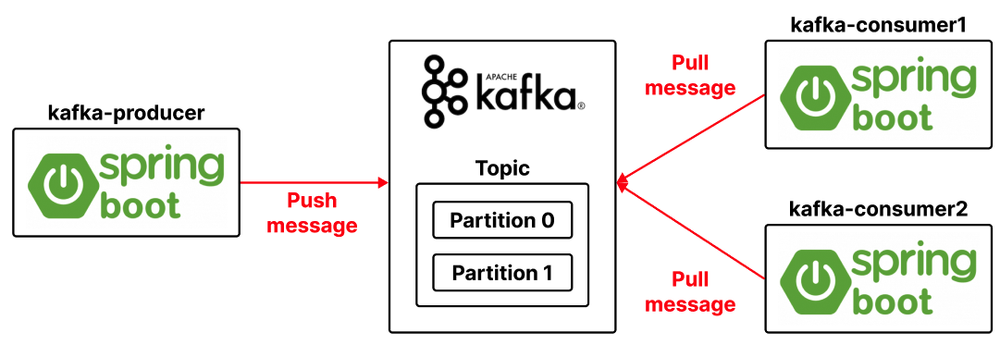
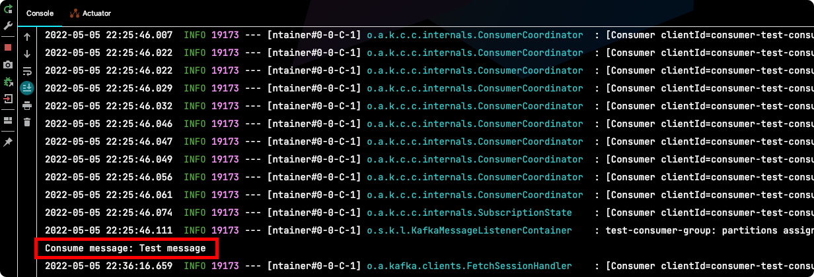

# Table of Contents
[[toc]]

# Spring Kafka 시작하기
`Spring Boot`에서 `Kafka`를 사용하는 방법에 대해 정리한다. 예제는 세 개의 프로젝트로 구성된다.

- `kafka-producer`: Kafka로 메시지를 전송한다.
- `kafka-consumer1`: Kafka를 구독하고 있다가 메시지가 오면 화면에 출력한다.
- `kafka-consumer2`: Kafka를 구독하고 있다가 메시지가 오면 화면에 출력한다.



## Kafka 서버 
Kafka 서버는 Docker compose로 구성한다.
``` yml
# docker-compose.yml
version: '2'
services:
  # Zookeeper
  zookeeper:
    image: wurstmeister/zookeeper
    container_name: zookeeper
    ports:
      - "2181:2181"

  # Kafka
  kafka:
    image: wurstmeister/kafka
    container_name: kafka
    ports:
      - "9092:9092"
    environment:
      KAFKA_ADVERTISED_HOST_NAME: 127.0.0.1
      KAFKA_ZOOKEEPER_CONNECT: zookeeper:2181
```
```
$ docker-compose up -d 
```

그리고 두 개의 Partition을 갖는 Topic을 생성한다.
```
$ kafka-topics \
--bootstrap-server localhost:9092 \
--topic test-topic \
--partitions 2 \
--create
```


## Producer
Consumer 역할을 하는 `kafka-producer` 프로젝트는 HTTP 요청이 오면 Kafka 서버로 메시지를 전송한다. 이 프로젝트의 의존성은 다음과 같다.

``` groovy {4}
// build.gradle 
dependencies {
    implementation 'org.springframework.boot:spring-boot-starter-web'
    implementation 'org.springframework.kafka:spring-kafka'
}
```
설정파일 `application.yml`은 다음과 같다.
``` yml
# application.yml
server:
  port: 8080
spring:
  kafka:
    producer:
      bootstrap-servers: localhost:9092
      key-serializer: org.apache.kafka.common.serialization.StringSerializer
      value-serializer: org.apache.kafka.common.serialization.StringSerializer
```

Kafka 서버로 메시지를 전송하는 서비스는 다음과 같다. `Spring Kafka` 모듈에서 제공하는 <b>`KafkaTemplate`</b>클래스를 사용하면 된다.
``` java {9,13}
import org.springframework.beans.factory.annotation.Autowired;
import org.springframework.kafka.core.KafkaTemplate;
import org.springframework.stereotype.Service;

@Service
public class KafkaProducerService {

    @Autowired
    private KafkaTemplate<String, String> template;

    public void sendMessage(String message) {
        System.out.println("message: " + message);
        template.send("test-topic", message);
    }
}
```

HTTP 요청을 받는 컨트롤러는 다음과 같다.
``` java
@RestController
@RequestMapping("/kafka")
public class KafkaController {
    @Autowired KafkaProducerService service;

    @GetMapping("/send")
    public void kafka() {
        service.sendMessage("Test message");
    }
}
```

## 첫 번째 Consumer
첫 번째 Consumer 역할을 하는 `kafka-consumer1` 프로젝트는 다음 의존성을 갖는다.
``` groovy {4}
// build.gradle
dependencies {
    implementation 'org.springframework.boot:spring-boot-starter-web'
    implementation 'org.springframework.kafka:spring-kafka'
}
```
설정 파일 `application.yml`은 다음과 같다.
``` yml
# application.yml
server:
  port: 8081
spring:
  kafka:
    consumer:
      bootstrap-servers: localhost:9092  # Kafka 서버 주소
      group-id: test-consumer-group  # Consumer group id
      key-deserializer: org.apache.kafka.common.serialization.StringDeserializer
      value-deserializer: org.apache.kafka.common.serialization.StringDeserializer
```
이제 Kafka 서버를 구독하고 있다가 메시지가 오면 화면에 출력하는 서비스를 구현한다. <b>`@KafkaListener`</b>어노테이션의 인자로 Topic과 Consumer group id를 전달한다.
``` java
import org.springframework.kafka.annotation.KafkaListener;
import org.springframework.stereotype.Service;

import java.io.IOException;

@Service
public class KafkaConsumerService {

    @KafkaListener(topics = "test-topic", groupId = "test-consumer-group")
    public void consume(String message) throws IOException {
        System.out.println("Consume message: " + message);
    }
}
``` 
## 두 번째 Consumer
두 번째 Consumer 역할을 하는 `kafka-consumer2` 프로젝트도 `kafka-consumer1` 프로젝트와 동일하다. 
``` groovy {4}
// build.gradle
dependencies {
    implementation 'org.springframework.boot:spring-boot-starter-web'
    implementation 'org.springframework.kafka:spring-kafka'
}
```
포트 번호만 다르게 설정해주자. `kafka-consumer1`과 `kafka-consumer2`를 같은 `Consumer Group`으로 지정한 점에 주의하자
``` yml {3,8}
# application.yml
server:
  port: 8082
spring:
  kafka:
    consumer:
      bootstrap-servers: localhost:9092  # Kafka 서버 주소
      group-id: test-consumer-group  # Consumer group id
      key-deserializer: org.apache.kafka.common.serialization.StringDeserializer
      value-deserializer: org.apache.kafka.common.serialization.StringDeserializer
```
``` java
import org.springframework.kafka.annotation.KafkaListener;
import org.springframework.stereotype.Service;

import java.io.IOException;

@Service
public class KafkaConsumerService {

    @KafkaListener(topics = "test-topic", groupId = "test-consumer-group")
    public void consume(String message) throws IOException {
        System.out.println("Consume message: " + message);
    }
}
``` 

## 테스트

이제 두 프로젝트를 실행한 후 `kafka-producer` 프로젝트의 `localhost:8080/kafka/test`로 HTTP 요청을 보내보자. 

Topic의 Partition이 2개고 Consumer Group의 Consumer도 2개다. 따라서 `kafka-consumer1`과 `kafka-consumer2` 프로젝트 콘솔에 메시지가 번갈아 출력되는 것을 확인할 수 있다.

