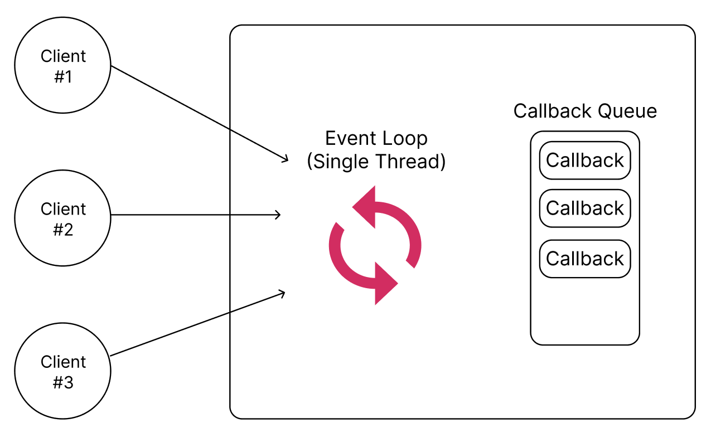

# Table of Contents
[[toc]]

## 동기-블로킹 모델
일반적으로 동기-블로킹 모델은 멀티 스레드로 동작한다. 멀티 스레드 모델은 하나의 요청을 하나의 스레드가 처리하며, 이를 `Thread per request`라고 한다.


동기-블로킹 모델에서는 네트워크 통신, 입출력 작업을 수행하면 스레드가 자원을 점유한 채 대기상태로 진입한다. 하드웨어 관점에서 보면 CPU는 네트워크 통신이나 입출력의 처리를 `IO Controller`에게 위임하며, CPU는 다른 스레드를 처리한다. 


이 과정에서 많은 `Context Switching`이 발생한다. 또한 멀티 스레드 모델에서는 요청이 많을 수록 스레드가 많아지며, 이에 대한 부하도 커진다.


## 비동기-논블로킹 모델
대표적인 비동기-논블로킹 모델인 `Node.js`를 먼저 살펴보자. `Node.js`는 비동기-논블로킹, 싱글 스레드로 동작한다. 이 모델에서는 `이벤트 루프`라는 스레드가 무한 루프를 돌며 사용자의 모든 요청을 순차적으로 처리한다.


만약 네트워크 통신, 입출력 처리가 필요하다면 `IO Controller`에게 이를 위임한다. 그리고 `이벤트 루프`는 대기 상태로 진입하지 않고 다른 요청을 계속 처리한다. 이 과정에서 네트워크 통신, 입출력 처리가 끝나는 시점을 알기 위해 `Callback`을 등록하며, Callback은 `Callback Queue`라는 공간에 저장된다. 



네트워크 통신, 입출력이 종료되면 `IO Controller`는 이벤트 루프에 이를 알리게 되며, 이벤트 루프는 해당 콜백을 가져와 실행하게 된다. 


콜백에는 네트워크 통신, 입출력이 끝났을 때 실행할 코드를 구현하며, 보통 다음과 같이 네트워크 통신 또는 입출력을 실행하는 구문의 마지막 인자에 람다식 형태로 콜백을 전달한다.
``` java
Long userId = 1L;

getUserDataFromNetwork(userId, (userData) -> {
    // 네트워크 통신 또는 입출력을 실행하는 구문
});
```

`Spring WebFlux` 또한 비동기-논블로킹 모델이지만 싱글 스레드는 아니다. `Spring WebFlux`는 CPU 코어 수 만큼의 스레드를 사용한다.


비동기-논블로킹 모델은 적은 수의 스레드로 모든 요청을 처리하기 때문에 `Context Switching` 비용이 훨씬 줄어든다. 


## Spring MVC vs. Spring WebFlux
<b>`Spring MVC`</b>는 동기/블로킹 모델이며, 런타임으로 멀티 스레드로 동작하는 톰캣 같은 서블릿 컨테이너를 사용한다. Spring MVC는 `One request One thread` 모델로 요청이 올 때마다 스레드를 생성하여 전담하게 한다. 이 모델에서는 네트워크나 입출력 등 무거운 작업을 수행하면 스레드가 자원을 점유한 채 대기하게 된다. CPU는 다른 스레드를 실행시키기 위해 Context Switching을 하며, 스레드 수가 많아질 수록 이에 대한 비용이 커지게 된다.

<b>`Spring WebFlux`</b>는 비동기/논블로킹 모델이며, 보통 네티 같은 비동기/논블로킹 런타임을 사용한다. Spring WebFlux는 <u>이벤트 드리븐 모델</u>인 `Node.js`와 유사하다. 다만 싱글 스레드는 아니며 CPU 코어 수 만큼의 스레드로 병렬처리를 한다. 비동기/논블로킹 모델에서 워커 스레드는 입출력 같이 오랜 시간이 걸리는 작업이 I/O Controller에 의해 처리될 때 이를 기다리지 않고 다른 작업을 수행한다. 다시 말해 스레드를 놀지 않게 하는 것이 핵심이며, 같은 스레드를 사용하기 때문에 Context Switching 비용이 최소화된다.

비동기/논블로킹 모델에서는 다른작업이 종료되었을 때 이를 알려줄 수 있는 방법이 필요한데, 보통 다음과 같은 방법으로 구현한다.
- Callback를 함께 전달하여 작업이 끝났을 때 호출되도록 한다.
- 관찰, 구독 가능한 객체로 이벤트를 보내거나 상태 변화를 일으킨다.

관찰, 구독 가능한 형태로 비동기/논블로킹 모델을 구현하는 경우, 서버가 데이터를 생성하는 속도가 클라이언트의 소비 속도보다 빠를 수 있다. 클라이언트는 이를 적절하게 처리하기 위해 배압 이슈를 해결해야 한다.

비동기/논블로킹의 모델은 네트워크 통신이나 데이터 소스도 논블로킹하게 처리해야한다. 그렇지 않으면 스레드 수가 적기 때문에 오히려 동기/블로킹 모델보다 속도가 느려지게 된다. Spring WebFlux의 경우 `WebClient`나 `Spring Data R2DBC(Reactive Relation Database Connectivity)`를 사용하여 네트워크 통신이 데이터 소스도 논블로킹하게 처리한다.

그럼 `Spring WebFlux`를 간단하게 사용해보자.

## 의존성 추가
Spring MVC의 경우 Servlet 기반의 Tomcat을 사용한다.
``` groovy
dependencies {
    // Spring Boot + Spring MVC
    implementation 'org.springframework.boot:spring-boot-starter-web'
    testImplementation 'org.springframework.boot:spring-boot-starter-test'
}
```
따라서 내장 Tomcat에서 애플리케이션이 구동된다. 


반면 Spring WebFlux는 Netty를 사용한다.
``` groovy 
dependencies {
    // Spring Boot + Spring WebFlux
    implementation 'org.springframework.boot:spring-boot-starter-webflux'
    testImplementation 'io.projectreactor:reactor-test'
}
```


## 사용법
Spring WebFlux는 두 가지 방식으로 API Endpoint를 정의할 수 있다.
- Spring MVC 어노테이션 방식
- 함수형 모델

### Spring MVC 어노테이션 방식
Spring MVC는 Servlet Container가 제공하는 `HttpServletRequest`, `HttpServletResponse`로 요청과 응답을 처리한다.
``` java
import javax.servlet.http.HttpServletRequest;
import javax.servlet.http.HttpServletResponse;

@RestController
public class TestController {

    @GetMapping("/test1")
    public void test1(HttpServletRequest request, HttpServletResponse response) throws IOException {
        String name = request.getParameter("name");
        response.getOutputStream().print("response: " + name);
    }

    @PostMapping("/test2")
    public void test2(HttpServletRequest request, HttpServletResponse response) throws IOException {
        // ...
    }
}
```
물론 `HttpServletRequest`, `HttpServletResponse` 대신 Spring MVC가 제공하는 다양한 어노테이션과 Converter로 <u><b>바인딩</b></u>할 수 있다.
``` java
import javax.servlet.http.HttpServletRequest;
import javax.servlet.http.HttpServletResponse;

@RestController
public class TestController {

    @GetMapping("/test1")
    public String test1(@RequestParam(value="name") String name) {
        return "response:" + name;
    }

    @PostMapping("/test2")
    public String test2(@RequestBody TestRequest request) {
        // ...
    }
}
```

Spring WebFlux도 Spring MVC와 유사한 방식으로 요청과 응답을 처리할 수 있다. 다만 HttpServletRequest, HttpServletResponse 대신 `ServerRequest`, `ServerResponse`를 사용한다. 또한 응답을 `Mono` 또는 `Flux`로 래핑해야한다.
``` java
import org.springframework.web.reactive.function.server.ServerRequest;
import org.springframework.web.reactive.function.server.ServerResponse;
import reactor.core.publisher.Mono;
import reactor.core.publisher.Flux;

@Controller
public class TestController {

    @GetMapping("/test1")
    public Mono<ServerResponse> test1(ServerRequest request) {
        // ...
    }

    @PostMapping("/test2")
    public Mono<ServerResponse> test2(ServerRequest request) {
        // ...
    }
}
```
또한 Spring MVC처럼 바인딩도 사용할 수 있다.
``` java
@RestController
public class TestController {

    @GetMapping("/test1")
    public Mono<String> test1(@RequestParam("name") String name) {
        return Mono.just("response: " + name);
    }

    @PostMapping("/test2")
    public Mono<ServerResponse> test2(@RequestBody TestRequest request) {
        // ...
    }
}
```
요청을 받을 때도 `Mono`로 래핑할 수 있다. 이 경우 Reactive Stream API가 제공하는 다양한 Operator로 더욱 Reactive하게 코드를 작성할 수 있다.
``` java
@RestController
public class TestController {

    // ...

    @PostMapping("/test2")
    public Mono<ServerResponse> test2(@RequestBody Mono<TestRequest> request) {
        return request
            .map(req -> ... )
    }
}
```

### 함수형 모델
함수형 모델은 두 가지의 함수형 인터페이스를 사용하여 구현한다.
- `HandlerFunction`: 요청을 처리하고 응답을 반환한다.
- `RouterFunction`: 요청을 라우팅해준다.

요청을 처리하고 응답을 반환하는 핸들러는 다음과 같이 정의할 수 있다.
``` java
import org.springframework.stereotype.Component;
import org.springframework.web.reactive.function.server.ServerRequest;
import org.springframework.web.reactive.function.server.ServerResponse;
import reactor.core.publisher.Mono;

import static org.springframework.web.reactive.function.BodyInserters.fromValue;
import static org.springframework.web.reactive.function.server.ServerResponse.ok;


@Component
public class TestHandler {

    public Mono<ServerResponse> test1(ServerRequest request) {
        return ok().body(fromValue("response 1: " + request.queryParam("name").get()));
    }

    public Mono<ServerResponse> test2(ServerRequest request) {
        return ok().body(fromValue("response 2: " + request.queryParam("name").get()));
    }
}
```
요청을 라우팅해주는 핸들러는 다음과 같이 정의할 수 있다.
``` java
import org.springframework.context.annotation.Bean;
import org.springframework.context.annotation.Configuration;
import org.springframework.web.reactive.function.server.RequestPredicates;
import org.springframework.web.reactive.function.server.RouterFunction;
import org.springframework.web.reactive.function.server.RouterFunctions;
import org.springframework.web.reactive.function.server.ServerResponse;

@Configuration
public class TestRouter {

    @Autowired TestHandler handler;

    @Bean
    public RouterFunction<ServerResponse> testRoute() {
        return RouterFunctions
            .route(RequestPredicates.GET("/test1"), handler::test1)
            .andRoute(RequestPredicates.GET("/test2"), handler::test2);
    }
}
```

## WebClient
`WebClient`는 Spring 5부터 지원하며 싱글 스레드, 비동기/논블로킹 식으로 HTTP 요청을 보내는 HTTP Client다. 

### 의존성 설정
`WebClient`는 Spring WebFlux에 포함되어있다.
``` groovy 
dependencies {
    // Spring Boot + Spring WebFlux
    implementation 'org.springframework.boot:spring-boot-starter-webflux'
    testImplementation 'io.projectreactor:reactor-test'
}
```

### 예제
간단한 예제를 살펴보자. 두 개의 프로젝트가 필요하다.
- `api`
- `client`

`api` 프로젝트에 다음 컨트롤러를 구현한 후 `9090` 포트로 실행한다.
``` java
@RestController
@RequestMapping("/api")
public class ApiController {

    @GetMapping("/get")
    public String get() {
        return "get";
    }
}
```

`client`는 다음 컨트롤러를 구현한 후 `8080` 포트로 실행한다.
``` java
import org.springframework.web.reactive.function.client.WebClient;
import reactor.core.publisher.Mono;

@RestController
@RequestMapping("/client")
public class ClientController {

    @GetMapping
    @RequestMapping("/get")
    public Mono<String> get() {
        WebClient webClient = WebClient.create();
        return webClient.get()
                .uri("http://localhost:9090/api/get")
                .retrieve()
                .bodyToMono(String.class);
    }
}
```
이제 웹 브라우저에서 `http://localhost:8080/client/get` 으로 접속하면 `WebClient`가 작동하는 것을 확인할 수 있다.

### WebClient 생성
`WebClient`는 두 가지 방법으로 생성할 수 있다. 우선 `WebClient.create()` 메소드를 사용할 수 있다.
``` java
WebClient webClient = WebClient
    .create("http://localhost:9090");
```
`WebClient.build()` 메소드를 사용할 수도 있다.
``` java
WebClient webClient = WebClient.builder()
    .baseUrl("http://localhost:9090")
    .defaultHeader(HttpHeaders.CONTENT_TYPE, MediaType.APPLICATION_JSON_VALUE)
    .build();
```

보통 다음과 같이 컨테이너에 빈으로 등록하여 사용한다.
``` java
@Configuration
public class WebClientConfig {

    @Bean
    public WebClient webClient() {
        return WebClient webClient = WebClient.builder()
            .baseUrl("http://localhost:9090")
            .defaultHeader(HttpHeaders.CONTENT_TYPE, MediaType.APPLICATION_JSON_VALUE)
            .build();
    }

}
```

### GET 요청 보내기
``` java
Mono<Person> result = webClient.get()
    .uri("/persons/1")
    .accept(MediaType.APPLICATION_JSON)
    .retrieve()
    .bodyToMono(Person.class);
```
``` java
Flux<Person> result = webClient.get()
    .uri("/persons/1")
    .accept(MediaType.APPLICATION_JSON)
    .retrieve()
    .bodyToFlux(Person.class);
```
``` java
Mono<ResponseEntity<Person>> result = webClient.get()
    .uri("/persons/1")
    .accept(MediaType.APPLICATION_JSON)
    .retrieve()
    .toEntity(Person.class);
```
### POST 요청 보내기
``` java
Person person = Person.builder().build();

Mono<Person> result = webClient.post()
    .uri("/persons")
    .body(Mono.just(person), Person.class)
    .retrieve()
    .bodyToMono(Person.class);
```
### PATCH 요청 보내기
``` java
Person person = Person.builder().build();

Mono<Person> result = webClient.patch()
    .uri("/persons/" + 1)
    .body(Mono.just(person), Person.class)
    .retrieve()
    .bodyToMono(Person.class);
```


### DELETE 요청 보내기
``` java
Mono<Void> result = webClient.delete()
    .uri("/persons/" +id)
    .retrieve()
    .bodyToMono(Void.class);
```

## @WebFluxTest, TestWebClient
`@WebFluxTest`어노테이션, `TestWebClient`클래스를 사용하면 WebFlux 기반 API Endpoint를 테스트할 수 있다. 다음과 같은 컨트롤러가 있다고 하자.
``` java
@RestController
@RequestMapping("/client")
public class ClientController {

    @GetMapping
    @RequestMapping("/get")
    public Mono<String> get() {
        return Mono.just("get");
    }
}
```
`@WebFluxTest`어노테이션과 `TestWebClient`클래스는 다음과 같이 사용한다.
``` java
import org.junit.jupiter.api.Test;
import org.springframework.beans.factory.annotation.Autowired;
import org.springframework.boot.test.autoconfigure.web.reactive.WebFluxTest;
import org.springframework.test.web.reactive.server.WebTestClient;

@WebFluxTest
class ApplicationTests {

    @Autowired
    private WebTestClient webClient;

    @Test
    void test() {
        webClient.get()
                .uri("/client/get")
                .exchange()
                .expectStatus().isOk();
    }
}
```
