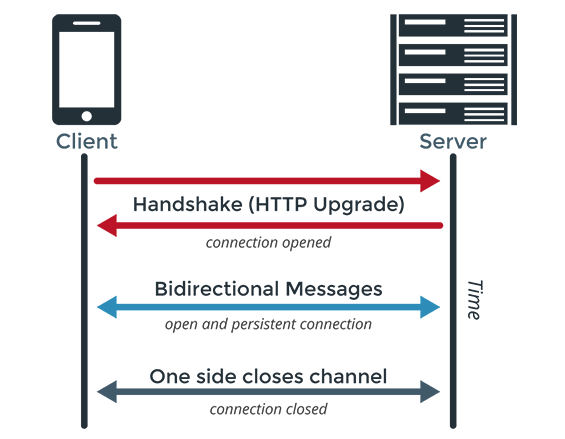
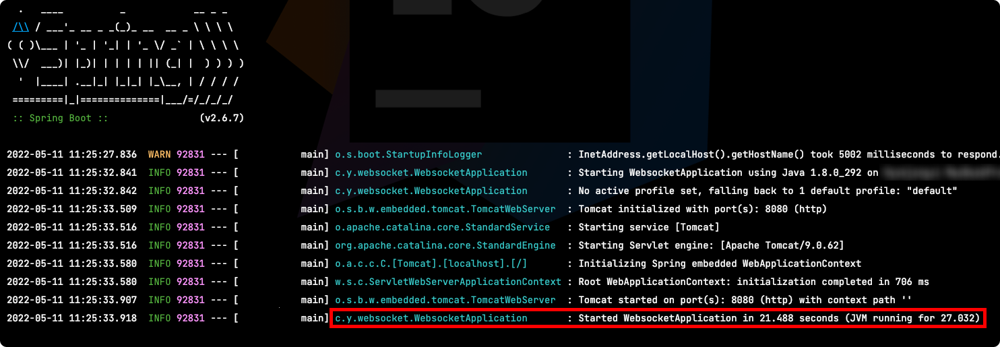
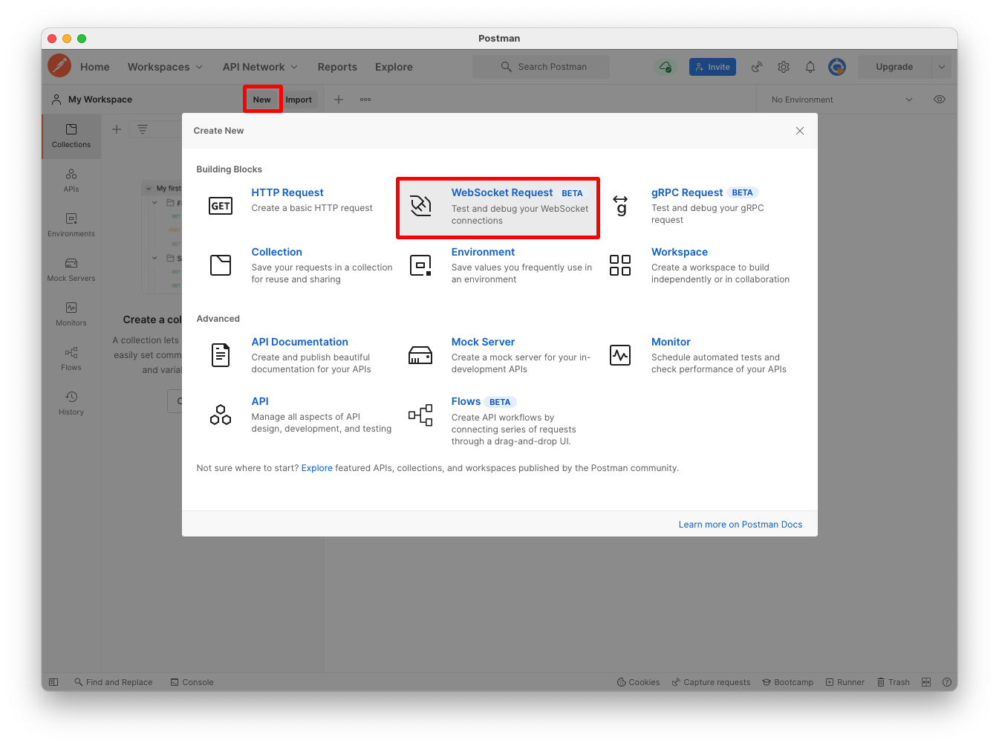
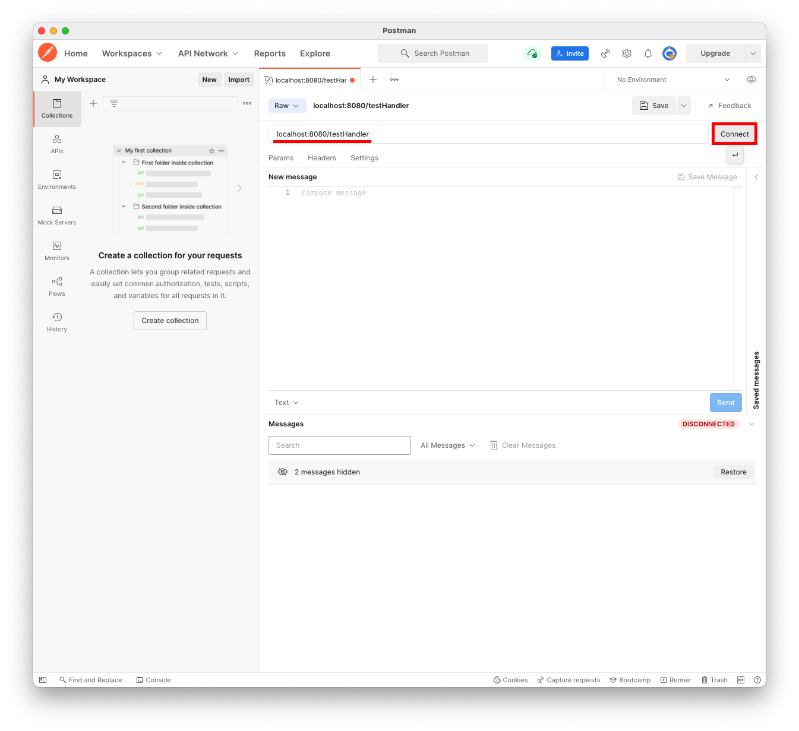
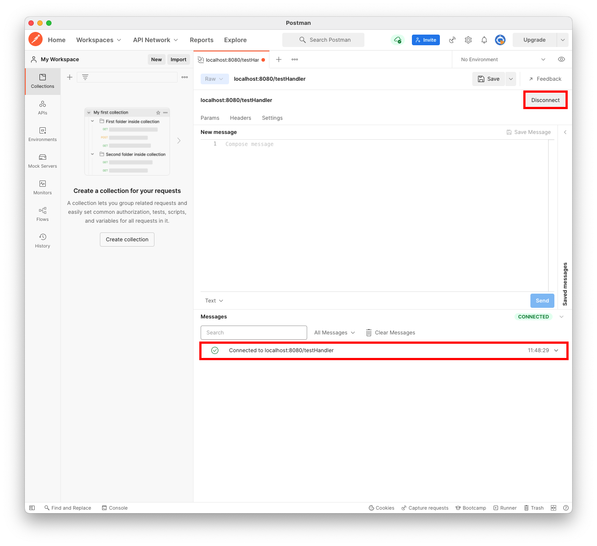
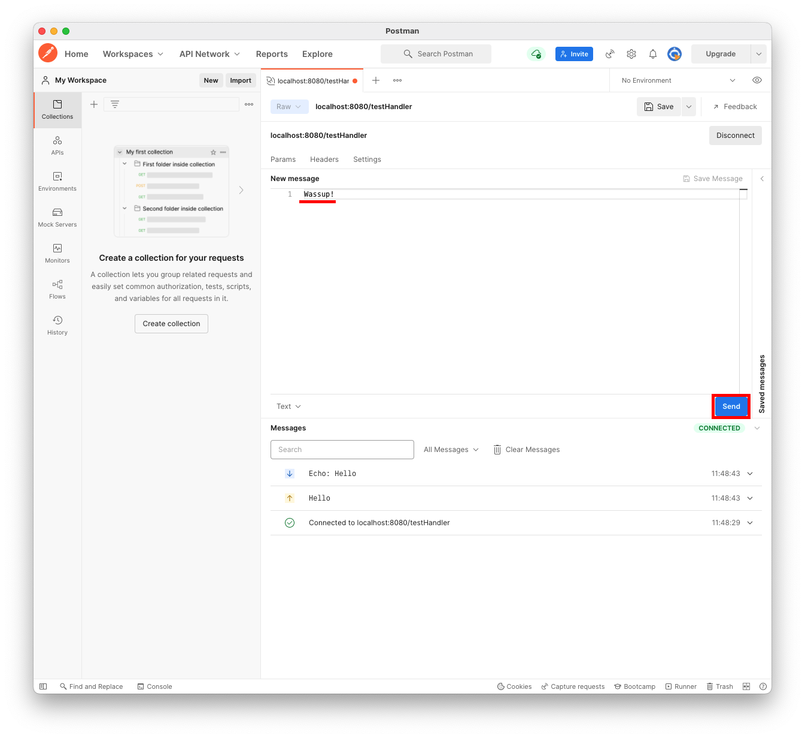
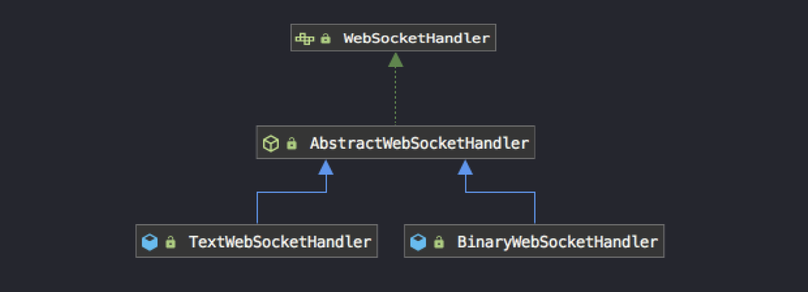
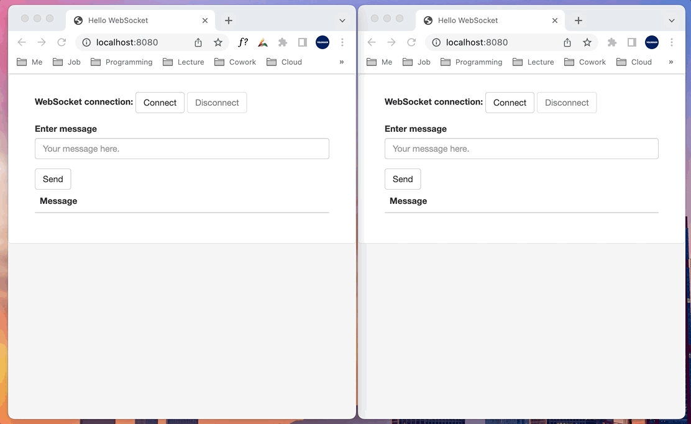

# Table of Contents
[[toc]]


## WebSocket
소켓을 사용하면 두 어플리케이션 간 `양방향 통신`을 할 수 있다. 자주 사용되는 소켓에는 TCP Socket과 Websocket이 있으며, 다음과 같은 차이점이 있다.
|TCP socket, UDP socket|WebSocket|
|------|---|
|OSI 7 Layer의 4계층에서 동작|OSI 7 Layer의 7계층에서 동작|


## WebSocket 프로토콜
HTTP는 `http` 또는 `https` 프로토콜을 사용한다.
```
http://192.168.0.24
https://192.168.0.39
```
WebSocket은 `ws(Websocket)` 또는 `wss(WebSocket Secure)` 프로토콜을 사용한다.
```
ws://172.30.9.13
wss://172.30.20.40
```

## WebSocket 연결 과정



WebSocket 프로토콜은 데이터를 전송하기 전 HTTP 프로토콜을 사용하여 연결을 먼저 수립한다. 이 과정을 `Websocket Handshake`라고 한다.

클라이언트는 웹 소켓 연결을 수립하기 위해 HTTP 프로토콜로 요청을 보낸다. 이때 다음과 같이 헤더를 설정해야한다.
- `Connection:Upgrade`와 `Upgrade:websocket` 헤더를 통해 웹소켓 요청임을 표시한다.
- `Sec-WebSocket-Key` 헤더를 통해 핸드쉐이크 응답을 검증할 키 값을 함께 전송한다.
- 그 외에도 WebSocket 연결 시 보조로 이용할 프로토콜 정보등의 추가적인 정보를 헤더에 담아 보낼 수 있다.

다음은 웹 소켓 연결을 요청하는 예시다.
``` yml
GET /endpoint HTTP/1.1
Host: socket.api.server.com
Upgrade: websocket
Connection: Upgrade
Sec-WebSocket-Key: x3JJHMbDL1EzLkh9GBhXDw==
Sec-WebSocket-Protocol: chat, superchat
Sec-WebSocket-Version: 13
Origin: http://yologger.com
```
웹 소켓 서버는 HTTP 응답을 반환한다. 이 응답에는 다음 정보가 포함되어야 한다.
- 정상 응답의 상태 코드는 `101(Switching Protocols)`다.
- 서버는 `Sec-WebSocket-Key`헤더로 받은 값에 특정 값을 붙인 후 해싱, 인코딩하여 `Sec-WebSocket-Accept`헤더에 포함시킨다.
- 클라이언트는 `Sec-WebSocket-Key`와 `Sec-WebSocket-Accept`를 비교하여 연결 수립에 성공하였는지 확인한다.
- 연결 수립에 성공하면 HTTP 연결을 종료한 후 WebSocket 프로토콜로 양방향 통신한다.

다음은 웹 소켓 연결 요청에 성공적으로 응답하는 예시다.
``` yml
HTTP/1.1 101 Switching Protocols
Upgrade: websocket
Connection: Upgrade
Sec-WebSocket-Accept: HSmrc0sMlYUkAGmm5OPpG2HaGWk=
Sec-WebSocket-Protocol: chat
```

## Spring WebSocket
웹 소켓 서버를 구축하려면 다음 의존성을 추가해야한다.
``` groovy {4}
// build.gradle
dependencies {
    implementation 'org.springframework.boot:spring-boot-starter-web'
    implementation 'org.springframework.boot:spring-boot-starter-websocket'
}
```
그리고 웹 소켓 메시지를 핸들링하는 핸들러를 구현해야한다. 보통 `WebSocketHandler`인터페이스의 구현체인 `TextWebsocketHandler` 또는 `BinaryWebSocketHandler`를 사용한다.
- `TextWebsocketHandler`: 텍스트 메시지를 처리하는 핸들러
- `BinaryWebSocketHandler`: 바이너리 메시지를 처리하는 핸들러

`TextWebSocketHandler`를 상속하는 핸들러 클래스를 정의해보자.
``` java
import org.springframework.web.socket.CloseStatus;
import org.springframework.web.socket.TextMessage;
import org.springframework.web.socket.WebSocketSession;
import org.springframework.web.socket.handler.TextWebSocketHandler;

public class TestHandler extends TextWebSocketHandler {

    @Override
    public void afterConnectionEstablished(WebSocketSession session) throws Exception {
        System.out.println("afterConnectionEstablished:" + session.toString());
    }

    @Override
    protected void handleTextMessage(WebSocketSession session, TextMessage message) throws Exception {
        System.out.println("message: " + message.toString());
        System.out.println("payload: " + message.getPayload());
        session.sendMessage(new TextMessage("Echo: " + message.getPayload()));
    }

    @Override
    public void afterConnectionClosed(WebSocketSession session, CloseStatus status) throws Exception {
        System.out.println("afterConnectionClosed:" + session.toString());
    }
}
```
- `afterConnectionEstablished`: 웹 소켓 연결이 수립된 후 호출
- `handleTextMessage`: 웹 소켓으로 메시지가 도착했을 때 호출
- `afterConnectionClosed`: 웹 소켓 연결이 닫힌 후 호출

그 다음 웹 소켓 핸들러를 등록해야한다. 설정 클래스는 `WebSocketConfigurer`인터페이스를 구현해야한다. 또한 `@EnableWebSocket` 어노테이션을 추가해야한다.
``` java
import org.springframework.context.annotation.Bean;
import org.springframework.context.annotation.Configuration;
import org.springframework.web.socket.config.annotation.EnableWebSocket;
import org.springframework.web.socket.config.annotation.WebSocketConfigurer;
import org.springframework.web.socket.config.annotation.WebSocketHandlerRegistry;

@Configuration
@EnableWebSocket
public class WebSocketConfig implements WebSocketConfigurer {

    @Bean
    public TestHandler testHandler() {
        return new TestHandler();
    }
    @Override
    public void registerWebSocketHandlers(WebSocketHandlerRegistry registry) {
        registry.addHandler(testHandler(), "/testHandler");
    }
}    
```

애플리케이션을 시작하면 웹 소켓 서버도 구동되는 것을 확인할 수 있다.



이제 `Postman`으로 웹 소켓 통신을 테스트해보자. `Postman > Workspace > New > WebSocket Request`를 클릭한다.



웹 소켓 주소를 입력하고 `Connect` 버튼을 클릭한다.



연결이 수립되면 `Connected to ~`가 출력된다. `Disconnect` 버튼을 누르면 연결을 해제할 수 있다.



`New message` 필드에 메시지를 입력하고 `Send` 버튼을 누르면 메시지가 발송된다. 수신된 메시지는 화면 하단의 `Message` 필드에서 확인할 수 있다.



## STOMP
`STOMP(Simple Text Oriented Messaging Protocol)`는 WebSocket 위에서 동작하며, 크게 두 가지 기능을 제공하는 서브 프로토콜이다. 

### 1:N 통신
`WebSocket`은 클라이언트와 서버 간 1:1 양방향 통신을 지원한다. `STOMP`는 <u>메시지 브로커</u>와 <u>Publish/Subscribe 모델</u>을 통해 1:N 양방향 통신, `브로드캐스팅`을 지원한다. 이를 통해 같은 채팅방의 모든 사용자에게 메시지를 보내는 기능을 구현할 수 있다.

### 커스텀 메세지 프로토콜
`WebSocket` 프로토콜은 문자열 또는 바이너리 타입의 메시지만을 지원한다. 이 때문에 웹 소켓 핸들러를 정의할 때도 `TextWebsocketHandler` 또는 `BinaryWebSocketHandler`를 사용했다. 



`WebSocket` 프로토콜로 전송되는 메시지는 타입이 문자열인지 바이너리인지 까지는 알 수 있다. 그러나 메시지가 어떤 형식을 가지고 있는지는 따로 정해져있지 않아 직접 정의해야한다. `STOMP`를 사용하면 WebSocket을 통해 전달되는 메시지에 형식을 부여할 수 있다. STOMP 프로토콜에서는 메시지를 `프레임(Frame)`이라고 한다.

STOMP의 프레임 형태은 다음과 같다.
```
COMMAND
header1:value1
header2:value2

Body^@
```

::: details STOMP 통신을 할때 전달되는 몇 가지 프레임에 대해 살펴보자.
STOMP 연결을 요청할 때의 프레임 형태는 다음과 같다.
```
CONNECT
accept-version:1.1,1.0
heart-beat:10000,10000
```
STOMP 연결이 수립되었을 때는 다음과 같다.
```
CONNECTED
version:1.1
heart-beat:0,0
```
클라이언트가 메시지를 전송할 때는 다음과 같은 형태로 전송한다.
```
SEND
destination:/publish/message
content-length:18

{"message":"aaaa"}
```
이에 대한 응답은 다음과 같다.
```
MESSAGE
destination:/subscribe/room
content-type:application/json
subscription:sub-0
message-id:7c7ced9d-e270-53ef-d12a-e1d3d5095178-1
content-length:24

{"message":"echo: aaaa"}
```

메시지 브로커를 구독할 때의 프레임은 다음과 같다.
``` 
SUBSCRIBE
id:sub-0
destination:/subscribe/room
```
:::


### 예제

`STOMP`를 사용하여 다음과 같은 앱을 만들어 보자.



서버 측 의존성은 다음과 같다.
``` groovy
// build.gradle
dependencies {
    implementation 'org.springframework.boot:spring-boot-starter-websocket'
    testImplementation 'org.springframework.boot:spring-boot-starter-test'
    compileOnly 'org.projectlombok:lombok'
    annotationProcessor 'org.projectlombok:lombok'
}
```

STOMP 관련된 설정 클래스는 다음과 같다.
- 설정 클래스는 `WebSocketMessageBrokerConfigurer`를 구현한다.
- `@EnableWebSocketMessageBroker` 어노테이션을 추가한다.
- `registerStompEndpoints()`: 웹 소켓 핸드쉐이킹을 위한 엔드포인트를 정의한다.
- `configureMessageBroker()`: STOMP 관련 엔드포인트를 정의한다.
    - `setApplicationDestinationPrefixes()`: 메시지 송신을 위한 엔드포인트를 정의한다.
    - `enableSimpleBroker()`: 메시지 수신을 위한 엔드포인트를 정의한다.

`enableSimpleBroker()`를 사용하면 스프링 웹 소켓에서 제공하는 인메모리 내장 메시지 브로커를 사용한다. 별도의 설정으로 `Redis`, `Kafka` 같은 외부 메시지 브로커도 사용할 수 있다.
``` java
import org.springframework.context.annotation.Configuration;
import org.springframework.messaging.simp.config.MessageBrokerRegistry;
import org.springframework.web.socket.config.annotation.EnableWebSocketMessageBroker;
import org.springframework.web.socket.config.annotation.StompEndpointRegistry;
import org.springframework.web.socket.config.annotation.WebSocketMessageBrokerConfigurer;

@Configuration
@EnableWebSocketMessageBroker
public class WebSocketConfig implements WebSocketMessageBrokerConfigurer {

    @Override
    public void registerStompEndpoints(StompEndpointRegistry registry) {
        registry.addEndpoint("/websocket");
    }

    @Override
    public void configureMessageBroker(MessageBrokerRegistry registry) {
        // Send Endpoint
        registry.setApplicationDestinationPrefixes("/publish");

        // SimpleBroker는 Spring WebSocket 모듈에서 제공하는 인메모리 방식의 내장 Message Broker
        registry.enableSimpleBroker("/subscribe");
    }
}
```

이제 클라이언트가 STOMP 형식의 메시지를 송신할 때 사용할 엔드포인트를 정의하자.
``` java
import org.springframework.messaging.handler.annotation.MessageMapping;
import org.springframework.messaging.handler.annotation.SendTo;
import org.springframework.stereotype.Controller;
import org.springframework.web.util.HtmlUtils;

@Controller
public class MessageController {
    @MessageMapping("/message")
    @SendTo("/subscribe/room")
    public ResponseDTO greeting(RequestDTO message) throws Exception {
        System.out.println("message: " + message.toString());
        return new ResponseDTO("echo: " + HtmlUtils.htmlEscape(message.getMessage()));
    }
}
```
엔드포인트는 `@MessageMapping()`를 사용하여 지정한다. 클라이언트는 이 어노테이션으로 전달한 값과 설정 클래스의 `setApplicationDestinationPrefixes()`에서 지정한 값을 붙인 경로로 STOMP 메시지를 전송한다.
```
/publish/message
```
이제 클라이언트 소스코드를 간단하게 작성하자. 클라이언트를 위한 의존성은 다음과 같다.
``` groovy
// build.gradle
dependencies {
    // ...
    implementation 'org.webjars:webjars-locator-core'
    implementation 'org.webjars:stomp-websocket:2.3.3'
    implementation 'org.webjars:bootstrap:3.3.7'
    implementation 'org.webjars:jquery:3.1.1-1'
}
```

 `index.html`은 다음과 같다.
``` html
<!DOCTYPE html>
<html>
<head>
    <title>Hello WebSocket</title>
    <link href="/webjars/bootstrap/css/bootstrap.min.css" rel="stylesheet">
    <link href="/main.css" rel="stylesheet">
    <script src="/webjars/jquery/jquery.min.js"></script>
    <script src="/webjars/sockjs-client/sockjs.min.js"></script>
    <script src="/webjars/stomp-websocket/stomp.min.js"></script>
    <script src="/app.js"></script>
</head>
<body>
<noscript><h2 style="color: #ff0000">Seems your browser doesn't support Javascript! Websocket relies on Javascript being
    enabled. Please enable
    Javascript and reload this page!</h2></noscript>
<div id="main-content" class="container">
    <div class="row">
        <div class="col-md-6">
            <form class="form-inline">
                <div class="form-group">
                    <label for="connect">WebSocket connection:</label>
                    <button id="connect" class="btn btn-default" type="submit">Connect</button>
                    <button id="disconnect" class="btn btn-default" type="submit" disabled="disabled">Disconnect
                    </button>
                </div>
            </form>
        </div>
        <div class="col-md-6">
            <form class="form-inline">
                <div class="form-group">
                    <label for="message">Enter message</label>
                    <input type="text" id="message" class="form-control" placeholder="Your message here.">
                </div>
                <button id="send" class="btn btn-default" type="submit">Send</button>
            </form>
        </div>
    </div>
    <div class="row">
        <div class="col-md-12">
            <table id="conversation" class="table table-striped">
                <thead>
                <tr>
                    <th>Message</th>
                </tr>
                </thead>
                <tbody id="responses">
                </tbody>
            </table>
        </div>
    </div>
</div>
</body>
</html>
```
`app.js`는 다음과 같다.
``` javascript{19-27,40}
var stompClient = null;

function setConnected(connected) {
    $("#connect").prop("disabled", connected);
    $("#disconnect").prop("disabled", !connected);
    if (connected) {
        $("#conversation").show();
    }
    else {
        $("#conversation").hide();
    }
    $("#greetings").html("");
}

function connect() {
    var socket = new WebSocket("ws://localhost:8080/websocket");
    stompClient = Stomp.over(socket);
    
    // 웹 소켓 연결
    stompClient.connect({}, function (frame) {
        setConnected(true);
        console.log('Connected: ' + frame);
        // 구독
        stompClient.subscribe('/subscribe/room', function (response) {
            showResponses(JSON.parse(response.body).message);
        });
    });
}

function disconnect() {
    if (stompClient !== null) {
        stompClient.disconnect();
    }
    setConnected(false);
    console.log("Disconnected");
}

function sendMessage() {
    // 전송
    stompClient.send("/publish/message", {}, JSON.stringify({'message': $("#message").val()}));
}

function showResponses(message) {
    $("#responses").append("<tr><td>" + message + "</td></tr>");
}

$(function () {
    $("form").on('submit', function (e) {
        e.preventDefault();
    });
    $( "#connect" ).click(function() { connect(); });
    $( "#disconnect" ).click(function() { disconnect(); });
    $( "#send" ).click(function() { sendMessage(); });
});
```
`main.css`는 다음과 같다.
``` css
body {
    background-color: #f5f5f5;
}

#main-content {
    max-width: 940px;
    padding: 2em 3em;
    margin: 0 auto 20px;
    background-color: #fff;
    border: 1px solid #e5e5e5;
    -webkit-border-radius: 5px;
    -moz-border-radius: 5px;
    border-radius: 5px;
}
```

## SocketJS
일부 웹 브라우저는 `WebSocket`을 지원하지 않거나 제대로 동작하지 않는다. <b>`SocketJS`</b>는 브라우저에서 WebSocket이 동작하지 않을 때 TCP 소켓처럼 다른 방법을 사용하거나 이전 상태로 되돌리는 Fallback 기능을 제공한다.

백엔드 부분에서는 `SocketJS`를 쉽게 활성화할 수 있다. `withSocketJS()`를 호출하면 된다.
``` java
@Configuration
@EnableWebSocketMessageBroker
public class WebSocketConfig implements WebSocketMessageBrokerConfigurer {

    @Override
    public void registerStompEndpoints(StompEndpointRegistry registry) {
        // registry.addEndpoint("/websocket");
        registry.addEndpoint("/websocket").withSockJS();
    }

    // ...
}
```
클라이언트에서 `WebSocket 클라이언트` 라이브러리 대신 `SocketJS 클라이언트` 라이브러리를 사용한다. 이를 위해 다음 의존성을 추가하면 된다.
``` groovy
// build.gradle
dependencies {
    // ...
    implementation 'org.webjars:sockjs-client:1.0.2'
}
```
그리고 클라이언트 측 `app.js`를 다음과 같이 수정하기만 하면 된다.
``` javascript {5}
// ...

function connect() {
    // var socket = new WebSocket("ws://localhost:8080/websocket");
    var socket = new SockJS('/websocket');

    stompClient = Stomp.over(socket);
    stompClient.connect({}, function (frame) {
        setConnected(true);
        console.log('Connected: ' + frame);
        stompClient.subscribe('/subscribe/room', function (response) {
            showResponses(JSON.parse(response.body).message);
        });
    });
}

// ...
```

## 참고 - socket.io
웹소켓 서버는 `node.js`로도 구현이 가능하다. 특히 자바스크립트 진영에는 웹소켓 서버 위에서 동작하는 `socket.io` 자바스크립트 라이브러리를 사용하여 웹소켓 서버를 쉽게 구현할 수 있다. `socket.io` 역시 Java 진영의 `STOMP`처럼 브로드캐스팅 기능을 지원하며 사용하기가 상당이 쉽다. 

또한 클라이언트 쪽에도 `socket.io`을 위한 클라이언트 라이브러리가 잘 활성화되어있기 때문에 클라이언트 개발자는 `socket.io`를 선호한다고 들었다. 웹 환경에서는 `socket.io-client`, 안드로이드 앱에서는 `socket.io-client-java`, iOS 앱에서는 `socket.io-client-swift` 라이브러리를 사용하면 된다.