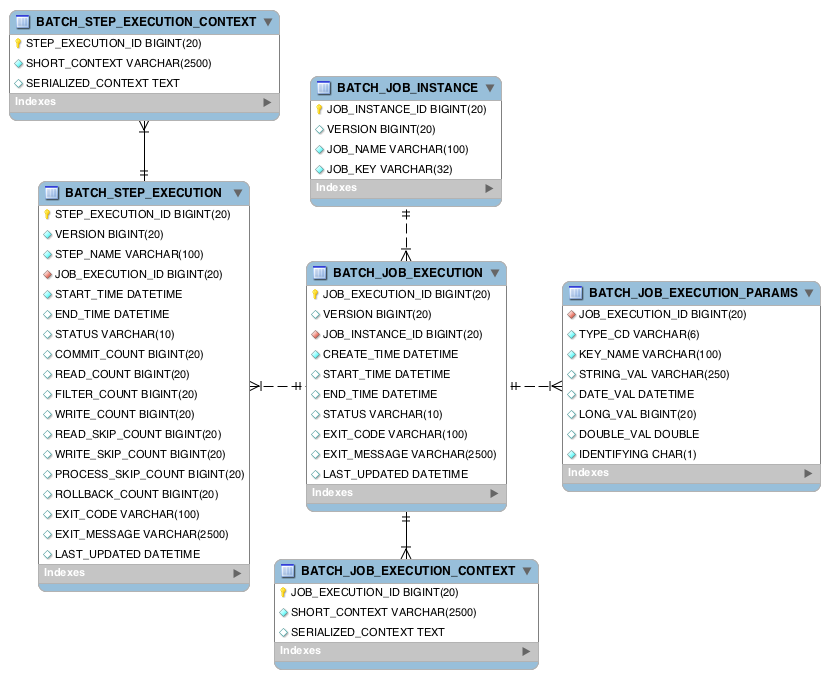
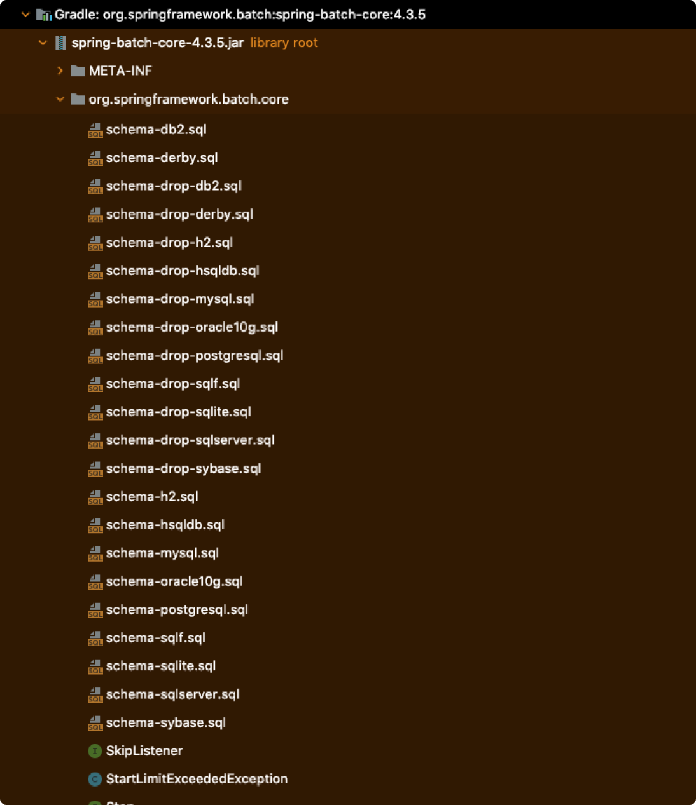
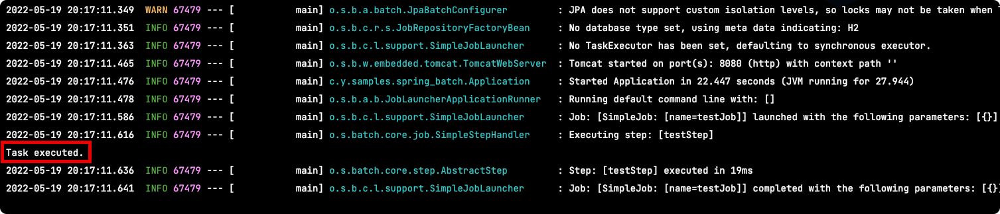
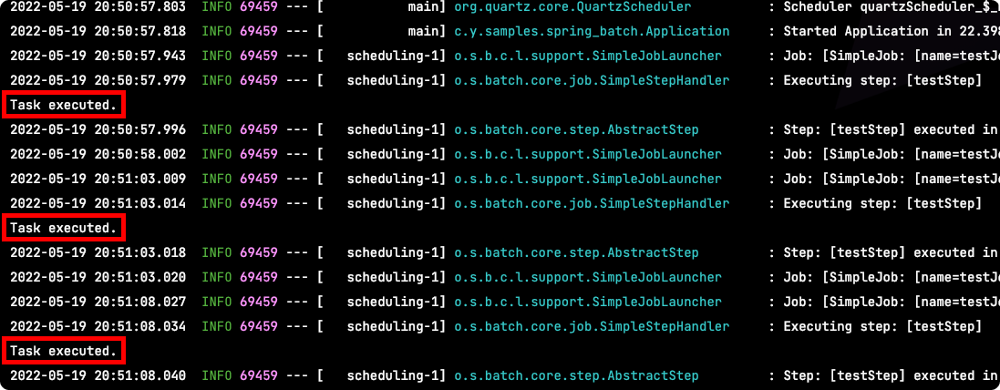

# Table of Contents
[[toc]]

# Spring Batch 시작하기
`Spring Batch`를 사용하면 배치 작업을 쉽게 수행할 수 있다.

## 의존성 추가
``` groovy
// build.gradle
dependencies {
	implementation 'org.springframework.boot:spring-boot-starter-batch'
	testImplementation 'org.springframework.batch:spring-batch-test'
}
```

## 메타 테이블 스키마
스프링 배치는 실행한 배치 작업에 대한 정보들을 `메타 테이블`에 기록한다. 스프링 배치가 필요로 하는 `메타 테이블`은 다음과 같다.



별도의 설정이 없다면 스프링 배치는 인메모리 데이터베이스에 메타 테이블과 관련된 스키마를 자동으로 생성해준다. 따라서 다음과 같이 인메모리 의존성만 추가하면 된다.
``` groovy
// build.gradle
dependencies {
	// H2
	implementation "com.h2database:h2:${h2_version}"
}
```

그리고 다음과 같이 데이터베이스 설정을 해준다.
``` yml
# application.yml
spring:
  datasource:
    url: jdbc:h2:mem:testdb;DB_CLOSE_DELAY=-1;DB_CLOSE_ON_EXIT=FALSE
    username: sa
    password:
    driver-class-name: org.h2.Driver 
```

메타 데이터는 별도의 데이터베이스에 저장할 수 있다. 메타 데이터를 `MySQL`에 저장하려면 다음과 같은 의존성을 추가한다.
``` groovy
// build.gradle
dependencies {
	// NySQL Driver
	runtimeOnly group: 'mysql', name: 'mysql-connector-java', version: '8.0.26'
}
```
또한 메타 데이터와 관련된 스키마를 직접 생성해주어야한다. 메타 데이터 스키마 생성과 관련된 DDL은 `org.springframework.batch:spring-batch-core` 모듈의 `org.springframework.batch.core` 패키지에서 확인할 수 있다.



MySQL을 사용하는 경우 `schema-mysql.sql`을 사용하면 된다.

```
 CREATE TABLE BATCH_JOB_INSTANCE  (
	JOB_INSTANCE_ID BIGINT  NOT NULL PRIMARY KEY ,
	VERSION BIGINT ,
	JOB_NAME VARCHAR(100) NOT NULL,
	JOB_KEY VARCHAR(32) NOT NULL,
	constraint JOB_INST_UN unique (JOB_NAME, JOB_KEY)
) ENGINE=InnoDB;

CREATE TABLE BATCH_JOB_EXECUTION  (
	JOB_EXECUTION_ID BIGINT  NOT NULL PRIMARY KEY ,
	VERSION BIGINT  ,
	JOB_INSTANCE_ID BIGINT NOT NULL,
	CREATE_TIME DATETIME(6) NOT NULL,
	START_TIME DATETIME(6) DEFAULT NULL ,
	END_TIME DATETIME(6) DEFAULT NULL ,
	STATUS VARCHAR(10) ,
	EXIT_CODE VARCHAR(2500) ,
	EXIT_MESSAGE VARCHAR(2500) ,
	LAST_UPDATED DATETIME(6),
	JOB_CONFIGURATION_LOCATION VARCHAR(2500) NULL,
	constraint JOB_INST_EXEC_FK foreign key (JOB_INSTANCE_ID)
	references BATCH_JOB_INSTANCE(JOB_INSTANCE_ID)
) ENGINE=InnoDB;

CREATE TABLE BATCH_JOB_EXECUTION_PARAMS  (
	JOB_EXECUTION_ID BIGINT NOT NULL ,
	TYPE_CD VARCHAR(6) NOT NULL ,
	KEY_NAME VARCHAR(100) NOT NULL ,
	STRING_VAL VARCHAR(250) ,
	DATE_VAL DATETIME(6) DEFAULT NULL ,
	LONG_VAL BIGINT ,
	DOUBLE_VAL DOUBLE PRECISION ,
	IDENTIFYING CHAR(1) NOT NULL ,
	constraint JOB_EXEC_PARAMS_FK foreign key (JOB_EXECUTION_ID)
	references BATCH_JOB_EXECUTION(JOB_EXECUTION_ID)
) ENGINE=InnoDB;

CREATE TABLE BATCH_STEP_EXECUTION  (
	STEP_EXECUTION_ID BIGINT  NOT NULL PRIMARY KEY ,
	VERSION BIGINT NOT NULL,
	STEP_NAME VARCHAR(100) NOT NULL,
	JOB_EXECUTION_ID BIGINT NOT NULL,
	START_TIME DATETIME(6) NOT NULL ,
	END_TIME DATETIME(6) DEFAULT NULL ,
	STATUS VARCHAR(10) ,
	COMMIT_COUNT BIGINT ,
	READ_COUNT BIGINT ,
	FILTER_COUNT BIGINT ,
	WRITE_COUNT BIGINT ,
	READ_SKIP_COUNT BIGINT ,
	WRITE_SKIP_COUNT BIGINT ,
	PROCESS_SKIP_COUNT BIGINT ,
	ROLLBACK_COUNT BIGINT ,
	EXIT_CODE VARCHAR(2500) ,
	EXIT_MESSAGE VARCHAR(2500) ,
	LAST_UPDATED DATETIME(6),
	constraint JOB_EXEC_STEP_FK foreign key (JOB_EXECUTION_ID)
	references BATCH_JOB_EXECUTION(JOB_EXECUTION_ID)
) ENGINE=InnoDB;

CREATE TABLE BATCH_STEP_EXECUTION_CONTEXT  (
	STEP_EXECUTION_ID BIGINT NOT NULL PRIMARY KEY,
	SHORT_CONTEXT VARCHAR(2500) NOT NULL,
	SERIALIZED_CONTEXT TEXT ,
	constraint STEP_EXEC_CTX_FK foreign key (STEP_EXECUTION_ID)
	references BATCH_STEP_EXECUTION(STEP_EXECUTION_ID)
) ENGINE=InnoDB;

CREATE TABLE BATCH_JOB_EXECUTION_CONTEXT  (
	JOB_EXECUTION_ID BIGINT NOT NULL PRIMARY KEY,
	SHORT_CONTEXT VARCHAR(2500) NOT NULL,
	SERIALIZED_CONTEXT TEXT ,
	constraint JOB_EXEC_CTX_FK foreign key (JOB_EXECUTION_ID)
	references BATCH_JOB_EXECUTION(JOB_EXECUTION_ID)
) ENGINE=InnoDB;

CREATE TABLE BATCH_STEP_EXECUTION_SEQ (
	ID BIGINT NOT NULL,
	UNIQUE_KEY CHAR(1) NOT NULL,
	constraint UNIQUE_KEY_UN unique (UNIQUE_KEY)
) ENGINE=InnoDB;

INSERT INTO BATCH_STEP_EXECUTION_SEQ (ID, UNIQUE_KEY) select * from (select 0 as ID, '0' as UNIQUE_KEY) as tmp where not exists(select * from BATCH_STEP_EXECUTION_SEQ);

CREATE TABLE BATCH_JOB_EXECUTION_SEQ (
	ID BIGINT NOT NULL,
	UNIQUE_KEY CHAR(1) NOT NULL,
	constraint UNIQUE_KEY_UN unique (UNIQUE_KEY)
) ENGINE=InnoDB;

INSERT INTO BATCH_JOB_EXECUTION_SEQ (ID, UNIQUE_KEY) select * from (select 0 as ID, '0' as UNIQUE_KEY) as tmp where not exists(select * from BATCH_JOB_EXECUTION_SEQ);

CREATE TABLE BATCH_JOB_SEQ (
	ID BIGINT NOT NULL,
	UNIQUE_KEY CHAR(1) NOT NULL,
	constraint UNIQUE_KEY_UN unique (UNIQUE_KEY)
) ENGINE=InnoDB;

INSERT INTO BATCH_JOB_SEQ (ID, UNIQUE_KEY) select * from (select 0 as ID, '0' as UNIQUE_KEY) as tmp where not exists(select * from BATCH_JOB_SEQ);
```

마지막으로 데이터 소스를 다음과 같이 설정하면 된다.
``` yml
# application.properties
spring:
  datasource:
      url: jdbc:mysql://<URL>:3306/<SCHEMA>
      username: <USERNAME>
      password: <PASSWORD>
      driver-class-name: com.mysql.cj.jdbc.Driver
```

## 간단한 배치 작성해보기
로그를 출력하는 간단한 배치 애플리케이션을 작성해보자.

스프링 배치를 활성화하려면 어플리케이션 클래스나 구성 클래스에 `@EnableBatchProcessing`를 붙이면 된다.
``` java {3}
import org.springframework.batch.core.configuration.annotation.EnableBatchProcessing;

@EnableBatchProcessing
@SpringBootApplication
public class Application {
	public static void main(String[] args) {
		SpringApplication.run(Application.class, args);
	}
}
```
`Tasklet`인터페이스의 구현체를 정의하고 `execute()` 메소드에 수행할 배치 코드를 작성한다.
``` java
public class MyTasklet implements Tasklet {
    @Override
    public RepeatStatus execute(StepContribution contribution, ChunkContext chunkContext) throws Exception {
        System.out.println("Task executed.");
        return RepeatStatus.FINISHED;
    }
}
```
그리고 다음과 같이 `Job`과 `Step`을 정의한 구성 클래스를 구현한다.
``` java
@Configuration
@RequiredArgsConstructor
public class BatchConfig {

    private final JobBuilderFactory jobBuilderFactory;
    private final StepBuilderFactory stepBuilderFactory;

    @Bean
    public Job testJob() {
        return jobBuilderFactory.get("testJob")
                .start(testStep())
                .build();
    }

    @Bean
    public Step testStep() {
        return stepBuilderFactory.get("testStep")
                .tasklet(new MyTasklet())
                .build();
    }
}
```
이제 어플리케이션을 시작해보자. 잡이 수행되어 로그에 결과가 출력되는 것을 확인할 수 있다.



## Spring Quartz
지금까지 만든 배치 어플리케이션은 애플리케이션이 시작할 때 배치 작업을 수행한다. `Spring Quartz`는 배치 작업을 정해진 주기에 따라 실행시켜주는 스케쥴러다. 이를 통해 

`Spring Quartz`를 사용하려면 다음 의존성을 추가해야한다.
``` groovy
// build.gradle
dependencies {
	implementation 'org.springframework.boot:spring-boot-starter-quartz'
}
```

그리고 어플리케이션 클래스에 `@EnableScheduling` 어노테이션을 붙여준다.
``` java
import org.springframework.scheduling.annotation.EnableScheduling;

@SpringBootApplication
@EnableScheduling
public class Application {
	public static void main(String[] args) {
		SpringApplication.run(Application.class, args);
	}
}
```

스프링 배치는 기본적으로 어플리케이션이 시작할 때 배치 작업을 수행한다. 이를 비활성화하기 위해 `application.yml`을 다음과 같이 수정해준다. 
``` yml
spring:
  batch:
    job:
      enabled: false
```

이제 배치 작업을 스케쥴링하기 위해 스케쥴러를 정의해야한다.
``` java
import org.springframework.scheduling.annotation.Scheduled;
import org.springframework.batch.core.launch.JobLauncher;

@Component
@RequiredArgsConstructor
public class TestScheduler {

    private final Job job;
    private final JobLauncher jobLauncher;

    // 5초마다 실행
    @Scheduled(fixedDelay = 5 * 1000L)
    public void executeJob () {
        try {
            jobLauncher.run(
                    job,
                    new JobParametersBuilder()
                            .addString("datetime", LocalDateTime.now().toString())
                            .toJobParameters()  // job parameter 설정
            );
        } catch (JobInstanceAlreadyCompleteException e) {
            throw new RuntimeException(e);
        } catch (JobExecutionAlreadyRunningException e) {
            throw new RuntimeException(e);
        } catch (JobParametersInvalidException e) {
            throw new RuntimeException(e);
        } catch (JobRestartException e) {
            throw new RuntimeException(e);
        }
    }
}
```

이제 어플리케이션일 시작해보자. 5초마다 배치 작업이 수행되어 로그에 출력되는 것을 확인할 수 있다.

