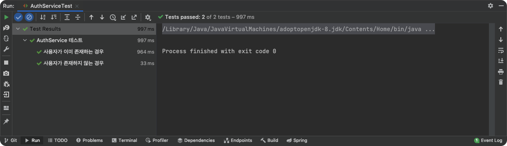
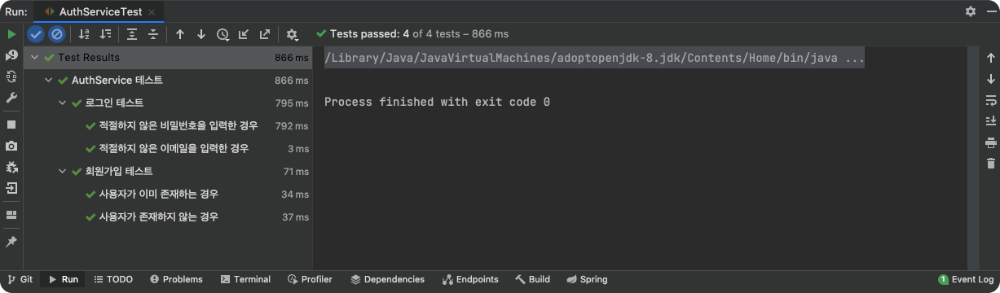

# Table of Contents
[[toc]]

# JUnit 5 사용법 정리
스프링 부트 어플리케이션을 테스트할 때는 `JUnit 5`을 많이 사용한다. 이번 포스트에서는 `JUnit 5`를 정리해보고자 한다.

## 설정
스프링 부트 어플리케이션을 테스트할 때는 보통 `spring-boot-starter-test` 의존성을 추가한다.
``` groovy
dependencies {
    testImplementation('org.springframework.boot:spring-boot-starter-test')
} 
```
이 의존성 안에는 `JUnit 5`가 포함된다.
```
$ gradle dependencies
+--- org.springframework.boot:spring-boot-starter-test -> 2.5.3
|    +--- org.junit.jupiter:junit-jupiter:5.7.2
|    |    +--- org.junit:junit-bom:5.7.2
|    |    +--- org.junit.jupiter:junit-jupiter-api:5.7.2
|    |    \--- org.junit.jupiter:junit-jupiter-params:5.7.2
```

## 사용법

### @Test
`@Test`는 해당 메소드가 테스트 메소드임을 기술할 때 사용한다.
``` java
class CalculatorTest {

    private final Calculator calculator = new Calculator();

    @Test
    void addition() {
        assertEquals(2, calculator.add(1, 1));
    }

}
```

### @BeforeEach
`@BeforeEach`가 붙은 메소드는 각 테스트 메서드보다 먼저 실행된다. 이 메소드에서는 보통 테스트를 위한 초기화 작업을 수행한다.
``` java
public class AuthServiceTest {

    @BeforeEach
    void setUp() {
        // ...
    }
}
```

### @AfterEach
`@AfterEach`가 붙은 메소드는 각 테스트 메서드가 실행된 후 호출된다. 이 메소드에서는 보통 테스트에 사용한 자원을 해제한다.
``` java
public class AuthServiceTest {

    @AfterEach
    void tearDown() {
        // ...
    }
}
```

### @DisplayName
`@DisplayName`을 사용하면 테스트 결과에 출력되는 이름을 직접 지정할 수 있다.
``` java
@DisplayName("AuthService 테스트")
public class AuthServiceTest {

    @Test
    @DisplayName("사용자가 이미 존재하는 경우")
    void user_already_exist() {
        // ...
    }

    @Test
    @DisplayName("사용자가 존재하지 않는 경우")
    void user_not_exist() throws UserAlreadyExistException {
        // ...
    }
}
```


### @Nested
`@Nested`를 사용하면 중첩된 구조로 테스트 코드를 작성할 수 있다. 이를 통해 연관된 테스트 코드를 더 체계적으로 관리할 수 있다.
``` java
@DisplayName("AuthService 테스트")
public class AuthServiceTest {

    @Nested
    @DisplayName("회원가입 테스트")
    class SignUpTest {

        @Test
        @DisplayName("사용자가 이미 존재하는 경우")
        void user_already_exist() {
            // ...
        }

        @Test
        @DisplayName("사용자가 존재하지 않는 경우")
        void user_not_exist() throws UserAlreadyExistException {
            // ...
        }
    }

    @Nested
    @DisplayName("로그인 테스트")
    class LoginTest {
        
        @Test
        @DisplayName("적절하지 않은 이메일을 입력한 경우")
        void login_with_invalid_email() {
            // ...
        }

        @Test
        @DisplayName("적절하지 않은 비밀번호을 입력한 경우")
        void login_with_invalid_password() {
            // ...
        }
    }
}
```


### @ExtendWith
JUnit 5부터는 `Extension`이라는 개념이 추가되었다. `Extension`은 <u>테스트 과정에서 특정 작업을 수행하도록 확장 기능을 추가하는 것</u>이다. `Extension`을 정의하는 방법은 [공식 문서](https://junit.org/junit5/docs/current/user-guide/#extensions)에서 확인할 수 있다.

`@ExtendWith` 어노테이션을 사용하면 `Extension`을 테스트 클래스에 추가할 수 있다. 예를 들어 `Mockito`를 사용하려면 다음과 같이 `MockitoExtension`을 추가해야한다. `MockitoExtension`에는 JUnit 5에서 Mockito를 사용하기 위한 확장 기능이 포함되어있다.
``` java
import org.junit.jupiter.api.extension.ExtendWith;
import org.mockito.junit.jupiter.MockitoExtension;
// ..

@ExtendWith(MockitoExtension.class)
@DisplayName("AuthService 테스트")
public class AuthServiceTest {

    // ..
}
```

## Mockito
JUnit 5는 `Mockito`를 내장하기 때문에 쉽게 목업 테스트를 할 수 있다.
``` java
import org.junit.jupiter.api.DisplayName;
import org.junit.jupiter.api.Nested;
import org.junit.jupiter.api.Test;
import org.junit.jupiter.api.extension.ExtendWith;
import org.mockito.InjectMocks;
import org.mockito.Mock;
import org.mockito.junit.jupiter.MockitoExtension;

import static org.assertj.core.api.Assertions.assertThatThrownBy;
import static org.mockito.ArgumentMatchers.any;
import static org.mockito.Mockito.when;

@ExtendWith(MockitoExtension.class)
@DisplayName("AuthService 테스트")
public class AuthServiceTest {

    @Mock
    private MemberRepository userRepository;

    @Mock
    private PasswordEncoder passwordEncoder;

    @InjectMocks
    private AuthService authService;

    @Nested
    @DisplayName("회원가입 테스트")
    class JoinTest {

        @Test
        @DisplayName("사용자가 이미 존재하는 경우")
        void user_already_exist() {
            // Given
            JoinRequestDto request = JoinRequestDto.builder()
                    .email("ronaldo@gmail.com")
                    .name("Cristiano Ronaldo")
                    .nickname("CR7")
                    .password("1234Asdf!@")
                    .build();

            MemberEntity member = MemberEntity.builder()
                    .email("ronaldo@gmail.com")
                    .name("Cristiano Ronaldo")
                    .nickname("CR7")
                    .password("1234Asdf!@")
                    .build();

            when(userRepository.findByEmail(any())).thenReturn(Optional.ofNullable(member));

            // When & Then
            assertThatThrownBy(() -> authService.join(request))
                    .isInstanceOf(MemberAlreadyExistException.class);
        }
    }
}
```
위 테스트는 스프링 컨테이너를 구동시키지 않으며, 스프링과 관련된 컴포넌트를 컨테이너에 등록하지도 않는다는 점에 주의하자. 

## ReflectionTestUtils
Mockito로 유틸리티 클래스를 테스트할 때 해당 클래스가 스프링 프로퍼티에 의존하는 경우가 있다.
``` java {4,5,7,8}
@Component
public class AccessTokenProvider {

    @Value("${jwt.access-token.secret}")
    private String secret;

    @Value("${jwt.access-token.expire}")
    private long expireTimeInSeconds;

    private static final String AUTHORITIES_KEY = "auth";

    public String createToken(Authentication authentication) {
        String authorities = authentication.getAuthorities().stream()
                .map(GrantedAuthority::getAuthority)
                .collect(Collectors.joining(","));

        Date validity = Date.from(ZonedDateTime.now().plusMinutes(expireTimeInSeconds).toInstant());

        return Jwts.builder()
                .setSubject(authentication.getName())
                .claim(AUTHORITIES_KEY, authorities)
                .signWith(SignatureAlgorithm.HS256, secret.getBytes())
                .setExpiration(validity)
                .compact();
    }

    public void validateToken(String token) {
        Jwts.parser()
                .setSigningKey(secret.getBytes(StandardCharsets.UTF_8))
                .parseClaimsJws(token);
    }

    public Authentication getAuthentication(String token) {

        Claims claims = Jwts.parser()
                .setSigningKey(secret.getBytes(StandardCharsets.UTF_8))
                .parseClaimsJws(token)
                .getBody();

        Collection<? extends GrantedAuthority> authorities =
                Arrays.stream(claims.get(AUTHORITIES_KEY).toString().split(","))
                        .map(SimpleGrantedAuthority::new)
                        .collect(Collectors.toList());

        User principal = new User(claims.getSubject(), "", authorities);

        return new UsernamePasswordAuthenticationToken(principal, token, authorities);
    }
}
```
이 경우 `ReflectionTestUtils`클래스를 사용하면 인스턴스가 생성된 후 멤버변수를 리플렉션으로 설정할 수 있다.
``` java {1,12,13}
import org.springframework.test.util.ReflectionTestUtils;

@ExtendWith(MockitoExtension.class)
@DisplayName("AccessTokenProvider 테스트")
class AccessTokenProviderTest {

    @InjectMocks
    AccessTokenProvider accessTokenProvider;

    @BeforeEach
    public void setUp() {
        ReflectionTestUtils.setField(accessTokenProvider, "secret", "dummy_access_key");
        ReflectionTestUtils.setField(accessTokenProvider, "expireTimeInSeconds", 1440);
    }

    @Test
    @DisplayName("AccessToken 발행 성공, 검증 성공 테스트")
    public void test_issue_success_validate_success() {
        String dummyEmail = "john@gmail.com";
        String dummyPassword = "1234";
        Authentication dummyAuth = new UsernamePasswordAuthenticationToken(dummyEmail, dummyPassword);
        String accessToken = accessTokenProvider.createToken(dummyAuth);

        assertThatNoException().isThrownBy(() -> {
            accessTokenProvider.validateToken(accessToken);
        });
    }

    @Test
    @DisplayName("AccessToken 발행 성공, 검증 실패 테스트")
    public void test_issue_success_validate_failure() {
        String dummyEmail = "john@gmail.com";
        String dummyPassword = "1234";
        Authentication dummyAuth = new UsernamePasswordAuthenticationToken(dummyEmail, dummyPassword);
        String accessToken = accessTokenProvider.createToken(dummyAuth);

        assertThatThrownBy(() -> accessTokenProvider.validateToken(accessToken + "dummy"))
                .isInstanceOf(SignatureException.class);
    }
}
```