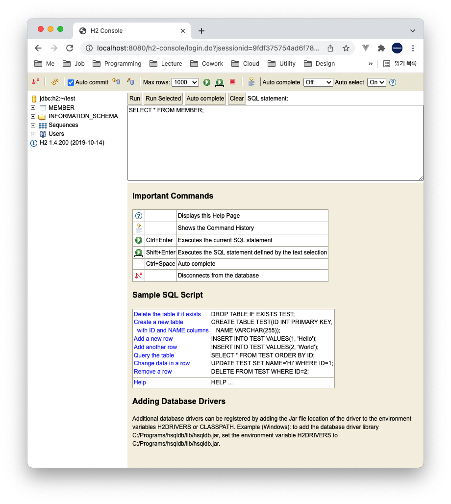

# Table of Contents
[[toc]]

# 스프링 부트 테스트 코드 작성하기
스프링부트의 다양한 테스트 코드 작성법에 대해 정리한다.

## 의존성 추가
스프링 부트에서 테스트 코드를 작성하려면 다음 의존성을 추가해야한다.
``` groovy
// build.gradle
dependencies {
    testImplementation('org.springframework.boot:spring-boot-starter-test')
}
```

## @WebMvcTest
`@WebMvcTest`는 `Spring MVC`와 관련된 컴포넌트를 테스트하는데 사용된다. `Controller Layer`와 관련된 컴포넌트만 컨테이너에 등록하기 때문에 속도가 빠르다. `@WebMvcTest`가 로드하는 컴포넌트는 다음과 같다.
- `@Controller`
- `@ControllerAdvice`
- `@JsonComponent`
- `@WebMvcConfigurer`

다음과 같은 컴포넌트는 컨테이너에 등록되지 않는다.
- `@Component`
- `@Service`
- `@Repository`

참고로 `@WebMvcTest`는 스프링 시큐리티와 관련된 설정도 로드한다.

### 사용법
두 개의 컨트롤러 클래스가 있다고 가정하자.
``` java
@RestController
@RequestMapping("/post")
public class PostController {

    @GetMapping("/test")
    public String test() {
        return "post";
    }
}
```
``` java
@RestController
@RequestMapping("/user")
public class UserController {

    @GetMapping("/test")
    public String test() {
        return "user";
    }
}
```

컨트롤러는 다음과 같이 테스트할 수 있다. `MockMvc`는 테스트를 위한 Spring MVC의 진입점이다. 쉽게 말해 가상의 테스트용 엔드 포인트를 제공하며, 이 곳에 HTTP 요청을 보내는 것이다. 
``` java
@WebMvcTest
class Test {

    @Autowired
    MockMvc mvc;

    @Test
    void test1() throws Exception {
        mvc.perform(get("/post/test"))
                .andExpect(content().string("post"));
    }

    @Test
    void test2() throws Exception {
        mvc.perform(get("/user/test"))
                .andExpect(content().string("user"));
    }

}
```

`@WebMvcTest`의 파라미터로 컨테이너에 빈으로 등록할 클래스를 지정할 수 있다. 이 경우 지정되지 않은 컨트롤러는 빈으로 등록되지 않는다.
``` java
@WebMvcTest(PostController.class)
class Test {

    @Autowired
    MockMvc mvc;

    @Test
    void test1() throws Exception {
        mvc.perform(get("/post/test"))
                .andExpect(content().string("post"));
    }

    @Test
    void test2() throws Exception {
        // UserController는 빈에 등록되지 않았으므로 이 부분은 테스트에 실패한다.
        mvc.perform(get("/user/test"))
                .andExpect(content().string("user"));
    }

}
```

### Mocking
만약 컨트롤러에 다음과 같이 의존관계가 존재한다면 어떻게 할까?
``` java{7,16}
// TestController.java
@RestController
@RequestMapping("/test")
@RequiredArgsConstructor
public class TestController {

    final TestService testService;

    @GetMapping("/test1")
    public String test1() {
        return "test1";
    }

    @GetMapping("/test2")
    public String test2() {
        return testService.test();
    }
}
```

``` java
// TestService.java
@Service
public class TestService {
    public String test() {
        return "test";
    }
}
```
`@WebMvcTest`는 Controller Layer의 컴포넌트만 로드하기 때문에 Service Layer는 직접 설정해야한다. 이때는 `spring-boot-starter-test`라이브러리에 포함된 `Mockito`를 사용하면 된다. 의존 관계에 있는 Layer를 Mocking하고 Stub를 구현해주면 된다.
``` java{11,12,22}
// TestControllerTest.java

import org.springframework.boot.test.mock.mockito.MockBean;

@WebMvcTest(TestController.class)
class TestControllerTest {

    @Autowired
    MockMvc mvc;

    @MockBean
    TestService testService;

    @Test
    public void test1() throws Exception {
        mvc.perform(get("/test/test1"))
                .andExpect(content().string("test1"));
    }

    @Test
    public void test2() throws Exception {
        given(testService.test()).willReturn("test");

        mvc.perform(get("/test/test2"))
                .andExpect(content().string("test"));
    }
}
```

### 특정 컴포넌트 제외시키기
`@WebMvcTest`는 컨트롤러 계층과 관련된 컴포넌트만 컨테이너에 등록하는 슬라이싱 테스트다. `@WebMvcTest`는 스프링 시큐리티와 관련된 설정도 로드하기 때문에 별도의 시큐리티 관련 구성 클래스를 정의했다면 그 내용이 적용된다.
``` java {5-7}
@EnableWebSecurity
@RequiredArgsConstructor
public class SecurityConfig extends WebSecurityConfigurerAdapter {

    private final MemberDetailsService memberDetailsService;
    private final JwtUtil jwtUtil;
    private final MemberRepository memberRepository;

    @Override
    protected void configure(HttpSecurity http) throws Exception {
        http
                .httpBasic().disable()
                .csrf().disable()
                .cors().disable()
                .formLogin().disable()
                .sessionManagement().sessionCreationPolicy(SessionCreationPolicy.STATELESS).and()
                .addFilterBefore(validateAccessTokenFilter(), UsernamePasswordAuthenticationFilter.class)
                .authorizeRequests(authorize -> authorize
                        .anyRequest().permitAll()
                );
    }
    // ...
}
```
문제는 위 코드와 같이 시큐리티 구성 클래스가 다른 빈에 의존할 때 발생한다. `@WebMvcTest` 테스트 코드를 실행하면 `MemberDetailsService`, `JwtUtil`, `MemberRepository` 빈이 없기 때문에 다음과 같은 에러가 발생한다.
```
Parameter 0 of constructor in SecurityConfig required a bean of type 'MemberDetailsService' that could not be found.
```
따라서 다음과 같이 시큐리티 구성 클래스를 빈 등록 대상에서 제외시켜야한다. 
``` java {3-5,15}
@WebMvcTest(
    controllers = TestController.class,
    excludeFilters = {
        @ComponentScan.Filter(type = FilterType.ASSIGNABLE_TYPE, classes = SecurityConfig.class)
    }
)
@DisplayName("TestController 테스트")
class TestControllerTest {

    @Autowired
    private MockMvc mvc;

    @Test
    @DisplayName("test1() 테스트")
    @WithMockUser
    public void test_test1() throws Exception {
        mvc.perform(get("/test/test1"))
                .andExpect(content().string("test1"));
    }
}
```
이렇게 하면 스프링 시큐리티의 기본값이 적용되기 때문에 `@WithMockUser`어노테이션을 붙여 인증된 목업 유저로 테스트를 진행할 수 있다.

## H2 데이터베이스
`H2`의 인메모리 데이터베이스를 사용하면 쉽게 데이터베이스를 테스트할 수 있다.

### 환경설정
다음 의존성을 추가한다.
``` groovy
// build.gradle
dependencies {
    // H2
    implementation 'com.h2database:h2'
}
```
그 다음 `application.properties`에 `H2` 관련 설정을 추가한다. `Spring Data JPA`와 관련된 설정은 생략한다.
``` properties
## H2 설정
spring.h2.console.enabled=true
spring.h2.console.path=/h2-console

## datasource 설정
spring.datasource.url=jdbc:h2:~/test;
spring.datasource.driverClassName=org.h2.Driver
spring.datasource.username=sa
spring.datasource.password=
spring.jpa.database-platform=org.hibernate.dialect.H2Dialect
```

### H2 Console
`H2` 데이터베이스는 인메모리 데이터베이스를 위한 Web 기반 DB Client를 제공한다. 어플리케이션이 구동된 상태에서 `http://localhost:포트/h2-console`에 접속하면 다음과 같은 화면을 볼 수 있다.


`Connect` 버튼을 누르면 `H2 Console`에 접속된다. 이 곳에서 스키마를 조작할 수 있고 SQL문을 직접 실행할 수 도 있다.



### 테스트 환경에 H2 활용하기
필자는 로컬 환경에서는 `MySQL`, 단위 테스트 환경에서는 `H2`를 사용한다. 이러한 환경은 다음과 같이 구성할 수 있다.
``` groovy
// build.gradle
dependencies {
    // implementation 'com.h2database:h2'
    testImplementation 'com.h2database:h2'
}
```
`src/main/resources`의 `application.properties`는 다음과 같이 구성하여 `MySQL`을 사용하도록 한다.
``` properties
## src/main/resources/application.properties
spring.datasource.driver-class-name=com.mysql.cj.jdbc.Driver
spring.datasource.url=jdbc:mysql://localhost:3306/mydb
spring.datasource.username=root
spring.datasource.password=root
```
`src/test/resources`의 `application.properties`는 다음과 같이 구성하여 `H2`을 사용하도록 한다.
``` properties
## src/test/resources/application.properties
spring.datasource.url=jdbc:h2:~/test;
spring.datasource.driverClassName=org.h2.Driver
spring.datasource.username=sa
spring.datasource.password=
spring.jpa.database-platform=org.hibernate.dialect.H2Dialect
```

이제 `JUnit`을 사용하여 단위테스트를 진행할 수 있다.
``` java
@DataJpaTest
class MemberRepositoryTest {

    @Autowired
    MemberRepository memberRepository;
    
    @AfterEach
    void tearDown() {
        memberRepository.deleteAll();
    }

    @Test
    void test() {
        MemberEntity memberEntity = MemberEntity.builder()
                .email("paul@gmail.com")
                .password("1234")
                .build();

        MemberEntity saved = memberRepository.save(memberEntity);

        assertThat(saved.getEmail()).isEqualTo("paul@gmail.com");
    }
}
```

## @DataJpaTest
Spring Data JPA를 사용한다면 `@DataJpaTest`를 사용할 수 있다. 이 어노테이션은 Spring Data JPA와 관련된 컴포넌트만 Spring IoC Container에 등록하기 때문에 `@SpringBootTest`보다 훨씬 빠르다.

이 어노테이션은 `Spring Test`에 포함되어있다.
``` groovy
dependencies {
    // Spring Data JPA
    implementation "org.springframework.boot:spring-boot-starter-data-jpa"

    // Spring Test
    testImplementation 'org.springframework.boot:spring-boot-starter-test'
}
```
`@DataJpaTest`는 <u>기본적으로 인메모리 데이터베이스를 사용하여 테스트를 진행</u>한다. 인메모리 데이터베이스로 `h2`를 사용하려면 다음 의존성을 추가해야한다.
``` groovy
dependencies {
    // H2
    testRuntimeOnly 'com.h2database:h2'
}
```

필자는 로컬 개발 환경에서는 `MySQL`, 단위 테스트 환경에서는 `h2`를 사용한다.
``` groovy
dependencies {
    // MySQL Connector
    runtimeOnly 'mysql:mysql-connector-java'
    // H2
    testRuntimeOnly 'com.h2database:h2'
}
```
```yml
# src/main/resources/application.yml
spring:
  datasource:
    url: jdbc:mysql://localhost:3306/test_db
    username: root
    password: root
    driver-class-name: com.mysql.cj.jdbc.Driver
  jpa:
    hibernate:
      ddl-auto: update
    generate-ddl: true
    properties:
      hibernate:
        show_sql: true
        format_sql: true
```
```yml
# src/test/resources/application.yml
spring:
  datasource:
    url: jdbc:h2:~/test;
    username: sa
    password:
  jpa:
    database-platform: org.hibernate.dialect.H2Dialect
    hibernate:
      ddl-auto: update
    generate-ddl: true
    properties:
      hibernate:
        show_sql: true
        format_sql: true
```

이제 예제를 통해 테스트를 진행해보자.
``` java
// UserEntity.java
@Entity
@Table(name= "user")
@Builder
@Getter
@AllArgsConstructor
@NoArgsConstructor
public class UserEntity extends BaseEntity {

    @Id
    @GeneratedValue(strategy = GenerationType.IDENTITY)
    private Long id;

    @Column(length = 200, nullable = false, unique = true)
    private String email;

    @Column(nullable = false)
    private String name;

    @Column(nullable = false)
    private String nickname;

    @Column(nullable = false)
    private String password;
}
```
``` java
// UserRepository.java
public interface UserRepository extends JpaRepository<UserEntity, Long> {
    Optional<UserEntity> findByEmail(String email);
}
```

`@DataJpaTest`는 다음과 같이 사용한다.
``` java
// UserRepositoryTest.java
@DataJpaTest
class UserRepositoryTest {

    @Autowired
    private UserRepository userRepository;

    @BeforeEach
    void setUp() {
    }

    @AfterEach
    void tearDown() {
        userRepository.deleteAll();
    }

    @Test
    public void test_findByEmail() {
        // Given
        String email = "CR7@gmail.com";
        String name = "Cristiano Ronaldo";
        String password = "12341234";
        String nickname = "CR7";

        UserEntity input = UserEntity.builder()
                .email(email)
                .name(name)
                .password(password)
                .nickname(nickname)
                .build();

        userRepository.save(input);

        // When
        Optional<UserEntity> output = userRepository.findByEmail(email);

        // Then
        assertTrue(output.isPresent());
        assertThat(output.get().getEmail()).isEqualTo(email);
    }
}
```

### 테스트 환경에서 온디스크 데이터베이스 사용하기
`@DataJpaTest`는 <u>기본적으로 인메모리 데이터베이스를 사용하여 테스트를 진행</u>한다. 온디스크 데이터베이스를 사용하려면 별도의 설정이 필요하다. `MySQL` DB를 사용하기 위해 `src/test/resources/application.yml`를 다음과 같이 수정한다.

```yml
# spring:
#   datasource:
#     url: jdbc:h2:~/test;
#     username: sa
#     password:
#   jpa:
#     database-platform: org.hibernate.dialect.H2Dialect
#     hibernate:
#       ddl-auto: update
#     generate-ddl: true
#     properties:
#       hibernate:
#         show_sql: true
#         format_sql: true
spring:
  datasource:
    url: jdbc:mysql://localhost:3306/test_db
    username: root
    password: root
    driver-class-name: com.mysql.cj.jdbc.Driver
  jpa:
    hibernate:
      ddl-auto: update
    generate-ddl: true
    properties:
      hibernate:
        show_sql: true
        format_sql: true
```

그리고 테스트 클래스에 `@AutoConfigureTestDatabase(replace = AutoConfigureTestDatabase.Replace.NONE)` 어노테이션을 추가한다. 이 어노테이션은 인메모리 데이터베이스 온디스크 데이터베이스를 사용하도록 한다.
``` java
// UserRepositoryTest.java
@DataJpaTest
@AutoConfigureTestDatabase(replace = AutoConfigureTestDatabase.Replace.NONE)
class UserRepositoryTest {
    // ..
}
```

### @Commit, @Rollback
`@DataJpaTest`는 기본적으로 테스트 종료 후 데이터베이스를 롤백한다. 롤백을 하지 않으려면 `@Commit` 또는 `@Rollback(false)` 어노테이션을 붙이면 된다.
``` java
@DataJpaTest
@Commit
class UserRepositoryTest {
    // ...
}
```

## @SpringBootTest
`@SpringBootTest`는 통합 테스트에 사용되는 어노테이션이다. 모든 컴포넌트를 컨테이너에 등록하기 때문에 속도가 느리지만 운영 환경과 가장 유사하게 테스트할 수 있다.

``` java
@SpringBootTest
public class Test {
    // ..
}
```

`@SpringBootTest`는 크게 두 가지 방법으로 사용할 수 있다.

### WebEnvironment.MOCK 
`@SpringBootTest`의 `webEnviroment` 속성을 `SpringBootTest.WebEnvironment.MOCK`로 설정하면 실제 내장 톰캣을 구동하지 않고 Mocking Container를 사용한다.
``` java
@SpringBootTest(webEnvironment = SpringBootTest.WebEnvironment.MOCK)
public class Test {
    // ...
}
```
따라서 `@AutoConfigureMockMvc`를 추가하고 `MockMVC`를 사용하여 테스트를 진행한다.
``` java
@SpringBootTest(webEnvironment = SpringBootTest.WebEnvironment.MOCK)
@AutoConfigureMockMvc
public class Test {
    
    @Autowired
    MockMvc mockMvc;
    
    @Test
    void test() throws Exception {
        mockMvc.perform(MockMvcRequestBuilders.get("/post/test"))
                .andExpect(status().isOk());
    }
}
```

### WebEnvironment.RANDOM_PORT
`SpringBootTest.WebEnvironment.RANDOM_PORT`로 설정하면 랜덤한 포트를 사용하여 실제 톰캣을 구동시킨 후 모든 컴포넌트를 컨테이너에 등록한다. 이 경우 `TestRestTemplate`으로 테스트를 진행할 수 있다.
``` java
@SpringBootTest(webEnvironment = SpringBootTest.WebEnvironment.RANDOM_PORT)
public class Test {

    @Autowired
    TestRestTemplate template;

    @LocalServerPort
    private int port;   // 랜덤한 포트가 주입된다.

    @Test
    void test() {
        String body = template.getForObject("/post/test", String.class);
        assertThat(body).isEqualTo("post");
    }
}
```

### 특정 클래스만 빈으로 등록하기
`classes` 속성을 사용하면 특정 클래스만 빈으로 등록하여 사용할 수 있다.
``` java {3-6}
@SpringBootTest(
    webEnvironment = SpringBootTest.WebEnvironment.RANDOM_PORT,
    classes = {
        PostService.class,
        PostRepository.class
    }
)
public class Test {

    @Autowired
    private postService PostService;

    @Test
    public void test() {
        Post post = postService.findById(1);
        assertThat(post.getTitle()).isEqualTo("title 1");
    }
}
```


### Mocking
`@MockBean`을 사용하면 통합테스트 환경에서도 Mock 객체를 사용할 수 있다.
``` java {13,14}
@SpringBootTest(
    webEnvironment = SpringBootTest.WebEnvironment.RANDOM_PORT,
    classes = {
        PostService.class,
        PostRepository.class
    }
)
public class Test {

    @Autowired
    private postService PostService;

    @MockBean
    private PostRepository postRepository;

    @Test
    public void test() {
        given(postRepository.findById(1))
            .willReturn(new Post(1, "title 1", "content 1"));

        Post post = postService.findById(1);
        assertThat(post.getTitle()).isEqualTo("title 1");
    }
}
```

## 어떤 테스트를 사용해야할까?
일반적으로 스프링 애플리케이션은 응집도(Cohension)을 높이고 결합도(Coupling)을 낮추기 위해 `Controller Layer`, `Service Layer`, `Data Layer`로 폴더나 모듈을 나눈다. 

계층을 분리하면 해당 계층만을 독립적으로 테스트할 수 있으며, 이를 `슬라이스 테스트(Slice Test)`라고 한다.
- `@WebMvcTest`
- `@DataJpaTest`

반면 어플리케이션을 구성하는 요소를 모두 로드하여 테스트하는 것을 `통합 테스트(Integration Test)`라고 한다.
- `@SpringBootTest`

어플리케이션의 규모가 커질 수록 통합 테스트에 많은 시간이 소요된다. 따라서 계층을 적절히 분리하고 필요한 컴포넌트만 로드하는 `슬라이스 테스트`를 사용하는 것이 좋겠다.

## @TestConfiguration, @Import
`@TestConfiguration`를 사용하면 테스트 환경에서 특정 빈을 선택적으로 스프링 컨테이너에 등록할 수 있다.

예제를 살펴보자. Query DSL을 사용하는 경우 `@SpringBootTest`로 통합 테스트를 하면 모든 빈이 등록되기 때문에 큰 문제가 없다. 그러나 `@DataJpaTest`를 사용하는 경우 Query DSL과 관련된 빈이 주입되지 않아 에러가 발생한다. 
```
Parameter 0 of constructor in com.yologger.repository.post.PostCustomRepositoryImpl required a bean of type 'com.querydsl.jpa.impl.JPAQueryFactory' that could not be found.
```

이제 테스트 환경에서 Query DSL과 관련된 빈을 등록해보자.
``` java
import com.querydsl.jpa.impl.JPAQueryFactory;
import org.springframework.boot.test.context.TestConfiguration;
import org.springframework.context.annotation.Bean;

import javax.persistence.EntityManager;
import javax.persistence.PersistenceContext;

@TestConfiguration
public class TestConfig {

    @PersistenceContext
    private EntityManager entityManager;

    @Bean
    public JPAQueryFactory jpaQueryFactory() {
        return new JPAQueryFactory(entityManager);
    }
}
```

그리고 `@Import`로 테스트 환경에서만 설정 클래스를 활성화할 수 있다.
``` java {2}
@DataJpaTest
@Import(TestConfig.class)
class MemberRepositoryTest {

    @Autowired
    private MemberRepository memberRepository;

    @BeforeEach
    void setUp() {
    }

    @AfterEach
    public void tearDown() {
        memberRepository.deleteAll();
    }

    @Test
    public void test_queryMember() {

        // Given
        String dummyEmail = "CR7@gmail.com";
        String dummyName = "Cristiano Ronaldo";
        String dummyPassword = "12341234";
        String dummyNickname = "CR7";

        MemberEntity input = MemberEntity.builder()
                .email(dummyEmail)
                .name(dummyName)
                .password(dummyPassword)
                .nickname(dummyNickname)
                .build();

        memberRepository.save(input);

        // When
        List<MemberEntity> members = memberRepository.findAll();

        // Then
        assertThat(members.size()).isEqualTo(1);
    }
}
```