# Table of Contents
[[toc]]

# Swagger 2
`Swagger 2`는 어플리케이션 엔드포인트 문서화 도구다. 

## 의존성 추가
``` groovy
dependencies {
    implementation 'io.springfox:springfox-swagger2:3.0.0'
    implementation 'io.springfox:springfox-swagger-ui:3.0.0'
}
```

## 구성 클래스
`Swagger 2`를 위한 구성 클래스는 다음과 같다.
``` java
@Configuration
@EnableSwagger2
public class Swagger2Config {
    @Bean
    public Docket api() {
        return new Docket(DocumentationType.SWAGGER_2)
                .apiInfo(apiInfo())
                .select()
                .apis(RequestHandlerSelectors.basePackage("com.yologger.demo"))
                .paths(PathSelectors.any())
                .build();
    }

    private ApiInfo apiInfo() {
        return new ApiInfoBuilder()
                .title("제목 작성")
                .version("버전 작성")
                .description("설명 작성")
                .build();
    }
}
```
`Docket`클래스로 설정하는 값은 다음과 같다.
- `apis()`: API 문서를 만들어줄 범위를 지정한다. 위 예제에서는 com.yologger.demo 하위 구조를 탐색하여 API 문서를 생성한다.
- `paths()`: API 의 URL 경로를 지정한다. `paths(PathSelectors.ant("api/v1/**"))`로 설정하면 `http://localhost/api/v1/` 하위 경로의 엔드포인트에 대해 API 문서를 생성한다.

`ApiInfoBuilder`로 설정하는 값은 다음과 같다.
- `title()`: API 문서의 제목을 설정한다.
- `version()`: API 문서의 버전을 설정한다.
- `description()`: API 문서의 상세 설명을 설정한다.

`ApiInfo`의 파라미터 정보는 다음과 같다.
``` java
public ApiInfo(
    String title,
    String description,
    String version,
    String termsOfServiceUrl,
    Contact contact,
    String license,
    String licenseUrl,
    Collection<VendorExtension> vendorExtensions
) {
        // ...
}
```

## 간단한 예제
간단한 컨트롤러를 생성하고 애플리케이션을 구동해보자.
``` java
@RestController
@RequestMapping("/test")
public class TestController {

    @GetMapping("/test1")
    String test1() {
        return "test1";
    }

    @GetMapping("/test2")
    String test2() {
        return "test2";
    }
}
```
애플리케이션이 구동된 상태에서 `http://localhost:8080/swagger-ui.html`로 접속하여 문서를 확인할 수 있다.

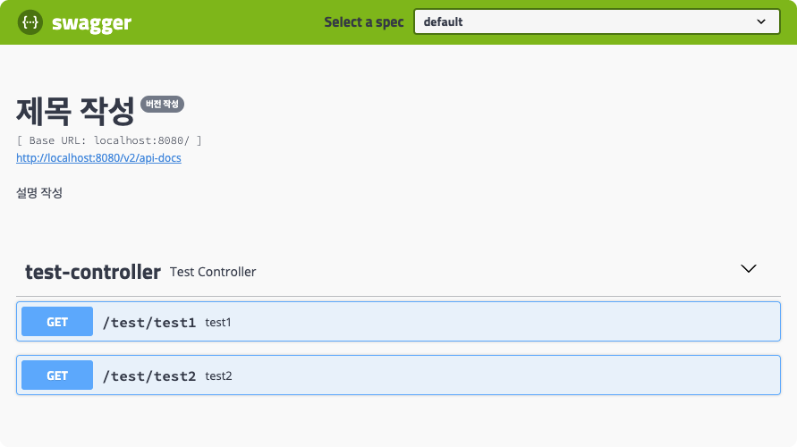


## Grouping
`Docket`클래스의 `group()`을 사용하면 문서를 그룹화할 수 있다.

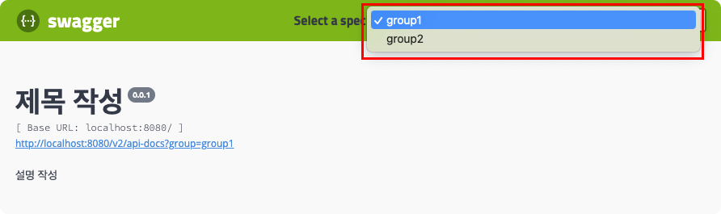

소스 코드는 다음과 같다.
``` java
@Configuration
@EnableSwagger2
public class Swagger2Config {
    @Bean
    public Docket apiV1() {
        return new Docket(DocumentationType.SWAGGER_2)
                .groupName("group1")
                .apiInfo(apiInfo1())
                .select()
                .apis(RequestHandlerSelectors.basePackage("com.yologger.samples.demo"))
                .paths(PathSelectors.ant("api/v1/**"))
                .build();
    }

    @Bean
    public Docket apiV2() {
        return new Docket(DocumentationType.SWAGGER_2)
                .groupName("group2")
                .apiInfo(apiInfo2())
                .select()
                .apis(RequestHandlerSelectors.basePackage("com.yologger.samples.demo"))
                .paths(PathSelectors.ant("api/v2/**"))
                .build();
    }

    private ApiInfo apiInfo1() {
        return new ApiInfoBuilder()
                .title("제목 작성")
                .version("0.0.1")
                .description("설명 작성")
                .build();
    }

    private ApiInfo apiInfo2() {
        return new ApiInfoBuilder()
                .title("제목 작성")
                .version("0.0.2")
                .description("설명 작성")
                .build();
    }
}
```

`group()`를 설정하지 않으면 `default` 그룹에 자동으로 추가된다.

## @Api
`@Api`는 컨트롤러에 추가하며, 컨트롤러에 대한 상세한 설명을 추가할 수 있다.
``` java {1,4}
import io.swagger.annotations.Api;

@RestController
@Api(tags = "게시글 관련 엔드포인트")
public class PostController {

    @GetMapping("/post/{post_id}")
    public Post getPost(@PathVariable("post_id") Long postId) {
        Post post = Post.builder()
                .id(postId)
                .title("title")
                .content("content")
                .build();

        return post;
    }
}
```

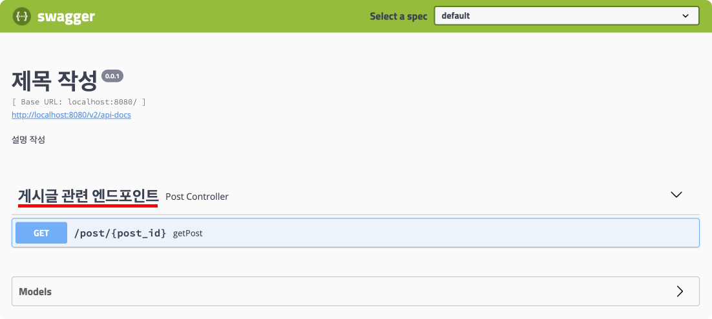

## @ApiOperation
`@ApiOperation`는 메소드에 추가하며, 엔드포인트 하나에 대한 설명을 추가할 수 있다.
- `value`: 
- `notes`: 

``` java{5-8}
@RestController
@Api(tags = "게시글 관련 엔드포인트")
public class PostController {

    @ApiOperation(
            value = "게시글 하나 조회",
            notes = "게시글 아이디로 게시글 조회하기"
    )
    @GetMapping("/post/{post_id}")
    public Post getPost(@PathVariable("post_id") Long postId) {
        Post post = Post.builder()
                .id(postId)
                .title("title")
                .content("content")
                .build();

        return post;
    }
```

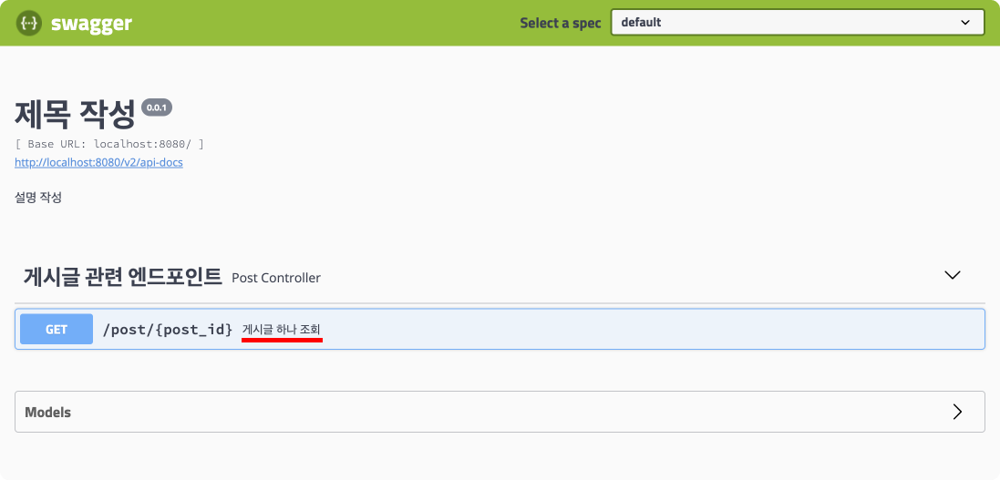

## @ApiResponses
응답에 대한 설명을 추가할 수 있다.
``` java
@RestController
@Api(tags = "게시글 관련 엔드포인트")
public class PostController {

    @ApiOperation(
            value = "게시글 하나 조회",
            notes = "게시글 아이디로 게시글 조회하기"
    )
    @ApiResponses({
        @ApiResponse(code = 200, message = "회원 목록 조회 성공"),
        @ApiResponse(code = 401, message = "인증 실패"),
        @ApiResponse(code = 403, message = "접근 권한 오류"),
        @ApiResponse(code = 404, message = "없는 게시물")
    })
    @GetMapping("/post/{post_id}")
    public Post getPost(@PathVariable("post_id") Long postId) {
        Post post = Post.builder()
                .id(postId)
                .title("title")
                .content("content")
                .build();

        return post;
    }
}
```

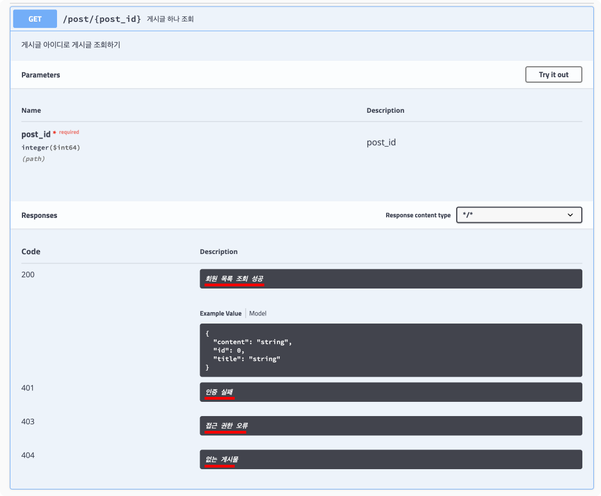

## @ApiModel, @ApiModelProperty
`@ApiModel`, `@ApiModelProperty`을 사용하면 데이터 모델 클래스도 문서화할 수 있다.
``` java {3-6,10,13,16}
@Getter
@NoArgsConstructor
@ApiModel(
    value = "게시물 정보",
    description = "작성자 아이디, 제목, 내용을 포함하는 게시물 작성 정보"
)
public class AddPostRequest {

    @JsonProperty("writer_id")
    @ApiModelProperty("작성자 아이디")
    private Long writerId;

    @ApiModelProperty("게시글 제목")
    private String title;

    @ApiModelProperty("게시글 내용")
    private String content;

    @Builder
    public AddPostRequest(Long writerId, String title, String content) {
        this.writerId = writerId;
        this.title = title;
        this.content = content;
    }
}
```
``` java
@RestController
@Api(tags = "게시글 관련 엔드포인트")
public class PostController {

    @ApiOperation(
            value = "게시글 추가",
            notes = "게시글 추가하기"
    )
    @PostMapping("/post")
    public Long addPost(@RequestBody AddPostRequest request) {
        return request.getWriterId();
    }
}
```

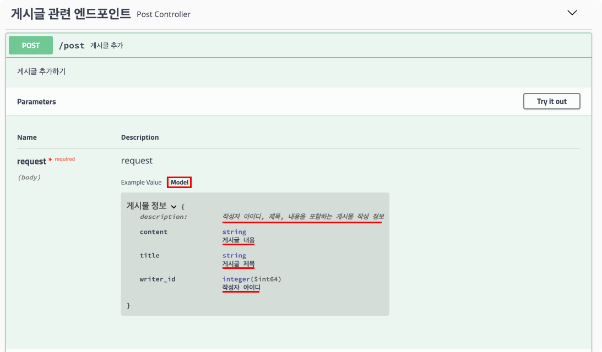

`@ApiModelProperty`의 `example` 속성으로 예제를 추가할 수도 있다.
``` java {10,13,16}
@Getter
@NoArgsConstructor
@ApiModel(
    value = "게시물 정보",
    description = "작성자 아이디, 제목, 내용을 포함하는 게시물 작성 정보"
)
public class AddPostRequest {

    @JsonProperty("writer_id")
    @ApiModelProperty(value = "작성자 아이디", example = "1")
    private Long writerId;

    @ApiModelProperty(value = "게시글 제목", example = "This is title")
    private String title;

    @ApiModelProperty(value = "게시글 내용", example = "This is content.")
    private String content;

    @Builder
    public AddPostRequest(Long writerId, String title, String content) {
        this.writerId = writerId;
        this.title = title;
        this.content = content;
    }
}
```

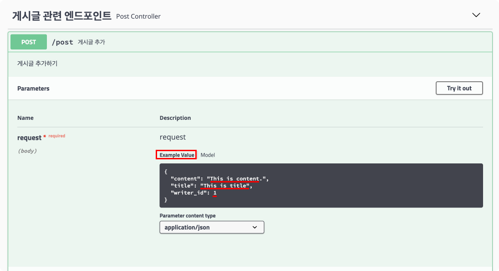

## @ApiParam
`@ApiParam`는 파라미터에 직접 추가하여 파라미터에 대한 정보를 문서화한다.
``` java {7,21}
@RestController
@Api(tags = "게시글 관련 엔드포인트")
public class PostController {

    @GetMapping("/post/{post_id}")
    public Post getPost(
            @ApiParam(value = "작성자 아이디", required = true) @PathVariable("post_id") Long postId
    ) {
        Post post = Post.builder()
                .id(postId)
                .title("title")
                .content("content")
                .build();

        return post;
    }

    @ApiOperation(value = "게시글 추가", notes = "게시글 추가하기")
    @PostMapping("/post")
    public Long addPost(
            @ApiParam(value = "게시글 정보", required = true) @RequestBody AddPostRequest request
    ) {
        return request.getWriterId();
    }
}
```

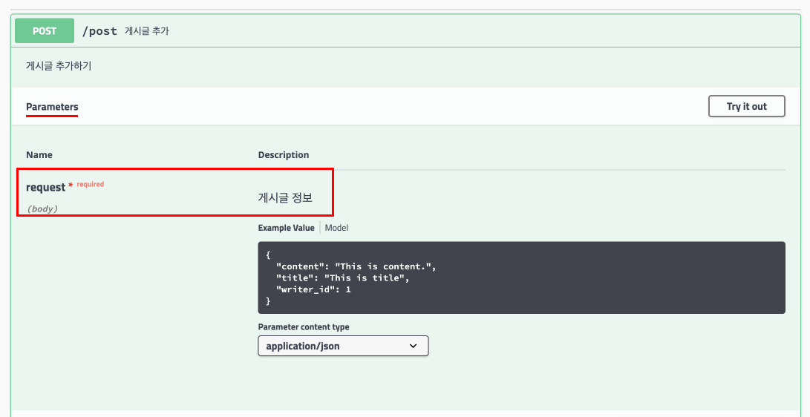

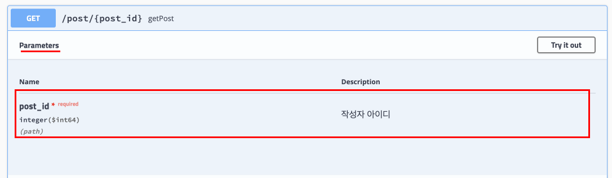

## @ApiImplicitParams, @ApiImplicitParam
`@ApiImplicitParams`, `@ApiImplicitParam`는 메소드에 붙여 파라미터 정보를 문서화할 수 있다.
``` java
@RestController
@Api(tags = "게시글 관련 엔드포인트")
public class PostController {

    @GetMapping("/post/{post_id}")
    @ApiImplicitParams({
        @ApiImplicitParam(
            name = "post_id",
            value = "사용자 아이디",
            required = true,
            dataType = "Long",  // 기본 타입 | 클래스 이름
            paramType = "path", // path | query | body | header | form
            defaultValue = "0")
    })
    public Post getPost(
            // @ApiParam(value = "작성자 아이디", required = true)
            @PathVariable("post_id") Long postId
    ) {
        Post post = Post.builder()
                .id(postId)
                .title("title")
                .content("content")
                .build();

        return post;
    }
}
```

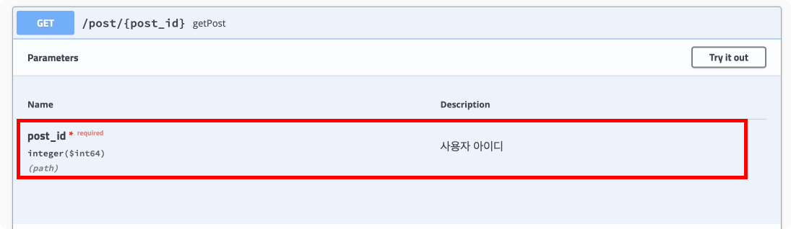

## Swagger UI로 테스트하기
`Swagger UI`를 사용하면 엔드포인트를 테스트할 수 있다. 테스트 파라미터 값도 직접 설정할 수 있다.

엔드포인트를 테스트하려면 `Try it out` 버튼을 클릭한다.

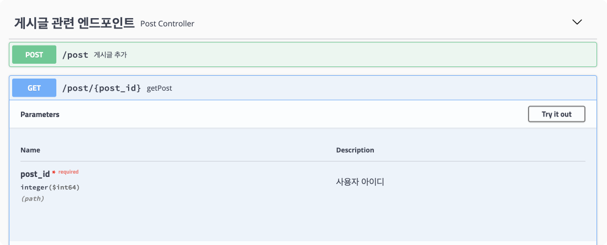

이후 테스트 파라미터 값을 적절하게 설정하고 `Execute` 버튼을 클릭한다.

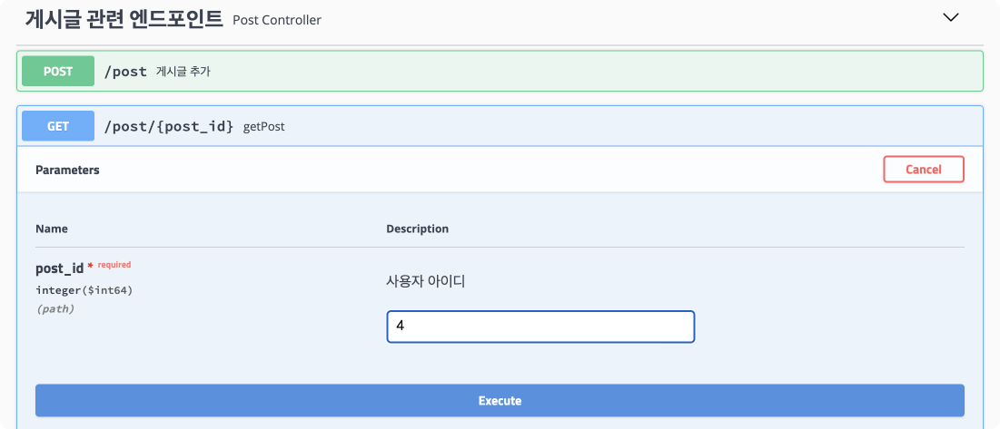

버튼 아래에서 실제로 실행된 `cURL` 명령어, `Request URL`, `Http 상태코드`, `응답 바디`, `응답 헤더`를 확인할 수 있다.

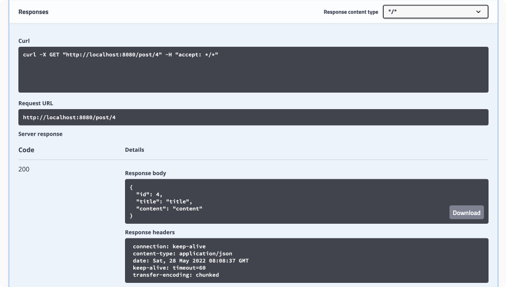


## 스프링 시큐리티와 Swagger