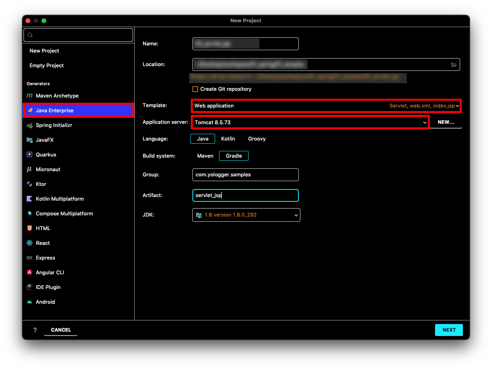
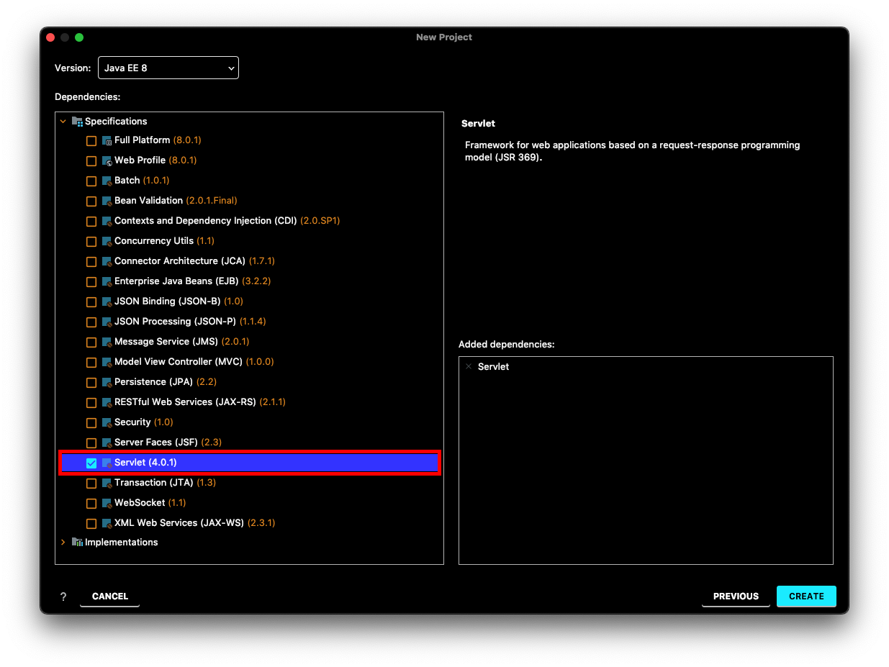
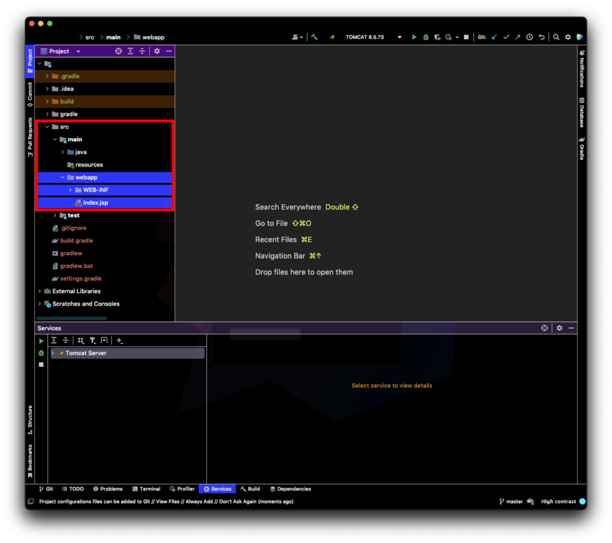
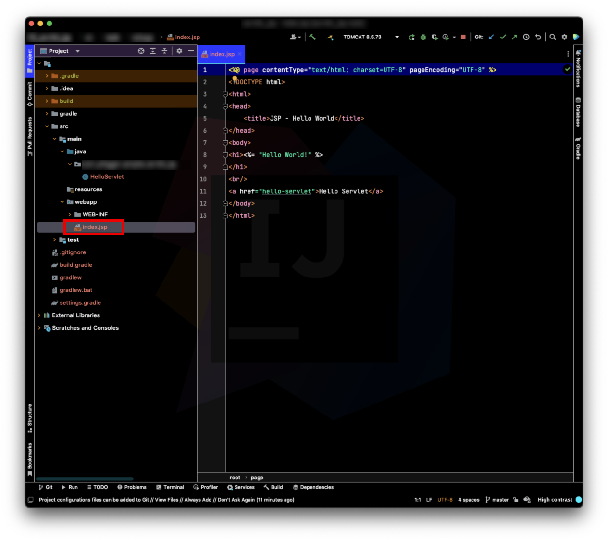
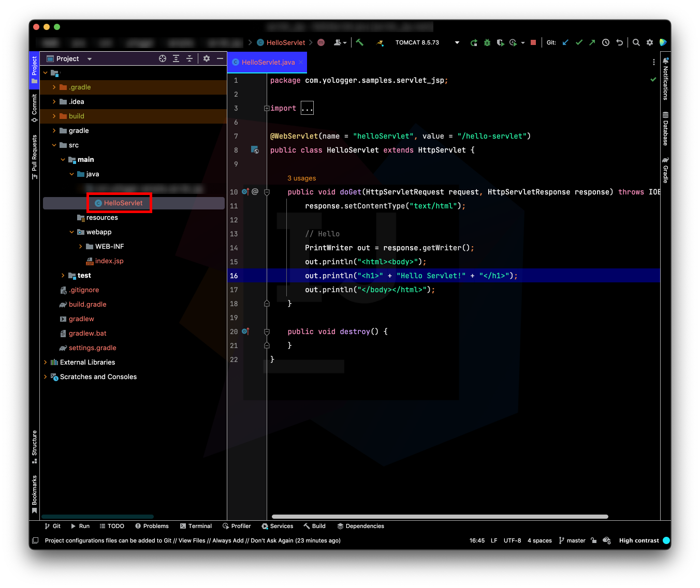
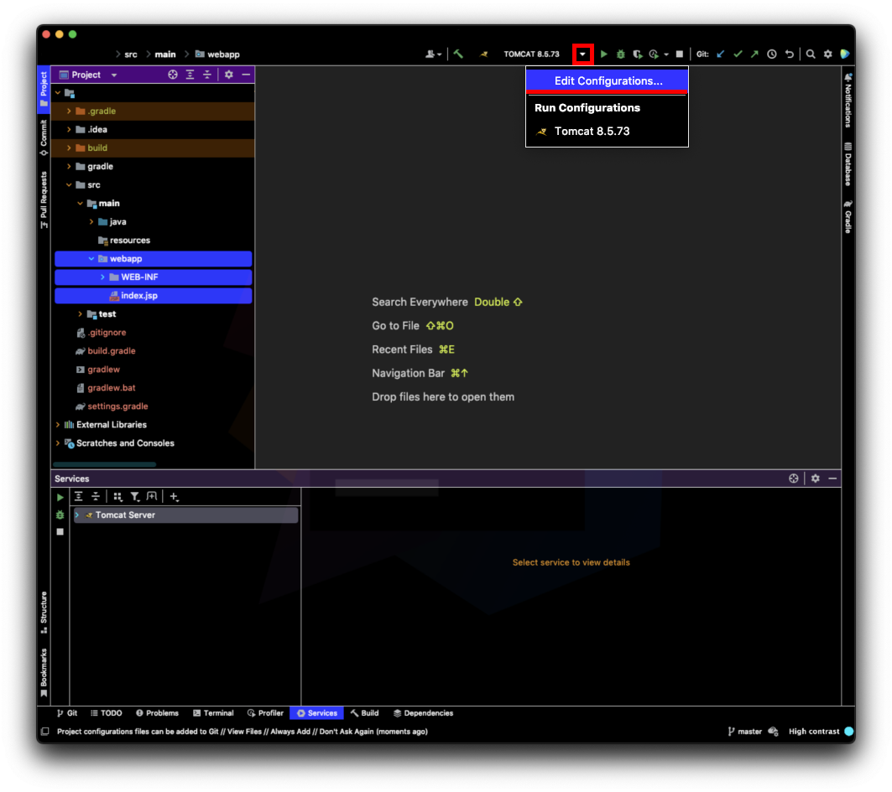
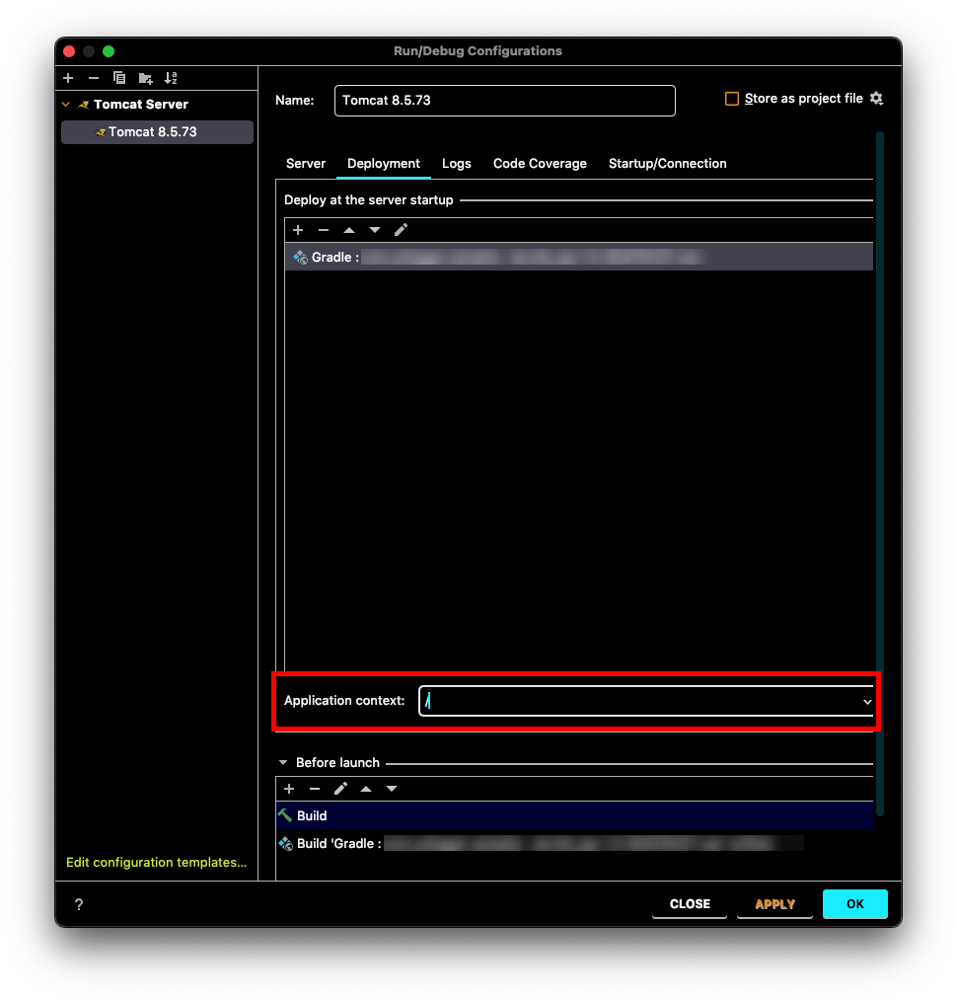
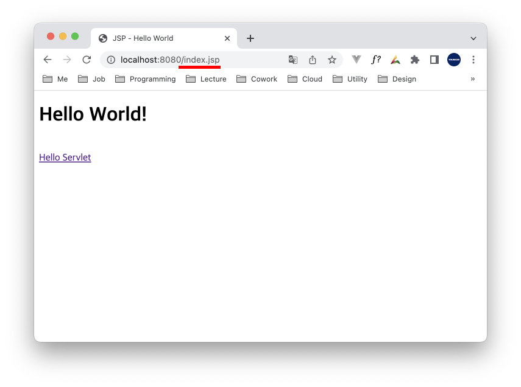
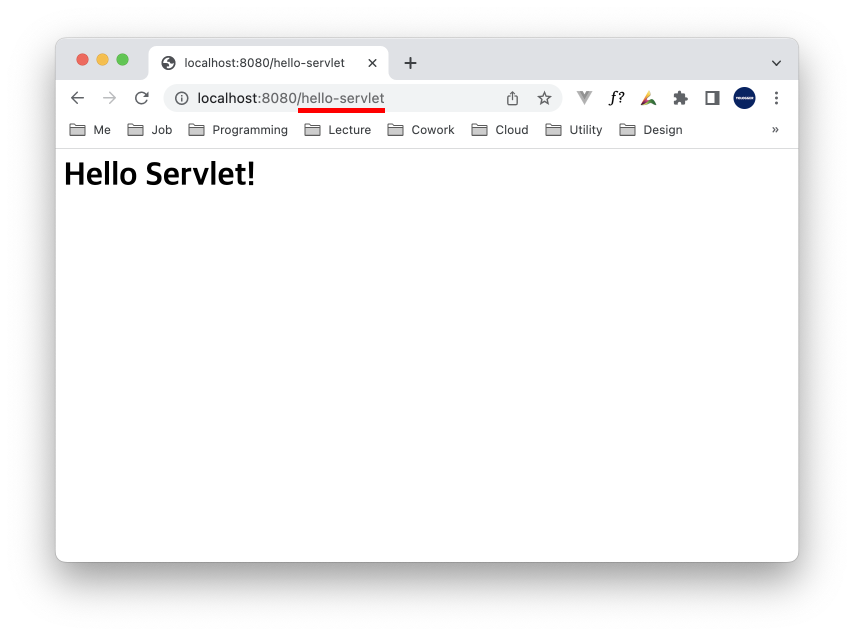

# Table of Contents
[[toc]]

`IntelliJ > New Project`에서 `Java Enterprise`를 선택한다. 그리고 다음과 같이 설정한 후 `NEXT` 버튼을 클릭한다.

`Specifications > Servlet`을 선택한 후 `CREATE` 버튼을 누른다.

`Java Web Application`의 구조가 생성된다.

`src/main/java`에는 서블릿 클래스가 위치한다.

`src/main/webapp`에는 JSP 파일이 위치한다.

이제 기본적인 설정을 하자. `Edit Configurations`를 클릭한다.

`Deployment`탭에서 `Application context`를 적절하게 설정한다.

이제 애플리케이션을 실행해보자.

