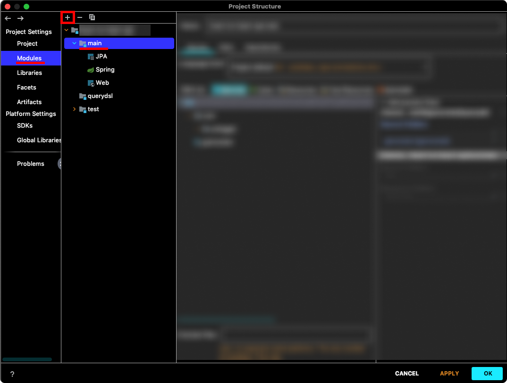
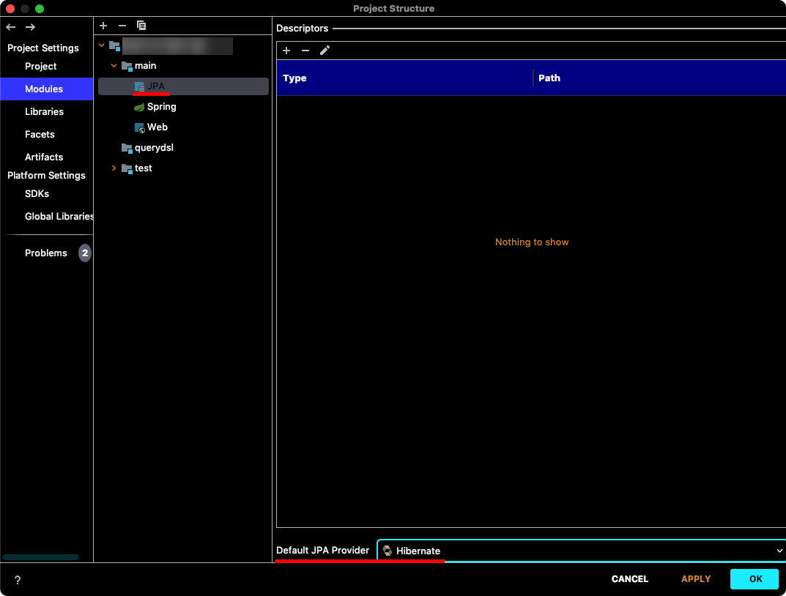
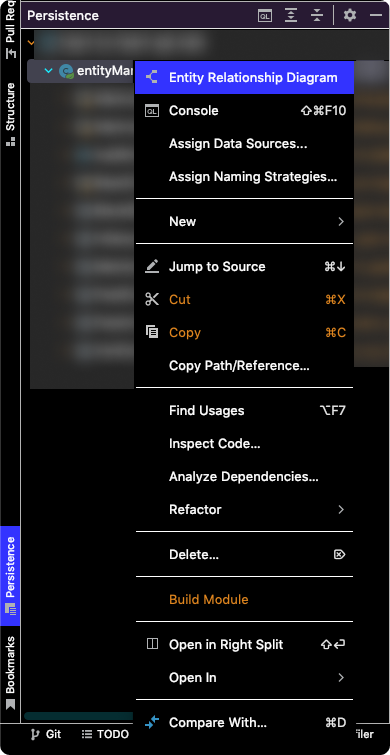
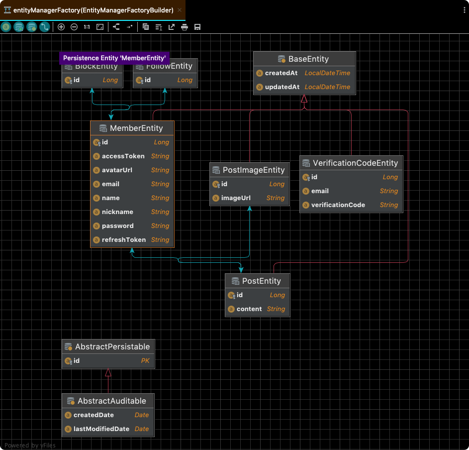

# InteliJ에서 JPA Entity ERD 확인하기
`IntelliJ > File > Project Structure`를 클릭한다. 그리고 `Project Settings > Modules`에서 프로젝트의 `main`을 선택한 후 `+` 버튼을 클릭한다.

`JPA`를 추가한 후 `JPA Default Provider`를 `Hibernate`로 선택한다.

`View > Tools Windows > Persistence`를 클릭하면 IntellJ 왼쪽 하단에 `Persistence` 탭이 생성된다. 여기서 `entityManagerFactory`를 우클릭 한 후 `ER Diagram`을 클릭하면 엔티티 연관관계가 그려진 ER Diagram을 확인할 수 있다.

