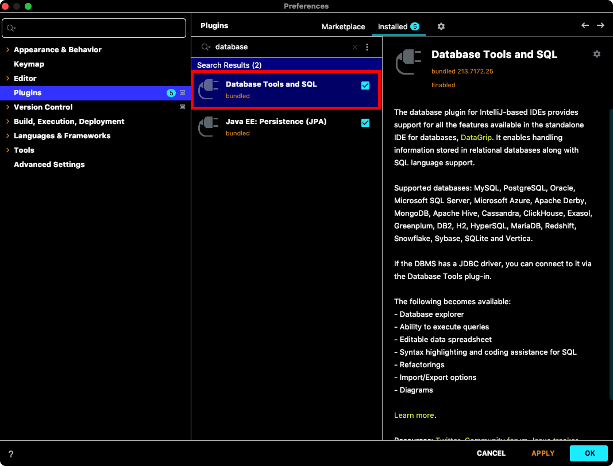
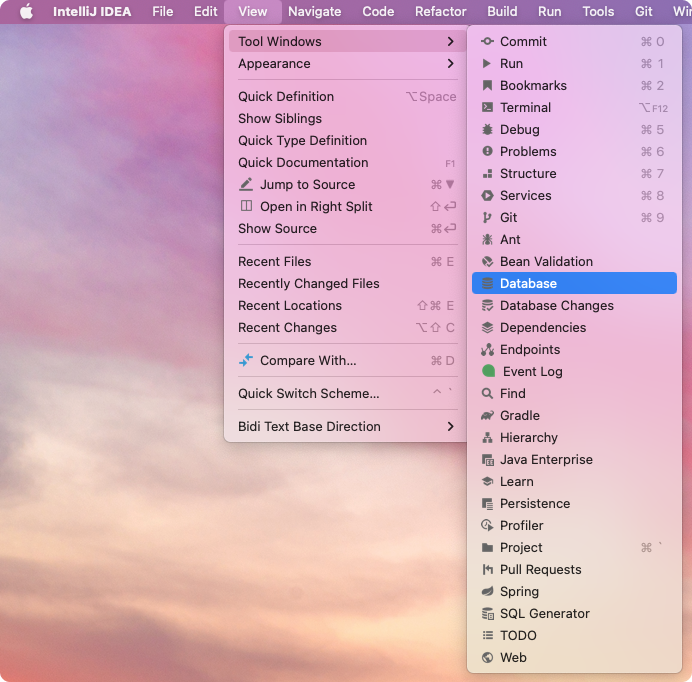
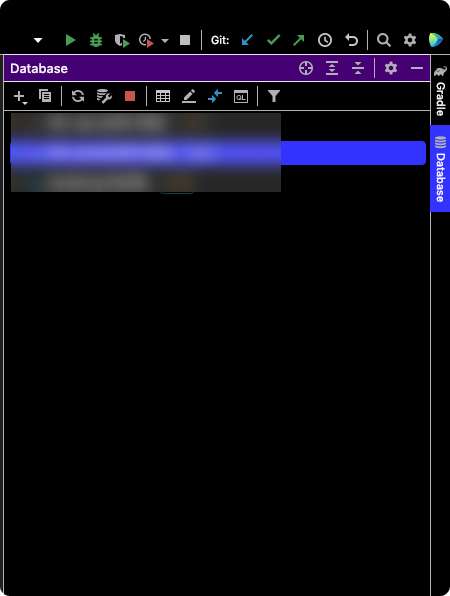
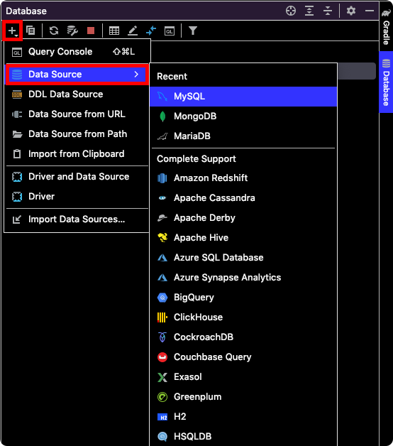
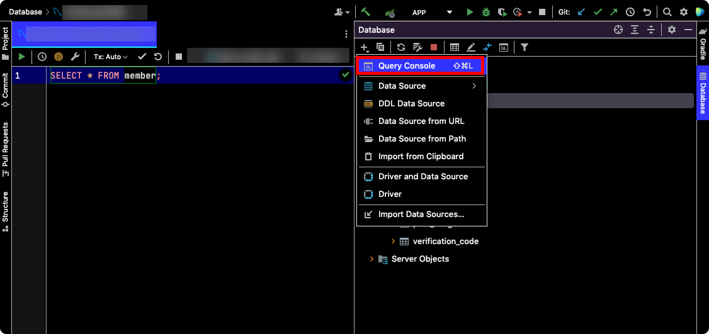
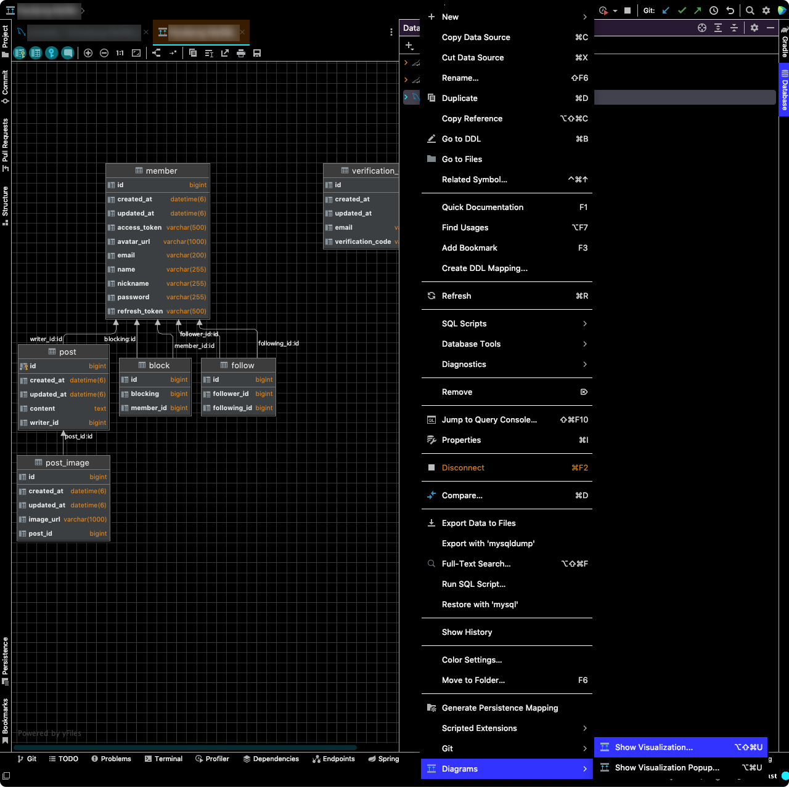

# IntelliJ에서 Database Tool 사용하기

`IntelliJ > Prefrences > Plugins`에서 `Database Tools and SQL` 플러그인을 설치한다.

`IntelliJ > View > Tool Windows`에서 `Database`를 클릭한다.

IntellJ 오른쪽에 `Database` 탭이 활성화된다.

`+` 버튼을 클릭한 후 `Data Source`에서 원하는 데이터베이스를 추가할 수 있다. 데이터베이스가 연결되면 테이블 등 다양한 스키마 정보를 확인할 수 있다.

`+` 버튼을 클릭한 후 `Query Console`을 클릭하면 쿼리를 작성할 수 있는 새로운 창이 열린다. 이 곳에서 다양한 쿼리를 실행해볼 수 있다.

`테이블 선택 후 우클릭 > SQL Scripts > SQL Generator`를 클릭하면 DDL을 추출할 수도 있다.

`테이블 선택 후 우클릭 > Diagrams > Sho Visualization`을 클릭하면 ER Diagram도 확인할 수 있다.

