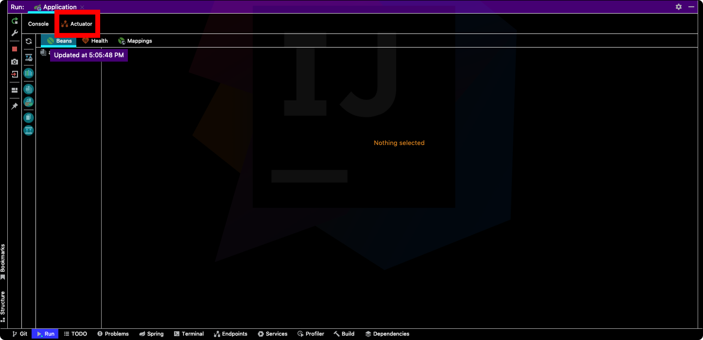

# Spring Actuator
`Spring Actuator`를 사용하면 스프링 부트 어플리케이션의 상태를 모니터링할 수 있다.

## 의존성 설정
``` groovy
dependencies {
	implementation "org.springframework.boot:spring-boot-starter-actuator"
}
```

## 사용법
`Spring Actuator`는 엔드포인트에 HTTP 요청을 보내서 어플리케이션 상태 정보를 받아볼 수 있다. `localhost:8080/actuator`로 접근하면 `Spring Actuator`가 외부로 노출하는 엔드포인트를 확인할 수 있으며, 기본 설정은 다음과 같다.

``` json
{
    "_links": {
        "self": {
            "href": "http://localhost:8080/actuator",
            "templated": false
        },
        "health": {
            "href": "http://localhost:8080/actuator/health",
            "templated": false
        },
        "health-path": {
            "href": "http://localhost:8080/actuator/health/{*path}",
            "templated": true
        },
        "info": {
            "href": "http://localhost:8080/actuator/info",
            "templated": false
        }
    }
} 
```
`"http://localhost:8080/actuator/health"`로 접근하면 어플리케이션이 구동 중인지 확인할 수 있다.
``` json
{
    "status": "UP"
}
```

## 엔드포인트 노출 관리
`application.properties`를 다음과 같이 설정하면 모든 엔드포인트를 외부로 노출할 수 있다.
``` properties
management.endpoints.web.exposure.include=*
```
다시 한 번 `localhost:8080/actuator`로 접근해보자. 외부로 노출되는 엔드포인트가 늘어난 것을 확인할 수 있다.
``` json
{
    "_links": {
        "self": {
            "href": "http://localhost:8080/actuator",
            "templated": false
        },
        "beans": {
            "href": "http://localhost:8080/actuator/beans",
            "templated": false
        },
        "caches": {
            "href": "http://localhost:8080/actuator/caches",
            "templated": false
        },
        "caches-cache": {
            "href": "http://localhost:8080/actuator/caches/{cache}",
            "templated": true
        },
        "health-path": {
            "href": "http://localhost:8080/actuator/health/{*path}",
            "templated": true
        },
        "health": {
            "href": "http://localhost:8080/actuator/health",
            "templated": false
        },
        "info": {
            "href": "http://localhost:8080/actuator/info",
            "templated": false
        },
        "conditions": {
            "href": "http://localhost:8080/actuator/conditions",
            "templated": false
        },
        "configprops": {
            "href": "http://localhost:8080/actuator/configprops",
            "templated": false
        },
        "env-toMatch": {
            "href": "http://localhost:8080/actuator/env/{toMatch}",
            "templated": true
        },
        "env": {
            "href": "http://localhost:8080/actuator/env",
            "templated": false
        },
        "loggers-name": {
            "href": "http://localhost:8080/actuator/loggers/{name}",
            "templated": true
        },
        "loggers": {
            "href": "http://localhost:8080/actuator/loggers",
            "templated": false
        },
        "heapdump": {
            "href": "http://localhost:8080/actuator/heapdump",
            "templated": false
        },
        "threaddump": {
            "href": "http://localhost:8080/actuator/threaddump",
            "templated": false
        },
        "metrics": {
            "href": "http://localhost:8080/actuator/metrics",
            "templated": false
        },
        "metrics-requiredMetricName": {
            "href": "http://localhost:8080/actuator/metrics/{requiredMetricName}",
            "templated": true
        },
        "scheduledtasks": {
            "href": "http://localhost:8080/actuator/scheduledtasks",
            "templated": false
        },
        "mappings": {
            "href": "http://localhost:8080/actuator/mappings",
            "templated": false
        }
    }
}
```

자주 사용하는 엔드포인트는 다음과 같다.
|경로|설명|
|------|---|
|`/beans`|컨테이너에서 관리되는 모든 빈을 표시한다.|
|`/env`|활성화된 Profile, Property 등을 확인할 수 있다.|
|`/health`|어플리케이션의 상태를 확인할 수 있다.|
|`/info`|애플리케이션의 정보를 확인할 수 있다.|
|`/loggers`|로깅 설정과 관련된 정보를 확인할 수 있다.|
|`/metrics`|메모리 사용량, CPU 정보, 스레드 수 같은 통계 정보를 확인할 수 있다.|
|`/mappings`|엔드포인트 URL Mapping을 확인할 수 있다.|

다음과 같이 일부 엔드포인트만 노출할 수 있다.
``` properties {}
management.endpoints.web.exposure.include=env,beans
```

다음과 같이 일부 엔드포인트는 차단할 수도 있다.
``` properties {2}
management.endpoints.web.exposure.include=*
management.endpoints.web.exposure.exclude=env,beans
```

## IntelliJ와 Actuator
`IntelliJ`를 사용한다면 애플리케이션을 구동했을 때 다음과 같이 `actuator` 탭이 활성화된다.



`actuator`의 `Beans` 탭에서 컨테이너에서 관리되는 모든 빈을 확인할 수 있다.


`actuator`의 `Health` 탭에서 어플리케이션의 상태를 확인할 수 있다. 


`actuator`의 `Mapping` 탭에서 어플리케이션의 엔드포인트를 확인할 수 있으며, HTTP 요청을 보낼 수도 있다.


