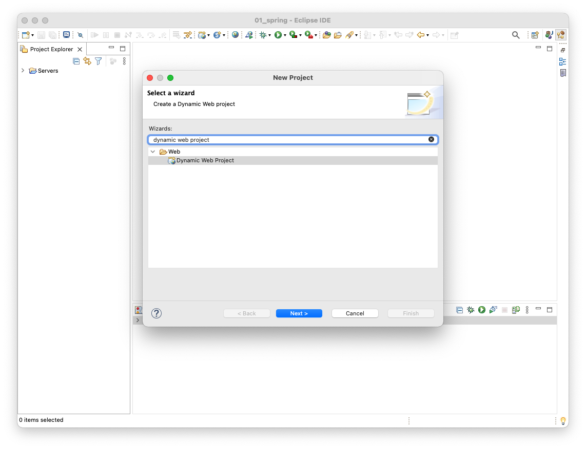
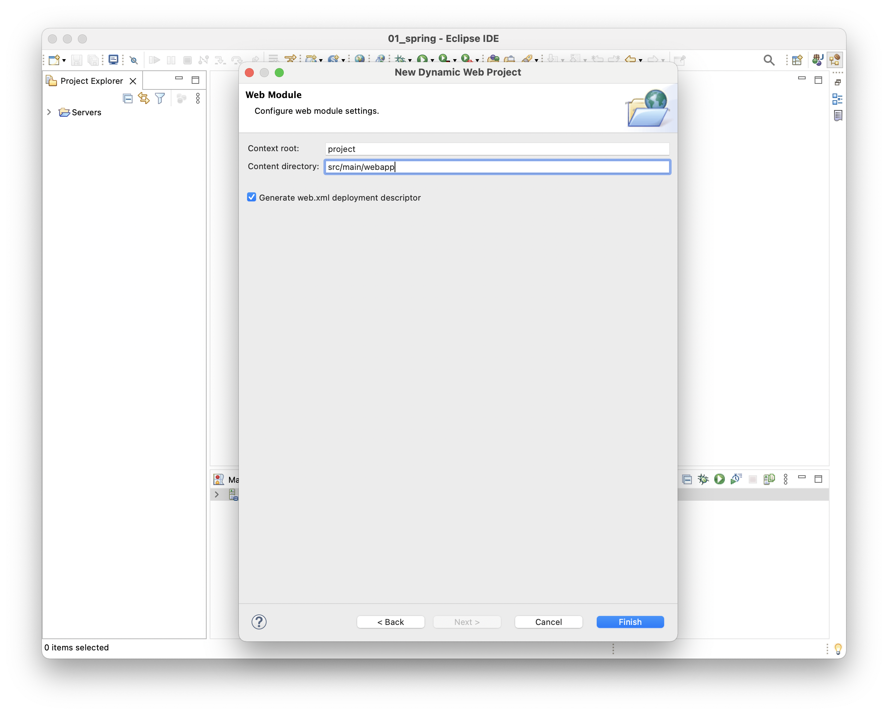

# Maven 기반의 Java Web Application 구성하기

Eclipse에서 `New Project`를 클릭하고 `Dynamic Web Project`를 선택한다.

`Project name`, `Location` 등의 프로젝트 정보를 입력한다. `Target runtime`에는 프로젝트를 배치할 `Tomcat`을 지정한다.

소스코드 디렉토리와 빌드 결과물을 저장할 디랙토리를 지정하고 Finish 버튼을 누른다. 

`Context root`와 `Content directory`를 지정한다. 그리고 `Generate web.xml deployment descriptor`를 선택한다.

다음과 같은 구조로 프로젝트가 생성된다.

`프로젝트 우클릭 > Run As > Run on Server`을 선택한다.

프로젝트를 배치할 `Tomcat`을 지정하고 `Next >`버튼을 클릭한다.

`Configured`항목에는 배치된 프로젝트를 의미하며, `Available`항목에는 배치할 수 있는 프로젝트를 의미한다. 프로젝트를 `Available`항목으로 이동시키고 `Finish`버튼을 클릭한다.

이제 웹 브라우저에서 웹 애플리케이션에 접속할 수 있다.