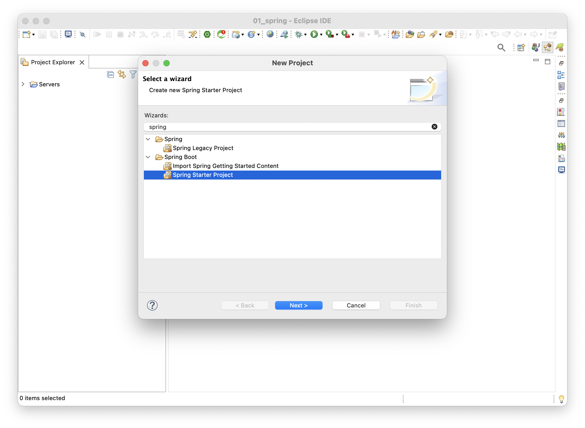
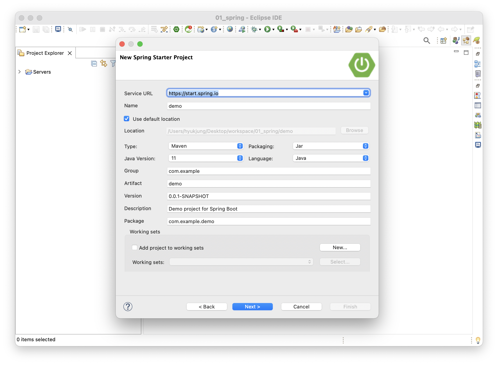
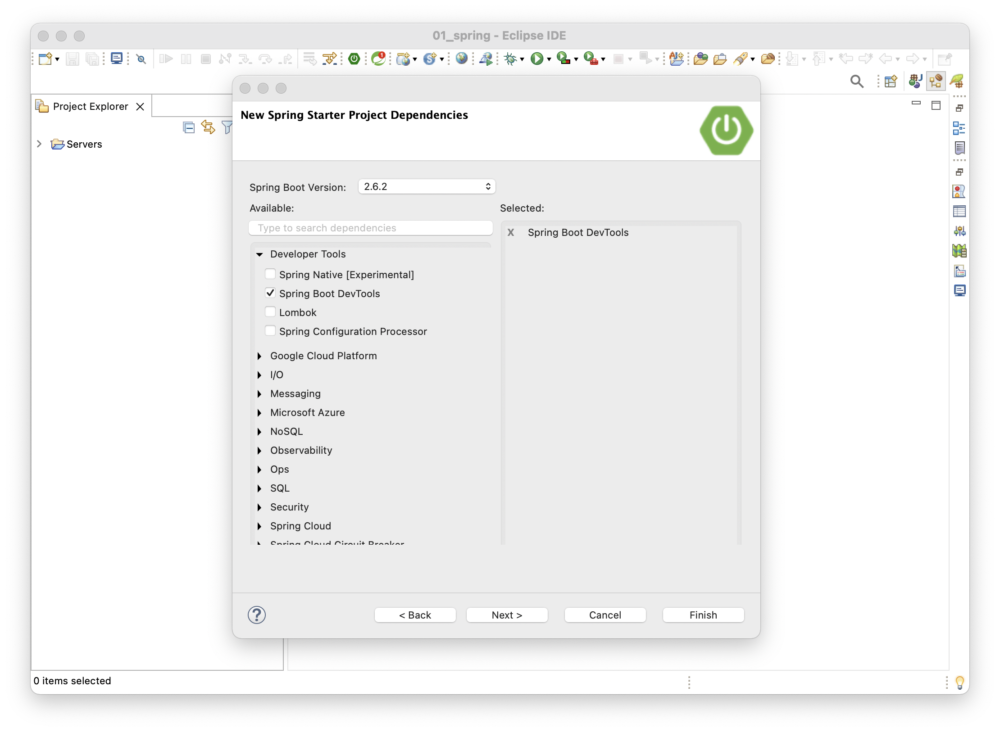

# Maven 기반의 Spring Boot Project 구성하기

Eclipse 환경에서는 `STS(Spring Tool Suite)`을 설치하여 Spring 프로젝트를 쉽게 구성할 수 있다. `Eclipse > Help > Eclipse Marketplace`로 이동한다. 그리고 검색창에 STS를 입력하고 적절한 버전을 설치한다. 이 포스트에서는 `STS 3`을 사용한다.

`Eclipse > File > New > Project`로 이동하여 spring을 검색한다. 그리고 `Spring Starter Project`를 선택하고 `Next >`버튼을 누른다.

`New Spring Starter Project` 화면에서 프로젝트의 구성정보를 입력하고 `Next >`버튼을 클릭한다.

이제 프로젝트에 필요한 의존성들을 추가하면 된다.
