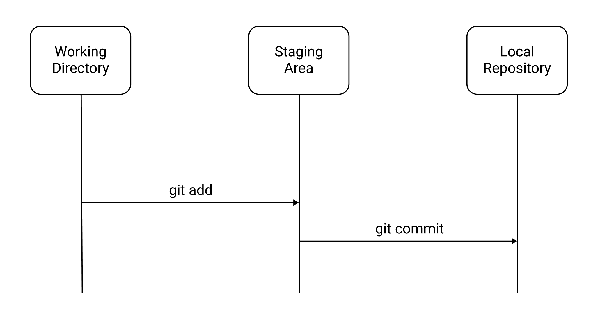
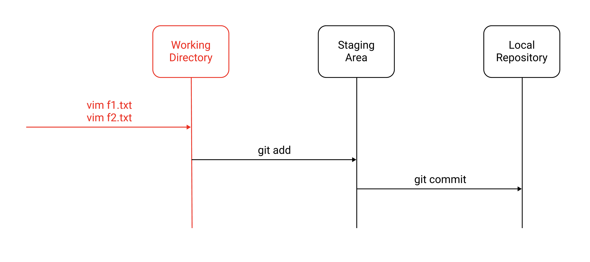
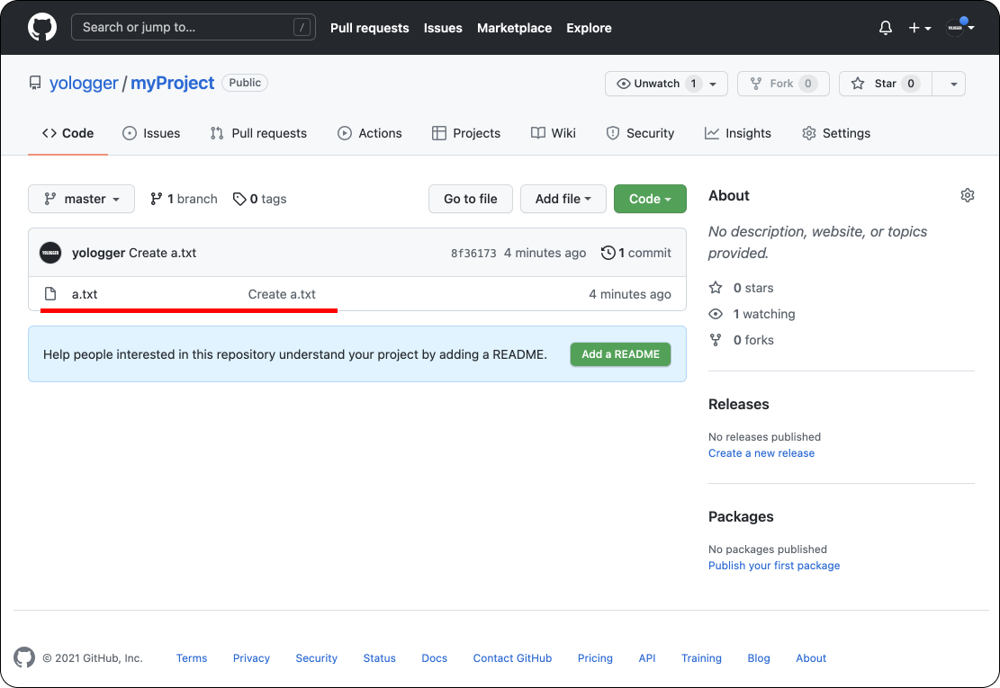

# Table of Contents
[[toc]]


# Git
`Git`은 버전 관리 시스템이다. Git을 사용하면 프로젝트의 변경사항을 쉽게 추적할 수 있다.

## Git 설치 및 설정
MacOS 환경에서는 Homebrew로 Git을 쉽게 설치할 수 있다.
``` shellsession
$ brew install git
```
버전을 확인해보자.
``` 
$ git --version
git version 2.30.1
```

설치되면 계정의 이름과 이메일을 설정해야한다.
``` shellsession
$ git config --global user.name "yologger"
$ git config --global user.email "yologger1013@gmail.com"
```

`git config`명령어로 모든 설정을 확인할 수 있다.
``` shellsession
$ git config --list
user.name=yologger
user.email=yologger1013@gmail.com
...
```

## 프로젝트 초기화
`git init`명령어로 프로젝트를 초기화한다.
``` shellsession
// 프로젝트 생성
$ mkdir myProject

// 프로젝트로 이동
$ cd myProject

// 프로젝트 초기화
$ git init
```
`git init`으로 프로젝트를 초기화하면 `.git`디렉토리가 생성된다. Git이 이 디렉토리를 관리한다는 의미며, 버전 관리에 필요한 데이터들이 이 곳에 저장된다.
``` shellsession{5}
$ ls -al
total 0
drwxr-xr-x   3 yologger  staff   96 Dec 20 14:45 .
drwx------@ 10 yologger  staff  320 Dec 20 14:42 ..
drwxr-xr-x   9 yologger  staff  288 Dec 20 14:45 .git
```

## git add, git commit

Git은 보통 다음과 같은 단계로 이루어진다.

예제로 이 단계를 살펴보자.

### 파일 생성
우선 `f1.txt`파일을 생성하자.
``` shellsession
$ vim f1.txt
```
```
// f1.txt
source: 1
```
`git status`명령어로 상태를 확인할 수 있다.
``` shellsession{6,9}
$ git status
On branch master

No commits yet

Untracked files:
    (use "git add <file>..." to include in what will be committed)

    f1.txt

nothing added to commit but untracked files present (use "git add" to track)
```
`Untracked files`에서 `f1.txt`을 확인할 수 있다. 파일이 Working Directory에 추가되었으나 Git이 아직 추적하고 있지 않고있다는 의미다.

### git add
Git이 파일을 추적하도록 하는 것을 `Staging`이라고 한다. `git add`명령어를 사용한다.
``` shellsession
$ git add f1.txt
```
다시 상태를 확인해보자.
``` shellsession{6,9}
$ git status
On branch master

No commits yet

Changes to be committed:
    (use "git rm --cached <file>..." to unstage)

    new file:   f1.txt
```
`f1.txt`파일이 `Untracked files`에서 `Changes to be committed`로 이동했다. 이제 Git이 이 파일을 추적하고 있다.

Working Directory의 모든 파일을 Staging 하려면 `-A`옵션을 추가한다.
``` shellsession
$ git add -A
```

물론 Staging을 취소할 수도 있다.
``` shellsession
$ git rm --cached f1.txt
```

### git commit
`git commit`명령어는 현재 상태를 Local Repository에 저장한다.
``` shellsession
$ git commit 
```
이때 Commit Message를 적어준다.
``` shellsession
First Commit	
```
명령어를 입력하면서 Commit Message를 함께 전달할 수도 있다. 옵션 `-m`을 사용하면 된다.
``` shellsession
$ git commit -m "First Commit"
```
`-am`옵션을 사용하면 `git add`와 `git commit`을 한꺼번에 할 수 있다.
``` shellsession
$ git commit -am "First Commit"
```
`git log`명령어로 Commit 내역을 확인할 수 있다.
``` shellsession
$ git log
commit 11111 (HEAD -> master)
Author: yologger <yologger1013@gmail.com>
Date:   Mon Dec 20 15:16:14 2021 +0900

    First Commit
```
위 결과물에서 `11111`을 `Commit ID`라고 한다. 위 예제에서는 알아보기 쉽게 `11111`로 작성했으나 실제로는 `3bc844016976f5a38bdd669dbf83c12b53318d47`처럼 알아보기 어려운 형태로 생성된다.

### 새로운 파일 추가
이제 `f2.txt`파일을 생성해보자.
``` shellsession
$ vim f2.txt
```
``` 
// f2.txt
source: 2
```
상태를 확인해보자.
``` shellsession{6,9}
$ git status
'On branch master

No commits yet

Untracked files:
    (use "git add <file>..." to include in what will be committed)

    f1.txt

nothing added to commit but untracked files present (use "git add" to track)
```
그 다음 Staging 한다.
``` shellsession
$ git add f2.txt
``` 
상태를 확인하자.
``` shellsession {6,9}
$ git status
On branch master

No commits yet

Changes to be committed:
    (use "git rm --cached <file>..." to unstage)

    new file:   f2.txt
```
두 번째 Commit을 하자.
``` shellsession
$ git commit -m "Second Commit"
```
로그를 확인해보자. 두 번째 Commit이 추가되었다.
``` shellsession {2-6}
$ git log
commit 22222 (HEAD -> master)
Author: yologger <yologger1013@gmail.com>
Date:   Mon Dec 20 15:24:45 2021 +0900

    Second Commit

commit 11111
Author: yologger <yologger1013@gmail.com>
Date:   Mon Dec 20 15:16:14 2021 +0900

    First Commit
```

### 왜 commit 전에 add를 할까?
선택적으로 Commit을 하기 위해서다. 예제를 살펴보자.

우선 `f1.txt`와 `f2.txt`를 생성하자. 파일을 디렉토리에 추가하면 Working Directory에서 관리된다.
```shellsession
$ vim f1.txt
$ vim f2.txt 
```

```shellsession{6,9,10}
$ git status
On branch master

No commits yet

Untracked files:
    (use "git add <file>..." to include in what will be committed)

    f1.txt
    f2.txt

nothing added to commit but untracked files present (use "git add" to track)
``` 
이제 `f1.txt`만 Staging 하자.
``` shellsession
$ git add f1.txt
```

상태를 확인해보자. `f1.txt`만 추적되고 `f2.txt`는 추적되지 않는 것을 확인할 수 있다.
``` shellsession{6,9,11,14}
$ git status
On branch master

No commits yet

Changes to be committed:
    (use "git rm --cached <file>..." to unstage)

    new file:   f1.txt

Untracked files:
    (use "git add <file>..." to include in what will be committed)

    f2.txt

```
이제 Commit을 하자
``` shellsession
$ git commit -m "First Commit"
```

로그도 확인해보자
```shellsession
$ git log
commit 11111 (HEAD -> master)
Author: yologger <yologger1013@gmail.com>
Date:   Mon Dec 20 15:43:16 2021 +0900

    First Commit
```
다시 상태를 확인해보자. `f2.txt`는 여전히 추적되지 않는 것을 확인할 수 있다.
``` shellsession{4,7}
$ git status
On branch master

Untracked files:
    (use "git add <file>..." to include in what will be committed)

    f2.txt
```

## git diff

`git diff`명령어를 사용하면 두 Commit의 차이점을 비교할 수 있다. 우선 다음과 같이 `hello.kt`를 작성하고 첫 번째 Commit을 해보자.
``` kotlin{3}
// Hello.kt
fun printHello() {
    print("Hello")
}
```
``` shellsession
$ git commit -am "First Commit"
```
이제 `hello.kt`를 수정하고 두 번째 Commit을 한다.
``` kotlin {3}
// Hello.kt
fun printGoodbye() {
    print("Goodbye")
}
```
``` shellsession
$ git commit -am "Second Commit"
```
로그는 다음과 같다.
``` shellsession
$ git log
commit 22222 (HEAD -> master)
Author: yologger <yologger1013@gmail.com>
Date:   Mon Dec 20 20:53:10 2021 +0900

    Second Commit

commit 11111
Author: yologger <yologger1013@gmail.com>
Date:   Mon Dec 20 20:52:08 2021 +0900

    First Commit
```
이제 두 Commit의 차이점을 비교해보자. `git diff`는 다음과 같은 형태로 사용한다.
``` shellsession
// git diff <commit_a_id>..<commit_b_id>
$ git diff 11111..22222
```
결과는 다음과 같다.
```
diff --git a/hello.kt b/hello.kt
index 11111..22222
--- a/hello.kt
+++ b/hello.kt
@@ -1,3 +1,3 @@
-fun printHello() {
-       print("Hello")
+fun printGoodbye() {
+       print("Goodbye")
 }
```
결과를 살펴보자. `fun printHello() {`와 `print("Hello")`가 삭제되었고 `fun printGoodbye() {`와 `print("Goodbye")`가 추가된 것을 확인할 수 있다.

## git rm
`git rm`은 Working Directory와 Staging Area에서 파일을 삭제한다.

예제를 살펴보자. 첫 번째 Commit에 `a.txt`를, 두 번째 Commit에 `b.txt`를 추가했다.
``` shellsession
$ git log
commit 22222 (HEAD -> master)
Author: yologger <yologger1013@gmail.com>
Date:   Mon Dec 20 19:28:26 2021 +0900

    Add b.txt

commit 11111
Author: yologger <yologger1013@gmail.com>
Date:   Mon Dec 20 19:28:02 2021 +0900

    Add a.txt
```
``` shellsession
$ ls
a.txt   b.txt
```
이제 `git rm`명령어로 `b.txt`를 삭제해보자.
``` shellsession
$ git rm b.txt
rm 'b.txt'
``` 
디렉토리에서 `b.txt`가 삭제되었다.
``` shellsession
$ ls
a.txt
```
물론 Local Repository에 반영하려면 새롭게 Commit 해야한다.
``` shellsession
$ git commit -m 'Remove b.txt'
```

`--cached` 옵션을 사용하면 Staging Area에서만 삭제하고 Working Directory에는 파일을 유지한다.
``` shellsession
$ git rm --cached b.txt
rm 'b.txt'
``` 
파일이 Staging Area에서만 삭제되었기 때문에 Working Directory에는 그대로 있다.
``` shellsession
$ ls
a.txt   b.txt
```
Staging Area에서는 삭제되었으므로 Untracked Files에 포함되어있다.
``` shellsession{7,9}
$ git status
현재 브랜치 master
커밋할 변경 사항:
  (use "git restore --staged <file>..." to unstage)
	삭제함: b.txt

추적하지 않는 파일:
  (커밋할 사항에 포함하려면 "git add <파일>..."을 사용하십시오)
	b.txt
```

## git clean
`git clean`은 추적되지 않는 파일을 제거한다.

`a.txt`, `b.txt`를 생성해보자.
``` shellsession
$ touch a.txt
$ touch b.txt
``` 
`a.txt`만 추적해보자.
``` shellsession
$ git add a.txt
```
상태를 확인해보자. `b.txt`는 추적되지 않는 것을 확인할 수 있다.
``` shellsession{11,14}
$ git status
On branch master

No commits yet

Changes to be committed:
    (use "git rm --cached <file>..." to unstage)

    new file:   a.txt

Untracked files:
    (use "git add <file>..." to include in what will be committed)

    b.txt
```
`git clean`명령어로 추적되지 않는 파일을 삭제하자.
``` shellsession
$ git clean
```
다음과 같은 에러가 발생한다. `git clean`명령어로 삭제한 파일은 다시 복구할 수 없기 때문에 신중하게 실행하라는 의미다.
``` 
fatal: clean.requireForce defaults to true and neither -i, -n, nor -f given; refusing to clean
``` 
따라서 `-f`옵션을 추가하여 삭제해야한다.
``` shellsession
$ git clean -f
```
파일을 삭제하기 전, `-n` 옵션으로 삭제될 파일을 미리 확인할 수 있다.
``` shellsession
$ git clean -n
b.txt 삭제할 예정
```

## git reset
`git reset --hard`명령어를 사용하면 Commit을 취소할 수 있다. 초기 상태는 다음과 같다고 가정하자.
``` shellsession
$ git log
commit 4444444 (HEAD -> master)
Author: yologger <yologger1013@gmail.com>
Date:   Sat Dec 18 18:30:39 2021 +0900

    4

commit 3333333
Author: yologger <yologger1013@gmail.com>
Date:   Sat Dec 18 18:30:18 2021 +0900

    3

commit 2222222
Author: yologger <yologger1013@gmail.com>
Date:   Sat Dec 18 18:29:43 2021 +0900

    2

commit 1111111
Author: yologger <yologger1013@gmail.com>
Date:   Sat Dec 18 18:29:19 2021 +0900

    1

```

이제 3, 4를 삭제하면서 2로 이동해보자.


``` shellsession
// 3, 4 삭제하면서 2로 이동
$ git reset 2222222 --hard
HEAD is now at 2222222
```
결과는 다음과 같다.
``` shellsession
$ git log
commit 2222222
Author: yologger <yologger1013@gmail.com>
Date:   Sat Dec 18 18:29:43 2021 +0900

    2

commit 1111111
Author: yologger <yologger1013@gmail.com>
Date:   Sat Dec 18 18:29:19 2021 +0900

    1

```
1단계 이전으로 돌아가려면 다음과 같이 입력하면 된다.
``` shellsession
$ git reset --hard HEAD~1
```
2단계 이전으로 돌아가려면 다음과 같이 입력하면 된다.
``` shellsession
$ git reset --hard HEAD~2
```
참고로 `git reset`에 `--soft`, `--mixed`, `--hard` 옵션을 추가할 수 있다.
### (1) soft
Commit을 취소하지만 파일은 추적되는 상태로 변경한다.

첫 상태가 다음과 같다고 가정하자.
``` shellsession
$ git log
commit 2222222 (HEAD -> master)
Author: yologger <yologger1013@gmail.com>
Date:   Mon Dec 20 16:59:24 2021 +0900

    Add b.txt

commit 1111111
Author: yologger <yologger1013@gmail.com>
Date:   Mon Dec 20 16:55:06 2021 +0900

    Add a.txt
```
`--soft` 옵션으로 `git reset`을 실행하자.
``` shellsession
$ git reset --soft HEAD~1
```
로그를 확인해보자. Commit Id 2222222이 삭제되었다.
``` shellsession
$ git log
commit 1111111 (HEAD -> master)
Author: yologger <yologger1013@gmail.com>
Date:   Mon Dec 20 16:55:06 2021 +0900

    Add a.txt

```
상태를 확인해보자. Commit은 취소되었으나 `b.txt`파일은 추적되는 상태다.
``` shellsession{4,7}
$ git status
On branch master

Changes to be committed:
    (use "git rm --cached <file>..." to unstage)

    new file:   b.txt
```
즉 Commit은 취소되었으나 `b.txt`파일은 삭제되지 않았다.
``` shellsession
$ ls
b.txt
```

### (2) mixed
Commit을 취소하고 파일은 추적되지 않는 상태로 변경한다.

첫 상태가 다음과 같다고 가정하자.
``` shellsession
$ git log
commit 2222222 (HEAD -> master)
Author: yologger <yologger1013@gmail.com>
Date:   Mon Dec 20 16:59:24 2021 +0900

    Add b.txt

commit 1111111
Author: yologger <yologger1013@gmail.com>
Date:   Mon Dec 20 16:55:06 2021 +0900

    Add a.txt
```
`--mixed` 옵션으로 `git reset`을 실행하자
``` shellsession
$ git reset --mixed HEAD~1
```
로그를 확인해보자. Commit Id 2222222이 삭제되었다.
``` shellsession
$ git log
commit 1111111 (HEAD -> master)
Author: yologger <yologger1013@gmail.com>
Date:   Mon Dec 20 16:55:06 2021 +0900

    Add a.txt

``` 
상태를 확인해보자. Commit은 취소되었고 `b.txt`파일은 추적되지 않는 상태다.
``` shellsession {4,7}
$ git status
On branch master

Untracked files:
    (use "git add <file>..." to include in what will be committed)

    b.txt
```
역시 Commit은 취소되었으나 `b.txt`파일은 삭제되지 않았다.
``` shellsession
$ ls
b.txt
```

### (3) hard
Commit을 취소하고 파일도 삭제한다.

첫 상태가 다음과 같다고 가정하자.
``` shellsession
$ git log
commit 2222222 (HEAD -> master)
Author: yologger <yologger1013@gmail.com>
Date:   Mon Dec 20 16:59:24 2021 +0900

    Add b.txt

commit 1111111
Author: yologger <yologger1013@gmail.com>
Date:   Mon Dec 20 16:55:06 2021 +0900

    Add a.txt
```
`--hard` 옵션으로 `git reset`을 실행하자
``` shellsession
$ git reset --hard HEAD~1
```
로그를 확인해보자. Commit Id 2222222이 삭제되었다.
``` shellsession
$ git log
commit 1111111 (HEAD -> master)
Author: yologger <yologger1013@gmail.com>
Date:   Mon Dec 20 16:55:06 2021 +0900

    Add a.txt

```
Commit은 취소되었고 `b.txt`파일도 삭제되었다.
``` shellsession
$ ls
b.txt
```

### git commit 하지 않은 변경사항 모두 삭제
```
$ git reset --hard
```

## git revert
`git revert`는 특정 Commit을 취소한다. 다만 `git reset`처럼 Commit을 아예 삭제하는 게 아니라 새로운 Commit을 추가하는 형태로 이전 Commit을 취소한다.

예를 들어보자. 디렉토리에는 네 개의 파일이 있다.
``` shellsession
$ ls
a.txt 
b.txt 
c.txt 
d.txt
```
현재 Commit 상태는 다음과 같다.
``` shellsession
$ git log
commit 4444444 (HEAD -> master)
Author: yologger <yologger1013@gmail.com>
Date:   Mon Dec 20 16:23:48 2021 +0900

    Add d.txt

commit 3333333
Author: yologger <yologger1013@gmail.com>
Date:   Mon Dec 20 16:23:17 2021 +0900

    Add c.txt

commit 2222222
Author: yologger <yologger1013@gmail.com>
Date:   Mon Dec 20 16:22:55 2021 +0900

    Add b.txt

commit 1111111
Author: yologger <yologger1013@gmail.com>
Date:   Mon Dec 20 16:22:26 2021 +0900

    Add a.txt

```


두 번째 Commit인 2222222로 Revert해보자.
``` shellsession
$ git revert 2222222
Revert "Add b.txt"

This reverts commit 2222222.
```

두 번째 Commit에서 추가한 b.txt가 사라졌다.
``` shellsession
$ ls
a.txt c.txt d.txt
```
로그도 확인해보자.
``` shellsession{2-8}
$ git log
commit 5555555 (HEAD -> master)
Author: yologger <yologger1013@gmail.com>
Date:   Mon Dec 20 16:26:17 2021 +0900

    Revert "Add b.txt"
    
    This reverts commit 2222222.

commit 4444444
Author: yologger <yologger1013@gmail.com>
Date:   Mon Dec 20 16:23:48 2021 +0900

    Add d.txt

commit 3333333
Author: yologger <yologger1013@gmail.com>
Date:   Mon Dec 20 16:23:17 2021 +0900

    Add c.txt

commit 2222222
Author: yologger <yologger1013@gmail.com>
Date:   Mon Dec 20 16:22:55 2021 +0900

    Add b.txt

commit 1111111
Author: yologger <yologger1013@gmail.com>
Date:   Mon Dec 20 16:22:26 2021 +0900

    Add a.txt
```


## git checkout
`git checkout`명령어를 사용하면 특정 Commit으로 `Head`를 이동시킬 수 있다.

예제를 살펴보자. 현재 `master` 브랜치의 Commit 내역은 다음과 같다.
``` shellsession
$ git log
commit 44444 (HEAD -> master)
Author: yologger <yologger1013@gmail.com>
Date:   Tue Oct 5 20:39:01 2021 +0900

    4

commit 33333
Author: yologger <yologger1013@gmail.com>
Date:   Tue Oct 5 20:38:45 2021 +0900

    3

commit 22222
Author: yologger <yologger1013@gmail.com>
Date:   Tue Oct 5 20:38:25 2021 +0900

    2

commit 11111
Author: yologger <yologger1013@gmail.com>
Date:   Tue Oct 5 20:38:07 2021 +0900

    1

```
브랜치의 <u>가장 최근 Commit</u>에는 <u>브랜치의 이름</u>이 표시된다. 다음 결과는 Commit ID 44444가 가장 최근 Commit이라는 의미다.
``` {1}
commit 44444 (master)
Author: yologger <yologger1013@gmail.com>
Date:   Tue Oct 5 20:39:01 2021 +0900

    4
```
현재 작업 중인 Commit에는 `HEAD`포인터가 표시된다.
``` {1}
commit 44444 (HEAD)
Author: yologger <yologger1013@gmail.com>
Date:   Tue Oct 5 20:39:01 2021 +0900

    4
```
다음 출력 결과는 `master`브랜치의 가장 최근 Commit의 Id가 44444이며, 현재 이 Commit에서 작업 중이라는 의미다.
``` {1}
commit 44444 (HEAD -> master)
Author: yologger <yologger1013@gmail.com>
Date:   Tue Oct 5 20:39:01 2021 +0900

    4
```

이제 `git checkout`명령어와 Commit Id를 이용하여 특정 Commit으로 이동해보자.
``` shellsession
// Commit Id 22222로 Head 이동
$ git checkout 22222
```
``` shellsession{2}
$ git log
commit 22222 (HEAD)
Author: yologger <yologger1013@gmail.com>
Date:   Tue Oct 5 20:38:25 2021 +0900

    2

commit 11111
Author: yologger <yologger1013@gmail.com>
Date:   Tue Oct 5 20:38:07 2021 +0900

    1
```
다시 master 브랜치의 최신 commit으로 Head를 이동시켜보자.
``` shellsession
// git checkout <branch_name>
$ git checkout master
```
``` shellsession {2}
$ git log
commit 44444 (HEAD -> master)
Author: yologger <yologger1013@gmail.com>
Date:   Tue Oct 5 20:39:01 2021 +0900

    4

commit 33333
Author: yologger <yologger1013@gmail.com>
Date:   Tue Oct 5 20:38:45 2021 +0900

    3

commit 22222
Author: yologger <yologger1013@gmail.com>
Date:   Tue Oct 5 20:38:25 2021 +0900

    2

commit 11111
Author: yologger <yologger1013@gmail.com>
Date:   Tue Oct 5 20:38:07 2021 +0900

    1
```

N 단계 이전으로 Head를 옮길 수 있다.

``` shellsession{5}
// 두 단계 이전으로 이동 
$ git checkout HEAD~2

$ git log
commit 22222 (HEAD)
Author: yologger <yologger1013@gmail.com>
Date:   Tue Oct 5 20:38:25 2021 +0900

    2

commit 11111
Author: yologger <yologger1013@gmail.com>
Date:   Tue Oct 5 20:38:07 2021 +0900

    1
```

## git branch

`브랜치(Branch)`를 사용하면 작업 공간을 분기할 수 있다.

우선 초기 상태를 확인해보자.
``` shellsession
$ git log
commit 90a9a879c5b45ae392a6b434a8cb75e823546374 (HEAD -> master)
Author: yologger <yologger1013@gmail.com>
Date:   Tue Oct 5 19:56:29 2021 +0900

    Second commit

commit 6904277d6ff897a2d7e8fac19f2186ab502cd1f1
Author: yologger <yologger1013@gmail.com>
Date:   Tue Oct 5 19:54:44 2021 +0900

    First commit
```
`git branch`명령어로 현재 작업 중인 브랜치를 확인할 수 있다.
``` shellsession {2}
$ git branch
* master
```
새로운 브랜치를 생성해보자. `develop`브랜치를 생성해보자.
``` shellsession
$ git branch develop
```
이제 두 개의 브랜치(`develop`, `master`)가 존재하게되며, 현재 `master`에서 작업하고 있다.
``` shellsession{3}
$ git branch
  develop
* master
```
``` shellsession {2}
$ git log 
commit 90a9a879c5b45ae392a6b434a8cb75e823546374 (HEAD -> master, develop)
Author: yologger <yologger1013@gmail.com>
Date:   Tue Oct 5 19:56:29 2021 +0900

    Second commit

commit 6904277d6ff897a2d7e8fac19f2186ab502cd1f1
Author: yologger <yologger1013@gmail.com>
Date:   Tue Oct 5 19:54:44 2021 +0900

    First commit
```
`git checkout`명령어를 이용하면 브랜치를 이동할 수 있다. `develop`로 이동해보자.
``` shellsession{5}
$ git checkout develop
'develop' 브랜치로 전환합니다

$ git branch
* develop
  master
```
`HEAD`가 `develop`로 이동했다.
``` shellsession{2}
$ git log
commit 90a9a879c5b45ae392a6b434a8cb75e823546374 (HEAD -> develop, master)
Author: yologger <yologger1013@gmail.com>
Date:   Tue Oct 5 19:56:29 2021 +0900

    Second commit

commit 6904277d6ff897a2d7e8fac19f2186ab502cd1f1
Author: yologger <yologger1013@gmail.com>
Date:   Tue Oct 5 19:54:44 2021 +0900

    First commit
```
이제 `develop`브랜치에서 새로운 Commit을 해보자.
``` shellsession{2}
$ git branch
* develop
  master

$ git commit -m "Third commit"
```
로그를 확인해보자.
``` shellsession{2,8}
$ git log
commit f3ecc9c5c0aab5deb00955184b497d44f5175c48 (HEAD -> develop)
Author: yologger <yologger1013@gmail.com>
Date:   Tue Oct 5 20:03:57 2021 +0900

    Third commit

commit 90a9a879c5b45ae392a6b434a8cb75e823546374 (master)
Author: yologger <yologger1013@gmail.com>
Date:   Tue Oct 5 19:56:29 2021 +0900

    Second commit

commit 6904277d6ff897a2d7e8fac19f2186ab502cd1f1
Author: yologger <yologger1013@gmail.com>
Date:   Tue Oct 5 19:54:44 2021 +0900

    First commit
```
다시 `master`로 이동해서 Commit을 해보자.

``` shellsession{5}
$ git checkout master 
'master' 브랜치로 전환합니다

$ git log
commit 90a9a879c5b45ae392a6b434a8cb75e823546374 (HEAD -> master)
Author: yologger <yologger1013@gmail.com>
Date:   Tue Oct 5 19:56:29 2021 +0900

    Second commit

commit 6904277d6ff897a2d7e8fac19f2186ab502cd1f1
Author: yologger <yologger1013@gmail.com>
Date:   Tue Oct 5 19:54:44 2021 +0900

    First commit
```
``` shellsession
$ git commit
Third commit
```
이제 로그를 확인해보자. `git log`명령어에 `--branches`와 `--graph`옵션을 추가하면 시각적으로 브랜치를 확인할 수 있다.
``` shellsession{2,8}
$ git log --branches --graph
* commit 043b07324fb44cdbea4f6ef4539bcb52ad895a4f (HEAD -> master)
| Author: yologger <yologger1013@gmail.com>
| Date:   Tue Oct 5 20:10:27 2021 +0900
| 
|     Third commit
|   
| * commit f3ecc9c5c0aab5deb00955184b497d44f5175c48 (develop)
|/  Author: yologger <yologger1013@gmail.com>
|   Date:   Tue Oct 5 20:03:57 2021 +0900
|   
|       Third commit
| 
* commit 90a9a879c5b45ae392a6b434a8cb75e823546374
| Author: yologger <yologger1013@gmail.com>
| Date:   Tue Oct 5 19:56:29 2021 +0900
| 
|     Second commit
| 
* commit 6904277d6ff897a2d7e8fac19f2186ab502cd1f1
  Author: yologger <yologger1013@gmail.com>
  Date:   Tue Oct 5 19:54:44 2021 +0900
  
      First commit
```

### 브랜치 삭제
`git branch -d <branch_name>` 명령어를 사용하면 브랜치를 삭제할 수 있다.

## git merge
두 개의 브랜치를 합치는 작업을 `Merge`라 한다.

예제를 살펴보자. 초기 상태는 다음과 같다.
``` shellsession
$ git log
commit 49ff46662071c4c4576aac8c0aca98f34058c919 (HEAD -> master)
Author: yologger <yologger1013@gmail.com>
Date:   Mon Dec 20 22:38:48 2021 +0900

    Add a.txt
```
``` text
// a.txt
function do()
```
`develop`브랜치를 생성하고 `a.txt`를 다음과 같이 수정한 후 Commit하자.
``` shellsession
// 브랜치 생성
$ git branch develop

// 브랜치 이동
$ git checkout develop 

 // a.txt 수정
$ vim a.txt
function develop()  // 추가된 부분
function do()

// add & commit
$ git add -A
$ git commit
Update a.txt
: Add function 'develop()'
```
`master`브랜치로 돌아가서 `a.txt`를 다르게 수정한 후 Commit하자.
``` shellsession
// 브랜치 이동
$ git checkout master

// a.txt 수정
$ vim a.txt
function do()
function master()  // 추가된 부분

// add & commit
$ git add -A
$ git commit
Update a.txt
: Add function 'master()'
```
로그를 확인해보자.
``` shellsession{2,9}
$ git log --branches --graph
* commit 9f265d2ef48776f5c9ef53bd6b2f286b52a051aa (HEAD -> master)
| Author: yologger <yologger1013@gmail.com>
| Date:   Mon Dec 20 22:46:14 2021 +0900
| 
|     Update a.txt
|     : Add function 'master()'
|   
| * commit 6ea93029db54ab2d98a81924241395fd3ffd654f (develop)
|/  Author: yologger <yologger1013@gmail.com>
|   Date:   Mon Dec 20 22:44:06 2021 +0900
|   
|       Update a.txt
|       : Add function 'develop()'
| 
* commit 49ff46662071c4c4576aac8c0aca98f34058c919
  Author: yologger <yologger1013@gmail.com>
  Date:   Mon Dec 20 22:38:48 2021 +0900
  
      Add a.txt
```
이제 `develop`을 `master`에 병합해보자. `master`로 이동한 후 다음 명령어를 입력한다.
``` shellsession
// master로 이동
$ git checkout master

// develop을 master에 merge
$ git merge develop
```
로그도 확인해보자. `develop`브랜치가 `master`에 병합되었다.
``` shellsession{2-7}
$ git log --branches --graph
*   commit 1ac36964707e4b6bcf594d864728ce1fc473b5cf (HEAD -> master)
|\  Merge: 9f265d2 6ea9302
| | Author: yologger <yologger1013@gmail.com>
| | Date:   Mon Dec 20 22:48:47 2021 +0900
| | 
| |     Merge branch 'develop'
| | 
| * commit 6ea93029db54ab2d98a81924241395fd3ffd654f (develop)
| | Author: yologger <yologger1013@gmail.com>
| | Date:   Mon Dec 20 22:44:06 2021 +0900
| | 
| |     Update a.txt
| |     : Add function 'develop()'
| | 
* | commit 9f265d2ef48776f5c9ef53bd6b2f286b52a051aa
|/  Author: yologger <yologger1013@gmail.com>
|   Date:   Mon Dec 20 22:46:14 2021 +0900
|   
|       Update a.txt
|       : Add function 'master()'
| 
* commit 49ff46662071c4c4576aac8c0aca98f34058c919
  Author: yologger <yologger1013@gmail.com>
  Date:   Mon Dec 20 22:38:48 2021 +0900
  
      Add a.txt
```
`a.txt`의 내용도 확인해보자. `develop`브랜치의 `a.txt`내용이 추가되었다.
``` text a.txt
function branch()   // branch에서 추가
function do()
function master()   // master에서 추가
```
이제 다 사용한 `develop`브랜치를 삭제하자. `master`브랜치에서 다음 명령어를 실행한다.
``` shellsession
// master로 이동
$ git checkout master

// develop 삭제
$ git branch -d develop
```
`develop`브랜치가 삭제되었는지 로그를 다시 한 번 확인해보자.
``` shellsession
$ git log --branches --graph
*   commit 1ac36964707e4b6bcf594d864728ce1fc473b5cf (HEAD -> master)
|\  Merge: 9f265d2 6ea9302
| | Author: yologger <yologger1013@gmail.com>
| | Date:   Mon Dec 20 22:48:47 2021 +0900
| | 
| |     Merge branch 'develop'
| | 
| * commit 6ea93029db54ab2d98a81924241395fd3ffd654f
| | Author: yologger <yologger1013@gmail.com>
| | Date:   Mon Dec 20 22:44:06 2021 +0900
| | 
| |     Update a.txt
| |     : Add function 'develop()'
| | 
* | commit 9f265d2ef48776f5c9ef53bd6b2f286b52a051aa
|/  Author: yologger <yologger1013@gmail.com>
|   Date:   Mon Dec 20 22:46:14 2021 +0900
|   
|       Update a.txt
|       : Add function 'master()'
| 
* commit 49ff46662071c4c4576aac8c0aca98f34058c919
  Author: yologger <yologger1013@gmail.com>
  Date:   Mon Dec 20 22:38:48 2021 +0900
  
      Add a.txt
```

### Conflict 관리

두 브랜치를 Merge하는 과정에 불일치가 발생할 수 있다. 이를 `Conflict`라고 한다.

예제를 살펴보자. 초기 상태는 다음과 같다.
``` shellsession
$ git log
* commit bbb7ca7cf73c3022b5bcf0df80b922021935780c
  Author: yologger <yologger1013@gmail.com>
  Date:   Mon Dec 20 22:11:40 2021 +0900
  
      Add a.txt
```
``` shellsession
$ ls
a.txt

$ cat a.txt
function do()
```
이제 `develop`브랜치를 만들고 `a.txt`를 다음과 같이 수정한 후 Commit한다.
``` shellsession
$ git branch develop
$ git checkout develop
```
``` shellsession
// a.txt 수정
$ vim a.txt
funtion do(develop)
```
``` shellsession
// Add & Commit
$ git add -A
$ git commit -m "Update a.txt: add parameter 'develop'"
```
`master`브랜치로 돌아와서 `a.txt`를 다음과 같이 수정한 후 Commit한다.
``` shellsession
$ git checkout master
```
``` shellsession
// a.txt 수정
$ vim a.txt
funtion do(master)
```
``` shellsession
// Add & Commit
$ git add -A
$ git commit -m "Update a.txt: add parameter 'master'"
```
이제 로그를 확인해보자
``` shellsession
$ git log --branches --graph
* commit 8a452009b15e4c9cb251c5697c23d94c3b6c64d6 (HEAD -> master)
| Author: yologger <yologger1013@gmail.com>
| Date:   Mon Dec 20 21:53:57 2021 +0900
| 
|     Update a.txt: add parameter 'master'
|   
| * commit 906f9ea289a238eb72b3aead3de918e053f5e3b7 (develop)
|/  Author: yologger <yologger1013@gmail.com>
|   Date:   Mon Dec 20 21:50:41 2021 +0900
|   
|       Update a.txt: add parameter 'develop'
| 
* commit bbb7ca7cf73c3022b5bcf0df80b922021935780c
  Author: yologger <yologger1013@gmail.com>
  Date:   Mon Dec 20 21:47:50 2021 +0900
  
      Add a.txt
```
`master`에서 `develop`을 Merge해보자. `a.txt`에서 Conflict가 발생한다.
``` shellsession
$ git branch
* master
  develop
```
``` shellsession {3,4}
$ git merge develop
Auto-merging a.txt
CONFLICT (content): Merge conflict in a.txt
Automatic merge failed; fix conflicts and then commit the result. 
```
`a.txt`를 열어보면 어디에서 Conflict가 발생했는지 확인할 수 있다.
``` shellsession{3,5}
$ cat a.txt
<<<<<<< HEAD
function do(master)         // Head(master) branch에서의 a.txt
=======
function do(develop)        // develop branch에서의 a.txt
>>>>>>> develop
```
Conflict를 해결하려면 `a.txt`를 직접 수정하고 다시 Commit해야한다. `a.txt`를 다음과 같이 수정하자.
``` text{2}
// a.txt
function(master, develop)
```
다시 Commit해준다.
``` shellsession
$ git add
$ git commit
[master 9384313] Merge branch 'develop'
```
마지막으로 `master`에서 다 사용한 `develop`브랜치를 삭제해주자.
``` shellsession
$ git checkout master
$ git branch -d develop
```
결과를 확인해보자.
``` shellsession{2-7}
$ git log
*   commit 9384313dcb041f1dc73a6862b2bd8de883da4c21 (HEAD -> master)
|\  Merge: 8a45200 906f9ea
| | Author: yologger <yologger1013@gmail.com>
| | Date:   Mon Dec 20 22:02:19 2021 +0900
| | 
| |     Merge branch 'develop'
| | 
| * commit 906f9ea289a238eb72b3aead3de918e053f5e3b7
| | Author: yologger <yologger1013@gmail.com>
| | Date:   Mon Dec 20 21:50:41 2021 +0900
| | 
| |     Update a.txt
| |     : add parameter 'develop'
| | 
* | commit 8a452009b15e4c9cb251c5697c23d94c3b6c64d6
|/  Author: yologger <yologger1013@gmail.com>
|   Date:   Mon Dec 20 21:53:57 2021 +0900
|   
|       Update a.txt:
|       add parameter 'master'
| 
* commit bbb7ca7cf73c3022b5bcf0df80b922021935780c
  Author: yologger <yologger1013@gmail.com>
  Date:   Mon Dec 20 21:47:50 2021 +0900
  
      Add a.txt
```
`a.txt`도 확인해보자. 수정한대로 Merge된 것을 확인할 수 있다.
``` shellsession{2}
$ cat a.txt
function(master, develop)
```

## GitHub
`GitHub`는 원격 분산 버전관리 시스템이다. `Git`과는 다음과 같은 차이가 있다.

|Git|GitHub|
|---|---|
|로컬 저장소에 버전을 관리한다.|원격 저장소에서 버전을 관리한다.|
||여러 개발자가 함께 협업할 수 있다.|

GitHub에서 버전을 관리하는 과정은 다음과 같다.


## GitHub에 원격 저장소 생성하기
GitHub에 소스 코드를 업로드하려면 `원격 저장소(Remote Repository)`를 생성해야한다. [https://github.com/](https://github.com/)에 접속하여 `New` 버튼을 클릭하여 원격 저장소를 생성할 수 있다.


원격 저장소 이름, 설명, 공개 범위를 입력하고 `Create repository`을 누르면 원격 저장소가 생성된다.


원격 저장소가 생성되면 <u>원격 저장소 URL</u>이 생성된다. 원격 저장소에 소스 코드를 업로드할 때 이 URL을 사용한다.


## git remote
`git remote`명령어를 사용하면 로컬 저장소와 원격 저장소 사이의 `연결(Connection)`을 생성할 수 있다.

현재 로컬 저장소의 상태는 다음과 같다고 가정하자.
``` shellsession
$ git log
commit 87e3f71ded76107c3c10abfe176b4ba9064195a9 (HEAD -> master)
Author: yologger <yologger1013@gmail.com>
Date:   Mon Dec 20 18:31:38 2021 +0900

    Add b.txt

commit 41f83d2e830455d23299b86856a3ecf6195d46d4
Author: yologger <yologger1013@gmail.com>
Date:   Mon Dec 20 16:55:06 2021 +0900

    Add a.txt
```
원격 저장소에 파일을 업로드하려면 먼저 `README.md`파일을 생성해야한다. 이 파일에는 프로젝트의 설명을 작성한다. `README.md` 파일을 생성하고 적절하게 작성한 후 Commit 하자.
``` 
// README.md
This is README.md
```
``` shellsession
$ git add -A
$ git commit -m "Add README.md"
```
다시 상태를 확인해보자.
``` shellsession {2-6}
$ git log
commit a09ef71ded76107c3c10abfe176b4ba9064195a9 (HEAD -> master)
Author: yologger <yologger1013@gmail.com>
Date:   Mon Dec 20 18:37:38 2021 +0900

    Add README.md

commit 87e3f71ded76107c3c10abfe176b4ba9064195a9
Author: yologger <yologger1013@gmail.com>
Date:   Mon Dec 20 18:31:38 2021 +0900

    Add b.txt

commit 41f83d2e830455d23299b86856a3ecf6195d46d4
Author: yologger <yologger1013@gmail.com>
Date:   Mon Dec 20 16:55:06 2021 +0900

    Add a.txt
```

이제 URL을 통해 원격 저장소와의 연결을 만들어야한다. 이때 `git remote` 명령어를 사용한다. 
``` shellsession
// git remote add <connection_name> <url>
$ git remote add origin https://github.com/yologger/myProject.git
```
연결은 다음과 같이 확인할 수 있다.
``` shellsession
$ git remote
origin
``` 
연결 이름을 변경할 수도 있다.
```
// git remote rename <old_name> <new_name>
``` 
연결을 삭제할 수도 있다.
```
// git remote remove <connection_name>
```

## git push
연결이 생성되면 파일을 업로드할 수 있다. 먼저 현재 브랜치를 확인해보자.
``` shellsession
$ git branch
* master
```
`git push`명령어로 `master` 브랜치를 업로드하자.
``` shellsession
// git push -u <connection_name> <branch>
$ git push -u origin master
```

이제 [https://github.com/](https://github.com/)에 접속하여 해당 원격 저장소에 접속해보자. 파일이 업로드된 것을 확인할 수 있다.


콘솔에서 로그를 확인해보자. 마지막 Commit의 ID 뒷 부분에 `origin/master`가 추가되었다.
``` shellsession {2}
$ git log
commit a09ef71ded76107c3c10abfe176b4ba9064195a9 (HEAD -> master, origin/master)
Author: yologger <yologger1013@gmail.com>
Date:   Mon Dec 20 18:37:38 2021 +0900

    Add READMD.md

commit 87e3f71ded76107c3c10abfe176b4ba9064195a9
Author: yologger <yologger1013@gmail.com>
Date:   Mon Dec 20 18:31:38 2021 +0900

    Add b.txt

commit 41f83d2e830455d23299b86856a3ecf6195d46d4
Author: yologger <yologger1013@gmail.com>
Date:   Mon Dec 20 16:55:06 2021 +0900

    Add a.txt
```

아래 출력 결과의 의미는 다음과 같다.
```
commit 111111 (HEAD -> master, origin/master)
```
- `HEAD`: 현재 Id가 111111 Commit에서 작업 중이다.
- `master`: master 브랜치의 최신 Commit이 111111다.
- `origin/master`: origin으로 연결된 원격 저장소의 master 브랜치의 최신 Commit이 111111다.

## .gitignore 파일
`.gitignore`파일을 사용하면 원격 저장소에 Push할 때 특정 파일은 무시할 수 있다.

예제를 살펴보자. 아래 상태에서
``` shellsession
$ ls
a.txt  b.txt  c.txt  d.txt  e.txt
```
`.gitignore`파일을 다음과 같이 작성하면
``` shellsession
$ vim .gitignore
a.txt
b.txt
```
원격 저장소에 Push할 때 `a.txt`, `b.txt`가 업로드되지 않는다.

###  .gitignore 파일이 적용되지 않을 때
파일을 원격 저장소에 이미 업로드한 경우, `.gitignore`를 변경해도 적용되지 않는 경우가 있다. 이때는 다음과 같은 명령어를 순차적으로 실행하면 된다.
``` shellsession
$ git rm -r --cached .

$ git add -A

$ git commit -m "Update .gitignore"

$ git push
```

## Tag
`Tag`를 사용하면 특정 Commit에 버전을 부여할 수 있다.

### 예제
프로젝트 초기 상태는 다음과 같다.
``` shellsession{2}
$ git log 
commit 3acd7d616ddc0e7243e37b03702434b714501f96 (HEAD -> master)
Author: yologger <yologger1013@gmail.com>
Date:   Tue Oct 5 22:20:53 2021 +0900

    2nd commit

commit 62186ec237d90bc4de2fb0fc93d0d943f7ed1981
Author: yologger <yologger1013@gmail.com>
Date:   Tue Oct 5 22:20:21 2021 +0900

    1st commit
```
`git tag`명령어를 사용하면 Tag를 추가할 수 있다. `3acd7d616ddc0e7243e37b03702434b714501f96` Commit에 Tag를 추가해보자.
``` 
// git tag <tag_name> <commit_id>
$ git tag 0.0.1 3acd7d616ddc0e7243e37b03702434b714501f96
```
다시 한번 로그를 확인해보자. Tag가 추가된 것을 확인할 수 있다.
``` shellsession {2}
$ git log
commit 3acd7d616ddc0e7243e37b03702434b714501f96 (HEAD -> master, tag: 0.0.1)
Author: yologger <yologger1013@gmail.com>
Date:   Tue Oct 5 22:20:53 2021 +0900

    2nd commit

commit 62186ec237d90bc4de2fb0fc93d0d943f7ed1981
Author: yologger <yologger1013@gmail.com>
Date:   Tue Oct 5 22:20:21 2021 +0900

    1st commit

```
다음 명령어로 추가된 모든 태그를 조회할 수도 있다.
``` shellsession
$ git tag
0.0.1
``` 
새롭게 Commit을 해도 Tag는 그대로 남아있다.
``` shellsession
$ git commit -m "3rd commit"
```
``` shellsession{8}
$ git log
commit 034de53ee5df7e265fbe8c65458b17b501c1da01 (HEAD -> master)
Author: yologger <yologger1013@gmail.com>
Date:   Tue Oct 5 22:24:37 2021 +0900

    3rd commit

commit 3acd7d616ddc0e7243e37b03702434b714501f96 (tag: 0.0.1)
Author: yologger <yologger1013@gmail.com>
Date:   Tue Oct 5 22:20:53 2021 +0900

    2nd commit

commit 62186ec237d90bc4de2fb0fc93d0d943f7ed1981
Author: yologger <yologger1013@gmail.com>
Date:   Tue Oct 5 22:20:21 2021 +0900

    1st commit
```
Tag를 사용하여 특정 버전으로 이동할 수도 있다.
``` 
$ git checkout 0.0.1
```
``` shellsession{2}
$ git log
commit 3acd7d616ddc0e7243e37b03702434b714501f96 (HEAD, tag: 0.0.1)
Author: yologger <yologger1013@gmail.com>
Date:   Tue Oct 5 22:20:53 2021 +0900

    2nd commit

commit 62186ec237d90bc4de2fb0fc93d0d943f7ed1981
Author: yologger <yologger1013@gmail.com>
Date:   Tue Oct 5 22:20:21 2021 +0900

    1st commit
```
다시 최신 Commit으로 이동해보자.
```
$ git checkout master
```
``` shellsession{2,8}
$ git log
commit 034de53ee5df7e265fbe8c65458b17b501c1da01 (HEAD -> master)
Author: yologger <yologger1013@gmail.com>
Date:   Tue Oct 5 22:24:37 2021 +0900

    3rd commit

commit 3acd7d616ddc0e7243e37b03702434b714501f96 (tag: 0.0.1)
Author: yologger <yologger1013@gmail.com>
Date:   Tue Oct 5 22:20:53 2021 +0900

    2nd commit

commit 62186ec237d90bc4de2fb0fc93d0d943f7ed1981
Author: yologger <yologger1013@gmail.com>
Date:   Tue Oct 5 22:20:21 2021 +0900

    1st commit
```

### Tag에 추가 정보 입력하기
Tag를 추가할 때 추가 정보를 입력할 수도 있다.

초기 상태는 다음과 같다.
``` shellsession
$ git log
commit 5f7df8c2b982b094ddca62183fc0b02c1ce497e4 (HEAD -> master)
Author: yologger <yologger1013@gmail.com>
Date:   Tue Oct 5 22:30:12 2021 +0900

    4th commit

commit 034de53ee5df7e265fbe8c65458b17b501c1da01
Author: yologger <yologger1013@gmail.com>
Date:   Tue Oct 5 22:24:37 2021 +0900

    3rd commit

commit 3acd7d616ddc0e7243e37b03702434b714501f96 (tag: 0.0.1)
Author: yologger <yologger1013@gmail.com>
Date:   Tue Oct 5 22:20:53 2021 +0900

    2nd commit

commit 62186ec237d90bc4de2fb0fc93d0d943f7ed1981
Author: yologger <yologger1013@gmail.com>
Date:   Tue Oct 5 22:20:21 2021 +0900

    1st commit
```
추가 정보는 다음과 같은 형태로 입력한다.
```
$ git tag -a <TAG_NAME> -m "MESSAGE" <COMMIT_ID>
```
```
$ git tag -a 0.0.2 -m "Fix bug" 5f7df8c2b982b094ddca62183fc0b02c1ce497e4
```
로그를 확인해보자.
``` shellsession{2}
$ git log
commit 5f7df8c2b982b094ddca62183fc0b02c1ce497e4 (HEAD -> master, tag: 0.0.2)
Author: yologger <yologger1013@gmail.com>
Date:   Tue Oct 5 22:30:12 2021 +0900

    4th commit

commit 034de53ee5df7e265fbe8c65458b17b501c1da01
Author: yologger <yologger1013@gmail.com>
Date:   Tue Oct 5 22:24:37 2021 +0900

    3rd commit3rd commit3rd commit

commit 3acd7d616ddc0e7243e37b03702434b714501f96 (tag: 0.0.1)
Author: yologger <yologger1013@gmail.com>
Date:   Tue Oct 5 22:20:53 2021 +0900

    2nd commit

commit 62186ec237d90bc4de2fb0fc93d0d943f7ed1981
Author: yologger <yologger1013@gmail.com>
Date:   Tue Oct 5 22:20:21 2021 +0900

    1st commit
```
모든 Tag를 확인해보자.
``` shellsession
$ git tag
0.0.1
0.0.2 
```
추가 정보는 다음과 같이 확인할 수 있다.
``` {7}
$ git tag -v 0.0.2
object 5f7df8c2b982b094ddca62183fc0b02c1ce497e4
type commit
tag 0.0.2
tagger yologger <yologger1013@gmail.com> 1633440702 +0900

Fix bug
error: no signature found
```

### Tag 삭제
`-d`옵션을 사용하면 Tag를 삭제할 수 있다.
```
// 모든 태그 조회
$ git tag
0.0.1
0.0.2
```
```
// 태그 삭제
$ git tag -d 0.0.2
```

### GitHub에 Tag 업로드 하기
브랜치를 GitHub에 Push해도 Commit만 올라갈 뿐 Tag는 업로드되지 않는다.


Tag는 다음과 같이 업로드 할 수 있다.

```
$ git push --tags
```


`Tags`탭을 클릭하면 자세한 내용을 확인할 수 있다.


## git clone
`git clone` 명령어를 사용하면 원격 저장소에서 관리하는 프로젝트를 로컬 PC에 동일하게 복사할 수 있다.

예제를 살펴보자. [Retrofit](https://github.com/square/retrofit)은 안드로이드에서 HTTP 통신을 할 때 사용하는 라이브러리다. `git clone`명령어를 사용하여 이 라이브러리를 로컬 PC에 복사해보자.

[https://github.com/square/retrofit](https://github.com/square/retrofit)에 접속한 후 `Code`버튼을 눌러 원격 저장소의 URL을 복사한다.


로컬 PC에서 `myRetrofit` 디렉토리를 생성한다.
``` shellsession
$ mkdir myRetrofit
$ cd myRetroft
```
`git clone`은 다음과 같이 사용한다.
``` shellsession
$ git clone <repository_url> <local_directory>
```
다음과 같이 작성하면 Retrofit을 현재 위치(`.`)에 다운받는다.
``` shellsession
$ git clone https://github.com/square/retrofit.git .
```
`ls`명령어를 실행하면 원격 저장소의 모든 파일이 다운된 것을 확인할 수 있다.
``` shellsession
$ ls
BUG-BOUNTY.md       README.md           deploy_website.sh   gradlew             retrofit-adapters   samples
CHANGELOG.md        RELEASING.md        gradle              gradlew.bat         retrofit-converters settings.gradle
LICENSE.txt         build.gradle        gradle.properties   retrofit            retrofit-mock       website
```

## git fetch
프로젝트를 생성하고 `a.txt`를 추가하자.
``` shellsession
// 디렉토리 생성
$ mkdir myProject

// 디렉토리로 이동
$ cd myProject

// 초기화
$ git init

// 파일 생성
$ vim a.txt

// 파일 확인
$ cat a.txt
a
```
Add, Commit을 한다.
``` shellsession
$ git add -A
$ git commit -m "Create a.txt"
``` 
원격 저장소와의 연결을 만들고 Push 한다.
``` shellsession
// 원격 저장소와의 연결 생성
$ git remote add origin https://github.com/yologger/myProject.git

// 원격 저장소에 master 브랜치 Push
$ git push origin master
``` 
원격 저장소를 확인해보자. 소스코드가 업로드 되어있다.



콘솔에서 로그도 확인해보자.
``` shellsession
$ git log
commit 8f36173735313143c654a95ca80b22f00fe490c9 (HEAD -> master, origin/master)
Author: yologger <yologger1013@gmail.com>
Date:   Tue Dec 21 04:04:57 2021 +0900

    Create a.txt
```
이제 원격 저장소에서 `b.txt`를 추가하자.


다시 터미널로 돌아와서 `a.txt`를 수정하고 Commit 하자.
``` shellsession
$ vim a.txt
a
aa // 추가된 부분
```
``` shellsession
$ git add -A
$ git commit -m "Update a.txt"
```
상태를 확인해보자.
``` shellsession
$ git log
commit 987ae40f10f4e2794115e25b4db35526a214850a (HEAD -> master)
Author: yologger <yologger1013@gmail.com>
Date:   Tue Dec 21 04:14:39 2021 +0900

    Update a.txt

commit 8f36173735313143c654a95ca80b22f00fe490c9 (origin/master)
Author: yologger <yologger1013@gmail.com>
Date:   Tue Dec 21 04:04:57 2021 +0900

    Create a.txt
```
이제 다시 Push를 하면 다음과 같은 에러가 발생한다.
``` shellsession
$ git push origin master
To https://github.com/yologger/myProject.git
 ! [rejected]        master -> master (fetch first)
error: 레퍼런스를 'https://github.com/yologger/myProject.git'에 푸시하는데 실패했습니다.
힌트: 리모트에 로컬에 없는 사항이 들어 있으므로 업데이트가
힌트: 거부되었습니다. 이 상황은 보통 또 다른 저장소에서 같은
힌트: 저장소로 푸시할 때 발생합니다.  푸시하기 전에
힌트: ('git pull ...' 등 명령으로) 리모트 변경 사항을 먼저
힌트: 포함해야 합니다.
힌트: 자세한 정보는 'git push --help'의 "Note about fast-forwards' 부분을
힌트: 참고하십시오.
```
이는 원격 저장소와 로컬 저장소의 스냅샷이 다르기 때문이다.


따라서 원격 저장소의 변경사항을 로컬 저장소에 적용한 후, 다시 Push를 해야한다. 


이때 `git fetch`명령어를 사용할 수 있다. `git fetch`는 다음과 같이 실행한다.
``` shellsession
$ git fetch <connection_name>
```
``` shellsession
$ git fetch origin
remote: Enumerating objects: 4, done.
remote: Counting objects: 100% (4/4), done.
remote: Compressing objects: 100% (2/2), done.
remote: Total 3 (delta 0), reused 0 (delta 0), pack-reused 0
오브젝트 묶음 푸는 중: 100% (3/3), 633 bytes | 316.00 KiB/s, 완료.
https://github.com/yologger/myProject URL에서
   8f36173..ca89a89  master     -> origin/master
```
출력 결과 하단을 보면  `origin/master` 브랜치를 확인할 수 있다. 이 브랜치와 로컬 저장소의 `master` 브랜치를 비교하면 어떤 부분이 다른지 확인할 수 있다.
``` shellsession
$ git diff ...origin/master
diff --git a/b.txt b/b.txt
new file mode 100644
index 0000000..6178079
--- /dev/null
+++ b/b.txt
@@ -0,0 +1 @@
+b
```
이 브랜치로 checkout하면 원격 저장소에 어떠한 변화가 있는지 로그를 확인할 수 있다.
``` shellsession
$ git checkout origin/master

$ git log
commit ca89a897d5eb11fab800050668c566fe369fa8c8 (HEAD, origin/master)
Author: yologger <yologger1013@gmail.com>
Date:   Tue Dec 21 04:12:03 2021 +0900

    Create b.txt

commit 8f36173735313143c654a95ca80b22f00fe490c9
Author: yologger <yologger1013@gmail.com>
Date:   Tue Dec 21 04:04:57 2021 +0900

    Create a.txt
```
다시 `master`브랜치로 돌아가서 `origin/master`를 병합하자.
``` shellsession
$ git checkout master

$ git merge origin/master 
Merge made by the 'recursive' strategy.
 b.txt | 1 +
 1 file changed, 1 insertion(+)
 create mode 100644 b.txt
```
`ls`명령어를 입력하면 원격 저장소에서 추가한 `b.txt`가 로컬 저장소에 Merge된 것을 확인할 수 있다.
``` shellsession
$ ls
a.txt b.txt
```
여기까지 한 작업을 그림으로 표한하면 아래와 같다.


이제 다시 Push를 시도해보자. 


``` shellsession
$ git push origin master
오브젝트 나열하는 중: 9, 완료.
오브젝트 개수 세는 중: 100% (8/8), 완료.
Delta compression using up to 8 threads
오브젝트 압축하는 중: 100% (3/3), 완료.
오브젝트 쓰는 중: 100% (5/5), 517 bytes | 517.00 KiB/s, 완료.
Total 5 (delta 0), reused 0 (delta 0), pack-reused 0
To https://github.com/yologger/myProject.git
   ca89a89..3671b58  master -> master
```
Push가 성공한 것을 확인할 수 있다.


## git pull
`git pull`은 `git fetch`와 `git merge`를 합친 것이다.

예제를 살펴보자. 원격 저장소에 `c.txt`를 추가한다.


이제 콘솔에서 다음과 같이 `git pull`을 호출한다.
``` shellsession
// git pull <connection_name> <branch_name>
$ git pull origin master
```
로그를 확인해보자. Merge까지 수행된 것을 확인할 수 있다.
``` shellsession
$ git log
commit 84b2a4fdccd369d9dd49756ed0859c51acdb642f (HEAD -> master, origin/master)
Author: YOLOGGER <yologger1013@gmail.com>
Date:   Tue Dec 21 04:36:31 2021 +0900

    Create c.txt

commit 3671b5831a882ee6fbea9e017a94e85f9d171a8e
Merge: 987ae40 ca89a89
Author: yologger <yologger1013@gmail.com>
Date:   Tue Dec 21 04:31:24 2021 +0900

    Merge remote-tracking branch 'origin/master'

commit 987ae40f10f4e2794115e25b4db35526a214850a
Author: yologger <yologger1013@gmail.com>
Date:   Tue Dec 21 04:14:39 2021 +0900

    Update a.txt

commit ca89a897d5eb11fab800050668c566fe369fa8c8
Author: YOLOGGER <yologger1013@gmail.com>
Date:   Tue Dec 21 04:12:03 2021 +0900

    Create b.txt

commit 8f36173735313143c654a95ca80b22f00fe490c9
Author: yologger <yologger1013@gmail.com>
Date:   Tue Dec 21 04:04:57 2021 +0900

    Create a.txt
```
`ls`명령어를 실행해보자. 원격 저장소에서 추가한 `c.txt`가 로컬 저장소에도 Merge되었다.
``` shellsession
$ ls
a.txt b.txt c.txt
```

## GitHub을 통한 협업 과정
`GitHub`을 통한 일반적인 협업 과정은 다음과 같다.
1. 보통 프로젝트에 처음 투입되는 개발자는 `git clone`명령어를 사용하여 로컬 PC에 프로젝트를 구성한다.
2. A 개발자는 작업을 마치고 `git push`를 통해 변경 내용을 원격 저장소에 반영시킨다.
3. B 개발자는 작업을 시작하기 전, 다른 개발자가 원격 저장소에 반영한 변경 내용을 본인의 로컬 PC에 반영해야한다. 이 때 `git pull` 명령어를 사용한다.