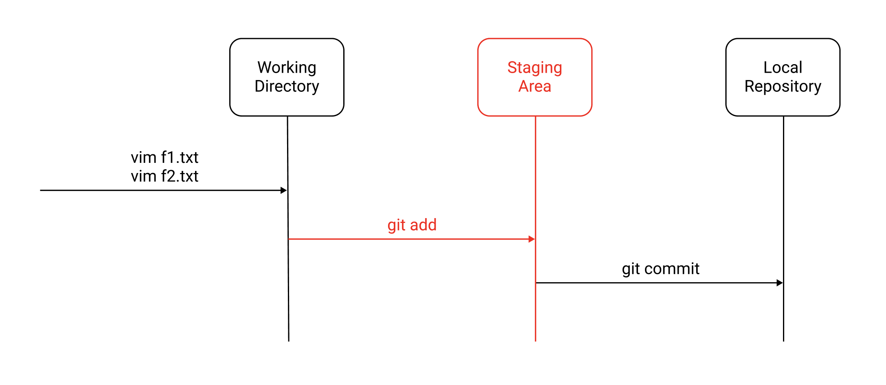

# git add, git commit 사용법

Git은 보통 다음과 같은 단계로 이루어진다.

예제로 이 단계를 살펴보자.

## 파일 생성
우선 `f1.txt`파일을 생성하자.
``` shellsession
$ vim f1.txt
```
```
// f1.txt
source: 1
```
`git status`명령어로 상태를 확인할 수 있다.
``` shellsession{6,9}
$ git status
On branch master

No commits yet

Untracked files:
    (use "git add <file>..." to include in what will be committed)

    f1.txt

nothing added to commit but untracked files present (use "git add" to track)
```
`Untracked files`에서 `f1.txt`을 확인할 수 있다. 파일이 Working Directory에 추가되었으나 Git이 아직 추적하고 있지 않고있다는 의미다.

## git add
Git이 파일을 추적하도록 하는 것을 `Staging`이라고 한다. `git add`명령어를 사용한다.
``` shellsession
$ git add f1.txt
```
다시 상태를 확인해보자.
``` shellsession{6,9}
$ git status
On branch master

No commits yet

Changes to be committed:
    (use "git rm --cached <file>..." to unstage)

    new file:   f1.txt
```
`f1.txt`파일이 `Untracked files`에서 `Changes to be committed`로 이동했다. 이제 Git이 이 파일을 추적하고 있다.

Working Directory의 모든 파일을 Staging 하려면 `-A`옵션을 추가한다.
``` shellsession
$ git add -A
```

물론 Staging을 취소할 수도 있다.
``` shellsession
$ git rm --cached f1.txt
```

## git commit
`git commit`명령어는 현재 상태를 Local Repository에 저장한다.
``` shellsession
$ git commit 
```
이때 Commit Message를 적어준다.
``` shellsession
First Commit	
```
명령어를 입력하면서 Commit Message를 함께 전달할 수도 있다. 옵션 `-m`을 사용하면 된다.
``` shellsession
$ git commit -m "First Commit"
```
`-am`옵션을 사용하면 `git add`와 `git commit`을 한꺼번에 할 수 있다.
``` shellsession
$ git commit -am "First Commit"
```
`git log`명령어로 Commit 내역을 확인할 수 있다.
``` shellsession
$ git log
commit 11111 (HEAD -> master)
Author: yologger <yologger1013@gmail.com>
Date:   Mon Dec 20 15:16:14 2021 +0900

    First Commit
```
위 결과물에서 `11111`을 `Commit ID`라고 한다. 위 예제에서는 알아보기 쉽게 `11111`로 작성했으나 실제로는 `3bc844016976f5a38bdd669dbf83c12b53318d47`처럼 알아보기 어려운 형태로 생성된다.

## 파일 추가
이제 `f2.txt`파일을 생성해보자.
``` shellsession
$ vim f2.txt
```
``` 
// f2.txt
source: 2
```
상태를 확인해보자.
``` shellsession{6,9}
$ git status
'On branch master

No commits yet

Untracked files:
    (use "git add <file>..." to include in what will be committed)

    f1.txt

nothing added to commit but untracked files present (use "git add" to track)
```
그 다음 Staging 한다.
``` shellsession
$ git add f2.txt
``` 
상태를 확인하자.
``` shellsession {6,9}
$ git status
On branch master

No commits yet

Changes to be committed:
    (use "git rm --cached <file>..." to unstage)

    new file:   f2.txt
```
두 번째 Commit을 하자.
``` shellsession
$ git commit -m "Second Commit"
```
로그를 확인해보자. 두 번째 Commit이 추가되었다.
``` shellsession {2-6}
$ git log
commit 22222 (HEAD -> master)
Author: yologger <yologger1013@gmail.com>
Date:   Mon Dec 20 15:24:45 2021 +0900

    Second Commit

commit 11111
Author: yologger <yologger1013@gmail.com>
Date:   Mon Dec 20 15:16:14 2021 +0900

    First Commit
```

## 왜 commit 전에 add를 할까?
선택적으로 Commit을 하기 위해서다. 예제를 살펴보자.

우선 `f1.txt`와 `f2.txt`를 생성하자. 파일을 디렉토리에 추가하면 Working Directory에서 관리된다.
```shellsession
$ vim f1.txt
$ vim f2.txt 
```

```shellsession{6,9,10}
$ git status
On branch master

No commits yet

Untracked files:
    (use "git add <file>..." to include in what will be committed)

    f1.txt
    f2.txt

nothing added to commit but untracked files present (use "git add" to track)
``` 
이제 `f1.txt`만 Staging 하자.
``` shellsession
$ git add f1.txt
```

상태를 확인해보자. `f1.txt`만 추적되고 `f2.txt`는 추적되지 않는 것을 확인할 수 있다.
``` shellsession{6,9,11,14}
$ git status
On branch master

No commits yet

Changes to be committed:
    (use "git rm --cached <file>..." to unstage)

    new file:   f1.txt

Untracked files:
    (use "git add <file>..." to include in what will be committed)

    f2.txt

```
이제 Commit을 하자
``` shellsession
$ git commit -m "First Commit"
```

로그도 확인해보자
```shellsession
$ git log
commit 11111 (HEAD -> master)
Author: yologger <yologger1013@gmail.com>
Date:   Mon Dec 20 15:43:16 2021 +0900

    First Commit
```
다시 상태를 확인해보자. `f2.txt`는 여전히 추적되지 않는 것을 확인할 수 있다.
``` shellsession{4,7}
$ git status
On branch master

Untracked files:
    (use "git add <file>..." to include in what will be committed)

    f2.txt
```