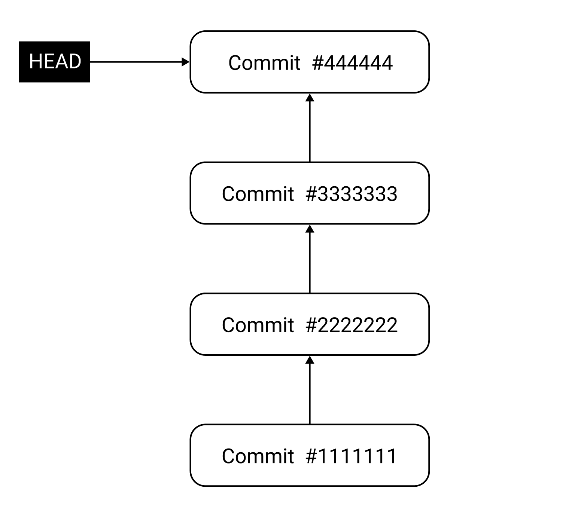
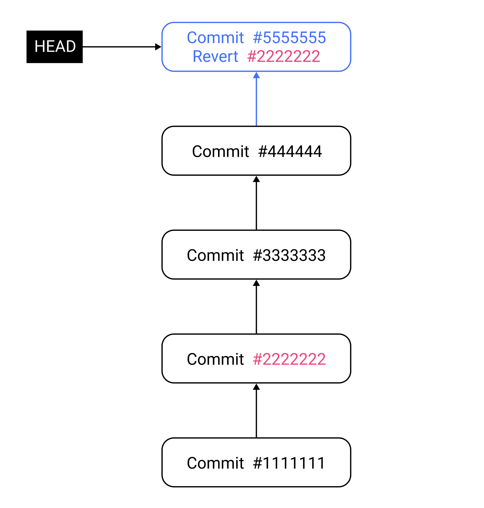

# git reset, git revert
`git reset`, `git revert`에 대해 알아보자.

## git reset
`git reset --hard`명령어를 사용하면 Commit을 취소할 수 있다. 초기 상태는 다음과 같다고 가정하자.
``` shellsession
$ git log
commit 4444444 (HEAD -> master)
Author: yologger <yologger1013@gmail.com>
Date:   Sat Dec 18 18:30:39 2021 +0900

    4

commit 3333333
Author: yologger <yologger1013@gmail.com>
Date:   Sat Dec 18 18:30:18 2021 +0900

    3

commit 2222222
Author: yologger <yologger1013@gmail.com>
Date:   Sat Dec 18 18:29:43 2021 +0900

    2

commit 1111111
Author: yologger <yologger1013@gmail.com>
Date:   Sat Dec 18 18:29:19 2021 +0900

    1

```

이제 3, 4를 삭제하면서 2로 이동해보자.


``` shellsession
// 3, 4 삭제하면서 2로 이동
$ git reset 2222222 --hard
HEAD is now at 2222222
```
결과는 다음과 같다.
``` shellsession
$ git log
commit 2222222
Author: yologger <yologger1013@gmail.com>
Date:   Sat Dec 18 18:29:43 2021 +0900

    2

commit 1111111
Author: yologger <yologger1013@gmail.com>
Date:   Sat Dec 18 18:29:19 2021 +0900

    1

```
1단계 이전으로 돌아가려면 다음과 같이 입력하면 된다.
``` shellsession
$ git reset --hard HEAD~1
```
2단계 이전으로 돌아가려면 다음과 같이 입력하면 된다.
``` shellsession
$ git reset --hard HEAD~2
```
참고로 `git reset`에 `--soft`, `--mixed`, `--hard` 옵션을 추가할 수 있다.
### (1) soft
Commit을 취소하지만 파일은 추적되는 상태로 변경한다.

첫 상태가 다음과 같다고 가정하자.
``` shellsession
$ git log
commit 2222222 (HEAD -> master)
Author: yologger <yologger1013@gmail.com>
Date:   Mon Dec 20 16:59:24 2021 +0900

    Add b.txt

commit 1111111
Author: yologger <yologger1013@gmail.com>
Date:   Mon Dec 20 16:55:06 2021 +0900

    Add a.txt
```
`--soft` 옵션으로 `git reset`을 실행하자.
``` shellsession
$ git reset --soft HEAD~1
```
로그를 확인해보자. Commit Id 2222222이 삭제되었다.
``` shellsession
$ git log
commit 1111111 (HEAD -> master)
Author: yologger <yologger1013@gmail.com>
Date:   Mon Dec 20 16:55:06 2021 +0900

    Add a.txt

```
상태를 확인해보자. Commit은 취소되었으나 `b.txt`파일은 추적되는 상태다.
``` shellsession{4,7}
$ git status
On branch master

Changes to be committed:
    (use "git rm --cached <file>..." to unstage)

    new file:   b.txt
```
즉 Commit은 취소되었으나 `b.txt`파일은 삭제되지 않았다.
``` shellsession
$ ls
b.txt
```

### (2) mixed
Commit을 취소하고 파일은 추적되지 않는 상태로 변경한다.

첫 상태가 다음과 같다고 가정하자.
``` shellsession
$ git log
commit 2222222 (HEAD -> master)
Author: yologger <yologger1013@gmail.com>
Date:   Mon Dec 20 16:59:24 2021 +0900

    Add b.txt

commit 1111111
Author: yologger <yologger1013@gmail.com>
Date:   Mon Dec 20 16:55:06 2021 +0900

    Add a.txt
```
`--mixed` 옵션으로 `git reset`을 실행하자
``` shellsession
$ git reset --mixed HEAD~1
```
로그를 확인해보자. Commit Id 2222222이 삭제되었다.
``` shellsession
$ git log
commit 1111111 (HEAD -> master)
Author: yologger <yologger1013@gmail.com>
Date:   Mon Dec 20 16:55:06 2021 +0900

    Add a.txt

``` 
상태를 확인해보자. Commit은 취소되었고 `b.txt`파일은 추적되지 않는 상태다.
``` shellsession {4,7}
$ git status
On branch master

Untracked files:
    (use "git add <file>..." to include in what will be committed)

    b.txt
```
역시 Commit은 취소되었으나 `b.txt`파일은 삭제되지 않았다.
``` shellsession
$ ls
b.txt
```

### (3) hard
Commit을 취소하고 파일도 삭제한다.

첫 상태가 다음과 같다고 가정하자.
``` shellsession
$ git log
commit 2222222 (HEAD -> master)
Author: yologger <yologger1013@gmail.com>
Date:   Mon Dec 20 16:59:24 2021 +0900

    Add b.txt

commit 1111111
Author: yologger <yologger1013@gmail.com>
Date:   Mon Dec 20 16:55:06 2021 +0900

    Add a.txt
```
`--hard` 옵션으로 `git reset`을 실행하자
``` shellsession
$ git reset --hard HEAD~1
```
로그를 확인해보자. Commit Id 2222222이 삭제되었다.
``` shellsession
$ git log
commit 1111111 (HEAD -> master)
Author: yologger <yologger1013@gmail.com>
Date:   Mon Dec 20 16:55:06 2021 +0900

    Add a.txt

```
Commit은 취소되었고 `b.txt`파일도 삭제되었다.
``` shellsession
$ ls
b.txt
```

## git revert
`git revert`는 특정 Commit을 취소한다. 다만 `git reset`처럼 Commit을 아예 삭제하는 게 아니라 새로운 Commit을 추가하는 형태로 이전 Commit을 취소한다.

예를 들어보자. 디렉토리에는 네 개의 파일이 있다.
``` shellsession
$ ls
a.txt 
b.txt 
c.txt 
d.txt
```
현재 Commit 상태는 다음과 같다.
``` shellsession
$ git log
commit 4444444 (HEAD -> master)
Author: yologger <yologger1013@gmail.com>
Date:   Mon Dec 20 16:23:48 2021 +0900

    Add d.txt

commit 3333333
Author: yologger <yologger1013@gmail.com>
Date:   Mon Dec 20 16:23:17 2021 +0900

    Add c.txt

commit 2222222
Author: yologger <yologger1013@gmail.com>
Date:   Mon Dec 20 16:22:55 2021 +0900

    Add b.txt

commit 1111111
Author: yologger <yologger1013@gmail.com>
Date:   Mon Dec 20 16:22:26 2021 +0900

    Add a.txt

```


두 번째 Commit인 2222222로 Revert해보자.
``` shellsession
$ git revert 2222222
Revert "Add b.txt"

This reverts commit 2222222.
```

두 번째 Commit에서 추가한 b.txt가 사라졌다.
``` shellsession
$ ls
a.txt c.txt d.txt
```
로그도 확인해보자.
``` shellsession{2-8}
$ git log
commit 5555555 (HEAD -> master)
Author: yologger <yologger1013@gmail.com>
Date:   Mon Dec 20 16:26:17 2021 +0900

    Revert "Add b.txt"
    
    This reverts commit 2222222.

commit 4444444
Author: yologger <yologger1013@gmail.com>
Date:   Mon Dec 20 16:23:48 2021 +0900

    Add d.txt

commit 3333333
Author: yologger <yologger1013@gmail.com>
Date:   Mon Dec 20 16:23:17 2021 +0900

    Add c.txt

commit 2222222
Author: yologger <yologger1013@gmail.com>
Date:   Mon Dec 20 16:22:55 2021 +0900

    Add b.txt

commit 1111111
Author: yologger <yologger1013@gmail.com>
Date:   Mon Dec 20 16:22:26 2021 +0900

    Add a.txt
```
