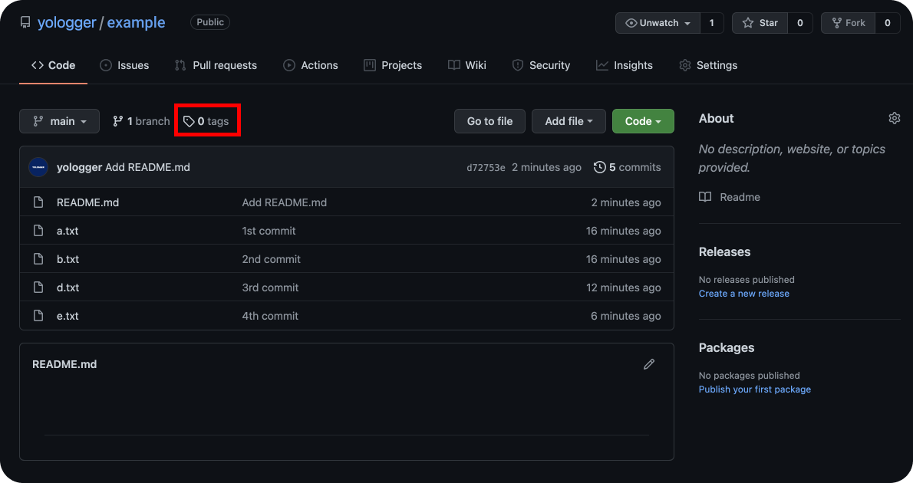

# Tag
`Tag`를 사용하면 특정 Commit에 버전을 부여할 수 있다.

## 예제
프로젝트 초기 상태는 다음과 같다.
``` shellsession{2}
$ git log 
commit 3acd7d616ddc0e7243e37b03702434b714501f96 (HEAD -> master)
Author: yologger <yologger1013@gmail.com>
Date:   Tue Oct 5 22:20:53 2021 +0900

    2nd commit

commit 62186ec237d90bc4de2fb0fc93d0d943f7ed1981
Author: yologger <yologger1013@gmail.com>
Date:   Tue Oct 5 22:20:21 2021 +0900

    1st commit
```
`git tag`명령어를 사용하면 Tag를 추가할 수 있다. `3acd7d616ddc0e7243e37b03702434b714501f96` Commit에 Tag를 추가해보자.
``` 
// git tag <tag_name> <commit_id>
$ git tag 0.0.1 3acd7d616ddc0e7243e37b03702434b714501f96
```
다시 한번 로그를 확인해보자. Tag가 추가된 것을 확인할 수 있다.
``` shellsession {2}
$ git log
commit 3acd7d616ddc0e7243e37b03702434b714501f96 (HEAD -> master, tag: 0.0.1)
Author: yologger <yologger1013@gmail.com>
Date:   Tue Oct 5 22:20:53 2021 +0900

    2nd commit

commit 62186ec237d90bc4de2fb0fc93d0d943f7ed1981
Author: yologger <yologger1013@gmail.com>
Date:   Tue Oct 5 22:20:21 2021 +0900

    1st commit

```
다음 명령어로 추가된 모든 태그를 조회할 수도 있다.
``` shellsession
$ git tag
0.0.1
``` 
새롭게 Commit을 해도 Tag는 그대로 남아있다.
``` shellsession
$ git commit -m "3rd commit"
```
``` shellsession{8}
$ git log
commit 034de53ee5df7e265fbe8c65458b17b501c1da01 (HEAD -> master)
Author: yologger <yologger1013@gmail.com>
Date:   Tue Oct 5 22:24:37 2021 +0900

    3rd commit

commit 3acd7d616ddc0e7243e37b03702434b714501f96 (tag: 0.0.1)
Author: yologger <yologger1013@gmail.com>
Date:   Tue Oct 5 22:20:53 2021 +0900

    2nd commit

commit 62186ec237d90bc4de2fb0fc93d0d943f7ed1981
Author: yologger <yologger1013@gmail.com>
Date:   Tue Oct 5 22:20:21 2021 +0900

    1st commit
```
Tag를 사용하여 특정 버전으로 이동할 수도 있다.
``` 
$ git checkout 0.0.1
```
``` shellsession{2}
$ git log
commit 3acd7d616ddc0e7243e37b03702434b714501f96 (HEAD, tag: 0.0.1)
Author: yologger <yologger1013@gmail.com>
Date:   Tue Oct 5 22:20:53 2021 +0900

    2nd commit

commit 62186ec237d90bc4de2fb0fc93d0d943f7ed1981
Author: yologger <yologger1013@gmail.com>
Date:   Tue Oct 5 22:20:21 2021 +0900

    1st commit
```
다시 최신 Commit으로 이동해보자.
```
$ git checkout master
```
``` shellsession{2,8}
$ git log
commit 034de53ee5df7e265fbe8c65458b17b501c1da01 (HEAD -> master)
Author: yologger <yologger1013@gmail.com>
Date:   Tue Oct 5 22:24:37 2021 +0900

    3rd commit

commit 3acd7d616ddc0e7243e37b03702434b714501f96 (tag: 0.0.1)
Author: yologger <yologger1013@gmail.com>
Date:   Tue Oct 5 22:20:53 2021 +0900

    2nd commit

commit 62186ec237d90bc4de2fb0fc93d0d943f7ed1981
Author: yologger <yologger1013@gmail.com>
Date:   Tue Oct 5 22:20:21 2021 +0900

    1st commit
```

## Tag에 추가 정보 입력하기
Tag를 추가할 때 추가 정보를 입력할 수도 있다.

초기 상태는 다음과 같다.
``` shellsession
$ git log
commit 5f7df8c2b982b094ddca62183fc0b02c1ce497e4 (HEAD -> master)
Author: yologger <yologger1013@gmail.com>
Date:   Tue Oct 5 22:30:12 2021 +0900

    4th commit

commit 034de53ee5df7e265fbe8c65458b17b501c1da01
Author: yologger <yologger1013@gmail.com>
Date:   Tue Oct 5 22:24:37 2021 +0900

    3rd commit

commit 3acd7d616ddc0e7243e37b03702434b714501f96 (tag: 0.0.1)
Author: yologger <yologger1013@gmail.com>
Date:   Tue Oct 5 22:20:53 2021 +0900

    2nd commit

commit 62186ec237d90bc4de2fb0fc93d0d943f7ed1981
Author: yologger <yologger1013@gmail.com>
Date:   Tue Oct 5 22:20:21 2021 +0900

    1st commit
```
추가 정보는 다음과 같은 형태로 입력한다.
```
$ git tag -a <TAG_NAME> -m "MESSAGE" <COMMIT_ID>
```
```
$ git tag -a 0.0.2 -m "Fix bug" 5f7df8c2b982b094ddca62183fc0b02c1ce497e4
```
로그를 확인해보자.
``` shellsession{2}
$ git log
commit 5f7df8c2b982b094ddca62183fc0b02c1ce497e4 (HEAD -> master, tag: 0.0.2)
Author: yologger <yologger1013@gmail.com>
Date:   Tue Oct 5 22:30:12 2021 +0900

    4th commit

commit 034de53ee5df7e265fbe8c65458b17b501c1da01
Author: yologger <yologger1013@gmail.com>
Date:   Tue Oct 5 22:24:37 2021 +0900

    3rd commit3rd commit3rd commit

commit 3acd7d616ddc0e7243e37b03702434b714501f96 (tag: 0.0.1)
Author: yologger <yologger1013@gmail.com>
Date:   Tue Oct 5 22:20:53 2021 +0900

    2nd commit

commit 62186ec237d90bc4de2fb0fc93d0d943f7ed1981
Author: yologger <yologger1013@gmail.com>
Date:   Tue Oct 5 22:20:21 2021 +0900

    1st commit
```
모든 Tag를 확인해보자.
``` shellsession
$ git tag
0.0.1
0.0.2 
```
추가 정보는 다음과 같이 확인할 수 있다.
``` {7}
$ git tag -v 0.0.2
object 5f7df8c2b982b094ddca62183fc0b02c1ce497e4
type commit
tag 0.0.2
tagger yologger <yologger1013@gmail.com> 1633440702 +0900

Fix bug
error: no signature found
```

## Tag 삭제
`-d`옵션을 사용하면 Tag를 삭제할 수 있다.
```
// 모든 태그 조회
$ git tag
0.0.1
0.0.2
```
```
// 태그 삭제
$ git tag -d 0.0.2
```

## GitHub에 Tag 업로드 하기
브랜치를 GitHub에 Push해도 Commit만 올라갈 뿐 Tag는 업로드되지 않는다.

Tag는 다음과 같이 업로드 할 수 있다.
```
$ git push --tags
```

`Tags`탭을 클릭하면 자세한 내용을 확인할 수 있다.

