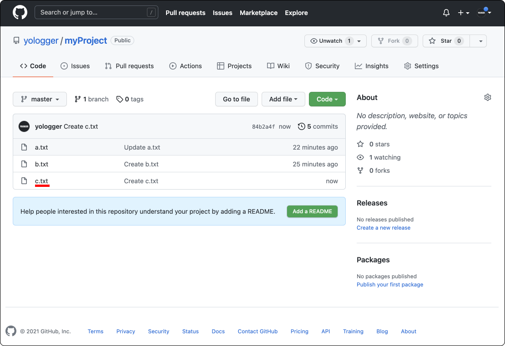

## git fetch
프로젝트를 생성하고 `a.txt`를 추가하자.
``` shellsession
// 디렉토리 생성
$ mkdir myProject

// 디렉토리로 이동
$ cd myProject

// 초기화
$ git init

// 파일 생성
$ vim a.txt

// 파일 확인
$ cat a.txt
a
```
Add, Commit을 한다.
``` shellsession
$ git add -A
$ git commit -m "Create a.txt"
``` 
원격 저장소와의 연결을 만들고 Push 한다.
``` shellsession
// 원격 저장소와의 연결 생성
$ git remote add origin https://github.com/yologger/myProject.git

// 원격 저장소에 master 브랜치 Push
$ git push origin master
``` 
원격 저장소를 확인해보자. 소스코드가 업로드 되어있다.


콘솔에서 로그도 확인해보자.
``` shellsession
$ git log
commit 8f36173735313143c654a95ca80b22f00fe490c9 (HEAD -> master, origin/master)
Author: yologger <yologger1013@gmail.com>
Date:   Tue Dec 21 04:04:57 2021 +0900

    Create a.txt
```
이제 원격 저장소에서 `b.txt`를 추가하자.

다시 터미널로 돌아와서 `a.txt`를 수정하고 Commit 하자.
``` shellsession
$ vim a.txt
a
aa // 추가된 부분
```
``` shellsession
$ git add -A
$ git commit -m "Update a.txt"
```
상태를 확인해보자.
``` shellsession
$ git log
commit 987ae40f10f4e2794115e25b4db35526a214850a (HEAD -> master)
Author: yologger <yologger1013@gmail.com>
Date:   Tue Dec 21 04:14:39 2021 +0900

    Update a.txt

commit 8f36173735313143c654a95ca80b22f00fe490c9 (origin/master)
Author: yologger <yologger1013@gmail.com>
Date:   Tue Dec 21 04:04:57 2021 +0900

    Create a.txt
```
이제 다시 Push를 하면 다음과 같은 에러가 발생한다.
``` shellsession
$ git push origin master
To https://github.com/yologger/myProject.git
 ! [rejected]        master -> master (fetch first)
error: 레퍼런스를 'https://github.com/yologger/myProject.git'에 푸시하는데 실패했습니다.
힌트: 리모트에 로컬에 없는 사항이 들어 있으므로 업데이트가
힌트: 거부되었습니다. 이 상황은 보통 또 다른 저장소에서 같은
힌트: 저장소로 푸시할 때 발생합니다.  푸시하기 전에
힌트: ('git pull ...' 등 명령으로) 리모트 변경 사항을 먼저
힌트: 포함해야 합니다.
힌트: 자세한 정보는 'git push --help'의 "Note about fast-forwards' 부분을
힌트: 참고하십시오.
```
이는 원격 저장소와 로컬 저장소의 스냅샷이 다르기 때문이다.

따라서 원격 저장소의 변경사항을 로컬 저장소에 적용한 후, 다시 Push를 해야한다. 


이때 `git fetch`명령어를 사용할 수 있다. `git fetch`는 다음과 같이 실행한다.
``` shellsession
$ git fetch <connection_name>
```
``` shellsession
$ git fetch origin
remote: Enumerating objects: 4, done.
remote: Counting objects: 100% (4/4), done.
remote: Compressing objects: 100% (2/2), done.
remote: Total 3 (delta 0), reused 0 (delta 0), pack-reused 0
오브젝트 묶음 푸는 중: 100% (3/3), 633 bytes | 316.00 KiB/s, 완료.
https://github.com/yologger/myProject URL에서
   8f36173..ca89a89  master     -> origin/master
```
출력 결과 하단을 보면  `origin/master` 브랜치를 확인할 수 있다. 이 브랜치와 로컬 저장소의 `master` 브랜치를 비교하면 어떤 부분이 다른지 확인할 수 있다.
``` shellsession
$ git diff ...origin/master
diff --git a/b.txt b/b.txt
new file mode 100644
index 0000000..6178079
--- /dev/null
+++ b/b.txt
@@ -0,0 +1 @@
+b
```
이 브랜치로 checkout하면 원격 저장소에 어떠한 변화가 있는지 로그를 확인할 수 있다.
``` shellsession
$ git checkout origin/master

$ git log
commit ca89a897d5eb11fab800050668c566fe369fa8c8 (HEAD, origin/master)
Author: YOLOGGER <yologger1013@gmail.com>
Date:   Tue Dec 21 04:12:03 2021 +0900

    Create b.txt

commit 8f36173735313143c654a95ca80b22f00fe490c9
Author: yologger <yologger1013@gmail.com>
Date:   Tue Dec 21 04:04:57 2021 +0900

    Create a.txt
```
다시 `master`브랜치로 돌아가서 `origin/master`를 병합하자.
``` shellsession
$ git checkout master

$ git merge origin/master 
Merge made by the 'recursive' strategy.
 b.txt | 1 +
 1 file changed, 1 insertion(+)
 create mode 100644 b.txt
```
`ls`명령어를 입력하면 원격 저장소에서 추가한 `b.txt`가 로컬 저장소에 Merge된 것을 확인할 수 있다.
``` shellsession
$ ls
a.txt b.txt
```
여기까지 한 작업을 그림으로 표한하면 아래와 같다.


이제 다시 Push를 시도해보자. 


``` shellsession
$ git push origin master
오브젝트 나열하는 중: 9, 완료.
오브젝트 개수 세는 중: 100% (8/8), 완료.
Delta compression using up to 8 threads
오브젝트 압축하는 중: 100% (3/3), 완료.
오브젝트 쓰는 중: 100% (5/5), 517 bytes | 517.00 KiB/s, 완료.
Total 5 (delta 0), reused 0 (delta 0), pack-reused 0
To https://github.com/yologger/myProject.git
   ca89a89..3671b58  master -> master
```
Push가 성공한 것을 확인할 수 있다.


## git pull
`git pull`은 `git fetch`와 `git merge`를 합친 것이다.

예제를 살펴보자. 원격 저장소에 `c.txt`를 추가한다.


이제 콘솔에서 다음과 같이 `git pull`을 호출한다.
``` shellsession
// git pull <connection_name> <branch_name>
$ git pull origin master
```
로그를 확인해보자. Merge까지 수행된 것을 확인할 수 있다.
``` shellsession
$ git log
commit 84b2a4fdccd369d9dd49756ed0859c51acdb642f (HEAD -> master, origin/master)
Author: YOLOGGER <yologger1013@gmail.com>
Date:   Tue Dec 21 04:36:31 2021 +0900

    Create c.txt

commit 3671b5831a882ee6fbea9e017a94e85f9d171a8e
Merge: 987ae40 ca89a89
Author: yologger <yologger1013@gmail.com>
Date:   Tue Dec 21 04:31:24 2021 +0900

    Merge remote-tracking branch 'origin/master'

commit 987ae40f10f4e2794115e25b4db35526a214850a
Author: yologger <yologger1013@gmail.com>
Date:   Tue Dec 21 04:14:39 2021 +0900

    Update a.txt

commit ca89a897d5eb11fab800050668c566fe369fa8c8
Author: YOLOGGER <yologger1013@gmail.com>
Date:   Tue Dec 21 04:12:03 2021 +0900

    Create b.txt

commit 8f36173735313143c654a95ca80b22f00fe490c9
Author: yologger <yologger1013@gmail.com>
Date:   Tue Dec 21 04:04:57 2021 +0900

    Create a.txt
```
`ls`명령어를 실행해보자. 원격 저장소에서 추가한 `c.txt`가 로컬 저장소에도 Merge되었다.
``` shellsession
$ ls
a.txt b.txt c.txt
```

## GitHub을 통한 협업 과정
`GitHub`을 통한 일반적인 협업 과정은 다음과 같다.
1. 보통 프로젝트에 처음 투입되는 개발자는 `git clone`명령어를 사용하여 로컬 PC에 프로젝트를 구성한다.
2. A 개발자는 작업을 마치고 `git push`를 통해 변경 내용을 원격 저장소에 반영시킨다.
3. B 개발자는 작업을 시작하기 전, 다른 개발자가 원격 저장소에 반영한 변경 내용을 본인의 로컬 PC에 반영해야한다. 이 때 `git pull` 명령어를 사용한다.