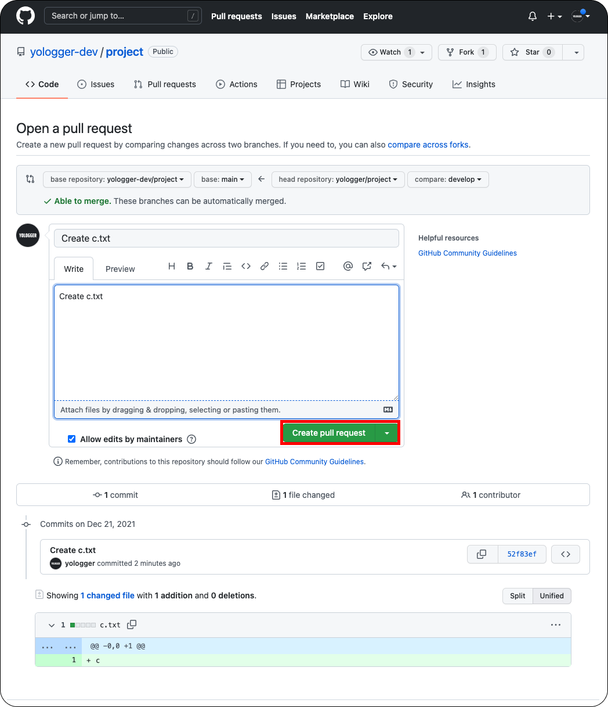
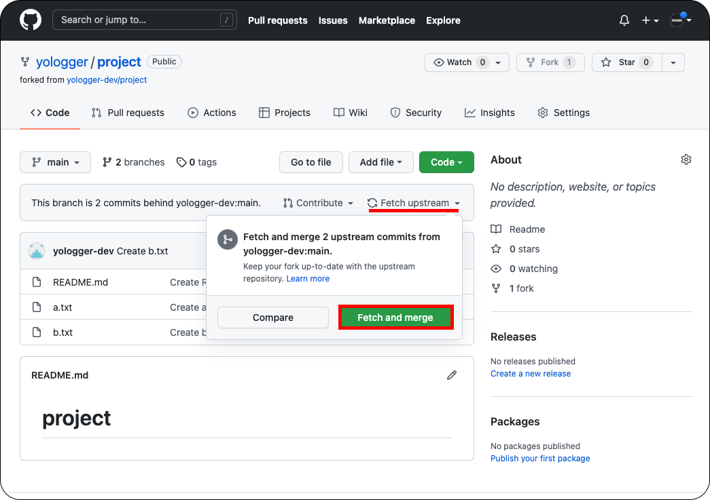

# GitHub Pull Request
GitHub의 `Pull Request`를 사용하면 효율적으로 협업할 수 있다. `Pull Request`는 보통 다음과 같은 순서로 진행된다.

1. 원본 저장소를 Fork한다.
2. Fork한 저장소를 Clone한다.
3. Clone한 프로젝트에서 새로운 브랜치를 생성한다.
4. 새로운 브랜치에서 작업하고 Fork한 저장소에 Push한다.
5. Fork한 저장소에서 Pull Request 버튼을 누른다.

이제 예제를 통해 `Pull Request`에 대해 알아보자.
::: tip 참고
예제에서 `yologger-dev`계정은 원본 저장소의 <b>Owner</b>다.
`yologger`계정은 원본 저장소를 Fork하여 수정하는 <b>Contributer</b>다.
:::

## fork

Contributer는 원본 저장소를 자신의 저장소로 Fork한다.


Fork를 하면 Contributer의 저장소에도 동일한 프로젝트가 생성된다.


## clone
Fork한 저장소를 clone한다.
``` shellsession
$ mkdir project

$ cd project

// git clone [REMOTE_REPO_URL] [DIR_NAME]
$ git clone https://github.com/yologger/project.git .
```

## remote 저장소 설정
clone한 프로젝트(Fork한 프로젝트)와 연결된 원격 저장소를 확인해보자.
``` shellsession
$ git remote --v
origin	https://github.com/yologger/project.git (fetch)
origin	https://github.com/yologger/project.git (push)
```
`origin`은 원본 저장소가 아닌 <u>Fork한 저장소</u>와의 연결이다. `Pull Request`를 사용하려면 <u>원본 저장소</u>와의 연결을 추가해야한다.
``` shellsession
// 원본 저장소와의 연결 추가
$ git remote add upstream https://github.com/yologger-dev/project.git
```
``` shellsession
$ git remote -v
// Fork한 저장소와의 연결
origin	https://github.com/yologger/project.git (fetch)
origin	https://github.com/yologger/project.git (push)
// 원본 저장소와의 연결
upstream	https://github.com/yologger-dev/project.git (fetch)
upstream	https://github.com/yologger-dev/project.git (push)
```

## Branch 생성
이제 작업을 하기 위해 새로운 브랜치를 생성해야한다. `develop` 브랜치를 생성하자.
``` shellsession
// 'develop' 브랜치 생성
$ git branch develop
* master
  develop

// 'develop' 브랜치로 이동
$ git checkout develop 
```

## 작업 수행 후 add, commit
`develop`브랜치에서 `c.txt`를 추가하자.
``` shellsession
$ vim c.txt
c
```
그리고 add, commit 한다.
``` shellsession
$ git add -am "Create c.txt"
```

##  push
원본 원격 저장소가 아니라 <u>Fork한 원격 저장소</u>에 Push한다.
```bash
// 저장소 확인
$ git remote
origin
upstream

// Fork한 원격 저장소에 push
$ git push [저장소명] [BRANCH_NAME]
$ git push origin develop
```

## Pull Request 보내기
Contributer의 Fork 원격 저장소에 `Compare & pull request` 버튼이 활성화된다. 이 버튼을 클릭하자

코멘트를 남기고 `Create pull request` 버튼을 클릭하면 Pull Request가 전송된다.


## Pull Request 승인 / 거절하기
Owner는 Pull Request를 확인할 수 있다. 

원본 저장소 주인 역시 코멘트를 남길 수 있다. 보통 이 단계에서 `Code Review`를 진행한다.

문제가 없으면 `Merge pull request`를 눌러 Merge한다. 물론 문제가 있다면 `Reject`할 수도 있다.


## Fork한 원격 저장소 업데이트
Owner가 Merge를 승인하면 Contribute도 Fork한 저장소를 업데이트할 수 있다. `Fetch upstream`을 누른 후 `Fetch and merge`버튼을 클릭하면 된다.

Fork한 저장소가 업데이트된 것을 확인할 수 있다.


## 로컬 저장소 업데이트
이제 원격 저장소를 pull하여 로컬 저장소의 `main`브랜치를 업데이트한다.
``` shellsession
// 'main' 브랜치로 이동
$ git checkout main

// 'main' 브랜치 업데이트
$ git pull upstream main
```
다 사용한 `develop`브랜치는 삭제한다.
``` shellsession
$ git branch
* main
develop

$ git branch -d develop
``` 
로컬 저장소의 `main`브랜치를 확인해보자.
``` shellsession
$ ls
README.md     a.txt     b.txt     c.txt
```
로컬 저장소의 `main`브랜치에도 변경이 반영되어있다.