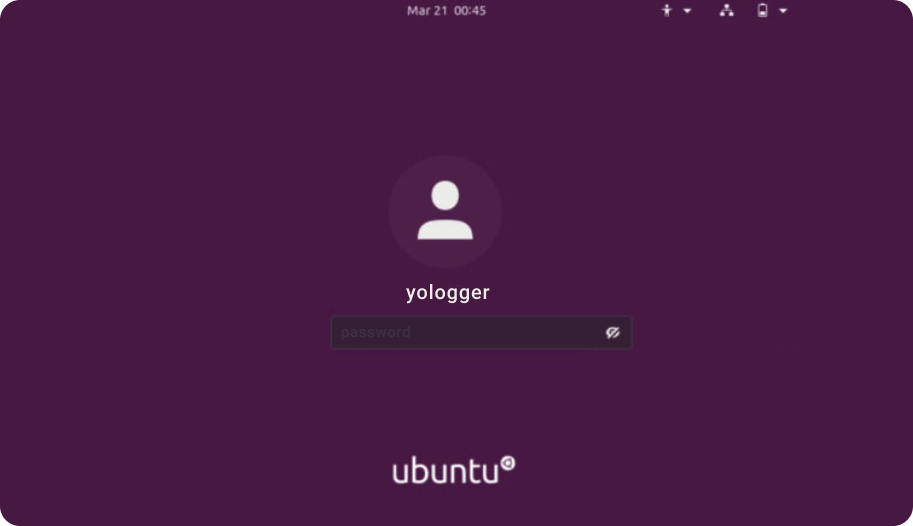
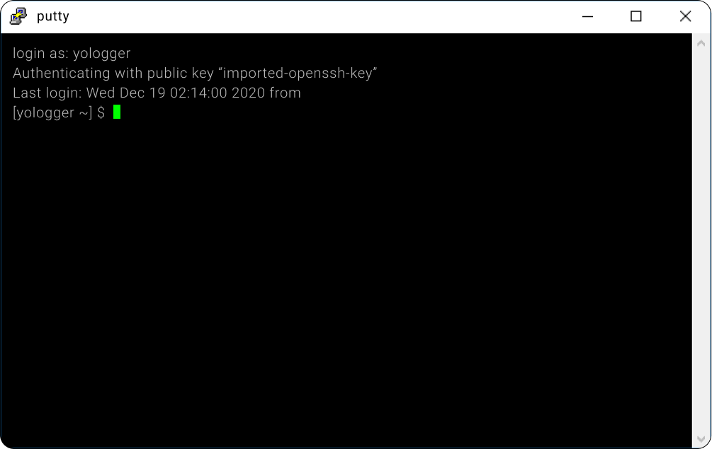
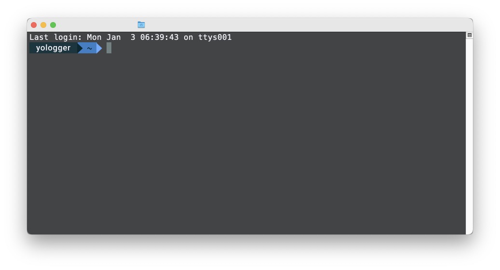

# Table of Contents
[[toc]]

## 쉘이란?
`쉘(Shell)`은 입력한 명령어를 커널에 전달하여 특정한 작업을 수행하도록 하는 프로그램이다.
시스템에 설치된 쉘은 다음과 같이 확인할 수 있다.
```
# cat /etc/shells
/bin/sh
/bin/dash
/bin/bash
/bin/rbash
```

대부분의 리눅스 배포판은 `bash`쉘을 기본으로 제공한다. 현재 쉘 세션에 접속한 계정의 시작 쉘은 다음과 같이 확인한다. 
```
# echo $SHELL
/bin/bash
```

계정마다 다른 쉘을 사용할 수 있으며, `chsh`명령어로 시작 쉘을 변경할 수 있다.
```
# chsh -s <쉘 설치 경로> <사용자 이름>
```
```
# chsh -s /bin/dash user1
```

## 쉘 세션
쉘은 크게 두 가지의 세션이 존재한다. 세션에 따라 적용되는 환경설정 파일이 다르다.

### 로그인 쉘 세션
ID와 Password를 입력하여 연결된 쉘 세션을 `로그인 쉘`이라고 한다. 
- GUI 로그인 화면에서 로그인
- SSH로 원격 접속





### 비로그인 쉘 세션
로그인 없이 연결된 쉘 세션을 `비로그인 쉘`이라고 한다. Mac OS에서 터미널을 실행시키는 것이 비로그인 쉘에 해당한다.

