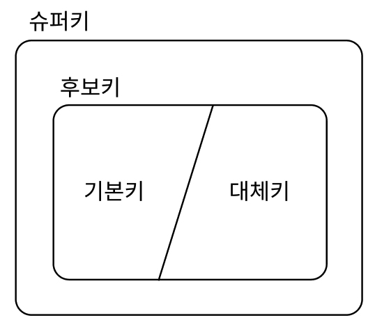

# Table of Contents
[[toc]]

# Database
`Databsae`개념에 대해 정리한다.

## DDL
`DDL(Data Definition Lauguage)`의 약자로 데이터베이스의 구조(Schema)를 정의하는 기능
- CREATE
- ALTER
- DROP
- TRUNCATE

## DML
`DML(Data Manipulation Lauguage)` 데이터를 조작하는 기능
- SELECT
- INSERT
- UPDATE
- DELETE

## DCL
`DCL(Database Control Launuage)`의 약자
- 무결성과 동시성 제어
    - COMMIT
    - ROLLBACK
- 보안과 권한
    - GRANT
    - REVOKE

## ERD
- `ERD(Entity-Relation Diagram)`은 데이터베이스의 개념적 설계에 사용한다.
- 필자는 [`draw.io`](https://app.diagrams.net/)를 사용하여 `ER Diagram`을 그린다.

## 기본키, 외래키
``` sql{3}
CREATE TABLE member (
    id BIGINT NOT NULL AUTO_INCREMENT,
    PRIMARY KEY(id)
);
```
``` sql{3}
CREATE TABLE post (
    // ...
    writer_id BIGINT,
    FOREIGN KEY (`writer_id`) REFERENCES `member` (`id`)
);
```

## 기타 다른 키
- `유일성`: 하나의 키로 하나의 행를 식별
- `최소성`: 최소한의 속성을 사용



- `슈퍼키`
    - 유일성
    - ~~최소성~~
        - 학번 - 단일속성
        - 주민번호 - 단일속성
        - 학번, 주민번호 - 복합속성
        - 주민등록번호, 학년 - 복합속성    

- `후보키`
    - 유일성
    - 최소성

- `기본키`와 `대체키`
    - 후보키가 여러 개인 경우 하나를 `기본키`, 나머지를 `대체키`로 지정한다.
        - 학번 - 기본키
        - 주민번호 - 대체키

## 이상현상
데이터베이스의 설계를 잘못하면 데이터의 `일관성`, `무결성`이 깨지는데 이를 <b>`이상현상(Anomaly)`</b>이라고 한다.
- 삽입 이상
- 갱신 이상
- 삭제 이상

## 정규화
- `이상현상`을 해결하기 위해 테이블을 <b>`무손실 분해`</b>하는 것
- 조인의 증가로 데이터 처리시간이 늘어난다는 단점이 있기 때문에 일관성과 무결성을 고려해서 적절하게 분해해야한다.

## 인덱스
- `인덱스`는 검색 성능을 향상시키기 위해 사용한다.
- 테이블을 생성할 때 `기본키`나 `유일키`를 지정하면 해당 컬럼으로 `인덱스`가 자동으로 생성된다.
- 필요에 따라 추가적인 인덱스를 생성할 수 있으며, 다중 컬럼으로도 `인덱스`를 생성할 수 있다.

## 트랜잭션
- 데이터베이스의 상태를 변화시키는 하나의 논리적인 작업
- `INSERT`, `DELETE`, `UPDATE` 같은 `DML` 연산 여러 개으로 구성되어있다.
- `Commit`을 하는 시점에 데이터베이스에 반영되며, 오류가 발생하거나 `Rollback`을 하면 데이터베이스에 반영되지 않는다.

## ACID
- `Atomaticity(원자성)`: `All or Nothing`, 트랜잭션을 구성하는 연산들은 모두 반영되거나 전부 반영되지 않아야 한다.
- `Consistency(일관성)`: 트랜잭션이 반영되고 나서도 데이터베이스의 무결성이 유지되어야 한다.
- `Isolation(격리성)`: 트랜잭션 중간에 다른 트랜잭션의 연산이 끼어들지 못핟나. 
- `Durability(내구성)`: 성공적으로 수행된 트랜잭션은 데이터베이스에 영구적으로 반영되어야 한다.

## RDBMS vs. NoSQL
### RDBMS
- `Row`와 `Column`으로 구성된 전통적인 이차원 관계형 데이터베이스다.
- 스키마 설계와 외래키 설정이 중요하며, 테이블들이 서로 연관관계를 맺으며 존재한다.
- 연관관계가 있는 테이블들은 `Join`으로 조회할 수 있다.
- 대표적인 제품군에는 Oracle DB, MySQL, Maria DB가 있다.

### NoSQL
- `Key-Value` 기반의 데이터베이스.
- `RDBMS`에 비해 자유도가 높으며, 단순 검색에 최적화되어있다.
- 대표적인 제품군에는 `Mongo DB`, `Redis` 등이 있다.

### 결론
두 데이터베이스는 대체 관계가 아니라 상호보완관계다. 필요한 시점과 상황에 따라 적절히 사용하는게 좋다.

## Redis
- `Key-Value` 기반의 데이터베이스


## Elastic Search
- 검색 엔진
