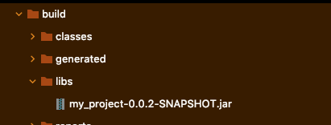
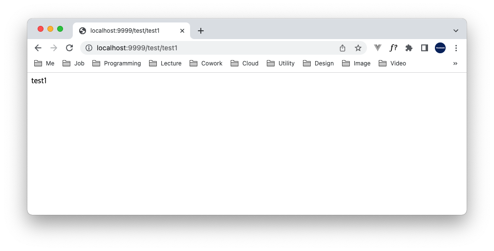

# Table of Contents
[[toc]]

## Spring Boot 프로젝트를 Docker 이미지로 만들기
다음과 같은 간단한 Spring Boot 프로젝트가 있다.
``` java
// Application.java
@SpringBootApplication
public class Application {
    public static void main(String[] args) {
        SpringApplication.run(Application.class, args);
    }
}
```
``` java
// TestController.java
@RestController
@RequestMapping("/test")
public class TestController {

    @GetMapping("/test1")
    String test1() {
        return "test1";
    }
}
```
포트는 5000으로 설정되어있다.
``` properties
# application.properties
server.port = 5000
```

첫 단계는 프로젝트를 빌드하여 `JAR` 파일을 생성하는 것이다.
```
$ ./gradlew clean
$ ./gradlew build
```

`build/libs`에서 `JAR`를 확인할 수 있다.



이제 `Dockerfile`을 작성한다.
```
FROM openjdk:8-jdk-alpine
ARG JAR_FILE=build/libs/*.jar
COPY ${JAR_FILE} app.jar
ENTRYPOINT ["java","-jar","/app.jar"]
```

그 다음 도커 이미지를 생성한다.
``` shellsession
$ docker build -t springboot-image:0.1 .                                     
[+] Building 1.0s (7/7) FINISHED                                                                                                                                                                                                                                                                                        
 => [internal] load build definition from Dockerfile                                                                                                                                                                                                                                                               0.0s
 => => transferring dockerfile: 36B                                                                                                                                                                                                                                                                                0.0s
 => [internal] load .dockerignore                                                                                                                                                                                                                                                                                  0.0s
 => => transferring context: 2B                                                                                                                                                                                                                                                                                    0.0s
 => [internal] load metadata for docker.io/library/openjdk:8-jdk-alpine                                                                                                                                                                                                                                            0.9s
 => [internal] load build context                                                                                                                                                                                                                                                                                  0.0s
 => => transferring context: 119B                                                                                                                                                                                                                                                                                  0.0s
 => [1/2] FROM docker.io/library/openjdk:8-jdk-alpine@sha256:94792824df2df33402f201713f932b58cb9de94a0cd524164a0f2283343547b3                                                                                                                                                                                      0.0s
 => CACHED [2/2] COPY build/libs/*.jar app.jar                                                                                                                                                                                                                                                                     0.0s
 => exporting to image                                                                                                                                                                                                                                                                                             0.0s
 => => exporting layers                                                                                                                                                                                                                                                                                            0.0s
 => => writing image sha256:87a6c94ce7cc1a9d6634bdecc8e263cb5fa7ec8d8486ad713252637f194bc1ff                                                                                                                                                                                                                       0.0s
 => => naming to docker.io/library/springboot-image:0.1            
```
도커 이미지가 잘 생성되었는지 확인한다.
``` shellsession{3}
$ docker images
REPOSITORY                 TAG              IMAGE ID       CREATED              SIZE
springboot-image           0.1              87a6c94ce7cc   About a minute ago   122MB
```
도커 이미지로 컨테이너를 생성하고 실행한다. 이 때 호스트의 포트로 접근 시 컨테이너 내부 스프링 부트로 포워딩되도록 포트를 바인딩해야한다.
``` shellsession
$ docker run -d --name springboot-container -p 9999:5000 springboot-image:0.1
```
도커 컨테이너가 정상적으로 실행되었는지 확인하자.
``` shellsession
$ docker ps -al     
CONTAINER ID   IMAGE                  COMMAND                CREATED          STATUS          PORTS                    NAMES
b2d971ca343f   springboot-image:0.1   "java -jar /app.jar"   53 seconds ago   Up 53 seconds   0.0.0.0:9999->8080/tcp   springboot-container
```
`docker logs [container_name]` 명령어로 로그를 확인할 수 있다.
``` shellsession
$ docker logs springboot-container

  .   ____          _            __ _ _
 /\\ / ___'_ __ _ _(_)_ __  __ _ \ \ \ \
( ( )\___ | '_ | '_| | '_ \/ _` | \ \ \ \
 \\/  ___)| |_)| | | | | || (_| |  ) ) ) )
  '  |____| .__|_| |_|_| |_\__, | / / / /
 =========|_|==============|___/=/_/_/_/
 :: Spring Boot ::                (v2.6.6)

2022-04-13 09:07:14.418  INFO 1 --- [           main] com.yologger.spring_docker.Application   : Starting Application using Java 1.8.0_212 on b2d971ca343f with PID 1 (/app.jar started by root in /)
2022-04-13 09:07:14.423  INFO 1 --- [           main] com.yologger.spring_docker.Application   : No active profile set, falling back to 1 default profile: "default"
2022-04-13 09:07:15.908  INFO 1 --- [           main] o.s.b.w.embedded.tomcat.TomcatWebServer  : Tomcat initialized with port(s): 8080 (http)
2022-04-13 09:07:15.928  INFO 1 --- [           main] o.apache.catalina.core.StandardService   : Starting service [Tomcat]
2022-04-13 09:07:15.929  INFO 1 --- [           main] org.apache.catalina.core.StandardEngine  : Starting Servlet engine: [Apache Tomcat/9.0.60]
2022-04-13 09:07:16.120  INFO 1 --- [           main] o.a.c.c.C.[Tomcat].[localhost].[/]       : Initializing Spring embedded WebApplicationContext
2022-04-13 09:07:16.121  INFO 1 --- [           main] w.s.c.ServletWebServerApplicationContext : Root WebApplicationContext: initialization completed in 1626 ms
2022-04-13 09:07:17.242  INFO 1 --- [           main] o.s.b.w.embedded.tomcat.TomcatWebServer  : Tomcat started on port(s): 8080 (http) with context path ''
2022-04-13 09:07:17.276  INFO 1 --- [           main] com.yologger.spring_docker.Application   : Started Application in 3.339 seconds (JVM running for 3.887)
2022-04-13 09:07:26.102  INFO 1 --- [nio-8080-exec-1] o.a.c.c.C.[Tomcat].[localhost].[/]       : Initializing Spring DispatcherServlet 'dispatcherServlet'
2022-04-13 09:07:26.103  INFO 1 --- [nio-8080-exec-1] o.s.web.servlet.DispatcherServlet        : Initializing Servlet 'dispatcherServlet'
2022-04-13 09:07:26.108  INFO 1 --- [nio-8080-exec-1] o.s.web.servlet.DispatcherServlet        : Completed initialization in 4 ms 
```
웹 브라우저에서 접속도 해보자.



컨테이너를 종료한다.
``` shellsession
$ docker stop springboot-container
```

다 사용한 컨테이너는 삭제한다.
``` shellsession
$ docker rm springboot-container
```

마지막으로 이미지도 삭제한다.
``` shellsession
$ docker rmi springboot-image:0.1
```

## Github Action로 Spring boot 도커 이미지를 Docker Hub에 배포하기

https://emgc.tistory.com/151

## Github Actions -> AWS EKS