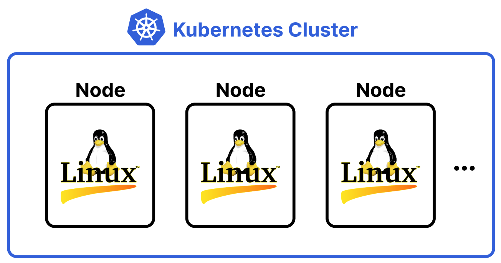
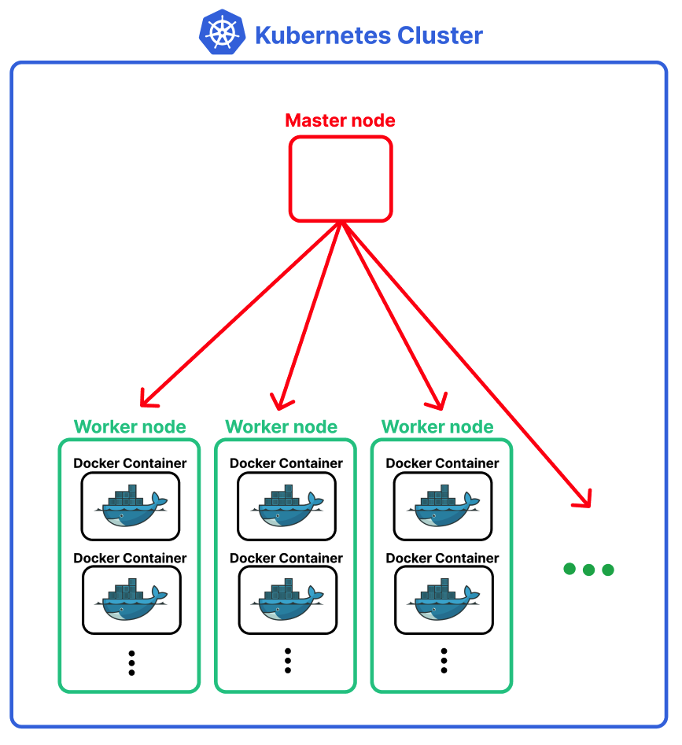
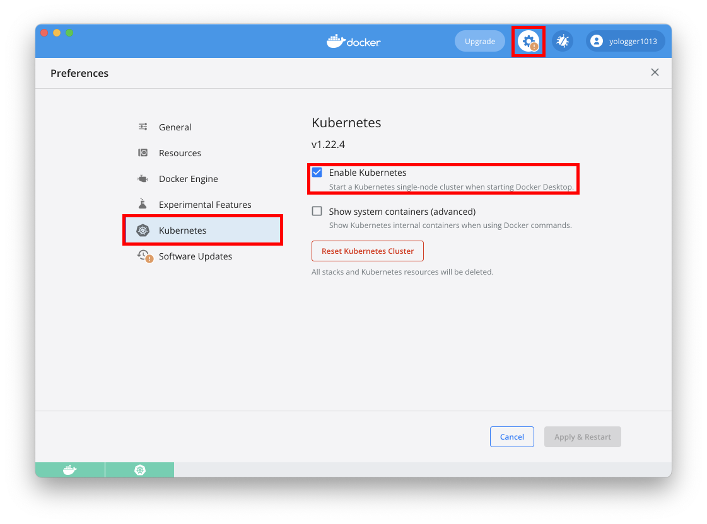

# Table of Contents
[[toc]]

## Kubernetes
`Kubernetes`는 <u>컨테이너 오케스트레이션</u> 시스템으로 다음과 같은 기능을 제공한다.
- `클러스터링`
    - 쿠버네티스는 여러 실제 서버를 논리적으로 하나의 서버로 클러스터링해준다.
    - 각 서버는 직접 구축한 온프레미스 서버일 수도 있고, AWS EC2처럼 클라우드 서버일 수도 있다.
- `오토 스케일링`
    - 쿠버네티스는 트래픽에 따라 노드나 컨테이너를 쉽게 수평적으로 확장(Scale-out) 할 수 있다.
- `셀프 힐링`
    - 쿠버네티스는 특정 노드나 컨테이너가 다운되어도 자동으로 복구할 수 있다.
- `로드 밸런싱`
    - 쿠버네티스는 노드나 컨테이너에 트래픽을 골고루 분배해준다.
- `롤링 업데이트`
    - 쿠버네티스는 서비스의 중단없이 새로운 버전을 노드나 컨테이너에 순차적으로 적용하는 무중단 배포를 지원한다.
- `롤백`
    - 쿠버네티스는 이전 버전으로 쉽게 돌아가는 롤백 기능을 제공한다.
- 그 밖에도 `네트워킹`, `보안`, `스토리지` 등의 다양한 기능을 제공한다.

## Master node, Worker node
쿠버네티스는 여러 서버를 `클러스터(Cluster)`로 만들어준다. 쿠버네티스에서는 각 서버를 `노드(Node)`라고 한다.



`마스터 노드(Master node)`는 클러스터와 워커 노드를 관리하며, `워커 노드(Worker node)`에는 컨테이너가 생성된다. (마스터 노드에도 컨테이너가 생성될 수 있다.)



보통 다음과 같은 순서로 쿠버네티스 클러스터를 구축한다.
1. 실제 서버든 클라우드 서비스의 서버든 상관없이 노드 역할을 할 서버를 세 개 이상 준비한다.
2. 모든 서버에 쿠버네티스를 설치한다.
3. 마스터 노드 역할을 할 서버를 선택한다.
4. 사용자는 `kubectl`로 마스터 노드에 접속하여 워커 노드를 등록한다.
5. 사용자는 워커 노드에 접속하여 마스터 노드에 대한 정보를 등록하여 클러스터 구축을 마무리한다.
6. 모든 노드에 설치된 `kubelet`이 유기적으로 통신하며 하나의 서버처럼 동작한다. 
7. 사용자는 마스터 노드에 접속하여 클러스터를 관리, 운영한다.

## 다양한 Kubernetes 환경

### 개발 환경
개발 환경에서는 하나의 노드로 구성된 쿠버네티스를 구축할 수 있다. 리눅스 환경에서는 `Minikube`, Mac OS 환경에서는 `Docker Destkop for Mac`, Window 환경에서는 `Docker Desktop for Window`를 설치하면 된다.

### 운영 환경 - 온프레미스
`온프레미스`는 AWS 같은 클라우드 서비스를 이용하지 않고 자체적인 서버실을 구축하여 운영하는 방식을 말한다. 온프레미스 환경에서는 `kubeadm`, `kubelet`를 설치하여 쿠버네티스 클러스터를 구축할 수 있다.

### 운영 환경 - 클라우드 컴퓨팅 서비스에 쿠버네티스 클러스터 구성
AWS EC2와 같은 클라우드 컴퓨팅 서비스에 쿠버네티스 클러스터를 구축할 수도 있다. 보통 `kubeadm`, `kubelet`를 사용한다.

### 운영 환경 - 쿠버네티스 클러스터 관리 서비스
온프레미스 환경이든 AWS EC2 클라우드 컴퓨팅 서비스를 사용하든 마스터 노드를 선택한 후 마스터 노드에서 클러스터 구성을 위한 복잡한 환경설정을 해야한다.

`AWS EKS(Elastic Kubernetes Service)`, `GCP GKE(Google Kubernetes Engine)` 같은 서비스는 마스터 노드 역할을 하는 클라우드 컴퓨팅 서비스를 제공한다. 이를 통해 좀 더 쉽게 쿠버네티스 클러스터를 구축할 수 있다.

## Mac OS에서 쿠버네티스 시작하기
`Docker Desktop for Mac`에는 쿠버네티스가 내장되어있다. `Docker Desktop for Mac`을 실행하여 다음과 같은 순서로 쿠버네티스를 활성화하면 된다.



`kubectl version` 명령어로 쿠버네티스 버전을 확인해보자.

``` shellsession
$ kubectl version  
Client Version: version.Info{Major:"1", Minor:"22", GitVersion:"v1.22.4", GitCommit:"b695d79d4f967c403a96986f1750a35eb75e75f1", GitTreeState:"clean", BuildDate:"2021-11-17T15:48:33Z", GoVersion:"go1.16.10", Compiler:"gc", Platform:"darwin/amd64"}
Server Version: version.Info{Major:"1", Minor:"22", GitVersion:"v1.22.4", GitCommit:"b695d79d4f967c403a96986f1750a35eb75e75f1", GitTreeState:"clean", BuildDate:"2021-11-17T15:42:41Z", GoVersion:"go1.16.10", Compiler:"gc", Platform:"linux/amd64"}
```

`kubectl get nodes`명령어로 클러스터에 포함된 노드들을 확인할 수 있다. 현재 하나의 노드를 확인할 수 있다.
``` shellsession
$ kubectl get nodes
NAME             STATUS   ROLES                  AGE   VERSION
docker-desktop   Ready    control-plane,master   66m   v1.22.4
```

## kubectl 명령어 정리
`kubectl`은 쿠버네티스 클러스터를 제어하기위한 커맨드 라인 도구다. 보통 `kubectl`로 각 노드에 접속하여 노드들을 관리, 운영한다.

### 모든 노드 확인하기
`kubectl get nodes`명령어로 클러스터에 포함된 노드들을 확인할 수 있다. 현재 하나의 노드를 확인할 수 있다.
``` shellsession
$ kubectl get nodes
NAME             STATUS   ROLES                  AGE   VERSION
docker-desktop   Ready    control-plane,master   66m   v1.22.4
```