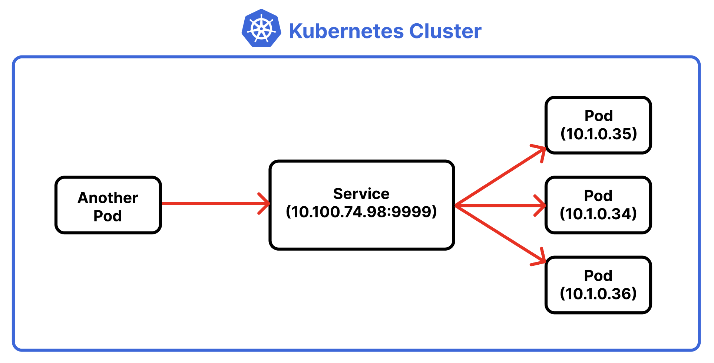
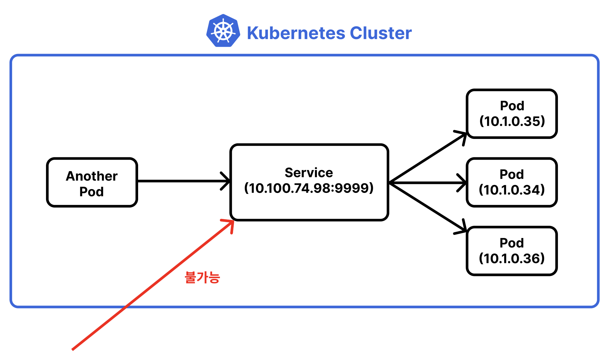
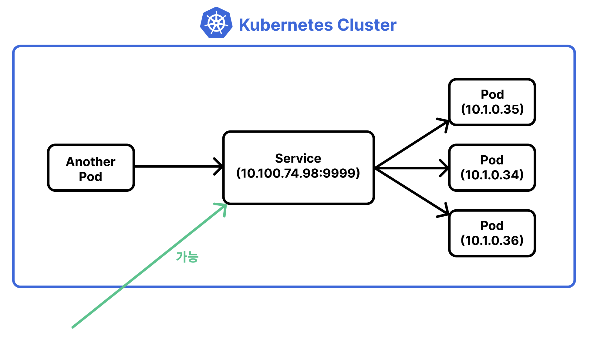

# Table of Contents
[[toc]]

# 오브젝트
쿠버네티스는 자원을 `오브젝트(Object)`라는 형태로 관리한다. 자주 사용하는 오브젝트는 다음과 같다.
- `Pod`
- `ReplicaSet`
- `Deployment`
- `Configmap`
- `Secret`
- `Namespace`
- `Service`
- `Ingress`

## 오브젝트 종류 확인하기
``` shellsession
$ kubectl api-resources
NAME                              SHORTNAMES   APIVERSION                             NAMESPACED   KIND
pods                              po           v1                                     true         Pod
replicasets                       rs           apps/v1                                true         ReplicaSet
services                          svc          v1                                     true         Service
deployments                       deploy       apps/v1                                true         Deployment
configmaps                        cm           v1                                     true         ConfigMap
secrets                                        v1                                     true         Secret
namespaces                        ns           v1                                     false        Namespace
ingresses                         ing          networking.k8s.io/v1                   true         Ingress
....
```

## YAML Configuration 파일
쿠버네티스틑 `.yml` 확장자를 갖는 `YAML 파일`에 오브젝트를 선언하고 설정한다. 그리고 `kubectl apply <YAML 파일>` 명령어로 클러스터를 실행한다.


## Pod
- 컨테이너 애플리케이션의 기본 단위를 `팟(Pod)`이라고 한다.
- 팟은 하나 이상의 도커 컨테이너로 구성된다.

하나의 Nginx 컨테이너로 구성된 간단한 팟을 생성해보자. 먼저 `nginx-pod.yml`파일을 다음과 같이 작성한다.
``` yml
apiVersion: v1
kind: Pod
metadata:
  name: nginx-pod  # Pod 이름
spec:
  containers:  # Pod에 생성할 컨테이너 나열
    - name: nginx-container  # 컨테이너 이름
      image: nginx:latest  # 컨테이너 이미지
      ports:
      - containerPort: 80
        protocol: TCP
```
- `kind`: 오브젝트 종류
- `metadata.name`: 팟 이름
- `spec`: 오브젝트 생성을 위한 상세한 종료
- `spec.containers`: 팟에 생성할 컨테이너들을 나열한다.

### 팟 생성 및 실행
`kubectl apply -f <YAML 파일>` 명령어로 클러스터에서 팟을 실행할 수 있다.
``` shellsession
$ kubectl apply -f nginx-pod.yml
pod/nginx-pod created
```
하나의 도커 컨테이너가 생성된 것도 확인할 수 있다.
``` shellsession
$ docker ps -al
ONTAINER ID   IMAGE     COMMAND                  CREATED          STATUS          PORTS     NAMES
fe068fdc944c   nginx     "/docker-entrypoint.…"   24 seconds ago   Up 24 seconds             k8s_nginx-container_nginx-pod_default_e1574fb9-c59e-4916-8bcc-188a5640f6cd_0
```

참고로 YAML 파일에 `---`를 명시하여 여러 오브젝트를 선언할 수 있다. 다음 예제는 두 개의 팟을 선언하고 있다.
``` yml
apiVersion: v1
kind: Pod
metadata:
  name: nginx-pod-1
spec:
  containers:  
    - name: nginx-container
      image: nginx:latest
      ports:
      - containerPort: 80
        protocol: TCP
---
apiVersion: v1
kind: Pod
metadata:
  name: nginx-pod-2
spec:
  containers:  
    - name: nginx-container
      image: nginx:latest
      ports:
      - containerPort: 80
        protocol: TCP
```

### 오브젝트 목록 확인
`kubectl get <오브젝트 이름>` 명령어로 오브젝트 목록을 확인할 수 있다.
``` shellsession
$ kubectl get pods
NAME        READY   STATUS    RESTARTS   AGE
nginx-pod   1/1     Running   0          3m
```
`READY`의 `1/1`은 한 개의 컨테이너 중 한 개의 컨테이너가 정상 실행 중이라는 의미다.

`-o wide` 옵션으로 팟에 할당된 IP도 확인할 수 있다.
```
$ kubectl get pods -o wide
NAME        READY   STATUS    RESTARTS   AGE   IP          NODE             NOMINATED NODE   READINESS GATES
nginx-pod   1/1     Running   0          70m   10.1.0.33   docker-desktop   <none>           <none>
```

::: warning
팟은 별도의 설정을 하지 않으면 쿠버네티스 클러스터 내부, 즉 <u>내부 다른 팟</u>에서만 해당 팟과 통신할 수 있다. 외부에서 팟의 통신을 허용하려면 뒤에서 살펴볼 `서비스(Service)`나 `인그레스(Ingress)`가 필요하다.
:::

### 오브젝트 상세정보 확인
`kubectl describe <오브젝트 종류> <오브젝트 이름>`으로 오브젝트의 상세한 정보를 확인할 수 있다.
``` shellsession {5,10}
$ kubectl describe pods nginx-pod    
Name:         nginx-pod
Namespace:    default
Priority:     0
Node:         docker-desktop/192.168.65.4   // 노드 IP
Start Time:   Tue, 19 Apr 2022 14:23:56 +0900
Labels:       <none>
Annotations:  <none>
Status:       Running
IP:           10.1.0.33   // 팟 IP
IPs:
  IP:  10.1.0.33
Containers:
  nginx-container:
    Container ID:   docker://fe068fdc944c8d64e198c6da83eb29d8f97340412679605c6ba15bda710efe31
    Image:          nginx:latest
    Image ID:       docker-pullable://nginx@sha256:2275af0f20d71b293916f1958f8497f987b8d8fd8113df54635f2a5915002bf1
    Port:           80/TCP
    // 생략 ...
```

### 컨테이너 내부에 접속하기
`kubectl exec -it <팟 이름> -c <컨테이너 이름> <사용할 쉘>`로 팟 내부 컨테이너에 접속할 수 있다.
``` shellsession
$ kubectl exec -it nginx-pod -c nginx-container bash
root@nginx-pod:/# 
```

`Nginx`가 실행 중인지 확인해보자.
``` shellsession
$ curl localhost
<!DOCTYPE html>
<html>
<head>
<title>Welcome to nginx!</title>
<style>
html { color-scheme: light dark; }
body { width: 35em; margin: 0 auto;
font-family: Tahoma, Verdana, Arial, sans-serif; }
</style>
</head>
<body>
<h1>Welcome to nginx!</h1>
<p>If you see this page, the nginx web server is successfully installed and
working. Further configuration is required.</p>

<p>For online documentation and support please refer to
<a href="http://nginx.org/">nginx.org</a>.<br/>
Commercial support is available at
<a href="http://nginx.com/">nginx.com</a>.</p>

<p><em>Thank you for using nginx.</em></p>
</body>
</html>
```

### 팟 로그 확인하기
`kubectl logs nginx-pod` 명령어로 팟 로그를 확인할 수 있다.
``` shellsession
$ kubectl logs nginx-pod
```

### 팟 삭제
`kubectl delete -f <yml 파일>` 명령어로 팟을 삭제할 수 있다.
``` shellsession
$ kubectl delete -f nginx-pod.yml
pod "nginx-pod" deleted
```

### Pod vs. Docker container
팟은 여러 컨테이너를 포함할 수도 있다. `nginx-pod.yml` 파일을 다음과 같이 수정하자.

``` yml{2,14-18}
apiVersion: v1
kind: Pod
metadata:
  name: nginx-pod
spec:
  containers:
    # 첫번째 컨테이너
    - name: nginx-container
      image: nginx:latest
      ports:
      - containerPort: 80
        protocol: TCP

    # 두번째 컨테이너
    - name: ubuntu-container
      image: ubuntu:latest
      command: ["tail"]
      args: ["-f", "/dev/null"]
```

두 개의 컨테이너가 생성된 것을 확인할 수 있다.
``` shellsession
$ kubectl get pods              
NAME        READY   STATUS    RESTARTS   AGE
nginx-pod   2/2     Running   0          116s
```

## ReplicaSet
`레플리카셋(ReplicaSet)`은 다음 기능을 제공하는 오브젝트다.

- 동일한 팟 여러 개를 쉽게 생성, 관리할 수 있다. 
- 지정한 개수의 팟을 항상 유지하기 때문에 특정 팟이 다운되어도 팟을 새롭게 생성하거나 재시작한다.

세 개의 동일한 팟을 유지하는 레플리카셋을 생성해보자. `nginx-replicaset.yml`을 다음과 같이 작성한다.
``` yml {3,7}
# nginx-replicaset.yml
apiVersion: apps/v1
kind: ReplicaSet
metadata:
  name: nginx-replicaset
spec:
  replicas: 3
  selector: 
    matchLabels: 
      app: nginx-pod-label
  template:
    metadata:
      name: nginx-pod
      labels:
        app: nginx-pod-label
    spec:
      containers:
      - name: nginx
        image: nginx:latest
        ports:
        - containerPort: 80
``` 
- `spec.replicas`: 생성할 팟의 수

이제 다음과 같이 레플리카셋을 생성하자.
``` shellsession
$ kubectl apply -f nginx-replicaset.yml
```
세 개의 팟이 생성된 것을 확인할 수 있다.
``` shellsession
$ kubectl get pods
NAME                     READY   STATUS    RESTARTS   AGE
nginx-replicaset-6txwh   1/1     Running   0          102s
nginx-replicaset-tvsg6   1/1     Running   0          102s
nginx-replicaset-xc5xt   1/1     Running   0          102s
```
``` shellsession
$ kubectl get replicaset
NAME               DESIRED   CURRENT   READY   AGE
nginx-replicaset   3         3         3       2m25s
```
레플리카를 다섯 개로 수정하고 `kubectl apply -f` 명령어를 다시 실행해보자.
``` shellsession {3,4}
$ kubectl get pods                  
NAME                     READY   STATUS              RESTARTS   AGE
nginx-replicaset-5xltl   1/1     Running             0          4s
nginx-replicaset-nlnsn   1/1     Running             0          4s
nginx-replicaset-6txwh   1/1     Running             0          3m44s
nginx-replicaset-tvsg6   1/1     Running             0          3m44s
nginx-replicaset-xc5xt   1/1     Running             0          3m44s
```
두 개의 팟이 추가적으로 생성되었다.

## Deployment
`디플로이먼트(Deployment)`는 다음 기능을 제공하는 오브젝트다.

- 애플리케이션의 배포와 롤링 업데이트를 지원한다.
- 이전 배포 버전으로 쉽게 롤백할 수 있다.

우선 디플로이먼트를 정의한 간단한 `nginx-deployment.yml` 파일을 생성하자. `1.10` 버전의 `nginx`를 사용하고 있는 것에 주목하자.
``` yml {2,18}
apiVersion: apps/v1
kind: Deployment
metadata:
  name: nginx-deployment
spec:
  replicas: 3
  selector:
    matchLabels:
      app: nginx-pod-label
  template:
    metadata:
      name: nginx-pod
      labels: 
        app: nginx-pod-label
    spec:
      containers:
        - name: nginx-container
          image: nginx:1.10
          ports:
          - containerPort: 80
```

이제 디플로이먼트를 생성하자. 이때 `--record` 옵션을 추가한다.
``` shellsession
$ kubectl apply -f nginx-deployment.yml --record
deployment.apps/nginx-deployment created
```
디플로이먼트가 생성되었다.
``` shellsession
$ kubectl get deployment
NAME               READY   UP-TO-DATE   AVAILABLE   AGE
nginx-deployment   3/3     3            3           116s
```
하나의 레플리카도 생성되었다.
``` shellsession
$ kubectl get replicaset
NAME                          DESIRED   CURRENT   READY   AGE
nginx-deployment-796dd5cd88   3         3         3       3m50s
```
세 개의 팟도 생성되었다.
``` shellsession
$ kubectl get pods
NAME                                READY   STATUS    RESTARTS   AGE
nginx-deployment-796dd5cd88-mnlpc   1/1     Running   0          105s
nginx-deployment-796dd5cd88-nsdlp   1/1     Running   0          105s
nginx-deployment-796dd5cd88-q97dp   1/1     Running   0          105s
```

지금까지는 디플로이먼트가 레플리카와 다를게 없어보인다. 이제 `nginx-deployment.yml` 파일에서 `nginx`의 버전을 `1.10`에서 `1.11`로 변경하자.
``` yml {5}
# 생략 ...
containers:
- name: nginx-container
    # image: nginx: 1.10
    image: nginx: 1.11
    ports:
    - containerPort: 80
```

그 다음 `kubectl apply -f` 명령어를 다시 실행한다.
``` shellsession
$ kubectl apply -f nginx-deployment.yml --record
```
팟들이 새롭게 생성된 것을 확인할 수 있다. 쿠버네티스가 각각의 팟들을 새로운 버전으로 롤링 업데이트한 것이다.
``` shellsession
$ kubectl get pods
NAME                               READY   STATUS    RESTARTS   AGE
nginx-deployment-664f4c64c-6wxxs   1/1     Running   0          32s
nginx-deployment-664f4c64c-ksdt4   1/1     Running   0          23s
nginx-deployment-664f4c64c-xz7vc   1/1     Running   0          25s
```
이제 레플리카 셋을 확인해보자. 기존 레플리카셋과 새로운 레플리카셋이 존재한다.
``` shellsession
$ kubectl get replicaset
NAME                          DESIRED   CURRENT   READY   AGE
nginx-deployment-664f4c64c    3         3         3       2m59s
nginx-deployment-796dd5cd88   0         0         0       10m
```
다음 명령어로 이전 버전으로 롤백을 할 수도 있다.
``` shellsession
$ kubectl rollout undo deployment nginx-deployment --to-revision=1
deployment.apps/nginx-deployment rolled back
```
``` shellsession
$ kubectl get pods
NAME                                READY   STATUS    RESTARTS   AGE
nginx-deployment-796dd5cd88-gtmjz   1/1     Running   0          12s
nginx-deployment-796dd5cd88-m4v8v   1/1     Running   0          9s
nginx-deployment-796dd5cd88-tnh5j   1/1     Running   0          11s
```

## Service
`서비스(Service)`는 크게 세 가지 역할을 하는 오브젝트다.

- `팟 주소 고정`: 레플리카셋이나 디플로이먼트로 띄운 팟은 쿠버네티스 클러스터의 상황에 따라서 노드를 옮겨다니기도 하고 재시작되기도 한다. IP 주소가 변하기도 한다. 서비스의 `셀렉터(Selector)`, 팟의 `라벨(Label)`를 사용하면 팟이 어떤 노드에 있든 고정된 방법으로 접근할 수 있다.

- `팟 외부 노출`: 컨테이너와 쿠버네티스 클러스터의 포트를 <u>바인딩</u>하고 컨테이너 포트를 외부로 노출하는 오브젝트다.  즉 서비스는 클러스터로 들어온 요청을 컨테이너로 <u>포워딩</u>해준다. 

- `로드 밸런싱`: 요청을 여러 팟으로 분산하여 보낸다. 


서비스는 크게 세 가지 타입이 존재한다.
|종류|설명|
|---|---|
|`ClusterIP`|쿠버네티스 내부의 포트를 외부로 노출하지 않는 서비스|
|`NodePort`|쿠버네티스 내부의 포트를 쿠버네티스 클러스터의 포트와 바인딩해주는 서비스. 또한 요청을 팟들에 로드밸런싱 해준다. 주로 <u>온프레미스 환경</u>에서 사용한다.|
|`LoadBalancer`|쿠버네티스 내부의 포트를 쿠버네티스 클러스터의 포트와 바인딩해주는 서비스. 또한 요청을 팟들에 로드밸런싱 해준다. AWS, GCP 등 <u>클라우드 서비스</u>에서 사용한다.|


실제 운영 환경에서는 `컨테이너 외부 노출` 기능은 서비스 대신 `인그레스(Ingress)`를 사용하여 구축한다. 서비스는 주로 `로드 밸런싱`에 사용된다.

### 외부 노출
::: warning
기본적으로 쿠버네티스는 팟을 외부에 노출하지 않는다. 이 때문에 <u>쿠버네티스 클러스터 내부 다른 팟</u>에서만 해당 팟과 통신할 수 있다.
:::
::: warning
팟을 <u>클러스터 구성하는 노드</u>로 노출하는지는 쿠버네티스의 네트워크 모델에 따라 다르다. 일반적으로 `Docker Desktop for Mac OS`, `Docker Desktop for Window`, `온프레미스 모델`에서는 클러스터를 구성하는 노드로 조차 포드를 노출하지 않는다. 반면 일부 퍼블릭 클라우드 쿠버네티스는 별다른 설정 없이도 클러스터를 구성하는 노드에게는 포드를 노출하기도 한다.
:::

### 팟 주소 고정
쿠버네티스는 팟에 동적으로 IP를 할당한다.

우선 아래 YAML 설정파일로 팟들을 생성해보자. 팟에는 `nginx-pod-label`이라는 라벨을 붙였다.
``` yml {9,10,15}
# nginx-deployment.yml
apiVersion: apps/v1
kind: Deployment
metadata:
  name: nginx-deployment
spec:
  replicas: 3
  selector:
    matchLabels:
      app: nginx-pod-label
  template:
    metadata:
      name: nginx-pod
      labels: 
        app: nginx-pod-label
    spec:
      containers:
        - name: nginx-container
          image: nginx:1.11
          ports:
          - containerPort: 80
```
3개의 팟과 각각의 IP를 확인할 수 있다.
``` shellsession
$ kubectl get pods -o wide       
NAME                               READY   STATUS    RESTARTS   AGE   IP          NODE             
nginx-deployment-664f4c64c-jsc5x   1/1     Running   0          45s   10.1.0.35   docker-desktop
nginx-deployment-664f4c64c-s2tqf   1/1     Running   0          45s   10.1.0.36   docker-desktop
nginx-deployment-664f4c64c-sl7dc   1/1     Running   0          45s   10.1.0.34   docker-desktop
```

각 팟에 할당된 IP는 쿠버네티스의 상태에 따라 동적으로 변한다. 따라서 IP가 아닌 다른 고정된 주소로 팟에 접근할 수 있어야 한다.

### ClusterIP
서비스는 IP가 아닌 `셀렉터(Selector)`를 사용한다. 서비스는 마치 DNS 처럼 동작하며, IP 대신 팟을 구분하는 `라벨(Label)`을 사용한다.

서비스 생성을 위한 설정파일은 다음과 같다.
``` yml {11,12,13}
# nginx-service-clusterip.yml
apiVersion: v1
kind: Service
metadata:
  name: nginx-service-clusterip
spec:
  ports:
    - name: nginx-pods-port
      port: 9999
      targetPort: 80
  selector:
    app: nginx-pod-label
  type: ClusterIP  
```
생성된 서비스는 다음과 같다.
``` shellsession {4}
kubectl get services
NAME                      TYPE        CLUSTER-IP     EXTERNAL-IP   PORT(S)    AGE
kubernetes                ClusterIP   10.96.0.1      <none>        443/TCP    22h
nginx-service-clusterip   ClusterIP   10.100.74.98   <none>        9999/TCP   17s
```
이제 다른 팟에서 서비스의 고정된 `CLUSTER-IP`와 `PORT`로 요청을 보내면 된다. 
```
$ curl 10.100.74.98:9999
```

서비스로 요청을 보내면 로드밸런싱도 수행된다.



`ClusterIP` 타입의 서비스는 팟을 외부로 노출하지 않기 때문에 클러스터 외부 네트워크에서는 접근할 수 없다.



### NodePort
`NodePort` 타입 서비스는 ClusterIP와 유사하다. 다만 외부 네트워크에서도 팟에 접근하도록 팟을 외부에 노출한다.
``` yml {13}
# nginx-service-nodeport.yml
apiVersion: v1
kind: Service
metadata:
  name: nginx-service-nodeport
spec:
  ports:
    - name: nginx-pods-port
      port: 9999
      targetPort: 80
  selector:
    app: nginx-pod-label
  type: NodePort  
```

서비스를 생성하자.
``` shellsession
$ kubectl apply -f nginx-service-nodeport.yml 
```

생성된 팟은 다음과 같다.
``` shellsession {3}
$ kubectl get services                        
NAME                     TYPE        CLUSTER-IP    EXTERNAL-IP   PORT(S)          AGE
kubernetes               ClusterIP   10.96.0.1     <none>        443/TCP          22h
nginx-service-nodeport   NodePort    10.99.245.9   <none>        9999:31667/TCP   4s
```

클러스터 내부에서 사용되는 `9999` 포트 외에도 `31667`라는 포트가 생성됐다. `31667` 포트는 외부 네트워크로 노출되는 포트이며, 외부 네트워크에서 팟에 접속할 수 있다.
```
$ curl <클러스터의 공인IP>:31667
```



## Namespace
`네임스페이스(Namespace)`를 사용하면 클러스터에서 여러 오브젝트를 논리적으로 구분할 수 있다.

### 네임스페이스 목록 확인
`kubectl get namespaces` 명령어로 네임스페이스 목록을 확인할 수 있다.
``` shellsession
$ kubectl get namespaces 
NAME              STATUS   AGE
kube-public       Active   25h
kube-system       Active   25h
default           Active   25h
```

쿠버네티스는 기본적으로 3개의 네임스페이스를 제공한다. `kube-public`와 `kube-system`는 시스템에서 사용하는 네임스페이스다. `default`는 기본으로 생성되는 네임스페이스로, 오브젝트를 생성할 때 별도의 네임스페이스를 지정하지 않으면 이 네임스페이스에 오브젝트가 생성된다.

### 네임스페이스 생성
다음과 같이 `YAML 설정 파일`로 네임스페이스를 생성할 수 있다.
``` yml
# my-namespace.yml
apiVersion: v1
kind: Namespace
metadata:
  name: my-namespace
```
``` shellsession
$ kubectl apply -f my_namespace.yml 
```
`kubectl create namespace <네임스페이스 이름>` 명령어로도 네임스페이스를 생성할 수 있다.
``` shellsession
$ kubectl create namespace your-namespace
```
2개의 네임스페이스가 생성된 것을 확인할 수 있다.
``` shellsession {6-7}
$ kubectl get namespace 
NAME              STATUS   AGE
default           Active   25h
kube-public       Active   25h
kube-system       Active   25h
my-namespace      Active   3m35s
your-namespace    Active   52s
```

### 네임스페이스에 오브젝트 생성하기
YAML 설정파일에서 `metadata.namespace` 항목을 다음과 같이 설정하면 된다.
``` yml {6}
# nginx-pod.yml
apiVersion: v1
kind: Pod
metadata:
  name: nginx-pod
  namespace: my-namespace
spec:
  containers:
    - name: nginx-container
      image: nginx:latest
      ports:
      - containerPort: 80
        protocol: TCP
```

### 특정 네임스페이스에 포함되는 오브젝트만 조회하기
`--all-namespaces` 옵션으로 네임스페이스 정보도 함께 출력할 수 있다.
``` shellsession
$ kubectl get pods --all-namespaces
NAMESPACE      NAME           READY   STATUS    RESTARTS         AGE
my-namespace   nginx-pod      1/1     Running   0                5m27s
...
```
`-n <네임스페이스 이름>` 옵션으로 특정 네임스페이스에 속하는 오브젝트만 조회할 수 있다.
``` shellsession
$ kubectl get pods -n my-namespace
NAME        READY   STATUS    RESTARTS   AGE
nginx-pod   1/1     Running   0          7m45s
```

### 네임스페이스 삭제
`kubectl delete namespace <네임스페이스 이름>` 명령어로 네임스페이스를 삭제할 수 있다.
``` shellsession
$ kubectl create configmap my-configmap
 --from-literal NAME=paul
```

## Configmap
`컨피그맵(Configmap)`은 설정값을 저장할 수 있는 오브젝트다. 컨피그맵은 네임스페이스별로 존재한다.

### 컨피그맵 생성
`kubectl create configmap <이름> --from-literal <키=값>`으로 컨피그맵을 생성할 수 있다.
``` shellsession
$ kubectl create configmap my-configmap --from-literal DB_URL=localhost
```

YAML 설정파일을 사용할 수도 있다.
``` yml
# your-configmap.yml
apiVersion: v1
kind: ConfigMap
metadata:
  name: your-configmap
data:
  DB_URL: localhost
  DB_USER: myuser
  DB_PASSWORD: mypassword
```

``` shellsession
$ kubectl apply -f your-configmap.yml
```

### 컨피그맵 확인
`kubectl get configmap`명령어로 컨피그맵을 확인할 수 있다.
``` shellsession
$ kubectl get configmap
NAME               DATA   AGE
my-configmap       1      70s
your-configmap     3      13s
```

`kubectl describe configmap <컨피그맵 이름>`으로 컨피그맵의 키-값을 확인할 수 있다.
``` shellsession
$ kubectl describe configmap your-configmap
Name:         your-configmap
Namespace:    default
Labels:       <none>
Annotations:  <none>

Data
====
DB_PASSWORD:
----
mypassword
DB_URL:
----
localhost
DB_USER:
----
myuser

BinaryData
====

Events:  <none>
```

### YAML 설정파일에서 컨피그맵 사용하기
컨피그맵의 키-값은 컨테이너가 생성될 때 환경변수로 추가된다.

이를 확인하기 위해 `nginx-pod.yml` 파일을 다음과 같이 수정하자.
``` yml {9-11}
apiVersion: v1
kind: Pod
metadata:
  name: nginx-pod
spec:
  containers:
    - name: nginx-container
      image: nginx:latest
      envFrom:
      - configMapRef:
          name: your-configmap
      ports:
      - containerPort: 80
        protocol: TCP
```

그 다음 컨테이너를 생성하자.
``` shellsession
$ kubectl apply -f nginx-pod.yml           
pod/nginx-pod created
```

그리고 컨테이너 내부에 접속한다.
``` shellsession
$ kubectl exec -it nginx-pod -c nginx-container bash
root@nginx-pod:/#
```

컨피그맵의 키-값이 컨테이너에 환경변수로 등록된 것을 확인할 수 있다.
``` shellsession
root@nginx-pod:/# echo $DB_PASSWORD
mypassword

root@nginx-pod:/# echo $DB_USER
myuser

root@nginx-pod:/# echo $DB_PASSWORD
mypassword
```


### 컨피그맵 삭제
`kubectl delete configmap <컨피그맵 이름>` 명령어로 컨피그맵을 삭제할 수 있다.
``` shellsession
$ kubectl delete configmap my-configmap
```

## Secret
`시크릿(Secret)`은 컨피그맵과 매우 유사하지만 값을 암호화하여 저장한다.

### 시크릿 생성
`kubectl create secret generic <시크릿 이름> --from-literal <키=값>` 명령어로 시크릿을 생성한다.
``` shellsession
kubectl create secret generic my-secret --from-literal DB_PASSWORD=1234
```

시크릿은 YAML 파일로 생성할 수도 있다.
``` yml
# your-secret.yml
apiVersion: v1
kind: Secret
metadata:
  name: your-secret
stringData:
  DB_URL: localhost
  DB_USER: myuser
  DB_PASSWORD: mypass
```
``` shellsession
$ kubectl apply -f your-secret.yml
```

### 시크릿 확인
`kubectl get secrets`명령어로 모든 시크릿을 확인할 수 있다.
``` shellsession
$ kubectl get secrets 
NAME                  TYPE                                  DATA   AGE
default-token-jsdgt   kubernetes.io/service-account-token   3      26h
my-secret             Opaque                                1      10m
your-secret           Opaque                                3      65s
```
`kubectl describe secret <시크릿 이름>` 명령어로 시크릿의 키-값을 확인해보자. 
``` shellsession
$ kubectl describe secret your-secret
Name:         your-secret
Namespace:    default
Labels:       <none>
Annotations:  <none>

Type:  Opaque

Data
====
DB_PASSWORD:  6 bytes
DB_URL:       9 bytes
DB_USER:      6 bytes
```
컨피그맵과 다르게 값을 직접 출력하지 않고 바이트 수만을 보여준다. `kubectl get secret <시크릿 이름> -o yaml` 명령어를 사용하면 저장된 값도 확인할 수 있다.
``` shellsession {4-6}
$ kubectl get secret your-secret -o yaml
apiVersion: v1
data:
  DB_PASSWORD: bXlwYXNz
  DB_URL: bG9jYWxob3N0
  DB_USER: bXl1c2Vy
kind: Secret
metadata:
  annotations:
    kubectl.kubernetes.io/last-applied-configuration: |
      {"apiVersion":"v1","kind":"Secret","metadata":{"annotations":{},"name":"your-secret","namespace":"default"},"stringData":{"DB_PASSWORD":"mypass","DB_URL":"localhost","DB_USER":"myuser"}}
  creationTimestamp: "2022-04-19T11:20:43Z"
  name: your-secret
  namespace: default
  resourceVersion: "54791"
  uid: 069997e5-4ab2-4b7c-9a82-ecbb1abc5521
type: Opaque
```
시크릿은 값을 base 64로 인코딩하여 저장한다. 따라서 값에 `bXlwYXNz`, `bG9jYWxob3N0` 같이 인코딩된 값이 저장된다.

### YAML 설정파일에서 시크릿 사용하기
시크릿의 키-값 또한 컨테이너가 생성될 때 환경변수로 추가된다.
``` yml {9-11}
apiVersion: v1
kind: Pod
metadata:
  name: nginx-pod
spec:
  containers:
    - name: nginx-container
      image: nginx:latest
      envFrom:
      - secretRef:
          name: your-secret
      ports:
      - containerPort: 80
        protocol: TCP
```

### 시크릿 삭제
`ubectl delete secret <시크릿 이름>` 명령어로 시크릿을 삭제할 수 있다.
``` shellsession
$ kubectl delete secret my-secret
```

## Ingress
`인그레스(Ingress)`는 크게 세 가지 기능을 제공한다.
- 컨테이너 외부 노출
- 포워딩
- SSL/TLS
