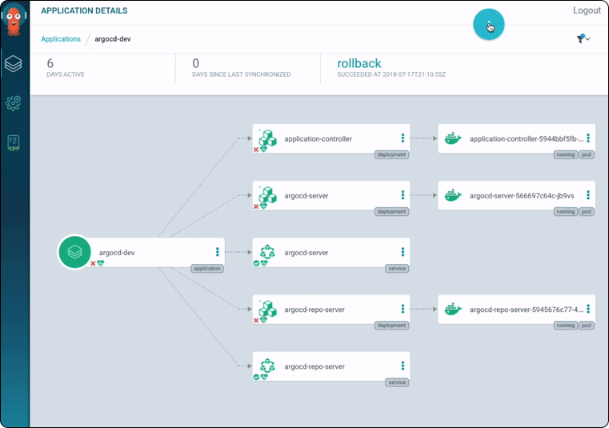
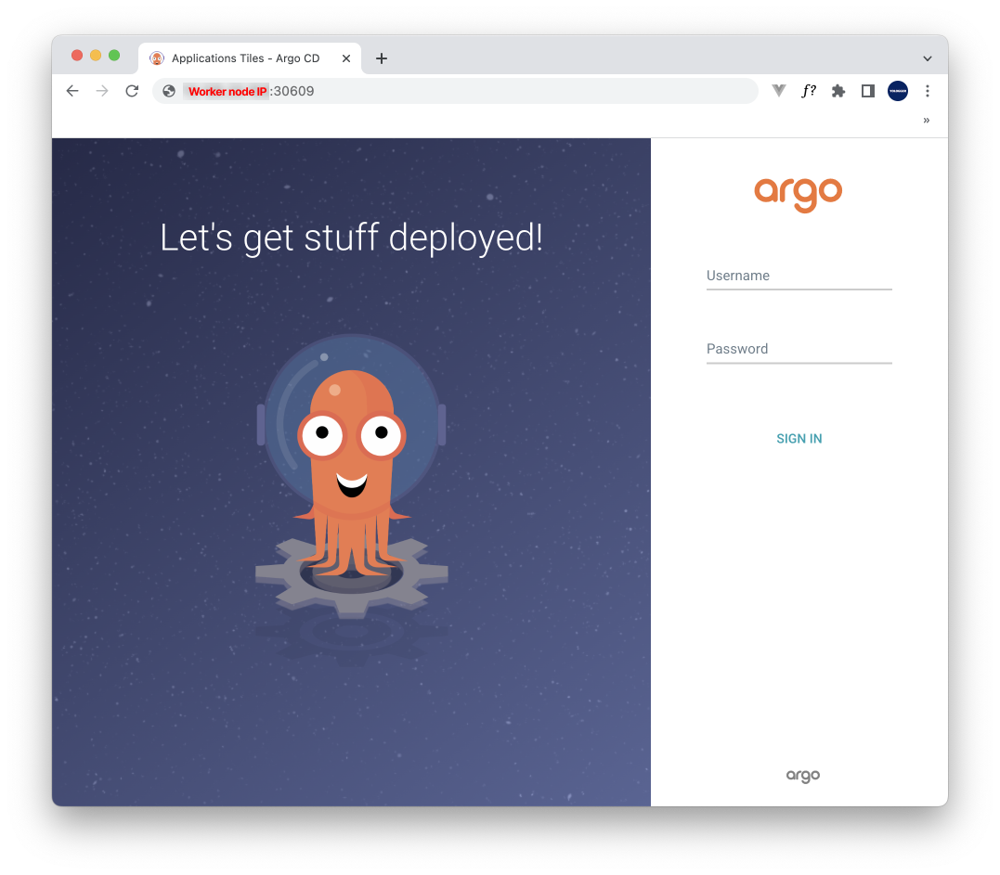

::: warning
미완성된 포스트입니다.
:::

# Table of Contents
[[toc]]

`Github Actions`와 `Argo CD`를 사용하여 스프링부트 프로젝트를 쿠버네티스 클러스터에 배포한다.

## 환경
- Spring Boot
- Github Actions
- AWS ECR
- Argo CD

## CI 구축하기
`Dockerfile`은 다음과 같다.
``` 
FROM openjdk:8-jdk-alpine
ARG JAR_FILE=build/libs/*.jar
COPY ${JAR_FILE} app.jar
ENTRYPOINT ["java","-Dspring.profiles.active=prod",  "-jar","/app.jar"]
```

Github Actions 스크립트는 다음과 같다.
``` yml
# main.yml
name: CI

on:
  push:
    branches: [ main ]
  pull_request:
    branches: [ main ]

  workflow_dispatch:

jobs:
  build:
    runs-on: ubuntu-latest

    steps:
      - name: Checkout
        uses: actions/checkout@v2

      - name: Set up JDK 1.8
        uses: actions/setup-java@v1
        with:
          java-version: 1.8

      - name: Grant execute permission for gradlew
        run: chmod +x gradlew

      - name: Add properties file
        run: echo '${{ secrets.APPLICATION_PROD_PROPERTIES }}' > ./src/main/resources/application-prod.properties

      - name: Build with Gradle
        run: ./gradlew clean build

      - name: Configure AWS credentials
        uses: aws-actions/configure-aws-credentials@v1
        with:
          aws-access-key-id: ${{ secrets.AWS_ACCESS_KEY_ID }}
          aws-secret-access-key: ${{ secrets.AWS_SECRET_ACCESS_KEY }}
          aws-region: ${{ secrets.AWS_REGION }}

      - name: Login to Amazon ECR
        id: login-ecr
        uses: aws-actions/amazon-ecr-login@v1

      - name: Build and Push images to AWS ECR
        id: build-image
        env:
          ECR_REGISTRY: ${{ steps.login-ecr.outputs.registry }}
          IMAGE_TAG: ${{ github.sha }}
        run: |
          docker build -t $ECR_REGISTRY/${{ secrets.ECR_REPOSITORY }}:$IMAGE_TAG .
          docker push $ECR_REGISTRY/${{ secrets.ECR_REPOSITORY }}:$IMAGE_TAG
          echo "::set-output name=image::$ECR_REGISTRY/${{ secrets.ECR_REPOSITORY }}:$IMAGE_TAG"
```

## ECR에서 도커 이미지 Pull 해오기
`CD(Continuous Deployment)`를 구축하기 전, ECR에서 수동으로 도커 이미지를 Pull 하는 방법에 대해 알아보자.

가장 먼저 `aws cli`를 설치한다.
```
$ curl "https://awscli.amazonaws.com/awscli-exe-linux-x86_64.zip" -o "awscliv2.zip"
$ sudo apt install unzip
$ unzip awscliv2.zip
$ sudo ./aws/install
```
`aws configure` 명령어로 `AmazonEC2ContainerRegistryFullAccess` 권한을 가진 사용자의 액세스 키, 비밀 키, 리전을 입력한다.
```
$ aws configure
AWS Access Key ID [None]: <YOUR_ACCESS_ID>
AWS Secret Access Key [None]: <YOUR_SECRET_ID>
Default region name [None]: <YOUR_REGION>
Default output format [None]: 
```
그 다음 명령어로 로그인한다.
```
$ aws ecr get-login-password --region <REGION> | docker login --username AWS --password-stdin <AWS_ACCOUNT_ID>.dkr.ecr.<REGION>.amazonaws.com
```
로그인 과정에서 다음 에러가 발생할 수 있다.
```
Got permission denied while trying to connect to the Docker daemon socket at unix:///var/run/docker.sock
```
`Docker`는 `/var/run/docker.sock`를 사용하여 ECR과 통신한다. 그런데 현재 리눅스 사용자가 이 파일이 접근할 권한이 없어 발생하는 문제다. 따라서 현재 사용자를 `docker` 그룹에 포함시켜준다.
```
$ sudo usermod -a -G docker $USER
```
세션을 다시 연결하고 로그인을 시도해보자. `Login Succeeded`가 출력되면 로그인에 성공한 것이다.
```
$ aws ecr get-login-password --region <REGION> | docker login --username AWS --password-stdin <AWS_ACCOUNT_ID>.dkr.ecr.<REGION>.amazonaws.com
Login Succeeded
```

이제 다음 명령어로 이미지를 다운받을 수 있다.
```
$ docker pull <AWS_ACCOUNT_ID>.dkr.ecr.<REGION>.amazonaws.com/<IMAGE>:<TAG>
```

## CD 구축하기

### Argo CD 설치하기
먼저 쿠버네티스 클러스터에서 `Argo CD`를 설치한다.
```
// 네임스페이스 생성
$ kubectl create namespace argocd

// Argo CD와 관련된 오브젝트 설치
$ kubectl apply -n argocd -f https://raw.githubusercontent.com/argoproj/argo-cd/stable/manifests/install.yaml
```
`Argo CD`와 관련된 오브젝트가 `argocd` 네임스페이스에 설치된다. 설치된 팟과 서비스를 확인해보자.
```
$ kubectl get pods -n argocd
NAME                                                READY   STATUS    RESTARTS   AGE
argocd-application-controller-0                     1/1     Running   0          119s
argocd-applicationset-controller-79f97597cb-gntdl   1/1     Running   0          2m
argocd-dex-server-6fd8b59f5b-gwwr9                  1/1     Running   0          2m
argocd-notifications-controller-5549f47758-4gqxv    1/1     Running   0          2m
argocd-redis-79bdbdf78f-k8ftl                       1/1     Running   0          2m
argocd-repo-server-5569c7b657-2df8d                 1/1     Running   0          2m
argocd-server-664b7c6878-krfp7                      1/1     Running   0          2m
```
```
$ kubectl get service -n argocd
NAME                                      TYPE        CLUSTER-IP       EXTERNAL-IP   PORT(S)                      AGE
argocd-applicationset-controller          ClusterIP   10.107.177.230   <none>        7000/TCP                     7m3s
argocd-dex-server                         ClusterIP   10.99.2.29       <none>        5556/TCP,5557/TCP,5558/TCP   7m3s
argocd-metrics                            ClusterIP   10.106.79.143    <none>        8082/TCP                     7m3s
argocd-notifications-controller-metrics   ClusterIP   10.107.128.107   <none>        9001/TCP                     7m3s
argocd-redis                              ClusterIP   10.99.61.196     <none>        6379/TCP                     7m3s
argocd-repo-server                        ClusterIP   10.105.139.69    <none>        8081/TCP,8084/TCP            7m3s
argocd-server                             ClusterIP   10.96.104.252    <none>        80/TCP,443/TCP               7m3s
argocd-server-metrics                     ClusterIP   10.110.209.117   <none>        8083/TCP                     7m3s
```

Argo CD는 웹 브라우저에서 GUI 형태로 관련된 오브젝트를 관리할 수 있도록 `Argo CD API server`를 제공한다. 



Argo CD가 설치되면 기본적으로 API server 접근하기 위한 서비스가 `Cluster IP`타입으로 설정된다. 클러스터 외부에서도 API server에 접근할 수 있도록 서비스 타입을 `NodePort`로 바꿔주자.

```
$ kubectl patch svc argocd-server -n argocd -p '{"spec": {"type": "NodePort"}}'
```
``` {9}
$ kubectl get service -n argocd
NAME                                      TYPE        CLUSTER-IP       EXTERNAL-IP   PORT(S)                      AGE
argocd-applicationset-controller          ClusterIP   10.107.177.230   <none>        7000/TCP                     8m40s
argocd-dex-server                         ClusterIP   10.99.2.29       <none>        5556/TCP,5557/TCP,5558/TCP   8m40s
argocd-metrics                            ClusterIP   10.106.79.143    <none>        8082/TCP                     8m40s
argocd-notifications-controller-metrics   ClusterIP   10.107.128.107   <none>        9001/TCP                     8m40s
argocd-redis                              ClusterIP   10.99.61.196     <none>        6379/TCP                     8m40s
argocd-repo-server                        ClusterIP   10.105.139.69    <none>        8081/TCP,8084/TCP            8m40s
argocd-server                             NodePort    10.96.104.252    <none>        80:30609/TCP,443:30992/TCP   8m40s
argocd-server-metrics                     ClusterIP   10.110.209.117   <none>        8083/TCP                     8m40s
```
이제 클러스터 외부에서 `<워커 노드 IP>:<외부노출 포트>` 형태로 API server에 접근할 수 있다.

::: warning
`EC2`로 클러스터를 구축한 경우 보안 그룹에서 해당 포트를 개방해야한다.
:::

제대로 접근한 경우 다음과 같이 로그인 화면이 나온다.



기본 계정은 `admin`이며, 비밀번호는 다음 명령어로 알아낼 수 있다.
```
$ kubectl -n argocd get secret argocd-initial-admin-secret -o jsonpath="{.data.password}" | base64 -d
```