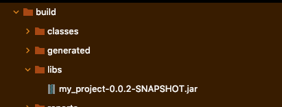
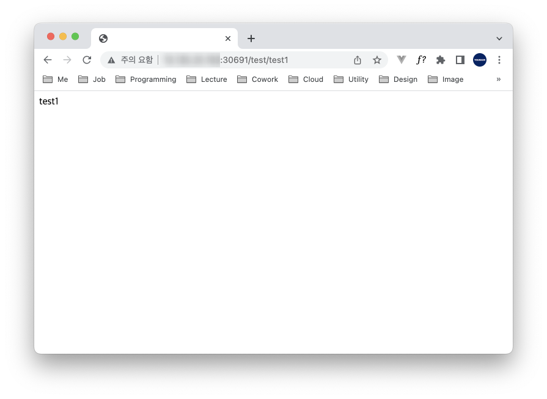

# Table of Contents
[[toc]]

# Dockerize Springboot & Deploy to Kubernetes
스프링 프로젝트를 도커 이미지로 빌드하고, 쿠버네티스 클러스터에 배포하는 과정에 대해 정리한다.

## Spring Boot 프로젝트를 Docker 이미지로 만들기
다음과 같은 간단한 Spring Boot 프로젝트가 있다.
``` java
// Application.java
@SpringBootApplication
public class Application {
    public static void main(String[] args) {
        SpringApplication.run(Application.class, args);
    }
}
```
``` java
// TestController.java
@RestController
@RequestMapping("/test")
public class TestController {

    @GetMapping("/test1")
    String test1() {
        return "test1";
    }
}
```
포트는 5000으로 설정되어있다.
``` properties
# application.properties
server.port = 5000
```

이 스프링 부트 프로젝트를 도커 이미지화 시키는 방법에는 두 가지가 있다.
- Dockerfile 사용하기
- Gradle bootBuildImage 

### Dokcerfile 사용하기

첫 단계는 프로젝트를 빌드하여 `JAR` 파일을 생성하는 것이다.
```
$ ./gradlew clean
$ ./gradlew build
```

`build/libs`에서 `JAR`를 확인할 수 있다.



이제 `Dockerfile`을 작성한다.
```
FROM openjdk:8-jdk-alpine
ARG JAR_FILE=build/libs/*.jar
COPY ${JAR_FILE} app.jar
ENTRYPOINT ["java","-jar","/app.jar"]
```

그 다음 도커 이미지를 생성한다.
``` shellsession
$ docker build -t springboot-image:0.1 .                                     
[+] Building 1.0s (7/7) FINISHED                                                                                                                                                                                                                                                                                        
 => [internal] load build definition from Dockerfile                                                                                                                                                                                                                                                               0.0s
 => => transferring dockerfile: 36B                                                                                                                                                                                                                                                                                0.0s
 => [internal] load .dockerignore                                                                                                                                                                                                                                                                                  0.0s
 => => transferring context: 2B                                                                                                                                                                                                                                                                                    0.0s
 => [internal] load metadata for docker.io/library/openjdk:8-jdk-alpine                                                                                                                                                                                                                                            0.9s
 => [internal] load build context                                                                                                                                                                                                                                                                                  0.0s
 => => transferring context: 119B                                                                                                                                                                                                                                                                                  0.0s
 => [1/2] FROM docker.io/library/openjdk:8-jdk-alpine@sha256:94792824df2df33402f201713f932b58cb9de94a0cd524164a0f2283343547b3                                                                                                                                                                                      0.0s
 => CACHED [2/2] COPY build/libs/*.jar app.jar                                                                                                                                                                                                                                                                     0.0s
 => exporting to image                                                                                                                                                                                                                                                                                             0.0s
 => => exporting layers                                                                                                                                                                                                                                                                                            0.0s
 => => writing image sha256:87a6c94ce7cc1a9d6634bdecc8e263cb5fa7ec8d8486ad713252637f194bc1ff                                                                                                                                                                                                                       0.0s
 => => naming to docker.io/library/springboot-image:0.1            
```
도커 이미지가 잘 생성되었는지 확인한다.
``` shellsession{3}
$ docker images
REPOSITORY                 TAG              IMAGE ID       CREATED              SIZE
springboot-image           0.1              87a6c94ce7cc   About a minute ago   122MB
```
도커 이미지로 컨테이너를 생성하고 실행한다. 이 때 호스트의 포트로 접근 시 컨테이너 내부 스프링 부트로 포워딩되도록 포트를 바인딩해야한다.
``` shellsession
$ docker run -d --name springboot-container -p 9999:5000 springboot-image:0.1
```
도커 컨테이너가 정상적으로 실행되었는지 확인하자.
``` shellsession
$ docker ps -al     
CONTAINER ID   IMAGE                  COMMAND                CREATED          STATUS          PORTS                    NAMES
b2d971ca343f   springboot-image:0.1   "java -jar /app.jar"   53 seconds ago   Up 53 seconds   0.0.0.0:9999->8080/tcp   springboot-container
```
`docker logs [container_name]` 명령어로 로그를 확인할 수 있다.
``` shellsession
$ docker logs springboot-container

  .   ____          _            __ _ _
 /\\ / ___'_ __ _ _(_)_ __  __ _ \ \ \ \
( ( )\___ | '_ | '_| | '_ \/ _` | \ \ \ \
 \\/  ___)| |_)| | | | | || (_| |  ) ) ) )
  '  |____| .__|_| |_|_| |_\__, | / / / /
 =========|_|==============|___/=/_/_/_/
 :: Spring Boot ::                (v2.6.6)

2022-04-13 09:07:14.418  INFO 1 --- [           main] com.yologger.spring_docker.Application   : Starting Application using Java 1.8.0_212 on b2d971ca343f with PID 1 (/app.jar started by root in /)
2022-04-13 09:07:14.423  INFO 1 --- [           main] com.yologger.spring_docker.Application   : No active profile set, falling back to 1 default profile: "default"
2022-04-13 09:07:15.908  INFO 1 --- [           main] o.s.b.w.embedded.tomcat.TomcatWebServer  : Tomcat initialized with port(s): 8080 (http)
2022-04-13 09:07:15.928  INFO 1 --- [           main] o.apache.catalina.core.StandardService   : Starting service [Tomcat]
2022-04-13 09:07:15.929  INFO 1 --- [           main] org.apache.catalina.core.StandardEngine  : Starting Servlet engine: [Apache Tomcat/9.0.60]
2022-04-13 09:07:16.120  INFO 1 --- [           main] o.a.c.c.C.[Tomcat].[localhost].[/]       : Initializing Spring embedded WebApplicationContext
2022-04-13 09:07:16.121  INFO 1 --- [           main] w.s.c.ServletWebServerApplicationContext : Root WebApplicationContext: initialization completed in 1626 ms
2022-04-13 09:07:17.242  INFO 1 --- [           main] o.s.b.w.embedded.tomcat.TomcatWebServer  : Tomcat started on port(s): 8080 (http) with context path ''
2022-04-13 09:07:17.276  INFO 1 --- [           main] com.yologger.spring_docker.Application   : Started Application in 3.339 seconds (JVM running for 3.887)
2022-04-13 09:07:26.102  INFO 1 --- [nio-8080-exec-1] o.a.c.c.C.[Tomcat].[localhost].[/]       : Initializing Spring DispatcherServlet 'dispatcherServlet'
2022-04-13 09:07:26.103  INFO 1 --- [nio-8080-exec-1] o.s.web.servlet.DispatcherServlet        : Initializing Servlet 'dispatcherServlet'
2022-04-13 09:07:26.108  INFO 1 --- [nio-8080-exec-1] o.s.web.servlet.DispatcherServlet        : Completed initialization in 4 ms 
```
웹 브라우저에서 접속도 해보자.


컨테이너를 종료한다.
``` shellsession
$ docker stop springboot-container
```

다 사용한 컨테이너는 삭제한다.
``` shellsession
$ docker rm springboot-container
```

마지막으로 이미지도 삭제한다.
``` shellsession
$ docker rmi springboot-image:0.1
```

### Gradle bootBuildImage 
`스프링부트 2.3` 부터는 Gradle의 `bootBuildImage` 태스크로 쉽게 도커 이미지를 생성할 수 있다.

예제를 살펴보자. 스프링부트 프로젝트의 정보는 다음과 같다.
``` groovy
// settings.gradle
rootProject.name = 'my_project'
```
``` groovy
// build.gradle
group = 'com.yologger'
version = '0.0.1'
// 중략 ...
```

이제 `bootBuildImage` 태스트를 실행한다.
``` shellsession
$ ./gradlew bootBuildImage
```

이미지가 생성된 것을 확인할 수 있다.
``` shellsession
$ docker images
REPOSITORY                 TAG              IMAGE ID       CREATED        SIZE
my_project                 0.0.1            69971d4876cc   42 years ago   225MB
```

컨테이너를 실행해보자
``` shellsession
$ docker run -d --name my_container -p 9999:8080 my_project:0.0.1
```

컨테이너가 시작된 것을 확인할 수 있다.
``` shellsession
$ docker ps -al
CONTAINER ID   IMAGE              COMMAND              CREATED          STATUS          PORTS                    NAMES
1e55d016e40d   my_project:0.0.1   "/cnb/process/web"   50 seconds ago   Up 49 seconds   0.0.0.0:9999->8080/tcp   my_container
```

`build.gradle`에서 `bootBuildImage`와 관련된 커스터마이징이 가능하다.
``` groovy
// build.gradle
bootBuildImage {
    // 이미지 이름 설정
    imageName=my_project_image
}
```

명령어로 속성을 전달할 수도 있다.
``` shellsession
$ ./gradlew bootBuildImage -imageName=my_project_image
```

## Github Actions로 Docker Hub에 배포하기
`Dockerfile`은 다음과 같다.
```
FROM openjdk:8-jdk-alpine
ARG JAR_FILE=build/libs/*.jar
COPY ${JAR_FILE} app.jar
ENTRYPOINT ["java","-Dspring.profiles.active=prod",  "-jar","/app.jar"]
```
`Github Actions` 관련 코드는 다음과 같다.
``` yaml
name: CI

on:
  push:
    branches: [ main ]
  pull_request:
    branches: [ main ]

  workflow_dispatch:

jobs:
  build:
    runs-on: ubuntu-latest

    steps:
      - uses: actions/checkout@v2

      - name: Set up JDK 1.8
        uses: actions/setup-java@v1
        with:
          java-version: 1.8

      - name: Grant execute permission for gradlew
        run: chmod +x gradlew

      - name: Add properties file
        run: echo '${{ secrets.APPLICATION_PROD_PROPERTIES }}' > ./src/main/resources/application-prod.properties

      - name: Build with Gradle
        run: ./gradlew clean build

      - name: Docker build
        run:  |
          docker login -u ${{ secrets.DOCKER_HUB_USERNAME }} -p ${{ secrets.DOCKER_HUB_PASSWORD }}  
          docker build -t springboot_image .
          docker tag springboot_image yologger1013/springboot_image:${GITHUB_SHA::7} 
          docker push yologger1013/springboot_image:${GITHUB_SHA::7}
```

이미지가 업로드된 것을 확인할 수 있다.



`application.properties` 같은 설정파일을 Github의 Secret으로 암호화했어도 Docker Hub에 업로드된 이미지를 실행하여 확인할 수 있다. 따라서 `Container Registry 서비스`의 사설 저장소 사용을 권장한다.

## 쿠버네티스에서 도커 이미지 Pull 하기
쿠버네티스에서 도커 허브의 이미지를 Pull 해보자. 먼저 로그인을 한다.
```
$ docker login
Login with your Docker ID to push and pull images from Docker Hub. If you don't have a Docker ID, head over to https://hub.docker.com to create one.
Username: <YOUR_USERNAME>
Password: <YOUR_PASSWORD>
```
이제 `docker pull` 명령어로 이미지를 Pull 한다.
```
$ docker pull yologger1013/springboot_image:843b71d
```
이미지가 다운된 것을 확인할 수 있다.
```
$ docker images
REPOSITORY                      TAG       IMAGE ID      CREATED         SIZE
yologger1013/springboot_image   843b71d   0d39900f7747  8 minutes ago   122MB
...
```

## 쿠버네티스에서 이미지 실행하기
다음과 같이 `springboot.yml`을 작성한다.
``` yml
apiVersion: apps/v1
kind: Deployment
metadata:
  name: springboot-deployment
spec:
  replicas: 3
  selector:
    matchLabels:
      app: springboot-app-label
  template:
    metadata:
      name: 
      labels: 
        app: springboot-app-label
    spec:
      containers:
        - name: springboot-app
          image: yologger1013/springboot_image:843b71d
          ports:
          - containerPort: 8080
---
apiVersion: v1
kind: Service
metadata:
  name: springboot-service
spec:
  ports:
    - name: springboot-service-port
      port: 20000
      targetPort: 8080
  selector:
    app: springboot-app-label
  type: NodePort
```
외부로 노출되는 포트를 확인한다.
```
$ kubectl get services
NAME                 TYPE        CLUSTER-IP     EXTERNAL-IP   PORT(S)           AGE
kubernetes           ClusterIP   10.96.0.1      <none>        443/TCP           3d1h
springboot-service   NodePort    10.99.31.235   <none>        20000:30691/TCP   6m43s
```
이제 `<워커 노드 IP>:<포트>` 형태로 접근할 수 있다.

