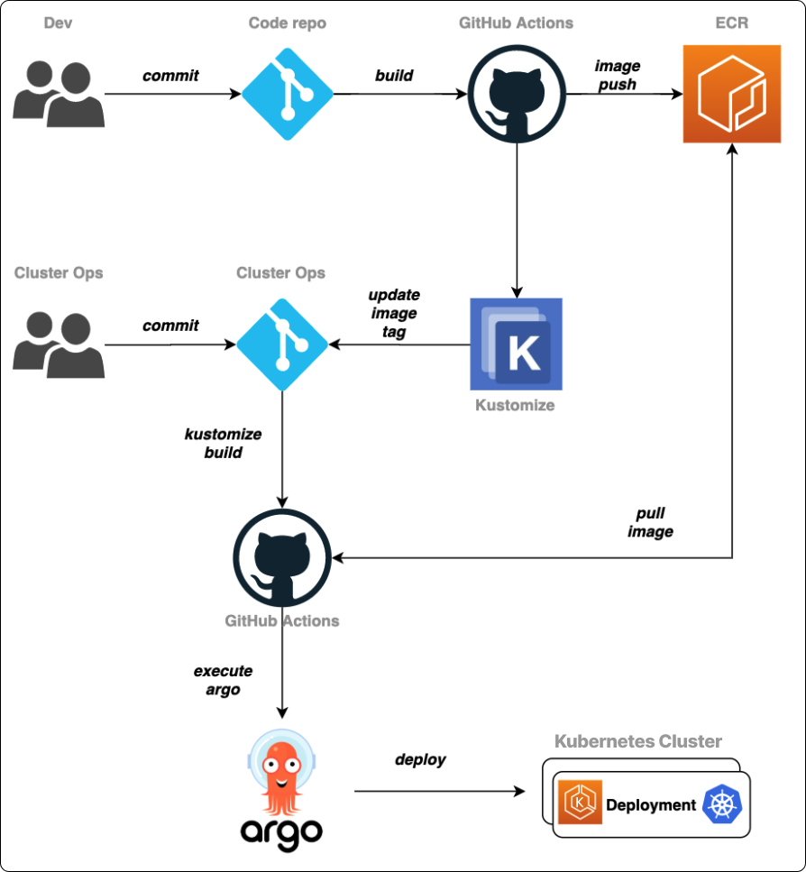
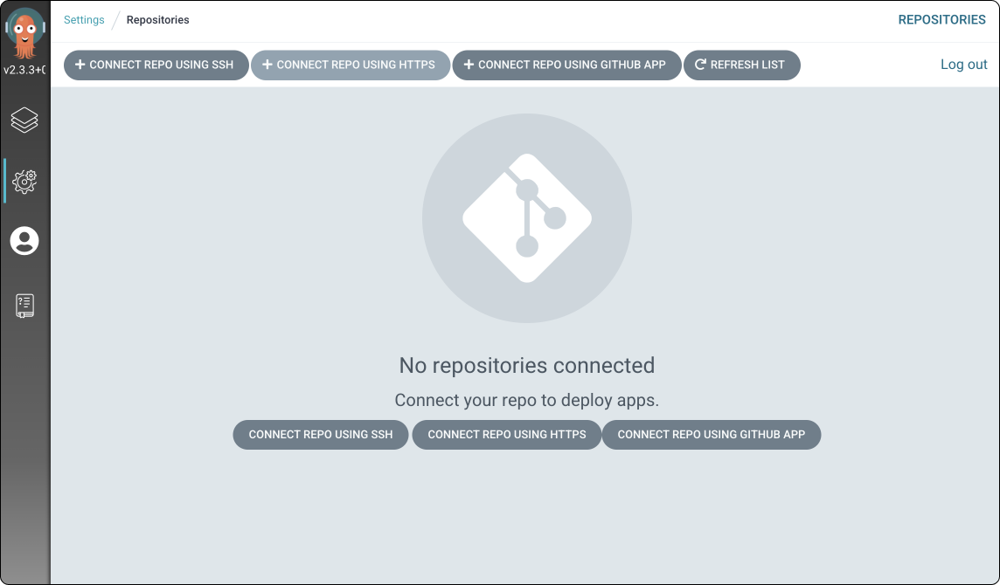

# Table of Contents
[[toc]]

::: warning
이 포스트는 [공식 문서](https://catalog.us-east-1.prod.workshops.aws/workshops/9c0aa9ab-90a9-44a6-abe1-8dff360ae428/ko-KR/110-cicd/100-cicd)를 참고하여 작성되었습니다.
:::

## CI/CD 파이프라인
`Github Actions`와 `Argo CD`를 사용하여 스프링부트 프로젝트를 쿠버네티스 클러스터에 배포한다. 공식 문서에서 제공하는 CI/CD 파이프라인의 흐름은 다음과 같다.



1. 개발자는 소스코드 리포지토리에 푸시한다.
1. 소스코드 리포지토리의 `GitHub Actions`가 동작하여 도커 이미지를 생성하고 ECR에 푸시한다.
1. `GitHub Actions`는 메니페스트 리포지토리에 이미지를 쿠버네티스 클러스터에 배포하기 위한 메니페스트 파일을 생성한다.
1. `Argo CD`가 메니페스트 리포지토리 변화를 감지하여 쿠버네티스 클러스터에 반영한다.


## GitOps
위처럼 배포, 운영과 관련된 모든 절차를 선언적으로 코드화하여 `Git`에서 관리하는 것을 <b>`GitOps`</b>라고 한다. 

GitOps의 핵심은 두 개의 저장소(소스코드 저장소, 메니페스트 저장소)을 사용하는 것이다.


## 환경
- Spring Boot
- Github Actions
- AWS ECR
- Multi AWS EC2 Kubernetes cluster (Not EKS)
- Argo CD

## CI 구축하기
`CI(Continuous Integration)`을 먼저 구축해보자.


`Dockerfile`은 다음과 같다.
``` 
FROM openjdk:8-jdk-alpine
ARG JAR_FILE=build/libs/*.jar
COPY ${JAR_FILE} app.jar
ENTRYPOINT ["java","-Dspring.profiles.active=prod",  "-jar","/app.jar"]
```

`Github Actions` 스크립트는 다음과 같다.
``` yml
# main.yml
on:
  push:
    branches: [ main ]
  pull_request:
    branches: [ main ]

  workflow_dispatch:

jobs:
  build:
    runs-on: ubuntu-latest

    steps:
      - name: Checkout
        uses: actions/checkout@v2

      - name: Set up JDK 1.8
        uses: actions/setup-java@v1
        with:
          java-version: 1.8

      - name: Grant execute permission for gradlew
        run: chmod +x gradlew

      - name: Add properties file
        run: echo '${{ secrets.APPLICATION_PROD_PROPERTIES }}' > ./src/main/resources/application-prod.properties

      # Jar 빌드
      - name: Build with Gradle
        run: ./gradlew clean build

      # AWS IAM 인증
      - name: Configure AWS credentials
        uses: aws-actions/configure-aws-credentials@v1
        with:
          aws-access-key-id: ${{ secrets.AWS_ACCESS_KEY_ID }}
          aws-secret-access-key: ${{ secrets.AWS_SECRET_ACCESS_KEY }}
          aws-region: ${{ secrets.AWS_REGION }}

      # AWS ECR 로그인
      - name: Login to Amazon ECR
        id: login-ecr
        uses: aws-actions/amazon-ecr-login@v1

      # 이미지 태그 생성
      - name: Make image tag
        id: image
        run: |
          VERSION=$(echo ${{ github.sha }} | cut -c1-8)
          echo VERSION=$VERSION
          echo "::set-output name=version::$VERSION"

      # 도커 이미지 빌드 & AWS ECR에 푸시
      - name: Build and Push images to AWS ECR
        id: build-image
        env:
          ECR_REGISTRY: ${{ steps.login-ecr.outputs.registry }}
          ECR_REPOSITORY: ${{ secrets.ECR_REPOSITORY }}
          IMAGE_TAG: ${{ steps.image.outputs.version }}
        run: |
          echo "::set-output name=ecr_repository::$ECR_REPOSITORY"
          echo "::set-output name=image_tag::$IMAGE_TAG"
          docker build -t $ECR_REGISTRY/$ECR_REPOSITORY:$IMAGE_TAG .
          docker push $ECR_REGISTRY/$ECR_REPOSITORY:$IMAGE_TAG
```

빌드가 성공했다면 `ECR`에 이미지가 저장되었을 것이다.


## 네임스페이스 생성하기
쿠버네티스 클러스터에 네임스페이스를 생성한다. 모든 오브젝트는 이 네임스페이스에서 실행된다.
```
$ kubectl create namespace <NAMESPACE>
```

## ECR 접근 권한 설정
ECR에서 쿠버네티스로 이미지를 Pull 하려면 접근권한 등록이 필요하다. 먼저 클러스터에서 AWS IAM 사용자의 Access key, Secret key를 등록하자.
```
$ aws configure
AWS Access Key ID [None]: <ACCESS_KEY>
AWS Secret Access Key [None]: <SECRET_KEY>
Default region name [None]: <REGION>
Default output format [None]: 
```

그 다음 AWS ECR에 로그인한다.
```
$ aws ecr get-login-password --region <REGION> | docker login --username AWS --password-stdin <AWS_ACCOUNT_ID>.dkr.ecr.<REGION>.amazonaws.com
```

로그인 정보는 `~/.docker/config.json`에 저장된다.
```
$ cat ~/.docker/config.json
```

이제 ECR에 접근하기 위한 비밀번호를 얻기 위해 다음 명령어를 입력한다.
```
$ aws ecr get-login-password --region <REGION>
```

그리고 이 비밀번호를 사용하여 위에서 생성한 네임스페이스에 Secret을 생성한다.
```
$ kubectl create secret docker-registry regcred --namespace=<NAMESPACE> --docker-server=<SERVER> --docker-username=AWS --docker-password=<PASSWORD>
```
``` {4}
$ kubectl get secret -n <NAMESPACE>
NAME                  TYPE                                  DATA   AGE
default-token-jvv9p   kubernetes.io/service-account-token   3      168m
regcred               kubernetes.io/dockerconfigjson        1      15m
```

생성한 Secret은 포스트 뒷 부분에서 사용한다.

## 메니페스트 리포지토리 구축
메니페스트 파일은 도커 이미지를 쿠버네티스 클러스터에 어떤 식으로 배포할지를 선언한 파일이며, 보통 <u>쿠버네티스 오브젝트를 선언한 YAML 설정파일</u>과 <u>`Kustomize` 관련 파일</u>을 의마한다. 메니페스트 리포지토리에는 이 파일이 저장된다.

이제 메니페스트 리포지토리를 생성하고 CI/CD 파이프라인을 구축해보자.


먼저 로컬 PC에서 다음과 같은 구조의 디렉토리를 생성한다.
```
$ tree
.
├── base
│   ├── deployment.yml
│   ├── kustomization.yml
│   └── service.yml
└── overlays
    └── prod
        └── kustomization.yml
```
`base/deployment.yml`은 다음과 같다. 위해서 생성한 Secret을 반드시 등록해준다.
``` yml {21,22}
apiVersion: apps/v1
kind: Deployment
metadata:
  name: springboot-deployment
spec:
  replicas: 2
  selector:
    matchLabels:
      app: springboot-app-label
  template:
    metadata:
      name: 
      labels: 
        app: springboot-app-label
    spec:
      containers:
        - name: springboot-app
          image: <YOUR_AWS_IAM_USER_ID>.dkr.ecr.<YOUR_ECR_REGION>.amazonaws.com/<YOUR_ECR_REPOSITORY>:0.0
          ports:
          - containerPort: 8080
      imagePullSecrets:
      - name: regcred
```
`base/service.yml`은 다음과 같다.
``` yml
apiVersion: v1
kind: Service
metadata:
  name: springboot-service
spec:
  ports:
    - name: springboot-service-port
      port: 8080
      targetPort: 8080
  selector:
    app: springboot-app-label
  type: NodePort
```
`base/kustomization.yml`은 다음과 같다.
``` yml
apiVersion: kustomize.config.k8s.io/v1beta1
kind: Kustomization
resources:
  - deployment.yml
  - service.yml
```
`overlays/prod/kustomization.yml`은 다음과 같다.
``` yml
apiVersion: kustomize.config.k8s.io/v1beta1
kind: Kustomization
images:
- name: <YOUR_AWS_IAM_USER_ID>.dkr.ecr.<YOUR_ECR_REGION>.amazonaws.com/<YOUR_ECR_REPOSITORY>
  newName: <YOUR_AWS_IAM_USER_ID>.dkr.ecr.<YOUR_ECR_REGION>.amazonaws.com/<YOUR_ECR_REPOSITORY>
  newTag: abcdefg
resources:
- ../../base
```

이제 깃헙에 매니페스트용 사설 리포지토리를 생성하고 코드를 Push한다.

::: danger
소스코드에 AWS IAM 사용자의 ID가 포함되므로 반드시 사설 리포지토리로 생성한다.
:::

이제 소스코드 리포지토리에 코드를 Push했을 때 매니페스트용 리포지토리로 매니페스트 파일들을 푸시하도록 Github Actions 스크립트를 추가한다.

``` yml
# main.yml
on:
  push:
    branches: [ main ]
  pull_request:
    branches: [ main ]

  workflow_dispatch:

jobs:
  build:
    runs-on: ubuntu-latest

    steps:

      # 생략 ...

      - name: Setup Kustomize
        uses: imranismail/setup-kustomize@v1

      - name: Checkout kustomize repository
        uses: actions/checkout@v2
        with:
          repository: <GITHUB_USERNAME>/<GITHUB_REPOSITORY_NAME>
          ref: main
          token: ${{ secrets.MANIFEST_REPO_PERSONAL_ACCESS_TOKEN }}
          path: <GITHUB_REPOSITORY_NAME>

      - name: Update Kubernetes resources
        run: |
          echo ${{ steps.login-ecr.outputs.registry }}
          echo ${{ steps.build-image.outputs.ecr_repository }}
          echo ${{ steps.build-image.outputs.image_tag }}
          cd <GITHUB_REPOSITORY_NAME>/overlays/prod/
          kustomize edit set image ${{ steps.login-ecr.outputs.registry}}/${{ steps.build-image.outputs.ecr_repository }}=${{ steps.login-ecr.outputs.registry}}/${{ steps.build-image.outputs.ecr_repository }}:${{ steps.build-image.outputs.image_tag }}
          cat kustomization.yml

      - name: Commit files
        run: |
          cd <GITHUB_REPOSITORY_NAME>
          git config --global user.email "<GITHUB_EMAIL>"
          git config --global user.name "<GITHUB_USENNAME>"
          git commit -am "Update image tag"
          git push -u origin main
```

Github Secret에 `MANIFEST_REPO_PERSONAL_ACCESS_TOKEN`를 추가한다. [PAT(Personal Access Token)](https://docs.github.com/en/authentication/keeping-your-account-and-data-secure/creating-a-personal-access-token)은 이 포스트를 참고하여 생성할 수 있다.

이제 소스코드 리포지토리에 다시 한번 푸시해보자. 메니페스트용 리포지토리에 `Kubernetes`와 `Kustomize` 설정파일이 생성되면 성공한 것이다.


## Argo CD를 사용하여 배포하기

`Argo CD`는 메니페스트 리포지토리가 변경되면 이를 감지하여 쿠버네티스 클러스터에 반영하는 역할을 한다. 


먼저 쿠버네티스 클러스터에서 `Argo CD`를 설치하자.
```
// 네임스페이스 생성
$ kubectl create namespace argocd

// Argo CD와 관련된 오브젝트 설치
$ kubectl apply -n argocd -f https://raw.githubusercontent.com/argoproj/argo-cd/stable/manifests/install.yaml
```
`Argo CD`와 관련된 오브젝트가 `argocd` 네임스페이스에 설치된다. 
```
$ kubectl get all -n argocd
NAME                                                    READY   STATUS    RESTARTS   AGE
pod/argocd-application-controller-0                     1/1     Running   0          37h
pod/argocd-applicationset-controller-79f97597cb-gntdl   1/1     Running   0          37h
pod/argocd-dex-server-6fd8b59f5b-gwwr9                  1/1     Running   0          37h
pod/argocd-notifications-controller-5549f47758-4gqxv    1/1     Running   0          37h
pod/argocd-redis-79bdbdf78f-k8ftl                       1/1     Running   0          37h
pod/argocd-repo-server-5569c7b657-2df8d                 1/1     Running   0          37h
pod/argocd-server-664b7c6878-krfp7                      1/1     Running   0          37h

NAME                                              TYPE        CLUSTER-IP       EXTERNAL-IP   PORT(S)                      AGE
service/argocd-applicationset-controller          ClusterIP   10.107.177.230   <none>        7000/TCP                     37h
service/argocd-dex-server                         ClusterIP   10.99.2.29       <none>        5556/TCP,5557/TCP,5558/TCP   37h
service/argocd-metrics                            ClusterIP   10.106.79.143    <none>        8082/TCP                     37h
service/argocd-notifications-controller-metrics   ClusterIP   10.107.128.107   <none>        9001/TCP                     37h
service/argocd-redis                              ClusterIP   10.99.61.196     <none>        6379/TCP                     37h
service/argocd-repo-server                        ClusterIP   10.105.139.69    <none>        8081/TCP,8084/TCP            37h
service/argocd-server                             ClusterIP   10.96.104.252    <none>        80:30609/TCP,443:30992/TCP   37h
service/argocd-server-metrics                     ClusterIP   10.110.209.117   <none>        8083/TCP                     37h

NAME                                               READY   UP-TO-DATE   AVAILABLE   AGE
deployment.apps/argocd-applicationset-controller   1/1     1            1           37h
deployment.apps/argocd-dex-server                  1/1     1            1           37h
deployment.apps/argocd-notifications-controller    1/1     1            1           37h
deployment.apps/argocd-redis                       1/1     1            1           37h
deployment.apps/argocd-repo-server                 1/1     1            1           37h
deployment.apps/argocd-server                      1/1     1            1           37h

NAME                                                          DESIRED   CURRENT   READY   AGE
replicaset.apps/argocd-applicationset-controller-79f97597cb   1         1         1       37h
replicaset.apps/argocd-dex-server-6fd8b59f5b                  1         1         1       37h
replicaset.apps/argocd-notifications-controller-5549f47758    1         1         1       37h
replicaset.apps/argocd-redis-79bdbdf78f                       1         1         1       37h
replicaset.apps/argocd-repo-server-5569c7b657                 1         1         1       37h
replicaset.apps/argocd-server-664b7c6878                      1         1         1       37h
```

Argo CD는 웹 브라우저에서 GUI 형태로 관련된 오브젝트를 관리할 수 있도록 `Argo CD API server`를 제공한다. 


Argo CD가 설치되면 기본적으로 API server 접근하기 위한 서비스가 `Cluster IP`타입으로 설정된다. 클러스터 외부에서도 API server에 접근할 수 있도록 서비스 타입을 `NodePort`로 바꿔주자.

```
$ kubectl patch svc argocd-server -n argocd -p '{"spec": {"type": "NodePort"}}'
```
``` {9}
$ kubectl get service -n argocd
NAME                                      TYPE        CLUSTER-IP       EXTERNAL-IP   PORT(S)                      AGE
argocd-applicationset-controller          ClusterIP   10.107.177.230   <none>        7000/TCP                     8m40s
argocd-dex-server                         ClusterIP   10.99.2.29       <none>        5556/TCP,5557/TCP,5558/TCP   8m40s
argocd-metrics                            ClusterIP   10.106.79.143    <none>        8082/TCP                     8m40s
argocd-notifications-controller-metrics   ClusterIP   10.107.128.107   <none>        9001/TCP                     8m40s
argocd-redis                              ClusterIP   10.99.61.196     <none>        6379/TCP                     8m40s
argocd-repo-server                        ClusterIP   10.105.139.69    <none>        8081/TCP,8084/TCP            8m40s
argocd-server                             NodePort    10.96.104.252    <none>        80:30609/TCP,443:30992/TCP   8m40s
argocd-server-metrics                     ClusterIP   10.110.209.117   <none>        8083/TCP                     8m40s
```
이제 클러스터 외부에서 `<워커 노드 IP>:<외부노출 포트>` 형태로 API server에 접근할 수 있다.

::: warning
`EC2`로 클러스터를 구축한 경우 보안 그룹에서 해당 포트를 개방해야한다.
:::

제대로 접근한 경우 다음과 같이 로그인 화면이 나온다.


기본 계정은 `admin`이며, 비밀번호는 다음 명령어로 알아낼 수 있다.
```
$ kubectl -n argocd get secret argocd-initial-admin-secret -o jsonpath="{.data.password}" | base64 -d
```

물론 커맨드라인으로 Argo CD를 제어할 수 있다. 로컬 PC에 `Argo CD CLI`를 설치하면 된다.
```
$ brew tap argoproj/tap 

$ brew install argoproj/tap/argocd

$ argocd version
argocd: v2.3.3+07ac038.dirty
  BuildDate: 2022-03-30T05:20:18Z
  GitCommit: 07ac038a8f97a93b401e824550f0505400a8c84e
  GitTreeState: dirty
  GoVersion: go1.18
  Compiler: gc
  Platform: darwin/amd64
FATA[0000] Argo CD server address unspecified  

$ argocd login <워커 노드IP>:30609
WARNING: server certificate had error: x509: “Argo CD” certificate is not trusted. Proceed insecurely (y/n)? y
Username: admin
Password: 
'admin:login' logged in successfully
```

비밀번호를 변경해보자.
```
$ argocd account update-password
*** Enter password of currently logged in user (admin): <기존 비밀번호> 
*** Enter new password for user admin: <새로운 비밀번호>
*** Confirm new password for user admin: <새로운 비밀번호>
```

이제 Argo CD와 메니페스트 저장소를 연동할 차례다. 리포지토리 탭에서 `Repositories`를 클릭한다.


`CONNECTION REPO USING HTTPS`를 선택한다.



퍼블릭 리포지토리인 경우 리포지토리 저장소 주소만 입력하면 저장소가 추가된다.


프라이빗 리포지토리의 경우 SSH을 통해 저장소를 추가해야한다. 먼저 로컬 PC에서 공개키, 개인키 쌍을 생성하자.
```
$ ssh-keygen -t ecdsa -b 521 -C "<YOUR_EMAIL>"
Generating public/private ecdsa key pair.
Enter file in which to save the key (/Users/yologger/.ssh/id_ecdsa):<KEY_NAME>
```
키 생성이 완료되면 개인키와 공개키가 생성된다. `.pub` 확장자가 붙은 키가 공개키, 나머지가 개인키다.
```
$ ls
<KEY_NAME>.pub
<KEY_NAME>
```

공개키를 메니페스트 리포지토리에 등록할 차례다. `Settings > Deploy Keys > Add deploy key`로 이동하여 공개키 파일의 내용을 등록한다.


이제 `Argo CD CLI`로 프라이빗 리포지토리를 추가할 수 있다.
```
// argocd repo add git@github.com:<YOUR_ID>/<YOUR_REPOSTIORY>.git --ssh-private-key-path <키 경로>
$ argocd repo add git@github.com:yologger/manifest_repo.git --ssh-private-key-path ./github-ssh-key
Repository 'git@github.com:yologger/manifest_repo.git.git' added
```

프라이빗 리포지토리가 추가되었는지 확인하자.
```
$ argocd repo list
TYPE  NAME  REPO                                        INSECURE  OCI    LFS    CREDS  STATUS      MESSAGE  PROJECT
git         git@github.com:yologger/manifest_repo.git   false     false  false  false  Successful 
```

::: warning
Argo CD는 3분마다 Github와 통신하며 리포지토리 변경사항을 확인한다. 따라서 EC2에 클러스터를 구축한 경우 보안 그룹을 적절히 설정해주어야 한다.
:::

저장소가 추가되었다면 `Argo CD API 서버`에서 `Application 탭 > NEW APP`을 선택한다.


`Application Name`을 입력하고 `SYNC POLICY`는 `Automatic`으로 설정한다. `Automatic`은 3분에 한번씩 연결된 저장소가 변경되었는지 자동으로 비교하고 반영하는 옵션이다.


- `Prune Resources`: 변경이 발생하여 리소스를 업데이트할 때, 기존 리소스를 삭제하고 새로운 리소스를 생성한다.
- `Self Heal`: 오브젝트가 다운되었을 때 Argo CD가 스스로 복구해준다.

등록한 저장소를 추가하고, 저장소 내 메니페스트 파일 경로를 입력한다.


클러스터를 선택하고 사용할 네임스페이스를 지정하고 `CREATE` 버튼을 누른다.


이제 메니페스트 리포지토리를 반영하여 쿠버네티스 배포를 시작한다.


나타나면 쿠버네티스 배포에 성공했다면 `Sync OK` 상태가 된다.


```
$ kubectl get all -n spring
NAME                                         READY   STATUS    RESTARTS   AGE
pod/springboot-deployment-6d7b75c58d-f5hbj   1/1     Running   0          2m4s
pod/springboot-deployment-6d7b75c58d-kl27z   1/1     Running   0          2m1s

NAME                         TYPE       CLUSTER-IP      EXTERNAL-IP   PORT(S)           AGE
service/springboot-service   NodePort   10.100.154.16   <none>        10000:30070/TCP   10m

NAME                                    READY   UP-TO-DATE   AVAILABLE   AGE
deployment.apps/springboot-deployment   2/2     2            2           10m

NAME                                               DESIRED   CURRENT   READY   AGE
replicaset.apps/springboot-deployment-6d7b75c58d   2         2         2       2m4s
replicaset.apps/springboot-deployment-7f75b4d546   0         0         0       10m
```

마지막으로 소스코드를 수정하고 소스코드 리포지토리에 푸시하여 CI/CD 파이프라인이 잘 작동하는지 확인해보자.