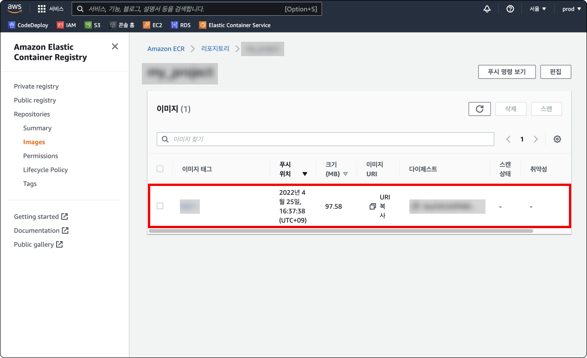

# Table of Contents
[[toc]]

# Docker
`Docker` 사용법에 대해 정리한다.

## Virtual Machine
호스트 OS에 가상의 여러 게스트 OS를 가상화하는 기술이다. 제품군에는 `VirtualBox`, `VMWare` 등이 있다.

## Docker
`Docker`는 컨테이너 가상화 플랫폼이다. Docker는 호스트 OS에 `Docker Container`라는 격리된 공간을 제공해준다. 

## Docker의 장점
- `Docker Container`를 생성하고 필요한 소프트웨어를 설치한 후 `Docker Image`로 빌드하면 Docker가 설치된 어떠한 곳에서든 실행할 수 있다. 이 덕분에 개발, 환경구성, 배포가 쉬워진다.
- `Docker Swarm`이나 `Kubernetes`같은 `컨테이너 오케스트레이션 기술`과 함께 사용하여 `MSA(Microservice Architecuture)`를 쉽게 구성할 수 있다.

## Virtual Machine vs. Docker
`Virtual Machine`은 게스트 OS와 하이버바이저를 거쳐 호스트 OS의 커널과 자원을 사용하기 때문에 성능 손실이 발생한다. 반면 `Docker`는 하이버파이저와 게스트 OS가 없고 `도커 엔진`만을 거쳐 호스트 OS의 커널과 자원을 사용하며, 호스트 OS에서 프로세스로 동작하기 때문에 속도가 훨씬 빠르다.


## 설치
운영체제에 따라 `Docker`를 설치하는 방법이 다르다.

### Mac OS에 Docker 설치
Mac OS 환경에서는 [Homebrew](https://brew.sh/)로 `Docker Desktop on Mac`을 쉽게 설치할 수 있다.
``` shellsession
$ brew install --cask docker 
```
도커 버전을 확인해보자.
``` shellsession
$ docker -v
Docker version 20.10.11, build dea9396
```

`LaunchPad`에서도 `Docker Desktop on Mac`을 확인할 수 있다.


## 도커 이미지 검색 
`docker search` 명령어로 도커 이미지를 검색할 수 있다.
``` shellsession
// docker search <image_name>
$ docker search centos
```
## 도커 이미지 다운로드
`docker pull`명령어로 도커 이미지를 다운받을 수 있다. `centos:7` 이미지를 다운받아보자.
``` shellsession
// docker pull <image_name>
$ docker pull centos:7
``` 

## 다운받은 도커 이미지 확인
`docker images` 명령어로 다운받은 도커 이미지 목록을 확인할 수 있다.
``` shellsession
$ docker images
REPOSITORY          TAG       IMAGE ID       CREATED        SIZE
centos              7         eeb6ee3f44bd   3 months ago   204MB
```

## 도커 컨테이너 생성
`docker create` 명령어로 도커 컨테이너를 생성할 수 있다. 자세한 실행 옵션은 [이 곳](https://docs.docker.com/engine/reference/commandline/create/)에서 확인할 수 있다.
``` shellsession
// docker create -i -t --name <container_name> <image_name> 
$ docker create -i -t --name my_centos centos:7
```
자주 사용하는 옵션은 다음과 같다.
- `--name`: 컨테이너 이름을 지정한다.
- `-i -t`: `docker attach`명령어로 컨테이너 내부에 진입할 수 있다.
- `-d`: 컨테이너를 백그라운드로 실행한다.

## 도커 컨테이너 실행
`docker start` 명령어로 도커 컨테이너를 시작한다.
``` shellsession
$ docker start <container_name>
docker start my_centos

$ docker ps -al          
CONTAINER ID   IMAGE      COMMAND       CREATED          STATUS         PORTS     NAMES
b5df63051a50   centos:7   "/bin/bash"   28 seconds ago   Up 3 seconds             my_centos
```

## 도커 컨테이너 접속하기, 빠져나오기
도커 컨테이너에는 두 가지 명령어로 접속할 수 있다. 

### docker attach
`docker attach`명령어로 컨테이너 내부로 접속할 수 있다.
```
docker attach <컨테이너 이름>
docker attach <컨테이너 ID>
```
`docker attach`명령어는 `root` 계정으로 컨테이너에 접속한다.
``` shellsession
$ docker attach my_centos
[root@a9adb823231 /]# 
```
`exit`을 입력하여 컨테이너에서 빠져나올 수 있다.
``` shellsession
[root@a9adb823231 /]# exit 
```
`exit`을 사용하여 컨테이너에서 빠져나오면 컨테이너가 종료된다.
``` shellsession
$ docker ps -a
CONTAINER ID   IMAGE      COMMAND       CREATED         STATUS                       PORTS     NAMES
b5df63051a50   centos:7   "/bin/bash"   4 minutes ago   Exited (127) 4 seconds ago             my_centos
```
컨테이너를 종료시키지 않고 빠져나오려면 `Ctrl + P, Q`를 입력한다. 이를 `Detach`라고 한다.

백그라운드로 실행되는 컨테이너에 `docker attach`로 접속하면 커맨드는 입력할 수 없고 출력되는 로그만 확인할 수 있다.

### docker exec -it
`docker exec -it` 명령어는 별도의 쉘 세션을 생성하여 컨테이너에 접속한다.
```
$ docker exec -it <CONTAINER NAME> <SHELL>
$ docker exec -it <CONTAINER ID> <SHELL>
```

``` shellsession
$ docker exec -it 75ef6d64fead /bin/bash 
bash-5.1# ls
```
`docker exec it` 명령어로 컨테이너에 접속한 경우 `exit` 명령어로 빠져나와도 컨테이너가 종료되지 않는다. 따라서 데몬 컨테이너에 접근하는데 사용할 수 있다.

### docker run
`docker run` 명령어를 사용하면 도커 이미지 다운, 도커 컨테이너 생성, 시작, 접속을 한 번에 할 수 있다.
``` shellsession
// docker run -i -t --name [container_name] [image_name]
$ docker run -i -t --name my_centos ubuntu:14.04
root@bdccae5606a1:/#
```

## 도커 컨테이너 정지
`docker stop` 명령어를 사용하면 도커 컨테이너를 정지할 수 있다.
``` shellsession
// docker stop <container_name>
$ docker stop my_centos
```

## 도커 컨테이너 목록, 상태 확인
`docker ps`명령어로 도커 컨테이너 목록을 확인할 수 있다. 어떤 옵션도 추가하지 않으면 실행 중인 컨테이너 목록만 출력된다. 정지된 컨테이너 목록까지 확인하려면 `-a` 옵션을 추가한다.
``` shellsession
$ docker ps -a
CONTAINER ID   IMAGE      COMMAND       CREATED         STATUS    PORTS     NAMES
b5df63051a50   centos:7   "/bin/bash"   7 seconds ago   Created             my_centos
```
`STATUS`는 컨테이너의 상태를 나타내며 다음 값들을 가질 수 있다.

- `Created`: 컨테이너가 생성되었으나 한번도 실행된 적이 없는 상태
- `Up`: 실행 중
- `Exited`: 종료된 상태
- `Pause`: 일시 중지된 상태

## 도커 컨테이너 삭제
`docker rm` 명령어를 사용하면 도커 컨테이너를 삭제할 수 있다.
``` shellsession
// docker rm <container_name>
$ docker rm my_centos
```  
`docker container prune` 명령어를 사용하면 모든 도커 컨테이너를 삭제한다.
``` shellsession
$ docker container prune
```

## 도커 이미지 만들기
`docker commit`명령어를 사용하면 도커 컨테이너를 빌드하여 도커 이미지를 생성할 수 있다.
``` shellsession
$ docker images
REPOSITORY          TAG       IMAGE ID       CREATED         SIZE
original_image      3.1     0903d3cdd37e   12 months ago   211MB
```
``` shellsession{2}
// docker commit -a [author] -m [message] ORIGINAL_CONTAINER COPIED_CONTAINER:TAG
$ docker commit -a "yologger" -m "This is message" copied_image copied_image:0.0.1
```
``` shellsession{4}
$ docker images
REPOSITORY          TAG     IMAGE ID       CREATED         SIZE
original_image      3.1     0903d3cdd37e   12 months ago   211MB
copied_image        0.1     0903d3cdd37e   4 seconds ago   211MB
```

## 도커 이미지 삭제
`docker image rmi` 명령어로 이미지를 삭제할 수 있다.
```shellsession{6}
$ docker images
REPOSITORY          TAG     IMAGE ID       CREATED         SIZE
original_image      3.1     0903d3cdd37e   12 months ago   211MB
copied_image        0.1     0903d3cdd37e   4 seconds ago   211MB

$ docker rmi copied_image:0.1

$ docker images
REPOSITORY          TAG     IMAGE ID       CREATED         SIZE
original_image      3.1     0903d3cdd37e   12 months ago   211MB
```
도커 이미지가 도커 컨테이너로 사용 중이라면 컨테이너를 먼저 삭제해야한다.

## 도커 이미지 이름, 태그 변경하기
`docker tag`명령어로 이미지 이름과 태그를 변경할 수 있다.
```shellsession
$ docker images
REPOSITORY          TAG     IMAGE ID       CREATED         SIZE
original_image      3.1     0903d3cdd37e   12 months ago   211MB
```
``` shellsession
// docker tag [기존이미지명:기존태그명] [새로운이미지명:새로운태그명]
$ docker tag copied_image:0.1 new_image:0.1
```
기존 이미지가 사라지는 것은 아니며, 새로운 이미지가 생성된다.
``` shellsession{4}
$ docker images
REPOSITORY          TAG     IMAGE ID       CREATED         SIZE
original_image      3.1     0903d3cdd37e   12 months ago   211MB
new_image           0.1     eeb6ee3f44bd   4 seconds ago   211MB
```

## Docker Volume
도커 컨테이너는 내부 파일시스템에 데이터를 저장할 수 있다. 그러나 이 파일시스템은 컨테이너가 삭제되었을 때 함께 사라진다. `도커 볼륨(Docker Volume)`은 컨테이너에 종속되지 않는 저장소를 제공한다.

도커 볼륨은 세 가지 종류가 있다.
- 호스트 볼륨 공유
- 컨테이너 볼륨 공유
- 도커 볼륨

### 호스트 볼륨 공유
도커 컨테이너는 호스트의 볼륨을 공유할 수 있다. 도커 컨테이너를 생성할 때 `-v` 또는 `--volume` 옵션으로 호스트의 볼륨과 컨테이너의 볼륨을 바인딩할 수 있다.

우선 호스트 OS에 `mydata` 디렉토리를 생성하자.
``` shellsession
$ mkdir mydata

$ cd mydata

$ pwd
/Users/yologger/mydata
``` 
이제 호스트 OS의 디렉토리를 공유하는 Ubuntu 컨테이너를 생성해보자.
``` shellsession
$ docker create -i -t \
--name my_container \
-v /Users/yologger/mydata:/mydata \
ubuntu:14.04
```
위 명령어는 호스트 파일시스템의 `/Users/yologger/mydata`를 도커 컨테이너 파일시스템 `/mydata`과 바인딩한다. 도커 컨테이너에 `/mydata` 디렉토리가 없다면 자동으로 생성된다.

이제 도커 컨테이너 내부에 접속하여 `/mydata` 디렉토리가 존재하는지 확인해보자.
``` shellsession
$ docker start my_container

$ docker attach my_container

root@308220530da1:/# ls
mydata 
...
```
도커 컨테이너에도 `mydata` 디렉토리가 생성된 것을 확인할 수 있다. 이제 이 디렉토리 안에 파일을 생성해본다.
``` shellsession
root@308220530da1:/# cd mydata

root@308220530da1:/mydata# echo "Hello world" > hello.txt
```
도커 컨테이너에서 빠져나와 호스트 OS의 `/Users/yologger/mydata`를 확인해본다.
``` shellsession
$ ls
hello.txt
```

### 컨테이너 볼륨 공유
지금까지 `-v` 옵션으로 볼륨을 사용하는 컨테이너를 생성했다.
``` shellsession
$ docker create -i -t \
--name my_container \
-v /Users/yologger/mydata:/mydata \
ubuntu:14.04
```

`--volumes-from` 옵션을 사용하면 이미 볼륨을 사용하는 다른 컨테이너의 볼륨을 공유할 수 있다.
``` shellsession {3}
$ docker create -i -t \
--name your_container \
--volumes-from my_container \
ubuntu:14.04
```
이제 `my_container`와 `your_container`는 호스트의 `/Users/yologger/mydata:/mydata` 디렉토리를 공유하게 된다. `your_container`에서도 `/mydata` 디렉토리를 확인할 수 있다.
``` shellsession
$ docker start your_container

$ docker attach your_container

root@6c256b3cb679:/# ls
mydata
...

root@6c256b3cb679:/# cat /mydata/hello.txt
Hello World
```

### 도커 볼륨
`도커 볼륨`은 도커가 직접 관리하는 볼륨이다. `docker volume` 명령어로 도커 볼륨을 관리할 수 있다.

`docker volume create <볼륨 이름>` 명령어로 볼륨을 생성할 수 있다.
``` shellsession
$ docker volume create my_volume
```

`docker volume ls` 명령어로 볼륨 목록을 확인할 수 있다.
``` shellsession
$ docker volume ls
DRIVER    VOLUME NAME
local     my_volume
...
```
`docker inspect volume <볼륨 이름>` 명령어로 호스트 OS에서 볼륨이 실제로 저장되는 위치를 확인할 수 있다.
``` shellsession {7}
$ docker inspect --type volume my_volume
[
    {
        "CreatedAt": "2022-05-05T04:08:30Z",
        "Driver": "local",
        "Labels": {},
        "Mountpoint": "/var/lib/docker/volumes/my_volume/_data",
        "Name": "my_volume",
        "Options": {},
        "Scope": "local"
    }
]
```
이제 볼륨을 사용하는 컨테이너를 생성해보자.
``` {3}
$ docker create -i -t \
--name my_container \
-v my_volume:/mydata \
ubuntu:14.04
```
도커 볼륨과 바인딩 되었는지 확인해보자.
``` shellsession {7}
$ docker start my_container
my_container

$ docker attach my_container

root@248ff308623a:/# ls 
mydata
...
```

`docker volume rm <볼륨 이름>` 명령어로 볼륨을 삭제할 수 있다.
``` shellsession
$ docker volume rm my_volume
```

## Container Registry
`컨테이너 레지스트리(Container Registery)`는 도커 이미지를 저장할 수 있는 저장소다. 저장소를 원격 서버에 구축할 수도 있고 온프레미스 서버에 구축할 수도 있다. 대표적인 컨테이너 레지스트리는 다음과 같다.
- Docker Hub
- AWS ECR (Elastic Container Registry)
- GCR (Google Container Registry)
- GHCR (GitHub Container Registry)

## 도커 허브
[도커 허브(Docker Hub)](https://hub.docker.com/)는 도커 이미지를 저장할 수 있는 원격 저장소다. 도커 허브는 크게 세 가지의 저장소를 제공한다.
- `Public repository`: 공개 원격 저장소, 무료 플랜 시 무제한 사용 가능하다.
- `Private repository`: 비공개 원격 저장소, 무료 플랜 시 1개를 무료로 사용할 수 있다.
- `Private registry`: 개인 서버에 구축하는 저장소

저장소에 따라 가격 정책이 다르며, [이 곳](https://hub.docker.com/billing/plan/update)에서 확인할 수 있다.

도커 허브의 대체제로는 `GitHub Registry`, `AWS ECR`가 있다.

### 도커 허브로 이미지 배포하기
`Docker Hub`의 `Repository`를 사용하면 도커 이미지를 배포할 수 있다. [이 곳](https://hub.docker.com/)에 접속하여 회원가입 후 `Repository > Create Repository`를 클릭한다. 그리고 `Repository` 이름을 입력하고 Repository를 생성한다. 

::: warning
Repository의 이름은 이미지의 이름과 동일해야한다.
:::


생성에 성공하면 Repository 정보를 확인할 수 있다.


이제 업로드할 이미지 이름 앞에 <b><u>사용자 이름</u></b>을 추가한다.
``` shellsession
$ docker tag test_image:0.1 yologger1013/test_image:0.1
REPOSITORY                  TAG       IMAGE ID       CREATED          SIZE
test_image                  0.1       0903d3cdd37e   41 minutes ago   211MB
yologger1013/test_image     0.1       0903d3cdd37e   41 minutes ago   211MB
```

그리고 `docker login` 명령어로 도커 허브에 로그인한다.
``` shellsession
$ docker login
Login with your Docker ID to push and pull images from Docker Hub. If you don't have a Docker ID, head over to https://hub.docker.com to create one.
Username: yologger1013
Password: 
Login Succeeded

Logging in with your password grants your terminal complete access to your account. 
For better security, log in with a limited-privilege personal access token. Learn more at https://docs.docker.com/go/access-tokens/
```

마지막으로 `docker push` 명령어로 이미지를 업로드한다.
``` shellsession
$ docker push yologger1013/test_image:0.1
The push refers to repository [docker.io/yologger1013/test_image]
d4b7a766cea6: Pushed 
83109fa660b2: Mounted from library/ubuntu 
30d3c4334a23: Mounted from library/ubuntu 
f2fa9f4cf8fd: Mounted from library/ubuntu 
0.1: digest: sha256:a7770184b5c0020cf9832e68509957bbca4498a4916c92a453047f184729e7f2 size: 1157
```

도커 허브에서 푸시한 이미지를 확인할 수 있다.


### 도커 허브에서 이미지 다운받기
`docker pull` 명령어로 도커 허브에서 이미지를 다운받을 수 있다.
``` shellsession
$ docker pull yologger1013/test_image:0.1 

$ docker images
REPOSITORY                TAG       IMAGE ID       CREATED          SIZE
yologger1013/test_image   0.1       0903d3cdd37e   56 minutes ago   211MB
```

## ECR
`AWS ECR(Elastic Container Registry)`도 도커 이미지를 저장할 수 있는 원격 저장소다. 

### ECR로 이미지 배포하기
먼저 AWS ECR에서 프라이빗 리포지토리를 생성한다.


저장소 이름은 업로드할 이미지와 동일하도록 설정한다.


### IAM 사용자 생성하기
`기존 정책 직접 연결`을 선택한 후 


`사용자 이름`을 입력하고 `프로그래밍 방식 액세스`를 선택한다.


`기존 정책 직접 연결`을 선택하고 `AmazonEC2ContainerRegistryFullAccess`를 선택한다.


`액세스 키`와 `비밀 키`를 기억해둔다.


### AWS CLI 설치
먼저 Homebrew를 사용하여 `AWS CLI`를 설치한다.
```
$ brew install awscli

$ aws --version
aws-cli/2.5.8 Python/3.9.12 Darwin/21.4.0 source/x86_64 prompt/off
```

`aws configure` 명령어를 입력한 후 발급 받은 `액세스 키`와 `비밀 키`를 입력한다. 네 번째 항목은 입력하지 않아도 된다.

```
$ aws configure
AWS Access Key ID [None]: <ACCESS_KEY>
AWS Secret Access Key [None]: <SECRET_KEY>
Default region name [None]: <REGION>
Default output format [None]: 
```

이제 다음 명령어로 로그인한다. `Login Succeeded`가 출력되면 로그인에 성공한 것이다.

```
$ aws ecr get-login-password --region <REGION> | docker login --username AWS --password-stdin <AWS_ACCOUNT_ID>.dkr.ecr.<REGION>.amazonaws.com
Login Succeeded
```

`AWS_ACCOUNT_ID`는 IAM 콘솔에서 확인할 수 있다.


### 이미지 Push
이제 이미지를 푸시해보자. 우선 이미지 이름을 다음 형식으로 변경해야한다. <u>이미지 이름과 저장소 이름이 동일해야한다.</u>
```
$ docker tag <IMAGE>:<TAG> <AWS_ACCOUNT_ID>.dkr.ecr.<REGION>.amazonaws.com/<IMAGE>:<TAG>
```
이제 `docker push` 명령어로 이미지를 푸시할 수 있다.
```
$ docker push <AWS_ACCOUNT_ID>.dkr.ecr.<REGION>.amazonaws.com/<IMAGE>:<TAG>
```

저장소에 이미지가 푸시되었다.




### 이미지 Pull
다음 명령어로 이미지를 풀 할 수 있다.
```
$ docker pull <AWS_ACCOUNT_ID>.dkr.ecr.<REGION>.amazonaws.com/<IMAGE>:<TAG>
```

쿠버네티스 클러스터가 구축된 노드(Ubuntu Server 20.04 LTS)에서 도커 이미지를 Pull해보자.

가장 먼저 `aws cli`를 설치한다.
```
$ curl "https://awscli.amazonaws.com/awscli-exe-linux-x86_64.zip" -o "awscliv2.zip"
$ sudo apt install unzip
$ unzip awscliv2.zip
$ sudo ./aws/install
```
`aws configure` 명령어로 `AmazonEC2ContainerRegistryFullAccess` 권한을 가진 사용자의 액세스 키, 비밀 키, 리전을 입력한다.
```
$ aws configure
AWS Access Key ID [None]: <YOUR_ACCESS_ID>
AWS Secret Access Key [None]: <YOUR_SECRET_ID>
Default region name [None]: <YOUR_REGION>
Default output format [None]: 
```
인증 정보를 확인해보자.
```
$ aws configure list
      Name                    Value             Type    Location
      ----                    -----             ----    --------
   profile                <not set>             None    None
access_key     ****************KS4Y shared-credentials-file    
secret_key     ****************SNC4 shared-credentials-file    
    region           ap-northeast-2      config-file    ~/.aws/config
```
다음 명령어로 키를 확인할 수도 있다.
```
$ aws configure get aws_access_key_id

$ aws configure get aws_secret_access_key
```
그 다음 명령어로 로그인한다.
```
$ aws ecr get-login-password --region <REGION> | docker login --username AWS --password-stdin <AWS_ACCOUNT_ID>.dkr.ecr.<REGION>.amazonaws.com
```
로그인 과정에서 다음 에러가 발생할 수 있다.
```
Got permission denied while trying to connect to the Docker daemon socket at unix:///var/run/docker.sock
```
`Docker`는 `/var/run/docker.sock`를 사용하여 ECR과 통신한다. 그런데 현재 리눅스 사용자가 이 파일이 접근할 권한이 없어 발생하는 문제다. 따라서 현재 사용자를 `docker` 그룹에 포함시켜준다.
```
$ sudo usermod -a -G docker $USER
```
세션을 다시 연결하고 로그인을 시도해보자. `Login Succeeded`가 출력되면 로그인에 성공한 것이다.
```
$ aws ecr get-login-password --region <REGION> | docker login --username AWS --password-stdin <AWS_ACCOUNT_ID>.dkr.ecr.<REGION>.amazonaws.com
Login Succeeded
```

이제 다음 명령어로 이미지를 다운받을 수 있다.
```
$ docker pull <AWS_ACCOUNT_ID>.dkr.ecr.<REGION>.amazonaws.com/<IMAGE>:<TAG>
```

## Dockerfile 파일
지금까지 다음과 같은 순서로 `Docker image`를 생성했다.

1. Docker image로 Docker container 생성
2. Docker container에 접속하여 필요한 어플리케이션 설치
3. `docker commit` 명령어로 이미지 생성

이러한 과정들을 `Dockerfile`라는 스크립트 파일에 나열한 후, 이 파일로 쉽게 Docker image를 생성할 수 있다.

예제를 살펴보자. 베이스가 되는 `ubuntu:18.04` 이미지에 `git`이 설치된 새로운 이미지를 생성할 것이다. 우선 디렉토리를 생성하자.
```shellsession
$ mkdir my_project

$ cd my_project 
```

그 다음 `Dockerfile`을 생성한다.
```
# 베이스가 될 이미지 지정
FROM ubuntu:18.04

# 패키지 매니저 업데이트
RUN apt update

# 패키지 매니저로 git 설치
RUN apt install -y git
```
### docker build 명령어
이제 `docker build -t <IMAGE_NAME>:<TAG> .` 명령어로 이미지를 생성하자. 마지막 인자로 `Dockerfile`이 위치하는 현재 디렉토리 `.`를 전달한다.
``` shellsession{1}
$ docker build -t my_ubuntu_image:0.1 .
[+] Building 2.2s (8/8) FINISHED                                                                                              
 => [internal] load build definition from Dockerfile                                                                     0.0s
 => => transferring dockerfile: 36B                                                                                      0.0s
 => [internal] load .dockerignore                                                                                        0.0s
 => => transferring context: 2B                                                                                          0.0s
 => [internal] load metadata for docker.io/library/ubuntu:18.04                                                          2.1s
 => [auth] library/ubuntu:pull token for registry-1.docker.io                                                            0.0s
 => [1/3] FROM docker.io/library/ubuntu:18.04@sha256:982d72c16416b09ffd2f71aa381f761422085eda1379dc66b668653607969e38    0.0s
 => CACHED [2/3] RUN apt update                                                                                          0.0s
 => CACHED [3/3] RUN apt install -y git                                                                                  0.0s
 => exporting to image                                                                                                   0.0s
 => => exporting layers                                                                                                  0.0s
 => => writing image sha256:abf23e9807b83b21b052ec8ad3c569c3131b0b73acf49c133fa6b08ffa6d272b                             0.0s
 => => naming to docker.io/library/my_ubuntu_image:0.1        
```
생성된 이미지를 확인할 수 있다.
``` shellsession
$ docker images
REPOSITORY        TAG       IMAGE ID       CREATED          SIZE
my_ubuntu_image   0.1       abf23e9807b8   24 minutes ago   197MB
```
마지막으로 생성한 이미지로 컨테이너를 생성해서 `git`이 설치되어있는지 확인해보자.
``` shellsession
$ docker create -i -t --name my_ubuntu_container my_ubuntu_image:0.1

$ docker ps -a
CONTAINER ID   IMAGE                 COMMAND   CREATED          STATUS    PORTS     NAMES
92102fed06dd   my_ubuntu_image:0.1   "bash"    14 seconds ago   Created             my_ubuntu_container

$ docker start my_ubuntu_container

$ docker attach my_ubuntu_container
```
`git`이 설치된 것을 확인할 수 있다.
``` shellsession
root@1143426a0e96:/# git --version
git version 2.17.1
```
### Dockerfile 명령어
#### FROM
- 베이스가 될 이미지. 
- Dockerfile에 반드시 한번 이상 입력해야한다. 
- 사용하려는 이미지가 없으면 자동으로 Pull한다.

```
FROM openjdk:8-jdk-alpine   // openjdk 8이 설치된 alpine linux 이미지
```


#### WORKDIR
- `cd`명령어와 동일하다.
- 디렉토리가 없으면 새로 생성한다.
```
WORKDIR /app
```

#### COPY
- Dockerfile이 위치하는 디렉토리에서 이미지로 파일을 복사한다.
``` 
// Dockerfile이 위치하는 디렉토리의 app.jar를 컨테이너 내부에 app.jar 라는 이름으로 복사
COPY app.jar app.jar

// Dockerfile이 위치하는 디렉토리의 run.sh를 컨테이너 내부에 run.sh 라는 이름으로 복사
COPY run.sh run.sh
```

#### ADD
- Dockerfile이 위치하는 디렉토리의 파일을 이미지에 추가

#### RUN
- 컨테이너 내부에서 명령어를 실행한다.
```
RUN chmod 774 run.sh
```

#### ARG
Dockerfile 내에서 빌드 시에 사용하는 변수

#### ENV
이미지에서 런타임에 사용할 환경변수를 지정한다.
```
ENV PROFILE=local
```
도커 컨테이너 내부에서 환경변수를 설정하는 것과 동일하다.
```
$ PROFILE=local
```

#### ARG
- 빌드 시 환경변수를 선언

#### ENTRYPOINT
- 컨테이너가 실행될 때마다 실행할 명령어. 
- Dockerfile에서 한번만 사용할 수 있다.
```
// ENTRYPOINT ["명령어", "인자1", "인자2", ...]
ENTRYPOINT ["echo", "Launching App."]
```
```
ENTRYPOINT ["./run.sh"]
```

#### EXPOSE
- 이미지에서 노출할 포트 지정


