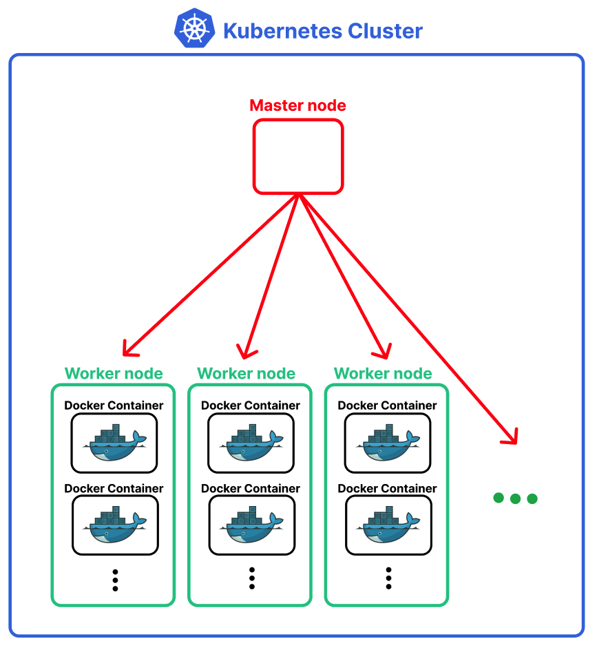
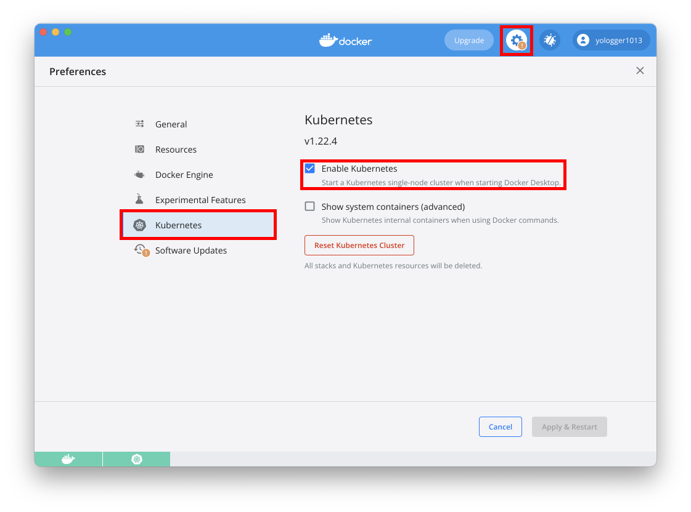
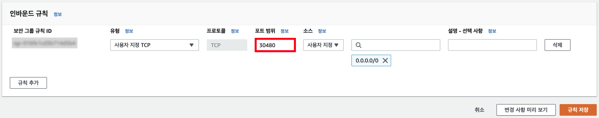
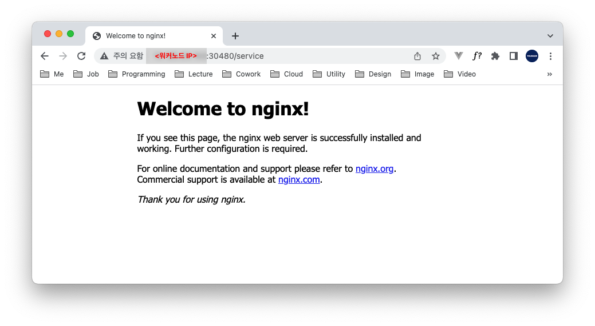

# Table of Contents
[[toc]]

## Kubernetes
`Kubernetes`는 <u>컨테이너 오케스트레이션</u> 시스템으로 다음과 같은 기능을 제공한다.
- `클러스터링`
    - 쿠버네티스는 여러 실제 서버를 논리적으로 하나의 서버로 클러스터링해준다.
    - 각 서버는 직접 구축한 온프레미스 서버일 수도 있고, AWS EC2처럼 클라우드 서버일 수도 있다.
- `오토 스케일링`
    - 쿠버네티스는 노드나 컨테이너를 쉽게 수평적 확장할 수 있다.
- `셀프 힐링`
    - 쿠버네티스는 특정 노드나 컨테이너가 다운되어도 자동으로 복구해준다.
- `로드 밸런싱`
    - 쿠버네티스는 노드나 컨테이너에 트래픽을 골고루 분배해준다.
- `롤링 업데이트`
    - 쿠버네티스는 무중단 배포를 지원한다.
- `롤백`
    - 쿠버네티스는 이전 버전으로 쉽게 돌아가는 롤백 기능을 제공한다.
- 그 밖에도 `네트워킹`, `보안`, `스토리지` 등의 다양한 기능을 제공한다.

## Master node, Worker node
쿠버네티스는 여러 서버를 `클러스터(Cluster)`로 만들어준다. 쿠버네티스에서는 각 서버를 `노드(Node)`라고 한다.


`마스터 노드(Master node)`는 클러스터와 워커 노드를 관리하며, `워커 노드(Worker node)`에는 컨테이너가 생성된다. (마스터 노드에도 컨테이너가 생성될 수 있다.)



보통 다음과 같은 순서로 쿠버네티스 클러스터를 구축한다.
1. 실제 서버든 클라우드 서비스의 서버든 상관없이 노드 역할을 할 서버를 세 개 이상 준비한다.
2. 모든 서버에 쿠버네티스를 설치한다.
3. 마스터 노드 역할을 할 서버를 선택한다.
4. 사용자는 `kubectl`로 마스터 노드에 접속하여 워커 노드를 등록한다.
5. 사용자는 워커 노드에 접속하여 마스터 노드에 대한 정보를 등록하여 클러스터 구축을 마무리한다.
6. 모든 노드에 설치된 `kubelet`이 유기적으로 통신하며 하나의 서버처럼 동작한다. 
7. 사용자는 마스터 노드에 접속하여 클러스터를 관리, 운영한다.

## 다양한 Kubernetes 환경

### 개발 환경
개발 환경에서는 하나의 노드로 구성된 쿠버네티스를 구축할 수 있다. 리눅스 환경에서는 `Minikube`, Mac OS 환경에서는 `Docker Destkop for Mac`, Window 환경에서는 `Docker Desktop for Window`를 설치하면 된다.

### 운영 환경 - 온프레미스
`온프레미스`는 AWS 같은 클라우드 서비스를 이용하지 않고 자체적인 서버실을 구축하여 운영하는 방식을 말한다. 온프레미스 환경에서는 `kubeadm`, `kops`, `kubespray` 등을 사용하여 쿠버네티스 클러스터를 구축할 수 있다.

### 운영 환경 - 클라우드 컴퓨팅 서비스에 쿠버네티스 클러스터 구성
AWS EC2와 같은 클라우드 컴퓨팅 서비스에 쿠버네티스 클러스터를 구축할 수도 있다. 보통 `kubeadm`, `kops`, `kubespray` 등을 사용하여 쿠버네티스 클러스터를 구축할 수 있다.

### 운영 환경 - 관리형 쿠버네티스
온프레미스 환경이든 AWS EC2 클라우드 컴퓨팅 서비스를 사용하든 마스터 노드에서 클러스터 구성을 위한 복잡한 환경설정을 해야한다. `AWS EKS(Elastic Kubernetes Service)`, `GCP GKE(Google Kubernetes Engine)` 같은 서비스는 마스터 노드 역할을 하는 클라우드 컴퓨팅 서비스를 제공하며, 이를 `관리형 쿠버네티스(Managed Kubernetes)`라고 한다.

## Mac OS에서 쿠버네티스 시작하기
`Docker Desktop for Mac`에는 쿠버네티스가 내장되어있다. `Docker Desktop for Mac`을 실행하여 다음과 같은 순서로 쿠버네티스를 활성화하면 된다.



`kubectl version` 명령어로 쿠버네티스 버전을 확인해보자.

```  
$ kubectl version  
Client Version: version.Info{Major:"1", Minor:"22", GitVersion:"v1.22.4", GitCommit:"b695d79d4f967c403a96986f1750a35eb75e75f1", GitTreeState:"clean", BuildDate:"2021-11-17T15:48:33Z", GoVersion:"go1.16.10", Compiler:"gc", Platform:"darwin/amd64"}
Server Version: version.Info{Major:"1", Minor:"22", GitVersion:"v1.22.4", GitCommit:"b695d79d4f967c403a96986f1750a35eb75e75f1", GitTreeState:"clean", BuildDate:"2021-11-17T15:42:41Z", GoVersion:"go1.16.10", Compiler:"gc", Platform:"linux/amd64"}
```

`kubectl get nodes`명령어로 클러스터에 포함된 노드들을 확인할 수 있다. 현재 하나의 노드를 확인할 수 있다.
```  
$ kubectl get nodes
NAME             STATUS   ROLES                  AGE   VERSION
docker-desktop   Ready    control-plane,master   66m   v1.22.4
```

## AWS EC2에서 쿠버네티스 클러스터 구축해보기
쿠버네티스 클러스터를 구성하기 위한 조건은 다음과 같다.

- 서버가 2개의 CPU core, 2GB RAM 이상이어야 한다.
- 메모르 스왑을 비활성화해야한다.
- 모든 서버의 시간이 NTP를 통해 동기화되어야한다. 

두 개의 AWS EC2 인스턴스로 쿠버네티스 클러스터를 구축해보자. AWS EC2 스펙은 다음과 같다.
- Ubuntu Server 20.04 LTS (HVM), SSD Volume Type
- t3a.small (2 CPU core, 2GB RAM)

### 보안 그룹 설정
쿠버네티스 노드 간 통신을 위해 다음과 같은 포트를 개방해야한다.
#### Master node

- `kubelet`: 10250
- `kube-apiserver`: 6443
- `etcd`: 2379, 2380

#### Worker node

- `kubelet`: 10250


### 호스트 이름 변경
`Hostname`에는 영문 소문자(a-z), 숫자(0-9), 그리고 하이폰(-)만 사용해야 한다.
우선 `sudo hostnamectl set-hostname <HOSTNAME>` 명령어로 호스트 이름을 변경한다.
```  
$ sudo hostnamectl set-hostname cluster-master1
```
`hostnamectl` 명령어로 반영되었는지 확인한다.
```  
$ hostnamectl
   Static hostname: cluster-master1
         Icon name: computer-vm
           Chassis: vm
        Machine ID: ec ... 766e7
           Boot ID: 33 ... e0732
    Virtualization: kvm
  Operating System: Ubuntu 18.04.6 LTS
            Kernel: Linux 5.4.0-1060-aws
      Architecture: x86-64
```
`/etc/hosts` 파일을 열고 호스트 네임을 추가한다.
```  
$ sudo vim /etc/hosts
```
``` {2}
127.0.0.1 localhost
127.0.0.1 cluster-master1
....
```

마지막으로 서버를 재시작한다.

### 패키지 업그레이드
기본으로 설치된 패키지들을 최신으로 업데이트 한다.
```
$ sudo apt update

$ sudo apt upgrade
```

### 메모리 스왑 비활성화
```
$ sudo swapoff -a
```

### NTP 설정 
쿠버네티스 클러스터는 여러 서버로 구성된다. 따라서 모든 서버의 시간을 `NTP(Network Time Protocol)`로 동기화 해야한다. 다음 명령어를 순서대로 입력하자.
```
$ sudo apt install ntp

$ sudo service ntp restart

$ sudo ntpq -p
```

### 도커 설치
먼저 각 노드에 도커를 설치하기 위해 다음 명령어를 순서대로 입력한다.
```
$ sudo apt-get update && sudo apt-get install -y apt-transport-https ca-certificates curl software-properties-common gnupg2

$ curl -fsSL https://download.docker.com/linux/ubuntu/gpg | sudo apt-key --keyring /etc/apt/trusted.gpg.d/docker.gpg add -

$ sudo add-apt-repository "deb [arch=amd64] https://download.docker.com/linux/ubuntu $(lsb_release -cs) stable"

$ sudo apt-get update && sudo apt-get install -y containerd.io=1.2.13-2 docker-ce=5:19.03.11~3-0~ubuntu-$(lsb_release -cs) docker-ce-cli=5:19.03.11~3-0~ubuntu-$(lsb_release -cs)

$ sudo mkdir /etc/docker

$ cat <<EOF | sudo tee /etc/docker/daemon.json
{
  "exec-opts": ["native.cgroupdriver=systemd"],
  "log-driver": "json-file",
  "log-opts": {
    "max-size": "100m"
  },
  "storage-driver": "overlay2"
}
EOF

$ sudo mkdir -p /etc/systemd/system/docker.service.d

$ sudo systemctl daemon-reload

$ sudo systemctl restart docker

$ sudo systemctl enable docker
```
도커가 설치되었는지 확인하자.
```
$ docker --version
Docker version 20.10.14, build a224086
```
도커는 다음과 같이 시작, 상태 확인, 정지할 수 있다.
```
$ sudo systemctl start docker 

$ sudo systemctl status docker 

$ sudo systemctl stop docker 
```

### 쿠버네티스 설치
먼저 쿠버네티스 저장소를 추가한다.
```
$ sudo apt-get update

$ sudo apt-get install -y apt-transport-https ca-certificates curl

$ sudo curl -fsSLo /usr/share/keyrings/kubernetes-archive-keyring.gpg https://packages.cloud.google.com/apt/doc/apt-key.gpg

$ echo "deb [signed-by=/usr/share/keyrings/kubernetes-archive-keyring.gpg] https://apt.kubernetes.io/ kubernetes-xenial main" | sudo tee /etc/apt/sources.list.d/kubernetes.list

$ sudo apt-get update

$ sudo apt-get install -y kubectl kubeadm kubelet 

$ sudo apt-mark hold kubectl kubeadm kubelet 
```
- `kubectl`: 쿠버네티스를 제어하기 위한 CLI 도구
- `kubeadm`: 쿠버네티스 클러스터를 구축하고 실행하는 도구
- `kubelet`: 쿠버네티스 노드 사이에서 실행되며, 노드 사이의 통신을 담당하는 도구

지금까지 마스터 노드에 도커와 쿠버네티스를 설치했다. 다른 작업 노드에도 동일한 방법으로 도커와 쿠버네티스를 설치하자.


### 마스터 노드에서 클러스터 초기화하기
마스터 노드로 사용할 호스트에서 다음 명령어로 클러스터를 초기화하고 마스터 노드를 생성한다.
```
$ sudo kubeadm init \
    --pod-network-cidr=192.168.0.0/16 \
    --control-plane-endpoint=<EC2 IP주소> \
    --apiserver-cert-extra-sans=<EC2 IP주소>    
```
마스터 노드 생성에 성공하면 다음과 같은 결과물이 출력된다.
``` {5-7,20,24}
Your Kubernetes control-plane has initialized successfully!

To start using your cluster, you need to run the following as a regular user:

  mkdir -p $HOME/.kube
  sudo cp -i /etc/kubernetes/admin.conf $HOME/.kube/config
  sudo chown $(id -u):$(id -g) $HOME/.kube/config

Alternatively, if you are the root user, you can run:

  export KUBECONFIG=/etc/kubernetes/admin.conf

You should now deploy a pod network to the cluster.
Run "kubectl apply -f [podnetwork].yaml" with one of the options listed at:
  https://kubernetes.io/docs/concepts/cluster-administration/addons/

You can now join any number of control-plane nodes by copying certificate authorities
and service account keys on each node and then running the following as root:

  kubeadm <마스터 노드 EC2 IP>:<PORT> --token 생략 ...

Then you can join any number of worker nodes by running the following on each as root:

  kubeadm join <마스터노드 EC2 IP>:<PORT> --token 생략 ...
```
결과물에서 명령어 몇 가지를 확인할 수 있는데 먼저 첫 번째 명령어를 마스터 노드에서 실행한다.
```
$ sudo mkdir -p $HOME/.kube

$ sudo cp -i /etc/kubernetes/admin.conf $HOME/.kube/config

$ sudo chown $(id -u):$(id -g) $HOME/.kube/config
```

두 번째 명령어는 마스터 노드를 추가하고 싶을 때 마스터 노드에서 실행한다.
``` {4}
You can now join any number of control-plane nodes by copying certificate authorities
and service account keys on each node and then running the following as root:

  kubeadm <마스터 노드 EC2 IP>:<PORT> --token 생략 ...
```

세 번째 명령어는 워커 노드를 추가하고 싶을 때 워커 노드에서 실행한다.
``` {3}
Then you can join any number of worker nodes by running the following on each as root:

  kubeadm join <마스터노드 EC2 IP>:<PORT> --token 생략 ...
```

### 워커 노드 추가하기
워커 노드로 사용할 EC2 인스턴스에도 위와 동일한 방법으로 도커와 쿠버네티스를 설치한다. 그리고 마스터 노드를 생성할 때 출력된 세 번째 명령어를 워커 노드에서 실행한다.
```
$ sudo kubeadm join <마스터노드 EC2 IP>:<PORT> --token 생략 ...
This node has joined the cluster
```  

### 오버레이 네트워크 설치
우선 마스터 노드 다음 명령어를 입력한다.
```{3,4}
$ kubectl get pod --all-namespaces
NAMESPACE     NAME                                      READY   STATUS              RESTARTS   AGE
kube-system   coredns-64897985d-7cn8t                   0/1     Pending             0          10m
kube-system   coredns-64897985d-fqxbs                   0/1     Pending             0          10m
kube-system   etcd-cluster-master1                      1/1     Running             0          10m
kube-system   kube-apiserver-cluster-master1            1/1     Running             0          10m
kube-system   kube-controller-manager-cluster-master1   1/1     Running             0          10m
kube-system   kube-proxy-8xft2                          1/1     Running             0          9m6s
kube-system   kube-proxy-qkd54                          1/1     Running             0          10m
kube-system   kube-scheduler-cluster-master1            1/1     Running             0          10m
```
`kube-system`에 `coredns`로 시작하는 오브젝트를 확인할 수 있다. 쿠버네티스는 싱글 노드 환경에서 기본적으로 `coredns`를 사용하여 오브젝트를 식별하며, `coredns-64897985d-7cn8t`, `coredns-64897985d-fqxbs`는 `coredns`와 관련된 오브젝트다.

그러나 멀티 노드로 구성된 클러스터 환경에서 오브젝트 사이의 통신을 위해서는 오버레이 네트워크를 구성해야한다. `CNI(Contaier Network Interface)`는 컨테이너 간 네트워킹을 제어할 수 있는 플러그인 표준이며, 이 구현체에는 `Calico`, `Flannel` 등이 존재한다.

아직 오버레이 네트워크가 구성되지 않았기 때문에 `coredns`와 관련된 오브젝트의 상태가 `Pending`이다.

이제 `Calico`를 사용하여 오버레이 네트워크를 구성해보자. 다음 명령어를 입력하기만 하면 된다.
```
$ kubectl apply -f https://docs.projectcalico.org/manifests/calico.yaml
```

정상적으로 설치가 완료되면 `Calico`와 관련된 오브젝트가 생성, 실행되는 것을 확인할 수 있다.
```{3-5}
$ kubectl get pods --all-namespaces
NAMESPACE     NAME                                      READY   STATUS    RESTARTS   AGE
kube-system   calico-kube-controllers-7c845d499-x84g7   1/1     Running   0          11m
kube-system   calico-node-shffx                         0/1     Running   0          11m
kube-system   calico-node-tgw54                         0/1     Running   0          11m
kube-system   coredns-64897985d-7cn8t                   1/1     Running   0          22m
kube-system   coredns-64897985d-fqxbs                   1/1     Running   0          22m
kube-system   etcd-cluster-master1                      1/1     Running   0          23m
kube-system   kube-apiserver-cluster-master1            1/1     Running   0          23m
kube-system   kube-controller-manager-cluster-master1   1/1     Running   0          23m
kube-system   kube-proxy-8xft2                          1/1     Running   0          21m
kube-system   kube-proxy-qkd54                          1/1     Running   0          22m
kube-system   kube-scheduler-cluster-master1            1/1     Running   0          23m
```
또한 오버레이 네트워크가 구성됐기 때문에 `coredns`와 관련된 오브젝트의 상태도 `Running`으로 변경되었다.

### 노드 삭제하기
삭제할 노드에서 `kubeadm reset` 명령어를 입력하면 쿠버네티스에서 노드가 삭제된다.

### 클러스터에 오브젝트 추가해보기
디플로이먼트, 서비스를 추가하여 클러스터가 잘 작동하는지 확인하자.

우선 디플로이먼트를 생성한다.
``` yml
# nginx-deployment.yml
apiVersion: apps/v1
kind: Deployment
metadata:
  name: nginx-deployment
spec:
  replicas: 3
  selector:
    matchLabels:
      app: nginx-pod-label
  template:
    metadata:
      name: nginx-pod
      labels: 
        app: nginx-pod-label
    spec:
      containers:
        - name: nginx-container
          image: nginx:latest
          ports:
          - containerPort: 80
```
```
$ kubectl apply -f nginx-deployment.yml
```
```
$ kubectl get deployment
NAME               READY   UP-TO-DATE   AVAILABLE   AGE
nginx-deployment   3/3     3            3           33s
```

그리고 ClusterIP 타입의 서비스를 생성한다.
``` yml
# nginx-service.yml
apiVersion: v1
kind: Service
metadata:
  name: nginx-service
spec:
  ports:
    - name: nginx-service-port
      port: 9999
      targetPort: 80
  selector:
    app: nginx-pod-label
  type: ClusterIP
```
```
$ kubectl apply -f nginx-service.yml
```
```
$ kubectl get services
NAME            TYPE        CLUSTER-IP       EXTERNAL-IP   PORT(S)    AGE
kubernetes      ClusterIP   10.96.0.1        <none>        443/TCP    14m
nginx-service   ClusterIP   10.103.118.151   <none>        9999/TCP   6s
```

그 다음 인그레스 오브젝트를 생성한다.
``` yml
# nginx-ingress.yml
apiVersion: networking.k8s.io/v1
kind: Ingress
metadata:
  name: nginx-ingress
  annotations:
    nginx.ingress.kubernetes.io/rewrite-target: / 
    kubernetes.io/ingress.class: "nginx"
spec:
  rules: 
  - http:
      paths:
      - path: /service
        pathType: Prefix
        backend:
          service:
            name: nginx-service
            port:
              number: 9999
```
```
$ kubectl apply -f nginx-ingress.yml
```
```
$ kubectl get ingress
NAME            CLASS    HOSTS   ADDRESS   PORTS   AGE
nginx-ingress   <none>   *                 80      2m32s
```
그리고 nginx 인그레스 컨트롤러를 설치한다.
```
$ kubectl apply -f https://raw.githubusercontent.com/kubernetes/ingress-nginx/controller-v1.0.0/deploy/static/provider/baremetal/deploy.yaml
```
마지막으로 nginx 인그레스 컨트롤러 서비스의 외부 포트를 EC2 보안 그룹에서 개방한다.
``` {3}
$ kubectl get services -n ingress-nginx 
NAME                                 TYPE        CLUSTER-IP       EXTERNAL-IP   PORT(S)                      AGE
ingress-nginx-controller             NodePort    10.102.204.237   <none>        80:30480/TCP,443:32300/TCP   10m
ingress-nginx-controller-admission   ClusterIP   10.106.35.236    <none>        443/TCP                      10m
```



이제 워커노드로 요청을 보낼 수 있게 된다.

