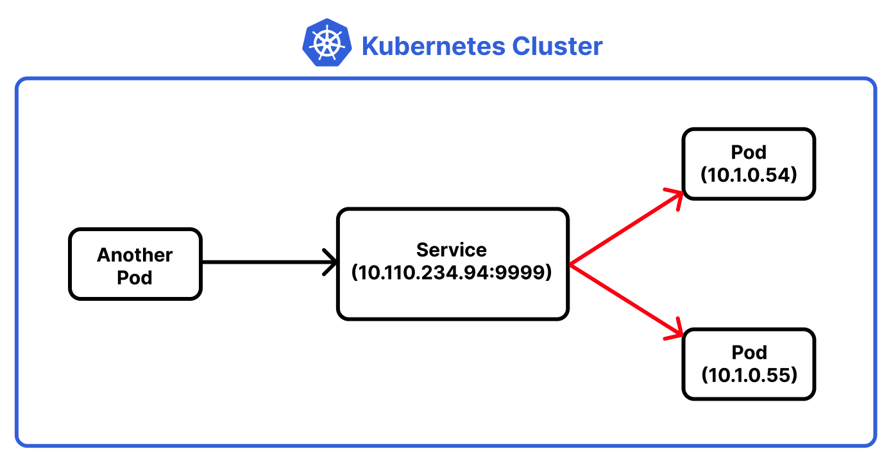
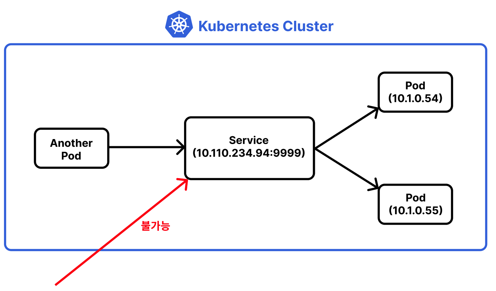
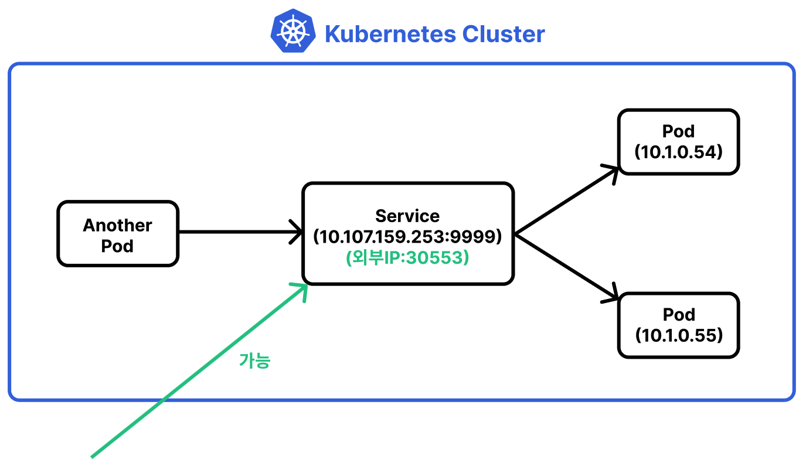
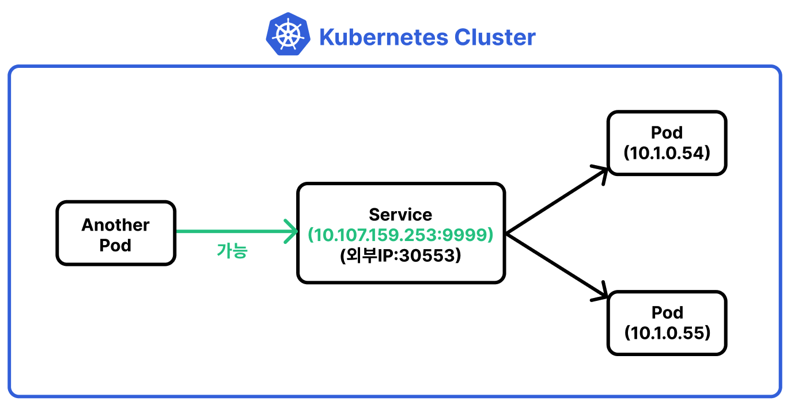
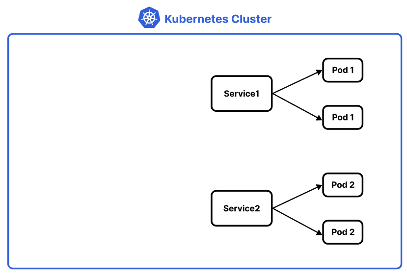
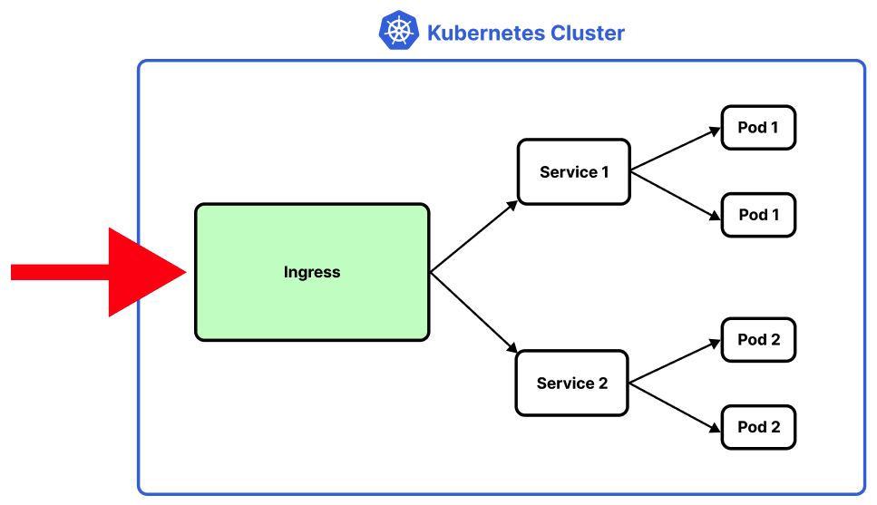
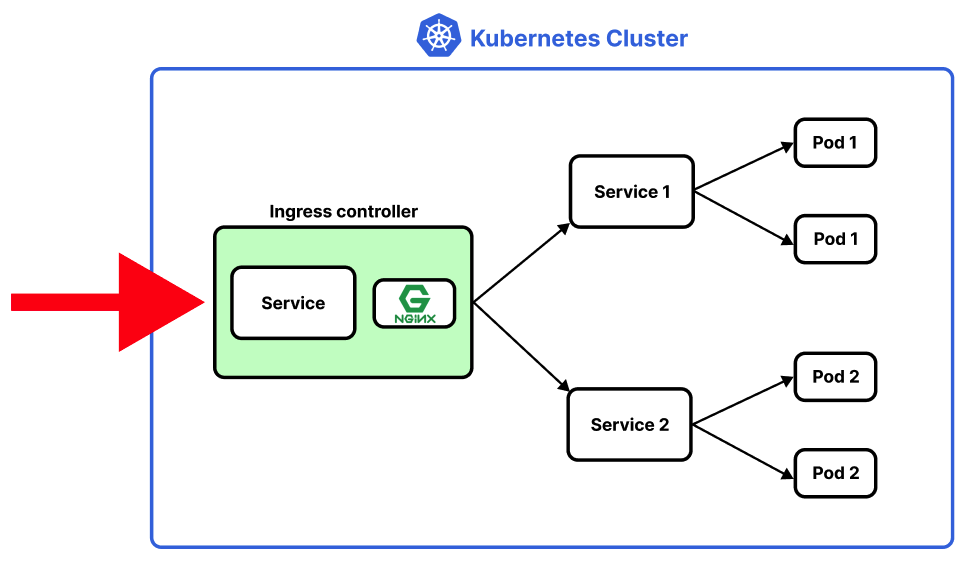

# Table of Contents
[[toc]]

# 오브젝트
쿠버네티스는 자원을 `오브젝트(Object)`라는 형태로 관리한다. 자주 사용하는 오브젝트는 다음과 같다.
- `Pod`
- `ReplicaSet`
- `Deployment`
- `Configmap`
- `Secret`
- `Namespace`
- `Service`
- `Ingress`

## 오브젝트 종류 확인하기
``` shellsession
$ kubectl api-resources
NAME                              SHORTNAMES   APIVERSION                             NAMESPACED   KIND
pods                              po           v1                                     true         Pod
replicasets                       rs           apps/v1                                true         ReplicaSet
services                          svc          v1                                     true         Service
deployments                       deploy       apps/v1                                true         Deployment
configmaps                        cm           v1                                     true         ConfigMap
secrets                                        v1                                     true         Secret
namespaces                        ns           v1                                     false        Namespace
ingresses                         ing          networking.k8s.io/v1                   true         Ingress
....
```

## YAML Configuration 파일
쿠버네티스틑 `.yml` 확장자를 갖는 `YAML 파일`에 오브젝트를 선언하고 설정한다. 그리고 `kubectl apply <YAML 파일>` 명령어로 클러스터를 실행한다.


## Pod
- 쿠버네티스에서는 컨테이너 애플리케이션의 기본 단위를 `팟(Pod)`이라고 한다.
- 팟은 하나 이상의 도커 컨테이너로 구성된다.

하나의 Nginx 컨테이너로 구성된 간단한 팟을 생성해보자. 먼저 `nginx-pod.yml`파일을 다음과 같이 작성한다.
``` yml
apiVersion: v1
kind: Pod
metadata:
  name: nginx-pod  # Pod 이름
spec:
  containers:  # Pod에 생성할 컨테이너 나열
    - name: nginx-container  # 컨테이너 이름
      image: nginx:latest  # 컨테이너 이미지
      ports:
      - containerPort: 80
        protocol: TCP
```
- `kind`: 오브젝트 종류
- `metadata.name`: 팟 이름
- `spec`: 오브젝트 생성을 위한 상세한 종료
- `spec.containers`: 팟에 생성할 컨테이너들을 나열한다.

### 팟 생성 및 실행
`kubectl apply -f <YAML 파일>` 명령어로 클러스터에서 팟을 실행할 수 있다.
``` shellsession
$ kubectl apply -f nginx-pod.yml
pod/nginx-pod created
```
하나의 도커 컨테이너가 생성된 것도 확인할 수 있다.
``` shellsession
$ docker ps -al
ONTAINER ID   IMAGE     COMMAND                  CREATED          STATUS          PORTS     NAMES
fe068fdc944c   nginx     "/docker-entrypoint.…"   24 seconds ago   Up 24 seconds             k8s_nginx-container_nginx-pod_default_e1574fb9-c59e-4916-8bcc-188a5640f6cd_0
```

참고로 YAML 파일에 `---`를 명시하여 여러 오브젝트를 선언할 수 있다. 다음 예제는 두 개의 팟을 선언하고 있다.
``` yml
apiVersion: v1
kind: Pod
metadata:
  name: nginx-pod-1
spec:
  containers:  
    - name: nginx-container
      image: nginx:latest
      ports:
      - containerPort: 80
        protocol: TCP
---
apiVersion: v1
kind: Pod
metadata:
  name: nginx-pod-2
spec:
  containers:  
    - name: nginx-container
      image: nginx:latest
      ports:
      - containerPort: 80
        protocol: TCP
```

### 오브젝트 목록 확인
`kubectl get <오브젝트 이름>` 명령어로 오브젝트 목록을 확인할 수 있다. `READY`의 `1/1`은 한 개의 컨테이너 중 한 개의 컨테이너가 정상 실행 중이라는 의미다.
``` shellsession
$ kubectl get pods
NAME        READY   STATUS    RESTARTS   AGE
nginx-pod   1/1     Running   0          3m
```


`-o wide` 옵션으로 클러스터 내부에서 팟에 할당된 IP도 확인할 수 있다.
``` shellsession
$ kubectl get pods -o wide
NAME        READY   STATUS    RESTARTS   AGE   IP          NODE             NOMINATED NODE   READINESS GATES
nginx-pod   1/1     Running   0          70m   10.1.0.33   docker-desktop   <none>           <none>
```

### 오브젝트 상세정보 확인
`kubectl describe <오브젝트 종류> <오브젝트 이름>`으로 오브젝트의 상세한 정보를 확인할 수 있다.
``` shellsession {5,10}
$ kubectl describe pods nginx-pod    
Name:         nginx-pod
Namespace:    default
Priority:     0
Node:         docker-desktop/192.168.65.4   // 노드 IP
Start Time:   Tue, 19 Apr 2022 14:23:56 +0900
Labels:       <none>
Annotations:  <none>
Status:       Running
IP:           10.1.0.33   // 팟 IP
IPs:
  IP:  10.1.0.33
Containers:
  nginx-container:
    Container ID:   docker://fe068fdc944c8d64e198c6da83eb29d8f97340412679605c6ba15bda710efe31
    Image:          nginx:latest
    Image ID:       docker-pullable://nginx@sha256:2275af0f20d71b293916f1958f8497f987b8d8fd8113df54635f2a5915002bf1
    Port:           80/TCP
    // 생략 ...
```

### 컨테이너 내부에 접속하기
`kubectl exec -it <팟 이름> -c <컨테이너 이름> <사용할 쉘>`로 팟 내부 컨테이너에 접속할 수 있다.
``` shellsession
$ kubectl exec -it nginx-pod -c nginx-container bash
root@nginx-pod:/# 
```

`Nginx`가 실행 중인지 확인해보자.
``` shellsession
$ curl localhost
<!DOCTYPE html>
<html>
<head>
<title>Welcome to nginx!</title>
<style>
html { color-scheme: light dark; }
body { width: 35em; margin: 0 auto;
font-family: Tahoma, Verdana, Arial, sans-serif; }
</style>
</head>
<body>
<h1>Welcome to nginx!</h1>
<p>If you see this page, the nginx web server is successfully installed and
working. Further configuration is required.</p>

<p>For online documentation and support please refer to
<a href="http://nginx.org/">nginx.org</a>.<br/>
Commercial support is available at
<a href="http://nginx.com/">nginx.com</a>.</p>

<p><em>Thank you for using nginx.</em></p>
</body>
</html>
```

### 팟 로그 확인하기
`kubectl logs nginx-pod` 명령어로 팟 로그를 확인할 수 있다.
``` shellsession
$ kubectl logs nginx-pod
```

### 팟 삭제
`kubectl delete -f <yml 파일>` 명령어로 팟을 삭제할 수 있다.
``` shellsession
$ kubectl delete -f nginx-pod.yml
pod "nginx-pod" deleted
```

### 모든 팟 삭제
`kubectl delete pods --all` 명령어로 모든 팟을 삭제할 수 있다.
``` shellsession
$ kubectl delete pods --all 
```


### Pod vs. Docker container
팟은 여러 컨테이너를 포함할 수도 있다. `nginx-pod.yml` 파일을 다음과 같이 수정하자.

``` yml{2,14-18}
apiVersion: v1
kind: Pod
metadata:
  name: nginx-pod
spec:
  containers:
    # 첫번째 컨테이너
    - name: nginx-container
      image: nginx:latest
      ports:
      - containerPort: 80
        protocol: TCP

    # 두번째 컨테이너
    - name: ubuntu-container
      image: ubuntu:latest
      command: ["tail"]
      args: ["-f", "/dev/null"]
```

두 개의 컨테이너가 생성된 것을 확인할 수 있다.
``` shellsession
$ kubectl get pods              
NAME        READY   STATUS    RESTARTS   AGE
nginx-pod   2/2     Running   0          116s
```

## ReplicaSet
`레플리카셋(ReplicaSet)`은 다음 기능을 제공하는 오브젝트다.

- 동일한 팟 여러 개를 쉽게 생성, 관리할 수 있다. 
- 지정한 개수의 팟을 항상 유지하기 때문에 특정 팟이 다운되어도 팟을 새롭게 생성하거나 재시작한다.

세 개의 동일한 팟을 유지하는 레플리카셋을 생성해보자. `nginx-replicaset.yml`을 다음과 같이 작성한다.
``` yml {3,7}
# nginx-replicaset.yml
apiVersion: apps/v1
kind: ReplicaSet
metadata:
  name: nginx-replicaset
spec:
  replicas: 3
  selector: 
    matchLabels: 
      app: nginx-pod-label
  template:
    metadata:
      name: nginx-pod
      labels:
        app: nginx-pod-label
    spec:
      containers:
      - name: nginx
        image: nginx:latest
        ports:
        - containerPort: 80
``` 
- `spec.replicas`: 생성할 팟의 수

이제 다음과 같이 레플리카셋을 생성하자.
``` shellsession
$ kubectl apply -f nginx-replicaset.yml
```
세 개의 팟이 생성된 것을 확인할 수 있다.
``` shellsession
$ kubectl get pods
NAME                     READY   STATUS    RESTARTS   AGE
nginx-replicaset-6txwh   1/1     Running   0          102s
nginx-replicaset-tvsg6   1/1     Running   0          102s
nginx-replicaset-xc5xt   1/1     Running   0          102s
```
``` shellsession
$ kubectl get replicaset
NAME               DESIRED   CURRENT   READY   AGE
nginx-replicaset   3         3         3       2m25s
```
레플리카를 다섯 개로 수정하고 `kubectl apply -f` 명령어를 다시 실행해보자.
``` shellsession {3,4}
$ kubectl get pods                  
NAME                     READY   STATUS              RESTARTS   AGE
nginx-replicaset-5xltl   1/1     Running             0          4s
nginx-replicaset-nlnsn   1/1     Running             0          4s
nginx-replicaset-6txwh   1/1     Running             0          3m44s
nginx-replicaset-tvsg6   1/1     Running             0          3m44s
nginx-replicaset-xc5xt   1/1     Running             0          3m44s
```
두 개의 팟이 추가적으로 생성되었다.

## Deployment
`디플로이먼트(Deployment)`는 서비스와 매우 유사하다. 다만 다음 기능을 추가적으로 제공한다.

- 애플리케이션의 배포와 롤링 업데이트를 지원한다.
- 이전 배포 버전으로 쉽게 롤백할 수 있다.

우선 디플로이먼트를 정의한 간단한 `nginx-deployment.yml` 파일을 생성하자. `1.10` 버전의 `nginx`를 사용하고 있는 것에 주목하자.
``` yml {2,18}
apiVersion: apps/v1
kind: Deployment
metadata:
  name: nginx-deployment
spec:
  replicas: 3
  selector:
    matchLabels:
      app: nginx-pod-label
  template:
    metadata:
      name: nginx-pod
      labels: 
        app: nginx-pod-label
    spec:
      containers:
        - name: nginx-container
          image: nginx:1.10
          ports:
          - containerPort: 80
```

이제 디플로이먼트를 생성하자. 이때 `--record` 옵션을 추가한다.
``` shellsession
$ kubectl apply -f nginx-deployment.yml --record
deployment.apps/nginx-deployment created
```
디플로이먼트가 생성되었다.
``` shellsession
$ kubectl get deployment
NAME               READY   UP-TO-DATE   AVAILABLE   AGE
nginx-deployment   3/3     3            3           116s
```
하나의 레플리카도 생성되었다.
``` shellsession
$ kubectl get replicaset
NAME                          DESIRED   CURRENT   READY   AGE
nginx-deployment-796dd5cd88   3         3         3       3m50s
```
세 개의 팟도 생성되었다.
``` shellsession
$ kubectl get pods
NAME                                READY   STATUS    RESTARTS   AGE
nginx-deployment-796dd5cd88-mnlpc   1/1     Running   0          105s
nginx-deployment-796dd5cd88-nsdlp   1/1     Running   0          105s
nginx-deployment-796dd5cd88-q97dp   1/1     Running   0          105s
```

지금까지는 디플로이먼트가 레플리카와 다를게 없어보인다. 이제 `nginx-deployment.yml` 파일에서 `nginx`의 버전을 `1.10`에서 `1.11`로 변경하자.
``` yml {5}
# 생략 ...
containers:
- name: nginx-container
    # image: nginx: 1.10
    image: nginx: 1.11
    ports:
    - containerPort: 80
```

그 다음 `kubectl apply -f` 명령어를 다시 실행한다.
``` shellsession
$ kubectl apply -f nginx-deployment.yml --record
```
팟들이 새롭게 생성된 것을 확인할 수 있다. 쿠버네티스가 각각의 팟들을 새로운 버전으로 롤링 업데이트한 것이다.
``` shellsession
$ kubectl get pods
NAME                               READY   STATUS    RESTARTS   AGE
nginx-deployment-664f4c64c-6wxxs   1/1     Running   0          32s
nginx-deployment-664f4c64c-ksdt4   1/1     Running   0          23s
nginx-deployment-664f4c64c-xz7vc   1/1     Running   0          25s
```
이제 레플리카 셋을 확인해보자. 기존 레플리카셋과 새로운 레플리카셋이 존재한다.
``` shellsession
$ kubectl get replicaset
NAME                          DESIRED   CURRENT   READY   AGE
nginx-deployment-664f4c64c    3         3         3       2m59s
nginx-deployment-796dd5cd88   0         0         0       10m
```
다음 명령어로 이전 버전으로 롤백을 할 수도 있다.
``` shellsession
$ kubectl rollout undo deployment nginx-deployment --to-revision=1
deployment.apps/nginx-deployment rolled back
```
``` shellsession
$ kubectl get pods
NAME                                READY   STATUS    RESTARTS   AGE
nginx-deployment-796dd5cd88-gtmjz   1/1     Running   0          12s
nginx-deployment-796dd5cd88-m4v8v   1/1     Running   0          9s
nginx-deployment-796dd5cd88-tnh5j   1/1     Running   0          11s
```

## Service
`서비스(Service)`는 크게 세 가지 역할을 하는 오브젝트다.

- `팟 주소 고정`: 레플리카셋이나 디플로이먼트로 띄운 팟은 쿠버네티스 클러스터의 상황에 따라서 노드를 옮겨다니기도 하고 재시작되기도 한다. IP 주소가 변하기도 한다. 서비스의 `셀렉터(Selector)`, 팟의 `라벨(Label)`를 사용하면 팟이 어떤 노드에 있든 고정된 방법으로 접근할 수 있다.

- `팟 외부 노출`: 컨테이너와 쿠버네티스 클러스터의 포트를 <u>바인딩</u>하고 컨테이너 포트를 외부로 노출하는 오브젝트다.  즉 서비스는 클러스터로 들어온 요청을 컨테이너로 <u>포워딩</u>해준다. 

- `로드 밸런싱`: 요청을 여러 팟으로 분산하여 보낸다. 

서비스는 크게 세 가지 타입이 존재한다.
|종류|설명|
|---|---|
|`ClusterIP`|쿠버네티스 내부의 팟을 외부로 노출하지 않는 서비스|
|`NodePort`|쿠버네티스 내부의 포트를 외부로 노출하는 서비스. 주로 <u>온프레미스 환경</u>에서 사용한다.|
|`LoadBalancer`|AWS, GCP 등 <u>클라우드 서비스</u>에서 사용하는 서비스. 클라우드 서비스가 제공하는 로드밸런서 기능을 사용한다.|


실제 운영 환경에서는 `컨테이너 외부 노출` 기능은 서비스 대신 `인그레스(Ingress)`를 사용하여 구축한다. 서비스는 주로 `팟 주소 고정`와 `로드 밸런싱`에 사용된다.


### 팟 주소 고정
쿠버네티스는 기본적으로 팟에 유동적으로 IP를 할당한다. 
``` shellsession
$ kubectl get pods -o wide
NAME                               READY   STATUS    RESTARTS   AGE   IP         
nginx-deployment-664f4c64c-4sbfd   1/1     Running   0          6s    10.1.0.54   
nginx-deployment-664f4c64c-5r55z   1/1     Running   0          6s    10.1.0.55   
```
위 예제에서의 IP(`10.1.0.54`, `10.1.0.55`)는 쿠버네티스의 상태에 따라 동적으로 변할 수 있다. 따라서 IP가 아닌 다른 고정된 주소로 팟에 접근할 수 있어야 한다.

### 팟의 외부 노출
팟은 기본적으로 외부에 노출되지 않는다. 즉 쿠버네티스 클러스터 내부, 즉 <u>내부 다른 팟</u>에서만 해당 팟과 통신할 수 있다. 

이를 살펴보기 위해 두 개의 동일한 팟을 유지하는 디플로이먼트를 실행해보자.
``` yml
# nginx-deployment.yml
apiVersion: apps/v1
kind: Deployment
metadata:
  name: nginx-deployment
spec:
  replicas: 2
  selector:
    matchLabels:
      app: nginx-pod-label
  template:
    metadata:
      name: nginx-pod
      labels: 
        app: nginx-pod-label
    spec:
      containers:
        - name: nginx-container
          image: nginx:latest
          ports:
          - containerPort: 80
```
``` shellsession
$ kubectl apply -f nginx-deployment.yml

$ kubectl get pods -o wide
NAME                               READY   STATUS    RESTARTS   AGE   IP         
nginx-deployment-664f4c64c-4sbfd   1/1     Running   0          6s    10.1.0.54   
nginx-deployment-664f4c64c-5r55z   1/1     Running   0          6s    10.1.0.55   
```

그 다음 `10.1.0.54` 팟에 접속하여 `10.1.0.55`과 통신할 수 있는지 확인해보자.
``` shellsession
$ kubectl exec -it nginx-deployment-664f4c64c-4sbfd bash
```
팟 사이에 정상적으로 통신이 되는 것을 확인할 수 있다.
```{1}
root@nginx-deployment-664f4c64c-4sbfd:/# curl 10.1.0.55
<!DOCTYPE html>
<html>
<head>
<title>Welcome to nginx!</title>
<style>
html { color-scheme: light dark; }
body { width: 35em; margin: 0 auto;
font-family: Tahoma, Verdana, Arial, sans-serif; }
</style>
</head>
<body>
<h1>Welcome to nginx!</h1>
<p>If you see this page, the nginx web server is successfully installed and
working. Further configuration is required.</p>

<p>For online documentation and support please refer to
<a href="http://nginx.org/">nginx.org</a>.<br/>
Commercial support is available at
<a href="http://nginx.com/">nginx.com</a>.</p>

<p><em>Thank you for using nginx.</em></p>
</body>
</html>
```

이제 클러스터 외부에서 접근이 안되는지 확인해보자. 쿠버네티스에서는 클러스터를 구성하는 노드 또한 외부로 간주한다. 따라서 노드에서 다음같은 접속들은 모두 허용되지 않는다.
``` 
$ curl 10.1.0.54
$ curl 10.1.0.55
```
또한 외부 네트워크에서의 접속도 허용되지 않는다.
```
$ curl <NODE IP>
```

::: warning
팟을 <u>클러스터 구성하는 노드</u>로 노출하는지는 쿠버네티스의 네트워크 모델에 따라 다르다. 일반적으로 `Docker Desktop for Mac OS`, `Docker Desktop for Window`, `온프레미스 모델`에서는 클러스터를 구성하는 노드로 조차 포드를 노출하지 않는다. 반면 일부 퍼블릭 클라우드 쿠버네티스는 별다른 설정 없이도 클러스터를 구성하는 노드에게는 포드를 노출하기도 한다. 따라서 기본적으로 <u><b>클러스터를 구성하는 노드에게 조차 팟을 노출하지 않는다</b></u>고 간주하는게 좋다.
:::

### ClusterIP 서비스
서비스는 IP가 아닌 `셀렉터(Selector)`를 사용하여 팟을 식별한다. 서비스는 마치 DNS 처럼 동작하며, IP 대신 팟을 구분하는 `라벨(Label)`을 사용한다.

서비스 생성을 위한 설정파일은 다음과 같다.
``` yml {11,12,13}
# nginx-service-clusterip.yml
apiVersion: v1
kind: Service
metadata:
  name: nginx-service-clusterip
spec:
  ports:
    - name: nginx-pods-clusterip-port
      port: 9999
      targetPort: 80
  selector:
    app: nginx-pod-label  ## 팟의 라벨
  type: ClusterIP  ## 서비스 타입
```
서비스를 생성한다.
``` shellsession
$ kubectl apply -f nginx-service-clusterip.yml 
service/nginx-service-clusterip created
```
생성된 서비스는 다음과 같다.
``` shellsession {4}
$ kubectl get services
NAME                      TYPE        CLUSTER-IP      EXTERNAL-IP   PORT(S)    AGE
kubernetes                ClusterIP   10.96.0.1       <none>        443/TCP    9m47s
nginx-service-clusterip   ClusterIP   10.110.234.94   <none>        9999/TCP   3m30s
```
이제 다른 팟에서 서비스를 통해 팟들과 통신할 수 있다. 서비스의 `CLUSTER-IP`와 `PORT`를 사용하면 된다.
```
// 다른 팟 내부에 접속
$ kubectl exec -it ubuntu-pod bash
```
```
// 다른 팟에서 서비스로 요청
root@ubuntu-pod:/# curl 10.110.234.94:9999
<!DOCTYPE html>
<html>
<head>
<title>Welcome to nginx!</title>
<style>
    body {
        width: 35em;
        margin: 0 auto;
        font-family: Tahoma, Verdana, Arial, sans-serif;
    }
</style>
</head>
<body>
<h1>Welcome to nginx!</h1>
<p>If you see this page, the nginx web server is successfully installed and
working. Further configuration is required.</p>

<p>For online documentation and support please refer to
<a href="http://nginx.org/">nginx.org</a>.<br/>
Commercial support is available at
<a href="http://nginx.com/">nginx.com</a>.</p>

<p><em>Thank you for using nginx.</em></p>
</body>
</html>
```

서비스로 요청을 보내면 로드밸런싱도 수행된다.



`ClusterIP` 타입의 서비스는 팟을 외부로 노출하지 않기 때문에 클러스터 외부 네트워크에서는 접근할 수 없다.



### NodePort 서비스
`NodePort` 타입 서비스는 ClusterIP와 유사하다. 다만 외부 네트워크에서도 팟에 접근하도록 팟을 외부에 노출한다.
``` yml {13}
# nginx-service-nodeport.yml
apiVersion: v1
kind: Service
metadata:
  name: nginx-service-nodeport
spec:
  ports:
    - name: nginx-pods-port
      port: 9999
      targetPort: 80
  selector:
    app: nginx-pod-label
  type: NodePort  
```

서비스를 생성하자.
``` shellsession
$ kubectl apply -f nginx-service-nodeport.yml 
```

생성된 서비스는 다음과 같다.
``` shellsession {4}
$ kubectl get services
NAME                      TYPE        CLUSTER-IP       EXTERNAL-IP   PORT(S)          AGE
kubernetes                ClusterIP   10.96.0.1        <none>        443/TCP          49s
nginx-service-clusterip   NodePort    10.107.159.253   <none>        9999:30553/TCP   34s
```

클러스터 내부에서 사용되는 `9999` 포트 외에도 `30553`라는 포트가 생성됐다. `30553` 포트는 외부 네트워크로 노출되는 포트이며, 외부 네트워크에서 팟과 통신할 수 있다.
``` shellsession
$ curl <워커노드 PUBLIC IP>:30553
```

::: danger
AWS EC2에서 쿠버네티스를 구축한 경우 보안 그룹에서 해당 포트를 개방해야한다.
:::

이제 클러스터의 노드에서도 팟과 통신할 수 있다.
``` shellsession
$ curl <워커노드 PUBLIC IP>:30553
<!DOCTYPE html>
<html>
<head>
<title>Welcome to nginx!</title>
<style>
    body {
        width: 35em;
        margin: 0 auto;
        font-family: Tahoma, Verdana, Arial, sans-serif;
    }
</style>
</head>
<body>
<h1>Welcome to nginx!</h1>
<p>If you see this page, the nginx web server is successfully installed and
working. Further configuration is required.</p>

<p>For online documentation and support please refer to
<a href="http://nginx.org/">nginx.org</a>.<br/>
Commercial support is available at
<a href="http://nginx.com/">nginx.com</a>.</p>

<p><em>Thank you for using nginx.</em></p>
</body>
</html>
```



물론 클러스터 내부 팟에서도 여전히 통신할 수 있다.

```
// 다른 팟 내부에 접속
$ kubectl exec -it ubuntu-pod bash
```
```
// 다른 팟에서 서비스로 요청
root@ubuntu-pod:/# curl 10.107.159.253:9999
<!DOCTYPE html>
<html>
<head>
<title>Welcome to nginx!</title>
<style>
    body {
        width: 35em;
        margin: 0 auto;
        font-family: Tahoma, Verdana, Arial, sans-serif;
    }
</style>
</head>
<body>
<h1>Welcome to nginx!</h1>
<p>If you see this page, the nginx web server is successfully installed and
working. Further configuration is required.</p>

<p>For online documentation and support please refer to
<a href="http://nginx.org/">nginx.org</a>.<br/>
Commercial support is available at
<a href="http://nginx.com/">nginx.com</a>.</p>

<p><em>Thank you for using nginx.</em></p>
</body>
</html>
```



외부로 노출되는 포트는 기본적으로 30000~32768 포트 중 랜덤하게 선택되지만 원하면 다음과 같이 포트를 지정할 수 있다.

``` yml {11}
# nginx-service-nodeport.yml
apiVersion: v1
kind: Service
metadata:
  name: nginx-service-nodeport
spec:
  ports:
    - name: nginx-pods-port
      port: 9999
      targetPort: 80
      nodePort: 31000
  selector:
    app: nginx-pod-label
  type: NodePort  
```

## Namespace
`네임스페이스(Namespace)`를 사용하면 클러스터에서 여러 오브젝트를 논리적으로 구분할 수 있다.

### 네임스페이스 목록 확인
`kubectl get namespaces` 명령어로 네임스페이스 목록을 확인할 수 있다.
``` shellsession
$ kubectl get namespaces 
NAME              STATUS   AGE
kube-public       Active   25h
kube-system       Active   25h
default           Active   25h
```

쿠버네티스는 기본적으로 3개의 네임스페이스를 제공한다. `kube-public`와 `kube-system`는 시스템에서 사용하는 네임스페이스다. `default`는 기본으로 생성되는 네임스페이스로, 오브젝트를 생성할 때 별도의 네임스페이스를 지정하지 않으면 이 네임스페이스에 오브젝트가 생성된다.

### 네임스페이스 생성
다음과 같이 `YAML 설정 파일`로 네임스페이스를 생성할 수 있다.
``` yml
# my-namespace.yml
apiVersion: v1
kind: Namespace
metadata:
  name: my-namespace
```
``` shellsession
$ kubectl apply -f my_namespace.yml 
```
`kubectl create namespace <네임스페이스 이름>` 명령어로도 네임스페이스를 생성할 수 있다.
``` shellsession
$ kubectl create namespace your-namespace
```
2개의 네임스페이스가 생성된 것을 확인할 수 있다.
``` shellsession {6-7}
$ kubectl get namespace 
NAME              STATUS   AGE
default           Active   25h
kube-public       Active   25h
kube-system       Active   25h
my-namespace      Active   3m35s
your-namespace    Active   52s
```

### 네임스페이스에 오브젝트 생성하기
YAML 설정파일에서 `metadata.namespace` 항목을 다음과 같이 설정하면 된다.
``` yml {6}
# nginx-pod.yml
apiVersion: v1
kind: Pod
metadata:
  name: nginx-pod
  namespace: my-namespace
spec:
  containers:
    - name: nginx-container
      image: nginx:latest
      ports:
      - containerPort: 80
        protocol: TCP
```

### 특정 네임스페이스에 포함되는 오브젝트만 조회하기
`--all-namespaces` 옵션으로 네임스페이스 정보도 함께 출력할 수 있다.
``` shellsession
$ kubectl get pods --all-namespaces
NAMESPACE      NAME           READY   STATUS    RESTARTS         AGE
my-namespace   nginx-pod      1/1     Running   0                5m27s
...
```
`-n <네임스페이스 이름>` 옵션으로 특정 네임스페이스에 속하는 오브젝트만 조회할 수 있다.
``` shellsession
$ kubectl get pods -n my-namespace
NAME        READY   STATUS    RESTARTS   AGE
nginx-pod   1/1     Running   0          7m45s
```

### 네임스페이스 삭제
`kubectl delete namespace <네임스페이스 이름>` 명령어로 네임스페이스를 삭제할 수 있다.
``` shellsession
$ kubectl create configmap my-configmap
 --from-literal NAME=paul
```

## Configmap
`컨피그맵(Configmap)`은 설정값을 저장할 수 있는 오브젝트다. 컨피그맵은 네임스페이스별로 존재한다.

### 컨피그맵 생성
`kubectl create configmap <이름> --from-literal <키=값>`으로 컨피그맵을 생성할 수 있다.
``` shellsession
$ kubectl create configmap my-configmap --from-literal DB_URL=localhost
```

YAML 설정파일을 사용할 수도 있다.
``` yml
# your-configmap.yml
apiVersion: v1
kind: ConfigMap
metadata:
  name: your-configmap
data:
  DB_URL: localhost
  DB_USER: myuser
  DB_PASSWORD: mypassword
```

``` shellsession
$ kubectl apply -f your-configmap.yml
```

### 컨피그맵 확인
`kubectl get configmap`명령어로 컨피그맵을 확인할 수 있다.
``` shellsession
$ kubectl get configmap
NAME               DATA   AGE
my-configmap       1      70s
your-configmap     3      13s
```

`kubectl describe configmap <컨피그맵 이름>`으로 컨피그맵의 키-값을 확인할 수 있다.
``` shellsession
$ kubectl describe configmap your-configmap
Name:         your-configmap
Namespace:    default
Labels:       <none>
Annotations:  <none>

Data
====
DB_PASSWORD:
----
mypassword
DB_URL:
----
localhost
DB_USER:
----
myuser

BinaryData
====

Events:  <none>
```

### YAML 설정파일에서 컨피그맵 사용하기
컨피그맵의 키-값은 컨테이너가 생성될 때 환경변수로 추가된다.

이를 확인하기 위해 `nginx-pod.yml` 파일을 다음과 같이 수정하자.
``` yml {9-11}
apiVersion: v1
kind: Pod
metadata:
  name: nginx-pod
spec:
  containers:
    - name: nginx-container
      image: nginx:latest
      envFrom:
      - configMapRef:
          name: your-configmap
      ports:
      - containerPort: 80
        protocol: TCP
```

그 다음 컨테이너를 생성하자.
``` shellsession
$ kubectl apply -f nginx-pod.yml           
pod/nginx-pod created
```

그리고 컨테이너 내부에 접속한다.
``` shellsession
$ kubectl exec -it nginx-pod -c nginx-container bash
root@nginx-pod:/#
```

컨피그맵의 키-값이 컨테이너에 환경변수로 등록된 것을 확인할 수 있다.
``` shellsession
root@nginx-pod:/# echo $DB_PASSWORD
mypassword

root@nginx-pod:/# echo $DB_USER
myuser

root@nginx-pod:/# echo $DB_PASSWORD
mypassword
```


### 컨피그맵 삭제
`kubectl delete configmap <컨피그맵 이름>` 명령어로 컨피그맵을 삭제할 수 있다.
``` shellsession
$ kubectl delete configmap my-configmap
```

## Secret
`시크릿(Secret)`은 컨피그맵과 매우 유사하지만 값을 암호화하여 저장한다.

### 시크릿 생성
`kubectl create secret generic <시크릿 이름> --from-literal <키=값>` 명령어로 시크릿을 생성한다.
``` shellsession
$ kubectl create secret generic my-secret --from-literal DB_PASSWORD=1234
```

시크릿은 YAML 파일로 생성할 수도 있다.
``` yml
# your-secret.yml
apiVersion: v1
kind: Secret
metadata:
  name: your-secret
stringData:
  DB_URL: localhost
  DB_USER: myuser
  DB_PASSWORD: mypass
```
``` shellsession
$ kubectl apply -f your-secret.yml
```

### 시크릿 확인
`kubectl get secrets`명령어로 모든 시크릿을 확인할 수 있다.
``` shellsession
$ kubectl get secrets 
NAME                  TYPE                                  DATA   AGE
default-token-jsdgt   kubernetes.io/service-account-token   3      26h
my-secret             Opaque                                1      10m
your-secret           Opaque                                3      65s
```
`kubectl describe secret <시크릿 이름>` 명령어로 시크릿의 키-값을 확인해보자. 
``` shellsession
$ kubectl describe secret your-secret
Name:         your-secret
Namespace:    default
Labels:       <none>
Annotations:  <none>

Type:  Opaque

Data
====
DB_PASSWORD:  6 bytes
DB_URL:       9 bytes
DB_USER:      6 bytes
```
컨피그맵과 다르게 값을 직접 출력하지 않고 바이트 수만을 보여준다. `kubectl get secret <시크릿 이름> -o yaml` 명령어를 사용하면 저장된 값도 확인할 수 있다.
``` shellsession {4-6}
$ kubectl get secret your-secret -o yaml
apiVersion: v1
data:
  DB_PASSWORD: bXlwYXNz
  DB_URL: bG9jYWxob3N0
  DB_USER: bXl1c2Vy
kind: Secret
metadata:
  annotations:
    kubectl.kubernetes.io/last-applied-configuration: |
      {"apiVersion":"v1","kind":"Secret","metadata":{"annotations":{},"name":"your-secret","namespace":"default"},"stringData":{"DB_PASSWORD":"mypass","DB_URL":"localhost","DB_USER":"myuser"}}
  creationTimestamp: "2022-04-19T11:20:43Z"
  name: your-secret
  namespace: default
  resourceVersion: "54791"
  uid: 069997e5-4ab2-4b7c-9a82-ecbb1abc5521
type: Opaque
```
시크릿은 값을 base 64로 인코딩하여 저장한다. `bXlwYXNz`, `bG9jYWxob3N0` 같이 인코딩된 값이 저장된다.

### YAML 설정파일에서 시크릿 사용하기
시크릿의 키-값 또한 컨테이너가 생성될 때 환경변수로 추가된다.
``` yml {9-11}
apiVersion: v1
kind: Pod
metadata:
  name: nginx-pod
spec:
  containers:
    - name: nginx-container
      image: nginx:latest
      envFrom:
      - secretRef:
          name: your-secret
      ports:
      - containerPort: 80
        protocol: TCP
```

### 시크릿 삭제
`kubectl delete secret <시크릿 이름>` 명령어로 시크릿을 삭제할 수 있다.
``` shellsession
$ kubectl delete secret my-secret
```

## Ingress
`인그레스(Ingress)`는 크게 세 가지 기능을 제공하는 오브젝트다.
- 팟 외부 노출
- URL Path를 통한 포워딩
- SSL/TLS

### 세팅
인그레스를 테스트하기 위해 다음과 같이 두 디플로이먼트를 먼저 생성한다.
``` yml
### deployment1.yml
apiVersion: apps/v1
kind: Deployment
metadata:
  name: deployment1
spec:
  replicas: 2
  selector:
    matchLabels:
      app: pod1-label
  template:
    metadata:
      name: pod1
      labels: 
        app: pod1-label
    spec:
      containers:
        - name: nginx-container
          image: nginx:latest
          ports:
          - containerPort: 80
```
``` yml
### deployment2.yml
apiVersion: apps/v1
kind: Deployment
metadata:
  name: deployment2
spec:
  replicas: 2
  selector:
    matchLabels:
      app: pod2-label
  template:
    metadata:
      name: pod2
      labels: 
        app: pod2-label
    spec:
      containers:
        - name: nginx-container
          image: nginx:latest
          ports:
          - containerPort: 80
```
그리고 두 디플로이먼트에 대한 서비스를 생성한다.
``` yml
# service1.yml
apiVersion: v1
kind: Service
metadata:
  name: service1
spec:
  ports:
    - name: service1-port
      port: 11111
      targetPort: 80
  selector:
    app: pod1-label
  type: ClusterIP
```
``` yml
# service2.yml
apiVersion: v1
kind: Service
metadata:
  name: service2
spec:
  ports:
    - name: service2-port
      port: 22222
      targetPort: 80
  selector:
    app: pod2-label
  type: ClusterIP
```
두 서비스의 타입은 `ClusterIP`이므로 팟들이 외부에 노출되지 않는다.



### 인그레스 오브젝트 생성하기
인그레스 오브젝트는 YAML 설정파일에 다음과 같이 선언한다.
``` yml
# my-ingress.yml
apiVersion: networking.k8s.io/v1
kind: Ingress
metadata:
  name: my-ingress
  annotations:
    kubernetes.io/ingress.class: "nginx"
spec:
  rules: 
  - http:
      paths:
      - path: /service1
        pathType: Prefix
        backend:
          service:
            name: service1
            port:
              number: 11111
      - path: /service2
        pathType: Prefix
        backend:
          service:
            name: service2
            port:
              number: 22222
```
이제 설정파일로 인그레스 오브젝트를 생성한다.
``` shellsession
$ kubectl apply -f my-ingress.yml
```



### 인그레스 컨트롤러 설치
인그레스 오브젝트만 생성해서는 아무 일도 일어나지 않는다. 외부 요청을 실제로 처리하는 서버가 필요하며, 이 서버를 `인그레스 컨트롤러`라고 한다. 인그레스 컨트롤러는 많은 제품군이 있으며, 여기서는 쿠버네티스 환경에서 활발히 사용되고 있는 `Nginx 인그레스 컨트롤러`를 사용해보자. 

우선 다음 명령어를 입력하여 `Nginx 인그레스 컨트롤러`를 설치한다.
```shellsession{1}
$ kubectl apply -f https://raw.githubusercontent.com/kubernetes/ingress-nginx/controller-v1.0.0/deploy/static/provider/baremetal/deploy.yaml
namespace/ingress-nginx created
serviceaccount/ingress-nginx created
configmap/ingress-nginx-controller created
clusterrole.rbac.authorization.k8s.io/ingress-nginx created
clusterrolebinding.rbac.authorization.k8s.io/ingress-nginx created
role.rbac.authorization.k8s.io/ingress-nginx created
rolebinding.rbac.authorization.k8s.io/ingress-nginx created
service/ingress-nginx-controller-admission created
service/ingress-nginx-controller created
deployment.apps/ingress-nginx-controller created
ingressclass.networking.k8s.io/nginx created
validatingwebhookconfiguration.admissionregistration.k8s.io/ingress-nginx-admission created
serviceaccount/ingress-nginx-admission created
clusterrole.rbac.authorization.k8s.io/ingress-nginx-admission created
clusterrolebinding.rbac.authorization.k8s.io/ingress-nginx-admission created
role.rbac.authorization.k8s.io/ingress-nginx-admission created
rolebinding.rbac.authorization.k8s.io/ingress-nginx-admission created
job.batch/ingress-nginx-admission-create created
job.batch/ingress-nginx-admission-patch created
```

`Nginx 인그레스 컨트롤러`를 설치하면 관련된 여러 오브젝트가 `ingress-nginx` 네임스페이스에 자동으로 생성된다. 우선 팟과 디플로이먼트를 확인해보자. Nginx 웹 서버가 팟으로 동작하는 것을 확인할 수 있다.
``` shellsession{5}
$ kubectl get pods -n ingress-nginx
NAME                                       READY   STATUS      RESTARTS   AGE
ingress-nginx-admission-create--1-x7fdd    0/1     Completed   0          4m42s
ingress-nginx-admission-patch--1-ncz4v     0/1     Completed   1          4m42s
ingress-nginx-controller-8cf5559f8-hvqkq   1/1     Running     0          4m42s
```
``` shellsession{3}
$ kubectl get deployments -n ingress-nginx
NAME                       READY   UP-TO-DATE   AVAILABLE   AGE
ingress-nginx-controller   1/1     1            1           5m
```
Nginx 웹 서버도 하나의 팟으로 동작하기 때문에 외부 노출을 위한 서비스가 필요하다. `Nginx 인그레스 컨트롤러`를 설치하면 필요한 서비스 또한 자동으로 생성된다.
``` shellsession {3}
$ kubectl get services -n ingress-nginx  
NAME                                 TYPE        CLUSTER-IP       EXTERNAL-IP   PORT(S)                      AGE
ingress-nginx-controller             NodePort    10.108.230.135   <none>        80:32508/TCP,443:32527/TCP   5m13s
ingress-nginx-controller-admission   ClusterIP   10.96.200.134    <none>        443/TCP                      5m13s
```
결국 인그레스 컨트롤러는 크게 두 가지 요소로 구성된다는 것을 알 수 있다.
- 웹 서버 컨테이너를 내장한 <u><b>팟</b></u>
- 팟을 외부에 노출하고, 외부 요청을 내부로 포워딩해주는 <u><b>서비스</b></u>



::: danger
AWS EC2에서 쿠버네티스를 구축한 경우 보안 그룹에서 해당 포트를 개방해야한다.
:::

이제 외부에서 인그레스 컨트롤러의 `service1` 서비스로 요청을 보내보자.
``` shellsession {1}
$ curl <워커노드 PUBLIC IP>:32508/service1
<!DOCTYPE html>
<html>
<head>
<title>Welcome to nginx!</title>
<style>
html { color-scheme: light dark; }
body { width: 35em; margin: 0 auto;
font-family: Tahoma, Verdana, Arial, sans-serif; }
</style>
</head>
<body>
<h1>Welcome to nginx!</h1>
<p>If you see this page, the nginx web server is successfully installed and
working. Further configuration is required.</p>

<p>For online documentation and support please refer to
<a href="http://nginx.org/">nginx.org</a>.<br/>
Commercial support is available at
<a href="http://nginx.com/">nginx.com</a>.</p>

<p><em>Thank you for using nginx.</em></p>
</body>
</html>
```
`service2`로의 요청도 처리되는 것을 확인할 수 있다.
``` shellsession
$ curl <워커노드 PUBLIC IP>/service2
<!DOCTYPE html>
<html>
<head>
<title>Welcome to nginx!</title>
<style>
html { color-scheme: light dark; }
body { width: 35em; margin: 0 auto;
font-family: Tahoma, Verdana, Arial, sans-serif; }
</style>
</head>
<body>
<h1>Welcome to nginx!</h1>
<p>If you see this page, the nginx web server is successfully installed and
working. Further configuration is required.</p>

<p>For online documentation and support please refer to
<a href="http://nginx.org/">nginx.org</a>.<br/>
Commercial support is available at
<a href="http://nginx.com/">nginx.com</a>.</p>

<p><em>Thank you for using nginx.</em></p>
</body>
</html>
```

## Kustomize
 <b>`Kustomize`</b>을 사용하면 리소스 설정파일을 사용자가 원하는대로 커스터마이징할 수 있다. 예를 들어 기본이 되는 리소스 설정파일 템플릿을 만들고, 개발 환경과 운영 환경에 따라 다른 리소스 설정파일을 구성할 수 있다.

### Kustomize 설치
운영체제별로 `Kustomize` 설치 방법이 다르다. `Ubuntu` 환경에서는 다음과 같이 설치할 수 있다.
```
$ curl -s "https://raw.githubusercontent.com/kubernetes-sigs/kustomize/master/hack/install_kustomize.sh" | bash

$ sudo mv kustomize /usr/local/bin/

$ kustomize version
{Version:kustomize/v4.5.4 GitCommit:cf3a452ddd6f83945d39d582243b8592ec627ae3 BuildDate:2022-03-28T23:12:45Z GoOs:linux GoArch:amd64}
```

### 예제 디렉토리 구성하기
다음과 같은 구조로 디렉토리를 생성한다.
```
$ mkdir app
$ cd
```
```
$ tree .
.
├── base
└── overlays
    ├── dev
    └── prod
```
`base`에는 템플릿으로 사용할 리소스 설정을 생성한다. `overlays`에서는 템플릿을 사용하여 리소스 설정을 커스터마이징한다.
- `overlays/dev`: 개발 환경을 위한 리소스 설정이 위치하는 디렉토리
- `overlays/prod`: 운영 환경을 위한 리소스 설정이 위치하는 디렉토리

### 템플릿 생성하기
`base` 디렉토리에 템플릿으로 사용할 리소스를 생성하자.

``` {3,4,5,6}
$ tree .
.
├── base
│   ├── nginx-deployment.yml
│   └── nginx-service.yml
│   └── kustomization.yml
└── overlays
    ├── dev
    └── prod
```
`base/nginx-deployment.yml`는 다음과 같다. 
``` yml
# base/nginx-deployment.yml
apiVersion: apps/v1
kind: Deployment
metadata:
  name: nginx-deployment
spec:
  replicas: 3
  selector:
    matchLabels:
      app: nginx-pod-label
  template:
    metadata:
      name: nginx-pod
      labels: 
        app: nginx-pod-label
    spec:
      containers:
        - name: nginx-container
          image: nginx:latest
          ports:
          - containerPort: 80
```
`base/nginx-service.yml`는 다음과 같다. 
``` yml
# base/nginx-service.yml
apiVersion: v1
kind: Service
metadata:
  name: nginx-service-nodeport
spec:
  ports:
    - name: nginx-pods-port
      port: 9999
      targetPort: 80
  selector:
    app: nginx-pod-label
  type: NodePort 
```
<b>`kustomization.yml`</b>은 `kustomize`의 핵심이 되는 파일이다. 이 파일에는 사용할 자원과 커스터마이징 방법을 나열한다. 

우선 템플릿에서 사용할 자원들을 `base/kustomization.yml`에 나열하자.
``` yml{5,6}
apiVersion: kustomize.config.k8s.io/v1beta1
kind: Kustomization

resources:  # 사용할 자원들을 나열한다.
- nginx-deployment.yml
- nginx-service.yml
```
이제 `kustomize build <경로>` 명령어를 실행해보자.
```
$ kustomize build .
```
`base/kustomization.yml`을 적용하여 새롭게 생성한 리소스 설정파일이 출력된다.
``` yml
apiVersion: v1
kind: Service
metadata:
  name: nginx-service-nodeport
spec:
  ports:
  - name: nginx-pods-port
    port: 9999
    targetPort: 80
  selector:
    app: nginx-pod-label
  type: NodePort
---
apiVersion: apps/v1
kind: Deployment
metadata:
  name: nginx-deployment
spec:
  replicas: 3
  selector:
    matchLabels:
      app: nginx-pod-label
  template:
    metadata:
      labels:
        app: nginx-pod-label
      name: nginx-pod
    spec:
      containers:
      - image: nginx:latest
        name: nginx-container
        ports:
        - containerPort: 80
```

다음 명령어를 사용하면 `kustomization.yml` 설정파일을 통해 리소스를 바로 생성할 수 있다.
``` 
$ kustomize build <경로> | kubectl apply -f -
```

### 개발 환경 커스터마이징
이제 템플릿을 사용하여 리소스 설정을 커스터마이징해보자. `overlays/dev`에 `kustomization.yml` 파일을 생성한다.
``` {9}
$ tree .
.
├── base
│   ├── kustomization.yml
│   ├── nginx-deployment.yml
│   └── nginx-service.yml
└── overlays
    ├── dev
    │   └── kustomization.yml
    └── prod
```
`dev/kustomization.yml`는 두 가지 역할을 하고 있다.
- 네임스페이스를 `default`로 지정한다.
- 오브젝트 이름에 접두어 `dev-`를 추가하고 있다.

``` yml
apiVersion: kustomize.config.k8s.io/v1beta1
kind: Kustomization
namespace: default    # 네임스페이스 지정
bases:
- ../../base          # base 디렉토리 경로 지정
namePrefix: dev-      # dev- 접두어 추가
```
이제 `kustomize build <경로>` 명령어를 실행해보자.
```
$ kustomize build .
```
접두어와 네임스페이스가 추가된 새로운 설정 파일이 출력된다.
``` yml {4,5,18,19}
apiVersion: v1
kind: Service
metadata:
  name: dev-nginx-service-nodeport  # 접두어 dev 추가
  namespace: default                # 네임스페이스 추가
spec:
  ports:
  - name: nginx-pods-port
    port: 9999
    targetPort: 80
  selector:
    app: nginx-pod-label
  type: NodePort
---
apiVersion: apps/v1
kind: Deployment
metadata:
  name: dev-nginx-deployment  # 접두어 dev- 추가
  namespace: default          # 네임스페이스 추가
spec:
  replicas: 3
  selector:
    matchLabels:
      app: nginx-pod-label
  template:
    metadata:
      labels:
        app: nginx-pod-label
      name: nginx-pod
    spec:
      containers:
      - image: nginx:latest
        name: nginx-container
        ports:
        - containerPort: 80
```

### 운영 환경 커스터마이징
운영 환경을 위한 `kustomization.yml` 파일을 `overlays/prod`에 구성하자.
``` {11}
$ tree .
.
├── base
│   ├── kustomization.yml
│   ├── nginx-deployment.yml
│   └── nginx-service.yml
└── overlays
    ├── dev
    │   └── kustomization.yml
    └── prod
        └── kustomization.yml
```
`prod/kustomization.yml`는 두 가지 역할을 하고 있다.
- 네임스페이스를 `default`로 지정한다.
- 오브젝트 이름에 접두어 `prod-`를 추가하고 있다.

``` yml
apiVersion: kustomize.config.k8s.io/v1beta1
kind: Kustomization
namespace: default    # 네임스페이스 지정
bases:
- ../../base          # base 디렉토리 경로 지정
namePrefix: prod-     # prod- 접두어 추가
```
이제 `kustomize build <경로>` 명령어를 실행해보자.
```
$ kustomize build .
```
접두어와 네임스페이스가 추가된 새로운 설정 파일이 출력된다
``` yml {4,5,18,19}
apiVersion: v1
kind: Service
metadata:
  name: prod-nginx-service-nodeport # 접두어 prod- 추가
  namespace: default                # 네임스페이스 추가
spec:
  ports:
  - name: nginx-pods-port
    port: 9999
    targetPort: 80
  selector:
    app: nginx-pod-label
  type: NodePort
---
apiVersion: apps/v1
kind: Deployment
metadata:
  name: prod-nginx-deployment # 접두어 prod- 추가
  namespace: default          # 네임스페이스 추가
spec:
  replicas: 3
  selector:
    matchLabels:
      app: nginx-pod-label
  template:
    metadata:
      labels:
        app: nginx-pod-label
      name: nginx-pod
    spec:
      containers:
      - image: nginx:latest
        name: nginx-container
        ports:
        - containerPort: 80
```

### 이미지 태그 변경하기
`kustomize edit set image <이미지이름>:<태그이름>` 명령어를 사용하면 이미지의 태그를 쉽게 변경할 수 있다.

우선 `base/deployment.yml` 파일을 살펴보자. `1.0` 버전의 nginx 이미지를 사용하고 있다.
``` yml {18}
apiVersion: apps/v1
kind: Deployment
metadata:
  name: nginx-deployment
spec:
  replicas: 3
  selector:
    matchLabels:
      app: nginx-pod-label
  template:
    metadata:
      name: nginx-pod
      labels: 
        app: nginx-pod-label
    spec:
      containers:
        - name: nginx-container
          image: nginx:1.0
          ports:
          - containerPort: 80
```

이제 `overlays/dev`에서 `kustomize edit set image <이미지이름>:<태그이름>` 명령어를 사용하며 `1.2` 버전으로 마이그레이션한다.
```
$ kustomize edit set image nginx:1.2
```

`overlays/dev/kustomization.yml`을 확인해본다. `1.2` 태그를 반영하도록 수정되어있다.
``` yml {8-10}
# overlays/dev/kustomization.yml
apiVersion: kustomize.config.k8s.io/v1beta1
kind: Kustomization
namespace: default
namePrefix: dev-
resources:
- ../../base
images:
- name: nginx
  newTag: "1.2"
```

이제 `kustomize build .` 명령어를 실행해보자.
```
$ kustomize build .
```
``` yml {32}
apiVersion: v1
kind: Service
metadata:
  name: dev-nginx-service-nodeport
  namespace: default
spec:
  ports:
  - name: nginx-pods-port
    port: 9999
    targetPort: 80
  selector:
    app: nginx-pod-label
  type: NodePort
---
apiVersion: apps/v1
kind: Deployment
metadata:
  name: dev-nginx-deployment
  namespace: default
spec:
  replicas: 3
  selector:
    matchLabels:
      app: nginx-pod-label
  template:
    metadata:
      labels:
        app: nginx-pod-label
      name: nginx-pod
    spec:
      containers:
      - image: nginx:1.2
        name: nginx-container
        ports:
        - containerPort: 80
```


### 패치 파일 사용하기
별도의 패치 파일을 사용할 수도 있다. 우선 `base/deployment.yml` 파일을 다음과 같이 수정한다.
``` yml {6,18}
apiVersion: apps/v1
kind: Deployment
metadata:
  name: nginx-deployment
spec:
  replicas: 3 ## 3개의 레플리카 사용
  selector:
    matchLabels:
      app: nginx-pod-label
  template:
    metadata:
      name: nginx-pod
      labels: 
        app: nginx-pod-label
    spec:
      containers:
        - name: nginx-container
          ## image: nginx:latest <<<< 사용할 이미지를 주석 처리
          ports:
          - containerPort: 80
```
그리고 `overlays/prod` 디렉토리에 `patch.yml` 패치 파일을 생성한다. 이 파일은 두 가지 역할을 한다.
- 레플리카셋을 4개로 변경한다.
- 컨테이너 이미지를 지정한다.
``` yml {7,12}
# overlays/prod/patch.yml
apiVersion: apps/v1
kind: Deployment
metadata:
  name: nginx-deployment
spec:
  replicas: 4
  template:
    spec:
      containers:
        - name: nginx-container
          image: nginx:1.0
```
이제 `overlays/prod/kustomization.yml`을 다음과 같이 수정한다.
``` yml {8,9}
# overlays/prod/kustomization.yml
apiVersion: kustomize.config.k8s.io/v1beta1
kind: Kustomization
namespace: default
bases:
- ../../base
namePrefix: prod-
patchesStrategicMerge:
- patch.yml
```
`patchesStrategicMerge`에 사용할 패치 파일들을 나열한다. 이 속성은 다음과 같이 동작한다.
- 패치파일에 선언된 속성이 템플릿 파일에 없으면 속성을 추가한다. 
- 패치파일에 선언된 속성이 템플릿 파일에 있으면 덮어쓴다.

이제 `kustomize build <경로>` 명령어로 결과물을 확인해보자.
```
$ kustomize build .
```
``` yml {21,32,33}
apiVersion: v1
kind: Service
metadata:
  name: prod-nginx-service-nodeport
  namespace: default
spec:
  ports:
  - name: nginx-pods-port
    port: 9999
    targetPort: 80
  selector:
    app: nginx-pod-label
  type: NodePort
---
apiVersion: apps/v1
kind: Deployment
metadata:
  name: prod-nginx-deployment
  namespace: default
spec:
  replicas: 4
  selector:
    matchLabels:
      app: nginx-pod-label
  template:
    metadata:
      labels:
        app: nginx-pod-label
      name: nginx-pod
    spec:
      containers:
      - image: nginx:1.0
        name: nginx-container
        ports:
        - containerPort: 80
```
패치 파일이 적용되어 레플리카 개수가 4개로 변경되었다. 또한 컨테이너 이미지의 이름과 버전이 추가되었다.