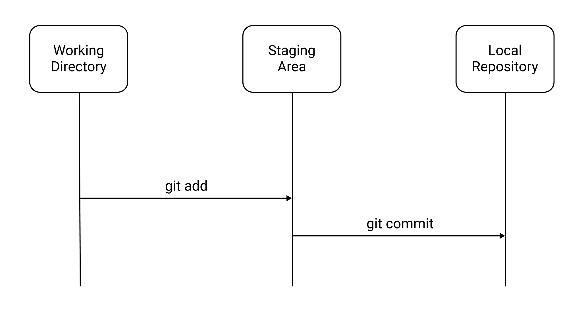

# git rm, git clean
`git rm`, `git clean`을 알아보기 전에 `git add`, `git commit` 과정을 다시 한번 숙지하자.


## git rm
`git rm`은 Working Directory와 Staging Area에서 파일을 삭제한다.

예제를 살펴보자. 첫 번째 Commit에 `a.txt`를, 두 번째 Commit에 `b.txt`를 추가했다.
``` shellsession
$ git log
commit 22222 (HEAD -> master)
Author: yologger <yologger1013@gmail.com>
Date:   Mon Dec 20 19:28:26 2021 +0900

    Add b.txt

commit 11111
Author: yologger <yologger1013@gmail.com>
Date:   Mon Dec 20 19:28:02 2021 +0900

    Add a.txt
```
``` shellsession
$ ls
a.txt   b.txt
```
이제 `git rm`명령어로 `b.txt`를 삭제해보자.
``` shellsession
$ git rm b.txt
rm 'b.txt'
``` 
디렉토리에서 `b.txt`가 삭제되었다.
``` shellsession
$ ls
a.txt
```
물론 Local Repository에 반영하려면 새롭게 Commit 해야한다.
``` shellsession
$ git commit -m 'Remove b.txt'
```

`--cached` 옵션을 사용하면 Staging Area에서만 삭제하고 Working Directory에는 파일을 유지한다.
``` shellsession
$ git rm --cached b.txt
rm 'b.txt'
``` 
파일이 Staging Area에서만 삭제되었기 때문에 Working Directory에는 그대로 있다.
``` shellsession
$ ls
a.txt   b.txt
```
Staging Area에서는 삭제되었으므로 Untracked Files에 포함되어있다.
``` shellsession{7,9}
$ git status
현재 브랜치 master
커밋할 변경 사항:
  (use "git restore --staged <file>..." to unstage)
	삭제함: b.txt

추적하지 않는 파일:
  (커밋할 사항에 포함하려면 "git add <파일>..."을 사용하십시오)
	b.txt
```

## git clean
`git clean`은 추적되지 않는 파일을 제거한다.

`a.txt`, `b.txt`를 생성해보자.
``` shellsession
$ touch a.txt
$ touch b.txt
``` 
`a.txt`만 추적해보자.
``` shellsession
$ git add a.txt
```
상태를 확인해보자. `b.txt`는 추적되지 않는 것을 확인할 수 있다.
``` shellsession{11,14}
$ git status
On branch master

No commits yet

Changes to be committed:
    (use "git rm --cached <file>..." to unstage)

    new file:   a.txt

Untracked files:
    (use "git add <file>..." to include in what will be committed)

    b.txt
```
`git clean`명령어로 추적되지 않는 파일을 삭제하자.
``` shellsession
$ git clean
```
다음과 같은 에러가 발생한다. `git clean`명령어로 삭제한 파일은 다시 복구할 수 없기 때문에 신중하게 실행하라는 의미다.
``` 
fatal: clean.requireForce defaults to true and neither -i, -n, nor -f given; refusing to clean
``` 
따라서 `-f`옵션을 추가하여 삭제해야한다.
``` shellsession
$ git clean -f
```
파일을 삭제하기 전, `-n` 옵션으로 삭제될 파일을 미리 확인할 수 있다.
``` shellsession
$ git clean -n
b.txt 삭제할 예정
```

## git add 하지 않는 변경사항 모두 삭제
`git clean -fdx`를 사용하면 `git add`하지 않는 변경사항을 모두 삭제할 수 있다.