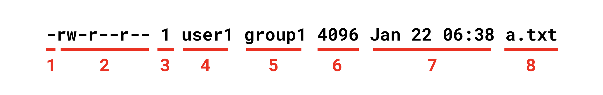

## 리눅스 권한 관리
리눅스 시스템에서 사용자는 <u>파일</u>과 <u>디렉토리</u>를 소유할 수 있다. `ls`명령어에 `-l`옵션을 추가하면 파일이나 디렉토리의 접근 권한을 확인할 수 있다.
```
$ touch a.txt

$ ls -l
-rw-r--r-- 1 user1 group1 4096 Jan 22 06:38 a.txt
```
출력 결과의 의미는 다음과 같다.

1. 파일의 종류
2. 권한
3. 심볼릭 링크 수
4. 해당 파일을 소유한 사용자 
5. 해당 파일을 소유한 그룹. 별도로 지정하지 않으면 파일 소유자가 속한 그룹
6. 용량
7. 생성일
8. 파일 이름

앞의 10글자를 좀 더 자세히 살펴보자.


1. 파일의 종류
2. 파일 소유자의 권한
3. 파일 소유자가 속한 그룹의 권한
4. 그 외 사용자의 권한

## 파일의 종류
|속성|파일 종류|
|------|---|
|-|일반 파일|
|d|디렉토리|
|l|심볼릭 링크|
|c|문자 특수 파일|
|b|블록 특수 파일|
|s|소켓|
|p|파이프|


## 권한 속성
파일과 디렉토리에는 `r(read)`, `w(write)`, `x(Execution)` 값으로 권한을 부여할 수 있다.

|속성|파일|디렉토리|
|------|---|---|
|r|파일을 열거나 읽을 수 있다.|ls 명령어로 디렉토리의 내용물을 나열할 수 있다.|
|w|파일을 쓰거나 수정할 수 있다.|디렉토리 내의 파일들을 생성, 삭제, 이름 변경할 수 있다.|
|x|파일을 실행할 수 있다.|cd 명령어로 디렉토리에 들어갈 수 있다.|


## 권한 변경
`chmod`명령어를 사용하면 권한을 변경할 수 있다. 이 명령어는 루트 사용자나 파일 소유자만 실행할 수 있다.
### 8진법 표현
```
# chmod 750 a.txt
```
8진법 `750`은 2진법 `111101000`에 해당하며, 이는 `rwxr-x---`와 동일하다.

###  기호 표현
기호 표현은 다음과 같이 사용한다. 아래 예제는 파일 소유자에게 실행 권한을 부여한다는 의미다.
```
# chmod u+e a.txt
```

이제 사용자와 관련된 기호에 대해 살펴보자.

|기호|의미|
|---|---|
|u|user의 약자, 파일 소유자|
|g|group의 약자, 그룹 소유자|
|o|other의 약자, 기타 사용자|
|a|all의 약자, u, g, o를 모두 포함|

퍼미션 추가, 삭제, 설정과 관련된 기호는 다음과 같다.

|기호|의미|
|----|---|
|+|뒤에 나열된 권한을 추가|
|-|뒤에 나열된 권한을 제거|
|=|뒤에 나열된 권한만 적용하고 나머지는 제거|

몇 개의 예제를 첨부한다.
```
# chmod o-rw a.txt
// 기타 사용자로부터 r, w 권한을 제거한다.
```
```
# chmod a-rwx a.txt
// 파일 소유자, 그룹 소유자, 기타 사용자 모두에게 r, w, x 권한을 부여한다.
```
```
# chmod go=rx a.txt
// 그룹 소유자와 기타 소유자의 권한을 r, x로 설정한다. e는 제거된다.
```

## 파일 소유자 변경
`chown`과 `chgrp`명령어를 사용하면 파일 소유자를 변경할 수 있다.

### chown
`a.txt` 파일의 현재 상태는 다음과 같다고 가정하자.
```
$ ls -al
total 3
drwxr-xr-x  3 user1  group1   96  6  5 13:38 .
drwxr-xr-x  9 user1  group1  288  6  5 12:59 ..
-rwsr-xr-x  1 user1  group1   76  6  5 13:38 a.txt
```
`chown`명령어는 다음과 같은 형식으로 사용한다.
```
$ chown [옵션] [소유자] [파일]
```
```
$ chown user2 a.txt

$ ls
total 3
drwxr-xr-x  3 user1  group1   96  6  5 13:38 .
drwxr-xr-x  9 user1  group1  288  6  5 12:59 ..
-rwsr-xr-x  1 user2  group1   76  6  5 13:38 a.txt
```
### chgrp
`chgrp`명령어는 다음과 같은 형식으로 사용한다.
```
# chgrp [옵션] [그룹] [파일]
```
```
$ chgrp group2 a.txt	

$ ls
total 3
drwxr-xr-x  3 user1  group1   96  6  5 13:38 .
drwxr-xr-x  9 user1  group1  288  6  5 12:59 ..
-rwsr-xr-x  1 user2  group2   76  6  5 13:38 a.txt
```

## 특수 권한
리눅스는 `r(read)`, `w(write)`, `x(execution)`외에도 세 가지 특수 권한을 제공한다.
### Sticky bit
root나 파일 소유자만 파일 삭제를 가능하도록 한다.

설정 전 상태가 다음과 같다고 가정하자.
```
-rwxr-xr--  1 yologger  group   76  6  5 13:38 a.txt
```
`Sticky Bit`는 다음과 같이 설정한다.
```
$ chmod 1755 a.txt
```
상태를 다시 확인해보자.
```
-rwxr-xr-t  1 yologger  group   76  6  5 13:38 a.txt
```
이제 이 파일은 소유자인 yologger나 root만 삭제할 수 있다.

### SetGID
파일을 소유 그룹 권한으로 실행한다.

설정 전 상태는 다음과 같다고 가정하자.
```
-rwxr-xr--  1 yologger  group   76  6  5 13:38 a.txt
```
`SetGID`는 다음과 같이 설정한다.
```
$ chmod 2755 a.txt
```
상태를 다시 확인해보자.
```
-rwxr-sr--  1 yologger  group   76  6  5 13:38 a.txt
```
### SetUID
파일을 소유자 권한으로 실행한다.

설정 전 상태는 다음과 같다고 가정하자.
```
-rwxr-xr--  1 yologger  group   76  6  5 13:38 a.txt
```
`SetUID`는 다음과 같이 설정한다.
```
$ chmod 4755 a.txt
```
상태를 다시 확인해보자.
```
-rwsr-xr--  1 yologger  group   76  6  5 13:38 a.txt
```