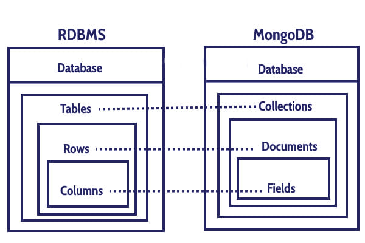

# Table of Contents
[[toc]]

# Mongo DB
기존의 테이블 기반 관계형 데이터베이스 구조가 아닌 Document 지향 데이터 모델을 사용하는 NoSQL 데이터베이스다.



수평적 확장성

## Mongo DB 환경설정

### 설치
`Mac OS`에서는 `Homebrew`로 Mongo DB를 설치할 수 있다.
``` shellsession
$ brew tap mongodb/brew

$ brew install mongodb-community@4.2
```

### 서비스 시작
``` shellsession
$ brew services start mongodb-community@4.2 
```

### 서비스 재시작
``` shellsession
$ brew services restart mongodb-community@4.2
```

### 서비스 종료
``` shellsession
$ brew services stop mongodb-community@4.2
```

### Mongo DB 접속
``` shellsession
$ mongo
> 
```

## Compass
`Compass`는 Mongo DB를 위한 GUI database clinet다. [이 곳](https://www.mongodb.com/try/download/compass)에서 다운받을 수 있다.

## Mongo DB 사용법

### 데이터베이스 목록 확인
`show db`는 모든 데이터베이스를 출력한다.
```
> show dbs
admin   0.000GB
config  0.000GB
local   0.000GB
```

### 현재 사용 중인 데이터베이스 출력
`db`는 현재 사용 중인 데이터베이스를 출력한다.
```
> db
test
```

### 데이터베이스 생성, 사용할 데이터베이스 선택
`use [데이터베이스 이름]` 명령어로 사용할 데이터베이스를 선택할 수 있다. 데이터베이스가 없으면 새로 생성한다.
```
> use my_db
switched to db my_db
```

### 데이터베이스 삭제
`dropDatabase()`로 현재 데이터베이스를 삭제한다.
```
> db.dropDatabase()
{ "dropped" : "my_db", "ok" : 1 }
```

## Collection
`Collection`은 RDBMS의 Table에 대응된다. 

### Collection 생성
Collection은 다음과 같이 생성할 수 있다.
``` 
// db.createCollection("컬렉션 명");
> db.createCollection("member");
```

### Collection 확인
데이터베이스에 생성된 Collection은 `show collections`로 확인할 수 있다.
```
> show collections
member
```

### Collection 삭제
`db.[Collection 이름].drop()`으로 Collection을 삭제할 수 있다.
```
> db.member.drop()
true
```

## Document, Field
`Document`는 RDBMS의 Row에 해당하며, `Field`는 Column에 해당한다.

### Document 저장
```
> db.member.insert({ name: "paul" })

> db.member.insert({ name: "john" })
```
Mongo DB는 데이터 중복을 허용한다.
```
> db.member.insert({ name: "john" })

> db.member.find()
{ "_id" : ObjectId("625ad76b8d6dabdee5230bee"), "name" : "paul" }
{ "_id" : ObjectId("625ad77b8d6dabdee5230bef"), "name" : "john" }
{ "_id" : ObjectId("625adc3d8d6dabdee5230bf6"), "name" : "john" }
```
다음과 같이 여러 Document를 한꺼번에 저장할 수 있다.
```
> db.member.insert([{ name: "messi" }, { name: "ronaldo" }])
```
Mongo DB는 스키마가 정해져있지 않아 저장되는 데이터 형태가 자유롭다.
```
> db.member.insert({ name: "monica", age: 35, isMarried: true, weight: 50.5 , createdAt: Date()})

> db.member.insert({ name: "rachel", age: 25, isMarried: false, weight: 60.5 , job: "programmer"})
```

Document는 다른 객체를 포함할 수도 있다.
```
> db.member.insert({ name: "marry", phone: { name: "iPhone 10", manufacturer: "Apple" } })
```

Document는 배열을 포함할 수도 있다.
```
> db.member.insert({ name: "jordan", children: ["ramos", "benzema"] })
```


### Document 조회
```
> db.member.find()
{ "_id" : ObjectId("625ad76b8d6dabdee5230bee"), "name" : "paul" }
{ "_id" : ObjectId("625ad77b8d6dabdee5230bef"), "name" : "john" }
{ "_id" : ObjectId("625adc3d8d6dabdee5230bf6"), "name" : "john" }
{ "_id" : ObjectId("625ad79e8d6dabdee5230bf0"), "name" : "messi" }
{ "_id" : ObjectId("625ad79e8d6dabdee5230bf1"), "name" : "ronaldo" }
{ "_id" : ObjectId("625ad8698d6dabdee5230bf2"), "name" : "monica", "age" : 35, "isMarried" : true, "weight" : 50.5, "createdAt" : "Sat Apr 16 2022 23:53:29 GMT+0900 (KST)" }
{ "_id" : ObjectId("625ad8ab8d6dabdee5230bf3"), "name" : "rachel", "age" : 25, "isMarried" : false, "weight" : 60.5, "job" : "programmer" }
{ "_id" : ObjectId("625ada168d6dabdee5230bf4"), "name" : "marry", "phone" : { "name" : "iPhone 10", "manufacturer" : "Apple" } }
{ "_id" : ObjectId("625ada838d6dabdee5230bf5"), "name" : "jordan", "children" : [ "ramos", "benzema" ] }
```
`pretty()`로 데이터를 보기 좋게 출력할 수 있다.
```
> db.member.find()
{ "_id" : ObjectId("625ad76b8d6dabdee5230bee"), "name" : "paul" }
{ "_id" : ObjectId("625ad77b8d6dabdee5230bef"), "name" : "john" }
{ "_id" : ObjectId("625adc3d8d6dabdee5230bf6"), "name" : "john" }
{ "_id" : ObjectId("625ad79e8d6dabdee5230bf0"), "name" : "messi" }
{ "_id" : ObjectId("625ad79e8d6dabdee5230bf1"), "name" : "ronaldo" }
{ "_id" : ObjectId("625ad8698d6dabdee5230bf2"), "name" : "monica", "age" : 35, "isMarried" : true, "weight" : 50.5, "createdAt" : "Sat Apr 16 2022 23:53:29 GMT+0900 (KST)" }
{ "_id" : ObjectId("625ad8ab8d6dabdee5230bf3"), "name" : "rachel", "age" : 25, "isMarried" : false, "weight" : 60.5, "job" : "programmer" }
{ "_id" : ObjectId("625ada168d6dabdee5230bf4"), "name" : "marry", "phone" : { "name" : "iPhone 10", "manufacturer" : "Apple" } }
{ "_id" : ObjectId("625ada838d6dabdee5230bf5"), "name" : "jordan", "children" : [ "ramos", "benzema" ] }
> db.member.find().pretty()
{ "_id" : ObjectId("625ad76b8d6dabdee5230bee"), "name" : "paul" }
{ "_id" : ObjectId("625ad77b8d6dabdee5230bef"), "name" : "john" }
{ "_id" : ObjectId("625ad79e8d6dabdee5230bf0"), "name" : "messi" }
{ "_id" : ObjectId("625ad79e8d6dabdee5230bf1"), "name" : "ronaldo" }
{
	"_id" : ObjectId("625ad8698d6dabdee5230bf2"),
	"name" : "monica",
	"age" : 35,
	"isMarried" : true,
	"weight" : 50.5,
	"createdAt" : "Sat Apr 16 2022 23:53:29 GMT+0900 (KST)"
}
{
	"_id" : ObjectId("625ad8ab8d6dabdee5230bf3"),
	"name" : "rachel",
	"age" : 25,
	"isMarried" : false,
	"weight" : 60.5,
	"job" : "programmer"
}
{
	"_id" : ObjectId("625ada168d6dabdee5230bf4"),
	"name" : "marry",
	"phone" : {
		"name" : "iPhone 10",
		"manufacturer" : "Apple"
	}
}
{
	"_id" : ObjectId("625ada838d6dabdee5230bf5"),
	"name" : "jordan",
	"children" : [
		"ramos",
		"benzema"
	]
}
```

`findOne()`는 하나의 Document를 조회한다.
```
> db.member.findOne() 
```

다음과 같이 조건을 추가할 수 있다.
```
> db.member.find({ name: "paul" })
{ "_id" : ObjectId("625ad76b8d6dabdee5230bee"), "name" : "paul" }
```

#### eq (equal)
```
> db.member.find({name: {$eq: "john"}})
{ "_id" : ObjectId("625ad77b8d6dabdee5230bef"), "name" : "john" }
{ "_id" : ObjectId("625adc3d8d6dabdee5230bf6"), "name" : "john" }
```

#### ne (not equal)
```
> db.member.find({name: {$ne: "john"}})
{ "_id" : ObjectId("625ad76b8d6dabdee5230bee"), "name" : "paul" }
{ "_id" : ObjectId("625ad79e8d6dabdee5230bf0"), "name" : "messi" }
{ "_id" : ObjectId("625ad79e8d6dabdee5230bf1"), "name" : "ronaldo" }
// ...
```

#### gt
```
> db.member.find({age: {$gt: 30}})
{ "_id" : ObjectId("625ad8698d6dabdee5230bf2"), "name" : "monica", "age" : 35, "isMarried" : true, "weight" : 50.5, "createdAt" : "Sat Apr 16 2022 23:53:29 GMT+0900 (KST)" }
```

#### gte
```
> db.member.find({age: {$gte: 30}})
```

#### lt
```
> db.member.find({age: {$lt: 30}})
```

#### lte
```
> db.member.find({age: {$#### lte
: 30}})
```

#### in
```
> db.member.find({name: {$in: ["monica", "paul"]}})
{ "_id" : ObjectId("625ad76b8d6dabdee5230bee"), "name" : "paul" }
{ "_id" : ObjectId("625ad8698d6dabdee5230bf2"), "name" : "monica", "age" : 35, "isMarried" : true, "weight" : 50.5, "createdAt" : "Sat Apr 16 2022 23:53:29 GMT+0900 (KST)" }
```
#### nin
```
> db.member.find({name: {$#### nin
: ["monica", "paul"]}})
```

#### and
```
> db.member.find({$and: [{name: "monica"}, {isMarried: true}]})
{ "_id" : ObjectId("625ad8698d6dabdee5230bf2"), "name" : "monica", "age" : 35, "isMarried" : true, "weight" : 50.5, "createdAt" : "Sat Apr 16 2022 23:53:29 GMT+0900 (KST)" }
```

#### or
```
> db.member.find({$or: [{name: "paul"}, {isMarried: true}]})
{ "_id" : ObjectId("625ad76b8d6dabdee5230bee"), "name" : "paul" }
{ "_id" : ObjectId("625ad8698d6dabdee5230bf2"), "name" : "monica", "age" : 35, "isMarried" : true, "weight" : 50.5, "createdAt" : "Sat Apr 16 2022 23:53:29 GMT+0900 (KST)" }
```

### Field 데이터 타입
Field에 저장할 수 있는 데이터 타입은 [이 곳](https://www.tutorialspoint.com/mongodb/mongodb_datatype.htm)에서 확인할 수 있다.

### Document 변경
#### 특정 필드 수정학기
```
> db.member.find({name: "monica"})
{ "_id" : ObjectId("625ad8698d6dabdee5230bf2"), "name" : "monica", "age" : 35, "isMarried" : false, "weight" : 50.5, "createdAt" : "Sat Apr 16 2022 23:53:29 GMT+0900 (KST)" }

> db.member.updateOne({name: "monica"}, {$set: {age: 35, isMarried: true}})
{ "acknowledged" : true, "matchedCount" : 1, "modifiedCount" : 0 }

> db.member.find({name: "monica"})
{ "_id" : ObjectId("625ad8698d6dabdee5230bf2"), "name" : "monica", "age" : 35, "isMarried" : true, "weight" : 50.5, "createdAt" : "Sat Apr 16 2022 23:53:29 GMT+0900 (KST)" }
```
#### 다른 Document로 대체하기
```
> db.member.update({ name: "paul"}, { name: "ping", age: 20})
WriteResult({ "nMatched" : 1, "nUpserted" : 0, "nModified" : 1 })
```

#### 특정 Field 제거하기
```
> db.member.find({name: "monica"})
{ "_id" : ObjectId("625ad8698d6dabdee5230bf2"), "name" : "monica", "age" : 35, "isMarried" : false, "weight" : 50.5, "createdAt" : "Sat Apr 16 2022 23:53:29 GMT+0900 (KST)" }

> db.member.update({name: "monica"}, {$unset: {isMarried: true}})
WriteResult({ "nMatched" : 1, "nUpserted" : 0, "nModified" : 1 })

> db.member.find({name: "monica"})
{ "_id" : ObjectId("625ad8698d6dabdee5230bf2"), "name" : "monica", "age" : 35, "weight" : 50.5, "createdAt" : "Sat Apr 16 2022 23:53:29 GMT+0900 (KST)" }
```

### Document 삭제
```
> db.member.remove({ name: "monica" })
WriteResult({ "nRemoved" : 1 })
```

## _id 필드
관계형 데이터베이스에는 `기본 키(primary key)`로 모든 Row를 고유하게 구분한다. `Mongo DB`도 유사한 개념의 `_id` Field로 Document를 고유하게 구분한다. Document를 저장할 때 명시적으로 값을 제공하지 않으면 Mongo DB가 `_id` 값을 자동으로 생성한다.
```
> db.member.insert({ name: "paul" })
> db.member.insert({ name: "john" })

> db.member.find({name: {$ne: "john"}})
{ "_id" : ObjectId("625ad76b8d6dabdee5230bee"), "name" : "paul" }
{ "_id" : ObjectId("625ad79e8d6dabdee5230bf0"), "name" : "messi" }
```

## Index
관계형 데이터베이스의 `인덱스(Index)`를 사용하면 데이터를 빠르게 탐색할 수 있다. Mongo DB도 인덱스를 제공한다.

### Index 조회
`db.[테이블명].getIndexes()` 명령어로 인덱스를 확인할 수 있다.
```
> db.member.getIndexes()
[
	{
		"v" : 2,
		"key" : {
			"_id" : 1
		},
		"name" : "_id_",
		"ns" : "my_db.member"
	}
]
```
Document를 유일하게 구분해주는 `_id` 필드에는 인덱스가 자동으로 생성된다.

### 단일 필드 인덱스 생성
`db.[테이블명].createIndex({ [필드명]: ±1 })`로 인덱스를 생성할 수 있다. `1`은 오름차순, `-1`은 내림차순으로 인덱스를 생성한다.
```
> db.member.createIndex({ name: 1 })
{
	"createdCollectionAutomatically" : false,
	"numIndexesBefore" : 1,
	"numIndexesAfter" : 2,
	"ok" : 1
}
```

### 복합 필드 인덱스 생성
```
> db.member.createIndex({ name: 1, age: 1 })
```

### 인덱스 삭제
`db.monsters.dropIndex(필드명);`으로 인덱스를 삭제할 수 있다.

## 정렬

## 스키마 설계
Mongo DB는 관계형 데이터베이스의 외래키 개념이 없다. 따라서 두 가지 방법으로 연관관계를 설정할 수 있다.

### Embedding
``` {4,5}
> db.member.insert({ 
    name: "paul", 
    posts: [
        { title: "Java", content: "I love Java." }, 
        { title: "Kotlin", content: "Kotlin is fun." }
    ]
})
WriteResult({ "nInserted" : 1 })
```
``` {6,7}
> db.member.findOne({ name: "paul" })
{
	"_id" : ObjectId("625afb558d6dabdee5230bf7"),
	"name" : "paul",
	"posts" : [
		{ "title" : "Java", "content" : "I love Java." },
		{ "title" : "Kotlin", "content" : "Kotlin is fun." }
	]
}
```

### Referencing
``` {14,15}
> db.post.insert({
    title: "Swift",
    content: "Swift for iOS"
})

> db.post.insert({
    title: "DevOps",
    content: "DevOps is useful."
})

> db.member.insert({
    name: "drogba",
    posts: [
        ObjectId("625afcaf8d6dabdee5230bf9"),
        ObjectId("625afcb48d6dabdee5230bfa")
    ]
})

```
``` {3,8}
> db.post.find().pretty()
{
	"_id" : ObjectId("625afcaf8d6dabdee5230bf9"),
	"title" : "Swift",
	"content" : "Swift for iOS"
}
{
	"_id" : ObjectId("625afcb48d6dabdee5230bfa"),
	"title" : "DevOps",
	"content" : "DevOps is useful."
}
```