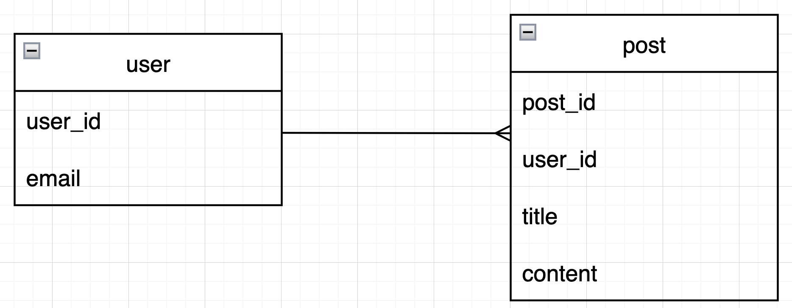
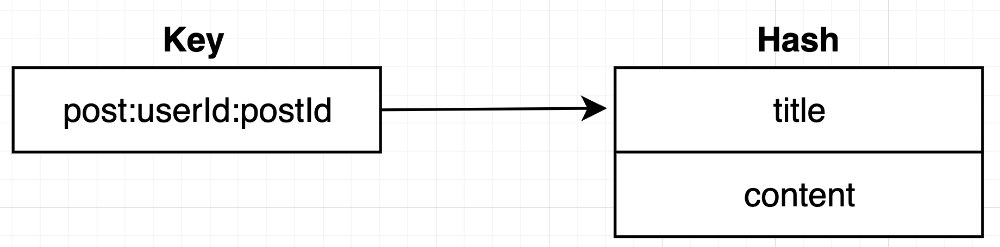
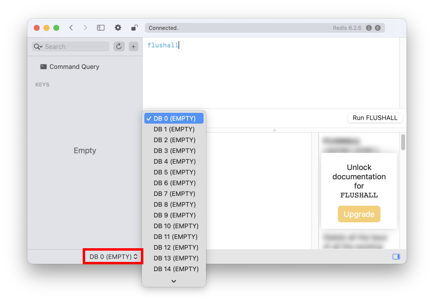
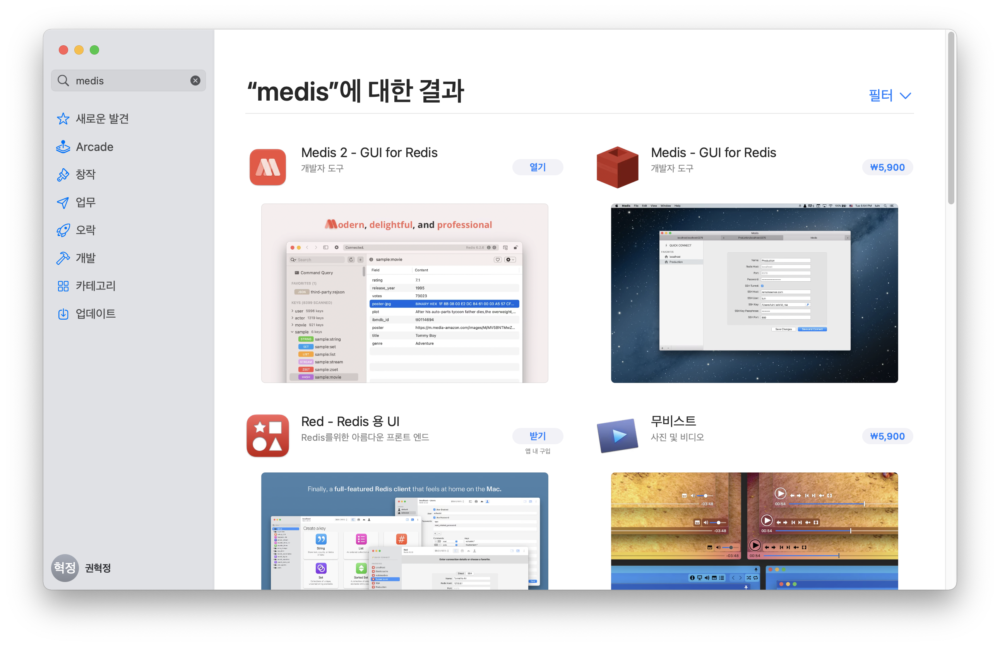
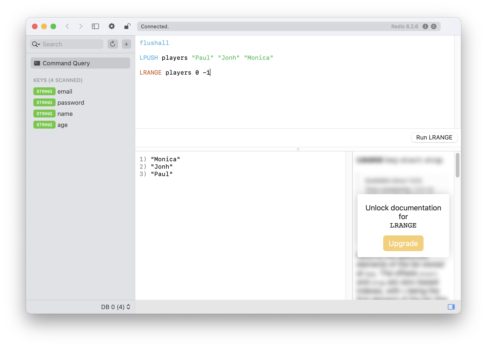

# Table of Contents
[[toc]]

# Redis 정리
- `Key-Value` 구조의 NoSQL 데이터베이스
- 관계형 데이터베이스처럼 테이블을 설계하거나 외래키 설정이 불가능하다.
- 디스크 기반이 아니라 인메모리 방식을 사용하기 때문에 입출력 적어 속도가 빠르다.
- 인메모리 방식이기 때문에 애플리케이션이 다운되거나 재시작되면 데이터가 사라진다. 이 때문에 다음과 같은 방법으로 데이터를 백업한다.
    - 디스크에 데이터를 저장
    - 다른 노드에 복사본 저장
- 세션 스토어, 데이터베이스 캐시, 공유 저장소 등에 사용된다.
- Publish/Subscribe 모델을 지원하기 때문에 메시지 큐로도 사용할 수 있다.


## Redis 설정
`Redis`의 설치, 사용 방법에 대해 정리한다.

### Redis 설치
`Mac OS`에서는 `Homebrew`로 Redis를 설치할 수 있다.
``` 
$ brew install redis
```
설치 정보를 확인해보자.
```
$ brew info redis
redis: stable 7.0.0 (bottled), HEAD
Persistent key-value database, with built-in net interface
https://redis.io/
/usr/local/Cellar/redis/7.0.0 (14 files, 2.6MB) *
  Poured from bottle on 2022-05-04 at 12:55:03
From: https://github.com/Homebrew/homebrew-core/blob/HEAD/Formula/redis.rb
License: BSD-3-Clause
==> Dependencies
Required: openssl@1.1 ✔
==> Options
--HEAD
	Install HEAD version
==> Caveats
To restart redis after an upgrade:
  brew services restart redis
Or, if you don't want/need a background service you can just run:
  /usr/local/opt/redis/bin/redis-server /usr/local/etc/redis.conf
==> Analytics
install: 77,367 (30 days), 155,724 (90 days), 648,001 (365 days)
install-on-request: 76,894 (30 days), 154,909 (90 days), 643,952 (365 days)
build-error: 14 (30 days)
```
버전을 확인해보자.
``` 
$ redis-server --version
Redis server v=6.2.6 sha=00000000:0 malloc=libc bits=64 build=c6f3693d1aced7d9
```

### Redis 설치 위치
Homebrew로 Redis를 설치한 경우 `/usr/local/opt/redis` 경로에 Redis가 설치된다.
```
$ cd /usr/local/opt

$ ls | grep redis
redis
redis@6.2
redis@7.0
```

### Redis 서버 설정 파일
Redis 서버는 `redis.confg`로 환경설정을 할 수 있다. Homebrew로 Redis를 설치한 경우 `/usr/local/etc`에 위치한다.
```
$ cd /usr/local/etc  

$ ls | grep redis.conf
redis.conf
redis.conf.default
```

### Redis 시작
`redis-server` 명령어로 Redis를 시작할 수 있다.
``` 
$ redis-server
52712:C 15 Apr 2022 11:06:15.382 # oO0OoO0OoO0Oo Redis is starting oO0OoO0OoO0Oo
52712:C 15 Apr 2022 11:06:15.382 # Redis version=6.2.6, bits=64, commit=00000000, modified=0, pid=52712, just started
52712:C 15 Apr 2022 11:06:15.382 # Warning: no config file specified, using the default config. In order to specify a config file use redis-server /path/to/redis.conf
52712:M 15 Apr 2022 11:06:15.383 * Increased maximum number of open files to 10032 (it was originally set to 256).
52712:M 15 Apr 2022 11:06:15.383 * monotonic clock: POSIX clock_gettime
                _._                                                  
           _.-``__ ''-._                                             
      _.-``    `.  `_.  ''-._           Redis 6.2.6 (00000000/0) 64 bit
  .-`` .-```.  ```\/    _.,_ ''-._                                  
 (    '      ,       .-`  | `,    )     Running in standalone mode
 |`-._`-...-` __...-.``-._|'` _.-'|     Port: 6379
 |    `-._   `._    /     _.-'    |     PID: 52712
  `-._    `-._  `-./  _.-'    _.-'                                   
 |`-._`-._    `-.__.-'    _.-'_.-'|                                  
 |    `-._`-._        _.-'_.-'    |           https://redis.io       
  `-._    `-._`-.__.-'_.-'    _.-'                                   
 |`-._`-._    `-.__.-'    _.-'_.-'|                                  
 |    `-._`-._        _.-'_.-'    |                                  
  `-._    `-._`-.__.-'_.-'    _.-'                                   
      `-._    `-.__.-'    _.-'                                       
          `-._        _.-'                                           
              `-.__.-'                                               

52712:M 15 Apr 2022 11:06:15.385 # Server initialized
52712:M 15 Apr 2022 11:06:15.385 * Ready to accept connections
```

`brew services start redis`로 redis를 백그라운드로 실행할 수 있다.
```  
$ brew services start redis
```

### Redis 상태 확인
```  
$ brew services list
Name    Status  User     File             
redis   started yologger ~/Library/LaunchAgents/homebrew.mxcl.redis.plist
```

### Redis 재시작
```  
$ brew services restart redis
```

### Redis 종료
```  
$ brew services stop redis
```

## redis-cli
`redis-cli`는 커맨드라인 기반 데이터베이스 클라이언트다. redis-cli로 redis에 접속해보자.
```  
$ redis-cli
> 
```

## Redis의 데이터 타입
`Redis`는 관계형 데이터베이스가 아니기 때문에 관계형 데이터베이스의 일반적인 데이터 타입을 지원하지 않는다. Redis가 지원하는 데이터 타입은 다음과 같다. 
- String
- List
- Set
- Hash

## String
Redis는 대부분의 데이터를 문자열로 표현한다. <u>숫자, 날짜, 시간 등도 <b>문자열</b>로 저장된다.</u>
```
> set name "Paul"
> set age 35
> set createdAt "2022-04-03 21:51:13.742000"
```

### String 저장
`SET <KEY> <VALUE>`로 문자열을 저장한다.
```
> SET name "paul"
OK

> SET email "yologger1013@gmail.com"
OK

> SET password "1234"
OK

> SET nation "Korea"
OK

> SET age 30
OK
```

### String 조회
`GET <KEY>`로 문자열을 조회한다.
```
> GET name
"paul"

> GET email
"Korea"
```

### 키 이름 변경
`RENAME <OLD KEY> <NEY KEY>`로 키 이름을 변경한다.
```
> RENAME name nickname
OK
```

### 키 개수 조회
`DBSIZE`로 데이터 개수를 조회한다.
```
> DBSIZE
(integer) 3
```

### 키 조회
`KEYS <PATTERN>` 형태로 키를 조회한다.
```
> KEYS *
1) "name"
2) "password"
3) "age"
4) "email"
5) "nation"
```
```
> KEYS n*
1) "name"
2) "nation"
```

### String 삭제
`DEL <KEY>`로 문자열을 삭제한다.
```
> DEL name
(integer) 1
```
여러 데이터를 동시에 삭제할 수 있다.
```
> DEL email password
(integer) 2
```

`FLUSHALL`로 모든 데이터를 삭제할 수 있다.
```
> DBSIZE
(integer) 3

> FLUSHALL
OK

> DBSIZE
(integer) 0
```

String과 관련된 모든 명령어는 [이 곳](http://redisgate.kr/redis/command/strings.php)에서 확인할 수 있다.

## List
`List`를 사용하면 하나의 키에 여러 값을 저장할 수 있다. List와 관련된 모든 명령어는 [이 곳](http://redisgate.kr/redis/command/lists.php)에서 확인할 수 있다.

### RPUSH
`RPUSH <key> <element element ..>`형태로 리스트의 오른쪽에 요소를 추가한다.
```
> RPUSH score 1 2 3 4 5
(integer) 5

> RPUSH score 6 7
(integer) 7

> LRANGE score 0 -1
1) "1"
2) "2"
3) "3"
4) "4"
5) "5"
6) "6"
7) "7"
```

### LPUSH 
리스트의 왼쪽에 값을 추가한다.
```
> RPUSH score 1 2 3 4 5
(integer) 5

> LPUSH score 6 7
(integer) 7

> LRANGE score 0 -1
1) "7"
2) "6"
3) "1"
4) "2"
5) "3"
6) "4"
7) "5"
```

### LRANGE
`LRANGE <START> <STOP>`형태로 사용하며 범위에 해당하는 요소들을 조회한다.
```
> RPUSH score 1 2 3 4 5
(integer) 5

> LRANGE score 0 2
1) "1"
2) "2"
3) "3"
```

`-1`은 List의 끝을 가리킨다.
```
> LRANGE score 0 -1
1) "1"
2) "2"
3) "3"
4) "4"
5) "5"
```

### LPOP
`LPOP <KEY> <COUNT>` 형태로 사용하며, 리스트의 첫 번째 요소를 제거한 후 반환한다.
```
> LRANGE score 0 -1
1) "1"
2) "2"
3) "3"
4) "4"
5) "5"

> LPOP score
"1"

> LPOP score 2
1) "2"
2) "3"

> LRANGE score 0 -1
1) "4"
2) "5"
```

### RPOP
`RPOP <KEY> <COUNT>` 형태로 사용하며, 리스트의 마지막 요소를 제거한 후 반환한다.
```
> LRANGE score 0 -1
1) "1"
2) "2"
3) "3"
4) "4"
5) "5"

> RPOP score
"5"

> RPOP score 2
1) "4"
2) "3"

> LRANGE score 0 -1
1) "1"
2) "2"
```

### LINDEX 
`LINDEX [KEY] [INDEX]`형태로 사용하며 해당 인덱스의 요소를 반환한다.
```
> LRANGE players 0 -1
1) "paul"
2) "john"
3) "kane"
4) "monica"

> LINDEX players 0
"paul"

> LINDEX players 1
"john"
```

## Set
`List`와 유사하지만 중복을 허용하지 않으며, 순서가 없다. 모든 명령어는 [이 곳](http://redisgate.kr/redis/command/sets.php)에서 확인할 수 있다.

### SADD
`SADD [KEY] [ELEMENT] [ELEMENT]..` 형태로 데이터를 추가한다.
``` 
> SADD players "paul" "smith"
(integer) 2

> SMEMBERS players
1) "paul"
2) "smith"

> SADD players "paul" "john"
(integer) 1

> SMEMBERS players
1) "john"
2) "smith"
3) "paul"
```

### SMEMBERS
`SMEMBERS [KEY]` 형태로 사용하며 모든 요소를 조회한다.
```
> SMEMBERS players
1) "john"
2) "smith"
3) "paul"
```

### SREM
`SREM [KEY] [ELEMENT]`형태로 사용하며 요소를 삭제한다.
```
> SMEMBERS players
1) "john"
2) "smtih"
3) "paul"

> SREM players "paul"
(integer) 1

> SMEMBERS players
1) "john"
2) "smtih"
```

### SUNION
`SUNION [KEY 1] [KEY 2]`형태로 사용하며 합집합을 반환한다.
```
> SMEMBERS players
1) "john"
2) "smtih"
3) "lampard"

> SMEMBERS managers
1) "gerrard"
2) "lampard"
3) "ferguson"

> SUNION players managers
1) "gerrard"
2) "lampard"
3) "john"
4) "smtih"
5) "ferguson"
```

### SINTER
`SINTER [KEY 1] [KEY 2]`형태로 사용하며 교집합을 반환한다.
```
> SMEMBERS players
1) "john"
2) "smtih"
3) "lampard"

> SMEMBERS managers
1) "gerrard"
2) "lampard"
3) "ferguson"

> SINTER players managers
1) "lampard"
```

### SDIFF
`SDIFF [KEY 1] [KEY 2]`형태로 사용하며 차집합을 반환한다.
```
> SMEMBERS players
1) "john"
2) "smtih"
3) "lampard"

> SMEMBERS managers
1) "gerrard"
2) "lampard"
3) "ferguson"

> SDIFF players managers
1) "smtih"
2) "john"
```


## Hash
<b>`Hash`</b>는 하나의 `Key`에 여러 `Field:Value`를 저장할 수 있다.

### HSET
`HSET <KEY> <FIELD VALUE>` 형태로 사용한다. 
```
> HSET paul email "paul@gmail.com"
(integer) 1
```

### HGET
`HGET <KEY> <FIELD>`형태로 사용한다.
```
HGET paul email
"paul@gmail.com"
```

### HMSET
`hmset <KEY> <FIELD VALUE> <FIELD VALUE> <FIELD VALUE> ...` 형태로 사용한다
```
> HMSET paul email "paul@gmail.com" nation "Korea" age 30
OK
```

### HMGET
`HMGET <KEY> <FIELD> <FIELD> ...` 형태로 사용한다.
```
> HMGET paul email nation age
1) "paul@gmail.com"
2) "Korea"
3) "30"
```
```
> HMGET paul email nation
1) "paul@gmail.com"
2) "Korea"
```

### HGETALL
`HGETALL [KEY]`형태로 사용하며 모든 field와 value를 조회한다.
```
> HMSET paul email "paul@gmail.com" nation "Korea" age 30
OK

> HGETALL paul
1) "email"
2) "paul@gmail.com"
3) "nation"
4) "Korea"
5) "age"
6) "30"
```

### HDEL
`HDEL [KEY] [FIELD] [FIELD] ...`형태로 사용하며 지정한 Field와 Value를 삭제한다.
```
> HMSET paul email "paul@gmail.com" nation "Korea" age 30
OK

> HGETALL paul
1) "email"
2) "paul@gmail.com"
3) "nation"
4) "Korea"
5) "age"
6) "30"

> HDEL paul nation age
(integer) 2

> HGETALL paul
1) "email"
2) "paul@gmail.com"
```

## TYPE 명령어
`TYPE <KEY>` 명령어로 타입을 확인할 수 있다.
```
> TYPE person
set

> TYPE person:a4be06b1-b445-42fe-a70f-0fdee111cf55
hash
```
## FLUSHALL 명령어
`FLUSHALL` 명령어로 모든 키를 삭제할 수 있다.
```
> FLUSHALL
OK

> KEYS *
(empty array)
```


## Redis Expire
`Redis`는 저장한 데이터에 expire를 설정할 수 있다. `EXPIRE [KEY] [SECOND]` 명령어를 사용하면 된다.
```
// 데이터 저장
> SET name "Paul"

// 만료 시간 설정 
> EXPIRE name 10
```
```
// 10초가 지나기 전
> GET name
"Paul"

// 10초가 지난 후
> GET name
(nil)
```
`TTL` 명령어로 남은 시간 또는 만료 후 지나간 시간을 조회할 수 있다.
```
> TTL name  
5   // 만료되기 5초 전

> TTL name
-5  // 만료된 후 5초
```
`PERSIST` 명령어로 expire를 해제할 수 있다.
```
> PERSIST name
```

## Redis Namespace
`Namespace`를 활용하면 데이터를 체계적으로 데이터베이스에 저장할 수 있다. 
```
> SET programmer:android:name "Paul"
> SET programmer:spring:name "John"
> SET designer:name "Monica"
> SET marketer:name "Rachel"
```
```
GET programmer:android:name
GET programmer:spring:name
GET designer:name
GET marketer:name
```
위 예제에서는 Namespace로 `콜론(:)`을 사용했다. 하지만 스택 오버플로우를 검색해보니 `슬래시(/)`를 사용하기도 한다. 구분자의 제한이 없는 것 같다.

### Namespace를 Redis 데이터베이스 설계에 활용하기
`관계형 데이터베이스`와 `Redis`는 구조적으로 다르기 때문에 데이터베이스 설계방식도 다르다. 

우선 관계형 데이터베이스를 살펴보자. 애플리케이션의 회원 정보를 담는 `member`테이블과 회원의 게시글 정보를 담는 `post`테이블이 있다. 
회원은 여러 게시글을 가질 수 있으므로 `member` 테이블과 `post` 테이블은 `일대다(One to Many)`관계이며, 이를 다이어그램으로 표현하면 다음과 같다.



테이블을 생성하는 DDL은 다음과 같을 것이다.
```
CREATE TABLE member (
    member_id BIGINT PRIMARY KEY NOT NULL AUTO_INCREMENT,
    email VARCHAR(255) 
);
```
```
CREATE TABLE post (
    post_id BIGINT PRIMARY KEY NOT NULL AUTO_INCREMENT,
    member_id BIGINT,
    title VARCHAR(255),
    content TEXT,
    FOREIGN KEY member_id REFERENCES member(member_id)
);
```

반면 Redis는 테이블이라는 개념 자체가 없다. 또한 외래키라는 개념도 없으므로 테이블 간 연관관계를 표현할 수도 없다. 따라서 마치 리눅스의 디렉토리 구조처럼 `Namespace`를 활용하여 데이터를 저장해야한다.



```
> HMSET post:1:1 title "programming" content "I love programming"
> HMGET post:1:1 title content
1) "programming"
2) "I love programming"
```

## Redis Multi Database
`Redis`는 여러 데이터베이스를 가질 수 있으며 기본적으로 16개의 데이터베이스가 제공된다. 설정파일에서 개수를 변경할 수 있으며, Homebrew로 Redis를 설치한 경우 `/usr/local/etc/redis.conf`에 위치한다.

``` {4}
# Set the number of databases. The default database is DB 0, you can select
# a different one on a per-connection basis using SELECT <dbid> where
# dbid is a number between 0 and 'databases'-1
databases 16
```

`redis-cli`로 Redis에 연결할 때 `-n` 옵션으로 데이터베이스를 선택할 수 있다. 
``` 
$ redis-cli -n 3
redis-cli[3] > 
```
옵션을 지정하지 않으면 0번 데이터베이스를 사용하게 된다.
``` 
$ redis-cli
redis-cli > 
```

Redis에 이미 연결된 상태에서는 `SELECT` 명령어로 데이터베이스를 변경할 수 있다.
```  
redis-cli[3]> SELECT 5
OK

redis-cli[5]> 
```

`Medis 2`를 사용하는 경우 화면 하단에서 데이터베이스를 선택할 수 있다.



## Redis Persistent
인메모리 방식이기 때문에 애플리케이션이 다운되거나 재시작되면 데이터가 사라진다. 이 때문에 다음과 같은 방법으로 데이터를 백업할 수 있다.

### RDB
현재 메모리 상태에 대한 스냅샷을 디스크에 저장한다.
```
# redis.conf
dbfilename dump.rdb
```

### AOF
`AOF(Append Only File)`은 추가, 수정, 삭제 명령이 실행될 때 마다 파일에 기록한다.
```
# redis.conf
appendonly yes # default no
appendfilename appendonly.aof # 파일이름 설정
appendfsync everysec # 디스크 동기화를 얼마나 자주할 것인가 (always, everysec, no)
```

## HA와 Redis Replication
`Redis Replication`을 사용하면 데이터를 이중화하여 `HA(High Availability, 고가용성)`을 확보할 수 있다. 쉽게 설명하면 다른 레디스 노드에 데이터를 복사하는 것이다.

레디스는 Master/Slave 모델의 Replication을 제공한다. 여러 레디스 노드 중 하나를 Master로 선정하여 사용하고, 데이터를 다른 노드에 저장한다. Master 노드에 장애가 발생하면 다른 Slave 노드를 Master로 승격하며, 특정 Slave 노드를 Master 노드로 변경할 수도 있다.

## Redis PUB/SUB
`Redis PUB/SUB`를 사용하면 Redis를 메시지 브로커로 사용할 수 있다. Redis PUB/SUB은 `채널(Channel)`을 통해 메시지를 전달한다.

메시지 수신 역할을 할 터미널을 오픈하고 `subscribe <CHANNEL_NAME>` 명령어를 입력하면 채널을 구독하게 된다. 채널이 없다면 자동으로 생성한다.
```
$ redis-cli

> subscribe channel1
Reading messages... (press Ctrl-C to quit)
```

메시지 전송 역할을 할 터미널을 오픈하고 `publish <CHANNEL_NAME> <MESSAGE>` 명령어를 입력하면 채널로 메시지를 보내게 된다.
```
$ redis-cli

> publish channel1 "message1"
```
수신 측 터미널에 메시지가 출력된다.
```
> subscribe test_channel
Reading messages... (press Ctrl-C to quit)
1) "message1"
```
`pubsub channels` 명령어로 채널 목록을 확인할 수 있다.
```
> pubsub channels
```
다음과 같이 여러 채널을 동시에 구독할 수도 있다. 
```
> subscribe channel1 channel2
```
한 채널을 여러 구독자가 구독할 수도 있으며, 구독자 하나도 없는 채널은 자동으로 삭제된다.

`Redis`는 Kafka와 달리 메시지를 디스크에 저장(Queuing)하지 않기 때문에 구독 전 전송된 메시지를 읽을 수 없으며, 메시지가 유실될 수도 있다. 따라서 메시지 영속성을 보장하려면 별도의 데이터베이스에 메시지를 저장해야한다.

## Redis Stream
레디스 5.0부터 도입된 `Redis Stream`은 Redis Channel과 다르게 메시지를 저장(Queing)한다. 이 때문에 메시지 브로커보단 메시지 큐에 가깝다.

::: tip information
정리 중인 컨텐츠 입니다.
:::


## Medis 2
`Medis 2`는 Redis를 위한 GUI Database Client다. Medis는 애플 앱 스토어에서 설치할 수 있다.





## Redis Labs
`Redis` 클라우드 서비스를 제공한다.

