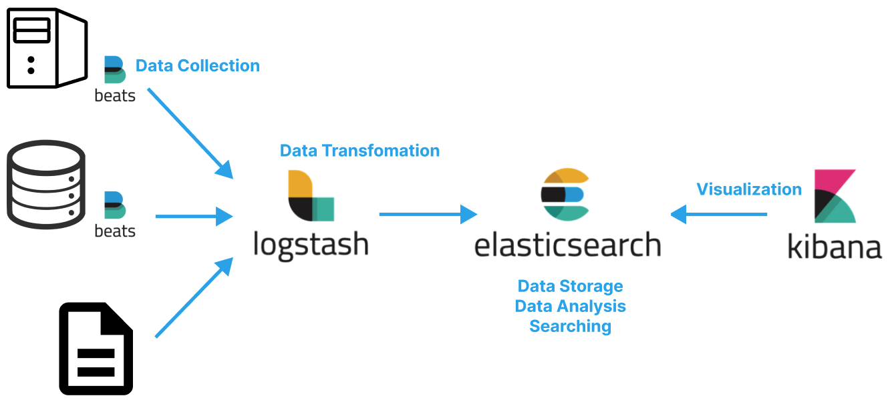

# Table of Contents
[[toc]]

## ElasticSearch
- `ElasticSearch`은 Apache Lucene 기반의 Java 오픈 소스 분산 검색 엔진이다. 
- 관계형 데이터베이스는 행의 위치인 `인덱스(Index)`를 사용하여 행을 조회한다. 반면 ElasticSearch은 도큐먼트의 문자, 단어 등을 매핑한 `역색인(Inverted Index)`을 사용하여 데이터를 조회한다. 일반 인덱스는 책 앞 페이지의 목차와 같은 의미이고, 역색인은 책 뒷 편의 단어 별 빠른 페이지와 같다.
- 인덱스를 통한 검색은 인덱스를 순차검색 하기 때문에 `O(n)`의 시간 복잡도를 갖는다. 반면 역색인은 마치 해시함수와 같아서 `O(1)`의 시간 복잡도를 갖는다. 이 때문에 ElasticSearch은 방대한 데이터를 빠르게 검색하는데 적합하다.
- ElasticSearch는 스키마가 없기 때문에 NoSQL처럼 비정형 데이터를 저장할 수 있다. 물론 `Mapping`을 사용하면 스키마를 설정할 수도 있다.

    |RDBMS|Elastic Search|
    |------|---|
    |Database|Index|
    |Table|Type|
    |Row|Document|
    |Column|Field|
    |Schema|Mapping|

- Elastic Search는 기본적으로 REST API에 HTTP 요청을 보내는 형태로 데이터를 조작한다.

    |RDBMS|Elastic Search|
    |------|---|
    |SELECT|GET|
    |UPDATE|PUT|
    |INSERT|POST|
    |DELETE|DELETE|

## ELK 스택
- `ElasticSearch`은 빠른 검색을 위해 단독으로 사용되기도 하지만 `ELK(ElasticSearch / LogStash / Kibana)` + `Beats` 스택으로 사용되기도 한다.
- ELK 스택을 사용하면 여러 데이터소스에서 발생한 데이터를 수집, 가공, 분석한 후 시각화할 수 있다.
- ELK 스택은 MSA 환경에서 여러 개별 서비스의 로그를 중앙 집중형 로깅하고 모니터링하는데 사용할 수 있다.
- 빅데이터 분야에도 활용할 수 있다.




### Beats
- 여러 데이터 소스에 설치되어 데이터를 수집한 후 Logstash로 전송한다.

### Logstash
- 데이터 소스의 데이터를 실시간으로 수집하여 Elastic Search로 전달하는 파이프 라인 엔진이다.
- 여러 데이터 소스로부터 발생하는 데이터를 적절하게 변환한다.

### Elastic Search
- Logstash를 통해 수신된 데이터를 저장소에 저장하는 역할을 담당한다.
- 역인덱싱을 통한 빠른 검색을 제공한다.
- 어그리게이션 등을 통한 데이터 가공 및 분석 기능을 제공한다.

### Kibana
- ElasticSearch에 저장된 데이터를 시각화한다.

## Elastic Search 설치
Mac OS 환경에서는 Homebrew로 쉽게 설치할 수 있다.
``` 
$ brew install elastic/tap/elasticsearch-full
```
``` 
$ brew info elastic/tap/elasticsearch-full
elastic/tap/elasticsearch-full: stable 7.17.4
Distributed search & analytics engine
https://www.elastic.co/products/elasticsearch
Conflicts with:
  elasticsearch
/usr/local/Cellar/elasticsearch-full/7.17.4 (946 files, 476.2MB) *
  Built from source on 2022-06-07 at 03:21:58
From: https://github.com/elastic/homebrew-tap/blob/HEAD/Formula/elasticsearch-full.rb
==> Caveats
Data:    /usr/local/var/lib/elasticsearch/elasticsearch_hyukjung/
Logs:    /usr/local/var/log/elasticsearch/elasticsearch_hyukjung.log
Plugins: /usr/local/var/elasticsearch/plugins/
Config:  /usr/local/etc/elasticsearch/ 
```
설치가 완료되었다면 다음과 같이 시작할 수 있다.
```
$ brew services start elastic/tap/elasticsearch-full
```

```
$ brew services list
Name                  Status  User     File
elasticsearch-full    started yologger ~/Library/LaunchAgents/homebrew.mxcl.elasticsearch-full.plist
```
참고로 다음과 같이 Elastic Search를 종료할 수 있다.
```
$ brew services stop elastic/tap/elasticsearch-full
```

## Index
`인덱스(Index)`는 관계형 데이터베이스의 데이터베이스에 상응한다.

### 인덱스 조회
인덱스는 다음과 같이 조회할 수 있다.
```
$ curl -XGET http://localhost:9200/person
```
인덱스가 없다면 다음과 같은 오류가 발생한다.
```
{"error":{"root_cause":[{"type":"index_not_found_exception","reason":"no such index [person]","resource.type":"index_or_alias","resource.id":"person","index_uuid":"_na_","index":"person"}],"type":"index_not_found_exception","reason":"no such index [person]","resource.type":"index_or_alias","resource.id":"person","index_uuid":"_na_","index":"person"},"status":404}
```
`pretty` 옵션으로 결과값을 예쁘게 출력할 수 있다.
```
$ curl -XGET http://localhost:9200/person?pretty
```
```
{
  "error" : {
    "root_cause" : [
      {
        "type" : "index_not_found_exception",
        "reason" : "no such index [person]",
        "resource.type" : "index_or_alias",
        "resource.id" : "person",
        "index_uuid" : "_na_",
        "index" : "person"
      }
    ],
    "type" : "index_not_found_exception",
    "reason" : "no such index [person]", 
    "resource.type" : "index_or_alias",
    "resource.id" : "person",
    "index_uuid" : "_na_",
    "index" : "person"
  },
  "status" : 404
}
```
### 인덱스 생성
다음과 같이 인덱스를 생성할 수 있다.
```
$ curl -XPUT http://localhost:9200/{INDEX_NAME}
``` 
```
$ curl -XPUT http://localhost:9200/person
{"acknowledged":true,"shards_acknowledged":true,"index":"person"}
```
### 인덱스 정보 조회
다음과 같이 인덱스에 대한 정보를 조회할 수 있다.
```
$ curl -XGET http://localhost:9200/person\?pretty
{
  "person" : {
    "aliases" : { },
    "mappings" : { },
    "settings" : {
      "index" : {
        "routing" : {
          "allocation" : {
            "include" : {
              "_tier_preference" : "data_content"
            }
          }
        },
        "number_of_shards" : "1",
        "provided_name" : "person",
        "creation_date" : "1654540638841",
        "number_of_replicas" : "1",
        "uuid" : "Hz8Fonq-Qrm6BGrKa2CDww",
        "version" : {
          "created" : "7170499"
        }
      }
    }
  }
}
```
### 인덱스 삭제
다음과 같이 인덱스를 삭제할 수 있다.
```
$ curl -XDELETE http://localhost:9200/person
{"acknowledged":true}
```

## Type, Document
`타입(Type)`은 관계형 데이터베이스의 테이블에 상응하며, `도큐먼트(Document)`는 관계형 데이터베이스의 로우에 상응한다.

### 타입,  도큐먼트 생성
타입과 도큐먼트는 다음과 같이 생성한다.
```
$ curl -XPOST http://localhost:9200/{index}/{type}/{id} \ 
- H 'Content-Type: application/json' \
- d '{"key": "value"}' 
```
```
$ curl -XPOST http://localhost:9200/person/player/1 \
-H 'Content-Type: application/json' \
-d '{"name": "messi", "nation": "argentina"}'
```
JSON 파일을 사용하여 생성할 수 있다.
``` json
// person.json
{
	"name": "ronaldo",
	"nation": "portugal"
}
```
```
$ curl -XPOST http://localhost:9200/person/player/2 \
-H 'Content-Type: application/json' \
-d @person.json
```
ID 없이 도큐먼트를 생성하면 ID가 자동으로 생성된다.
```
$ curl -XPOST http://localhost:9200/person/player?pretty \
-H 'Content-Type: application/json' \
-d '{"name": "neymar", "nation": "brazil"}'
{
    "_index":"person",
    "_type":"player",
    "_id":"Gkz8O4EBKxc1L-YCsXhD",
    "_version":1,
    "result":"created",
    "_shards":{
        "total":2,
        "successful":1,
        "failed":0
    },
    "_seq_no":1,
    "_primary_term":1
}
```

### 도큐먼트 조회
다음과 같이 도큐먼트를 조회할 수 있다.
```
$ curl -XGET http://localhost:9200/person/player/1?pretty
{
  "_index" : "person",
  "_type" : "player",
  "_id" : "2",
  "_version" : 1,
  "_seq_no" : 1,
  "_primary_term" : 1,
  "found" : true,
  "_source" : {
    "name" : "ronaldo",
    "nation" : "portugal"
  }
}
```
### 도큐먼트 업데이트
다음과 같은 도큐먼트가 있다고 하자.
```
$ curl -XGET http://localhost:9200/person/player/2?pretty
{
  "_index" : "person",
  "_type" : "player",
  "_id" : "2",
  "_version" : 1,
  "_seq_no" : 0,
  "_primary_term" : 1,
  "found" : true,
  "_source" : {
    "name" : "ronaldo",
    "nation" : "portugal"
  }
}
```
`doc` 옵션으로 필드를 업데이트할 수 있다.
``` {3}
$ curl -XPOST http://localhost:9200/person/player/2/_update \
-H 'Content-Type: application/json' \
-d '{"doc": {"team": "real madrid"}}'
```
```
$ curl -XGET http://localhost:9200/person/player/2\?pretty
{
  "_index" : "person",
  "_type" : "player",
  "_id" : "2",
  "_version" : 2,
  "_seq_no" : 2,
  "_primary_term" : 1,
  "found" : true,
  "_source" : {
    "name" : "Smith",
    "nation" : "UK",
    "team" : "real madrid"
  }
}
```
새로운 필드도 추가할 수 있다.
```
$ curl -XPOST http://localhost:9200/person/player/2/_update \
-H 'Content-Type: application/json' \
-d '{"doc": {"team": "manchester united"}}'
```
`script` 옵션을 사용하여 계산식을 사용할 수도 있다.
``` {3}
$ curl -XPOST http://localhost:9200/person/player/2/_update \
-H 'Content-Type: application/json' \
-d '{"script": "ctx._source.age += 5"}'
```
```
$ curl -XGET http://localhost:9200/person/player/2\?pretty
{
  "_index" : "person",
  "_type" : "player",
  "_id" : "2",
  "_version" : 6,
  "_seq_no" : 6,
  "_primary_term" : 1,
  "found" : true,
  "_source" : {
    "name" : "Smith",
    "nation" : "UK",
    "team" : "real madrid",
    "age" : 40
  }
}
```
### 도큐먼트 삭제
다음과 같이 도큐먼트를 삭제할 수 있다.
```
$ curl -XDELETE http://localhost:9200/person/player/2
{"_index":"person","_type":"player","_id":"2","_version":2,"result":"deleted","_shards":{"total":2,"successful":1,"failed":0},"_seq_no":8,"_primary_term":1}
```

## 벌크 연산
JSON 파일로 벌크 연산도 가능핟다.
``` json
// players.json
{ "index" : { "_index" : "person", "_type" : "player", "_id" : "1" } }
{"name": "ronaldo", "nation": "portugal", "team": "manchester united"}
{ "index" : { "_index" : "person", "_type" : "player", "_id" : "2" } }
{"name": "son", "nation": "south korea", "team": "tottenham"}
{ "index" : { "_index" : "person", "_type" : "player", "_id" : "3" } }
{"name": "salah", "nation": "egypt", "team": "liverpool"}
```
`--data-binary`옵션을 사용하면 된다.
```{3}
$ curl -XPOST http://localhost:9200/_bulk? \
-H 'Content-Type: application/json' \
--data-binary @players.json
```

## Mapping
Elastic Search는 자유로운 형태로 도큐먼트를 추가할 수 있다. 그러나 `매핑(Mapping)`을 사용하면 관계형 데이터베이스의 스키마처럼 형식을 강제할 수 있다.

### 매핑 조회
`_mapping`옵션으로 타입의 매핑을 확인할 수 있다. 매핑이 없다면 다음과 같이 출력된다.
```
$ curl -XGET http://localhost:9200/person/_mapping\?pretty
```
```
{
  "person" : {
    "mappings" : { }
  }
}
```
### 매핑 생성
다음과 같이 JSON 파일로 매핑을 정의할 수 있다.
``` json
// mapping.json
{
    "player": {
        "properties": {
            "name": {"type": "text"},
            "nation": {"type": "text"},
            "age": {"type": "integer"}
        }   
    }
}
```
```
$ curl -XPUT http://localhost:9200/person/player/_mapping?include_type_name=true&pretty \
-H 'Content-Type: application/json' \
-d @mapping.json
```
생성된 매핑을 확인해보자.
```
$ curl -XGET http://localhost:9200/person/_mapping\?pretty
```
```
{
  "person" : {
    "mappings" : {
      "properties" : {
        "age" : {
          "type" : "integer"
        },
        "name" : {
          "type" : "text"
        },
        "nation" : {
          "type" : "text"
        }
      }
    }
  }
}
```
이제 매핑에 맞는 형식의 도큐먼트를 추가해야한다.
```
$ curl -XPOST http://localhost:9200/person/player/30 \
-H 'Content-Type: application/json' \
-d '{"name": "messi", "nation": "argentina", "age": 36}'
```
매핑에 맞지 않는 형식의 도큐먼트를 추가하면 에러가 발생한다.
```
$ curl -XPOST http://localhost:9200/person/player/30\?pretty \
-H 'Content-Type: application/json' \
-d '{"name": "messi", "nation": "argentina", "nation": "usa"}'
```
```
{
  "error" : {
    "root_cause" : [
      {
        "type" : "mapper_parsing_exception",
        "reason" : "failed to parse"
      }
    ],
    "type" : "mapper_parsing_exception",
    "reason" : "failed to parse",
    "caused_by" : {
      "type" : "json_parse_exception",
      "reason" : "Duplicate field 'nation'\n at [Source: (ByteArrayInputStream); line: 1, column: 50]"
    }
  },
  "status" : 400
}
```

## 검색
`_search`옵션으로 타입의 도큐먼트들을 검색할 수 있다.
```
$ curl -XGET http://localhost:9200/person/player/_search\?pretty
```
```
{
  "took" : 4,
  "timed_out" : false,
  "_shards" : {
    "total" : 1,
    "successful" : 1,
    "skipped" : 0,
    "failed" : 0
  },
  "hits" : {
    "total" : {
      "value" : 3,
      "relation" : "eq"
    },
    "max_score" : 1.0,
    "hits" : [
      {
        "_index" : "person",
        "_type" : "player",
        "_id" : "2",
        "_score" : 1.0,
        "_source" : {
          "name" : "son",
          "nation" : "south korea",
          "age" : 31
        }
      },
      {
        "_index" : "person",
        "_type" : "player",
        "_id" : "3",
        "_score" : 1.0,
        "_source" : {
          "name" : "salah",
          "nation" : "egypt",
          "age" : 31
        }
      },
      {
        "_index" : "person",
        "_type" : "player",
        "_id" : "1",
        "_score" : 1.0,
        "_source" : {
          "name" : "messi",
          "nation" : "argentina",
          "age" : 36
        }
      }
    ]
  }
}
```
조건을 Path variable, Query paramter 형태로 전달할 수 있다.
```
$ curl -XGET http://localhost:9200/person/player/_search?q=age:36&pretty
```
```
{
  "took" : 35,
  "timed_out" : false,
  "_shards" : {
    "total" : 1,
    "successful" : 1,
    "skipped" : 0,
    "failed" : 0
  },
  "hits" : {
    "total" : {
      "value" : 1,
      "relation" : "eq"
    },
    "max_score" : 1.0,
    "hits" : [
      {
        "_index" : "person",
        "_type" : "player",
        "_id" : "1",
        "_score" : 1.0,
        "_source" : {
          "name" : "messi",
          "nation" : "argentina",
          "age" : 36
        }
      }
    ]
  }
}
```
조건을 HTTP request body 형태로 전달할 수도 있다.
```
$ curl -XGET http://localhost:9200/person/player/_search\?pretty \
-H 'Content-Type: application/json' \
-d '{ "query": { "term": {"name": "messi"} }}'
```
```
{
  "took" : 2,
  "timed_out" : false,
  "_shards" : {
    "total" : 1,
    "successful" : 1,
    "skipped" : 0,
    "failed" : 0
  },
  "hits" : {
    "total" : {
      "value" : 1,
      "relation" : "eq"
    },
    "max_score" : 0.87546873,
    "hits" : [
      {
        "_index" : "person",
        "_type" : "player",
        "_id" : "1",
        "_score" : 0.87546873,
        "_source" : {
          "name" : "messi",
          "nation" : "argentina",
          "age" : 36
        }
      }
    ]
  }
}
```

## 집계
`집계(Aggregation)`은 모든 데이터의 분석 및 요약을 제공하는 기능이다. 관계형 데이터베이스의 `Grouping`, `Project`에 상응한다.

어그리게이션 예제를 위한 테스트 데이터는 다음과 같다.
```
{ "index" : { "_index" : "person", "_type" : "player", "_id" : "1" } }
{"name": "ronaldo", "nation": "portugal", "age": 37, "score": 15, "assist": 15}
{ "index" : { "_index" : "person", "_type" : "player", "_id" : "2" } }
{"name": "son", "nation": "south korea", "age": 31, "score": 20, "assist": 13}
{ "index" : { "_index" : "person", "_type" : "player", "_id" : "3" } }
{"name": "salah", "nation": "egypt", "age": 31, "score": 19, "assist": 11}
{ "index" : { "_index" : "person", "_type" : "player", "_id" : "4" } }
{"name": "benzema", "nation": "france", "age": 36, "score": 27, "assist": 11}
{ "index" : { "_index" : "person", "_type" : "player", "_id" : "5" } }
{"name": "ebappe", "nation": "france", "age": 25, "score": 25, "assist": 7}
{ "index" : { "_index" : "person", "_type" : "player", "_id" : "6" } }
{"name": "pogba", "nation": "france", "age": 31, "score": 8, "assist": 20}
{ "index" : { "_index" : "person", "_type" : "player", "_id" : "7" } }
{"name": "kane", "nation": "england", "age": 30, "score": 12, "assist": 18}
{ "index" : { "_index" : "person", "_type" : "player", "_id" : "8" } }
{"name": "fernandes", "nation": "portugal", "age": 28, "score": 10, "assist": 16}
```
```
$ curl -XPOST http://localhost:9200/_bulk? \
-H 'Content-Type: application/json' \
--data-binary @players.json
```

### 메트릭 어그리게이션
산술이나 통계에 대한 어그리게이션을 `메트릭 어그리게이션`이라고 한다.

#### 평균 계산하기
``` json
// avg_score.json
{
    "size": 0,
    "aggs": {
        "avg_score": {
            "avg": { "field": "score" }
        }
    }
}
```
``` {22-24}
$ curl -XGET http://localhost:9200/_search\?pretty \
-H 'Content-Type: application/json' \
--data-binary @avg_score.json
{
  "took" : 409,
  "timed_out" : false,
  "_shards" : {
    "total" : 1,
    "successful" : 1,
    "skipped" : 0,
    "failed" : 0
  },
  "hits" : {
    "total" : {
      "value" : 8,
      "relation" : "eq"
    },
    "max_score" : null,
    "hits" : [ ]
  },
  "aggregations" : {
    "avg_score" : {
      "value" : 17.0
    }
  }
}
```
#### 최대값 계산하기
``` json
// max_score.json
{
    "size": 0,
    "aggs": {
        "max_score": {
            "max": { "field": "score" }
        }
    }
}
```
#### 최소값 계산하기
``` json
// min_score.json
{
    "size": 0,
    "aggs": {
        "min_score": {
            "min": { "field": "score" }
        }
    }
}
```
#### 합계 계산하기
``` json
// sum_score.json
{
    "size": 0,
    "aggs": {
        "sum_score": {
            "sum": { "field": "score" }
        }
    }
}
```
#### 모든 통계 정보
``` json
// stats_score.json
{
    "size": 0,
    "aggs": {
        "stats_score": {
            "stats": { "field": "score" }
        }
    }
}
```
``` {23-27}
$ curl -XGET http://localhost:9200/_search\?pretty \
-H 'Content-Type: application/json' \
--data-binary @stats_score.json
{
  "took" : 5,
  "timed_out" : false,
  "_shards" : {
    "total" : 1,
    "successful" : 1,
    "skipped" : 0,
    "failed" : 0
  },
  "hits" : {
    "total" : {
      "value" : 8,
      "relation" : "eq"
    },
    "max_score" : null,
    "hits" : [ ]
  },
  "aggregations" : {
    "stats_score" : {
      "count" : 8,
      "min" : 8.0,
      "max" : 27.0,
      "avg" : 17.0,
      "sum" : 136.0
    }
  }
}
```
### 버킷 어그리게이션
버킷 어그리게이션는 관계형 데이터베이스의 `Group by`와 유사하다. 버킷 어그리게이션을 사용하려면 매핑이 추가되어있어야 한다.
``` json
// player_mapping.json
{
    "player": {
        "properties": {
            "name": {"type": "text", "fielddata": true},
            "nation": {"type": "text", "fielddata": true},
            "age": {"type": "long"},
            "score": {"type": "long"},
            "assist": {"type": "long"}
        }   
    }
}
```
```
$ curl -XPUT http://localhost:9200/person/player/_mapping?include_type_name=true&pretty \
-H 'Content-Type: application/json' \
-d @player_mapping.json
```

#### Terms aggregation


``` json {6}
// terms_aggs.json
{
    "size": 0,
    "aggs": {
        "player": {
            "terms": { "field": "nation"}
        }
    }
}
```
```
$ curl -XGET http://localhost:9200/_search\?pretty \                                        
-H 'Content-Type: application/json' \
--data-binary @teams_aggs.json
{
  "took" : 89,
  "timed_out" : false,
  "_shards" : {
    "total" : 1,
    "successful" : 1,
    "skipped" : 0,
    "failed" : 0
  },
  "hits" : {
    "total" : {
      "value" : 8,
      "relation" : "eq"
    },
    "max_score" : null,
    "hits" : [ ]
  },
  "aggregations" : {
    "player" : {
      "doc_count_error_upper_bound" : 0,
      "sum_other_doc_count" : 0,
      "buckets" : [
        {
          "key" : "france",
          "doc_count" : 3
        },
        {
          "key" : "portugal",
          "doc_count" : 2
        },
        {
          "key" : "egypt",
          "doc_count" : 1
        },
        {
          "key" : "england",
          "doc_count" : 1
        },
        {
          "key" : "korea",
          "doc_count" : 1
        },
        {
          "key" : "south",
          "doc_count" : 1
        }
      ]
    }
  }
}
```