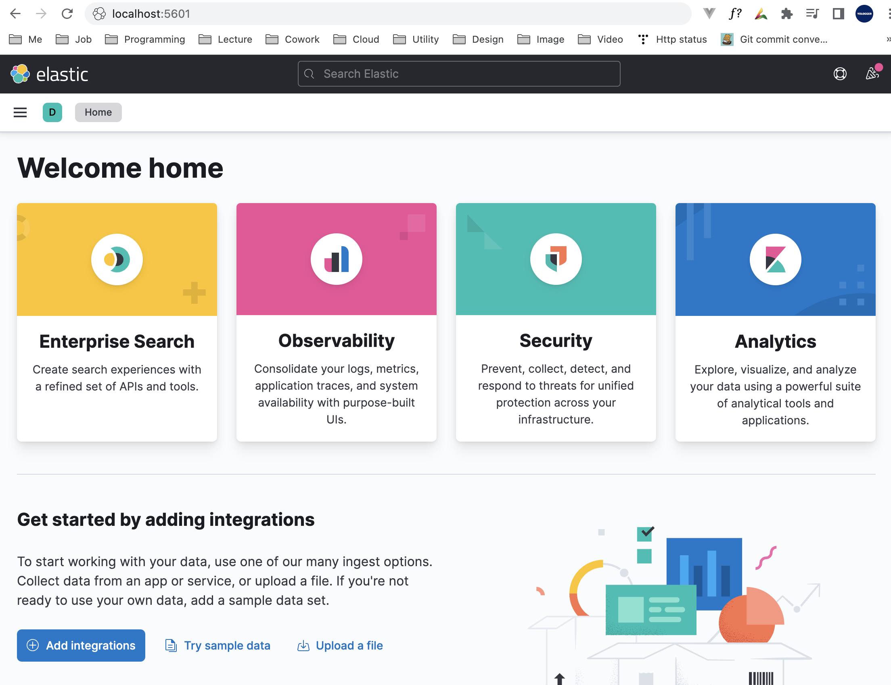
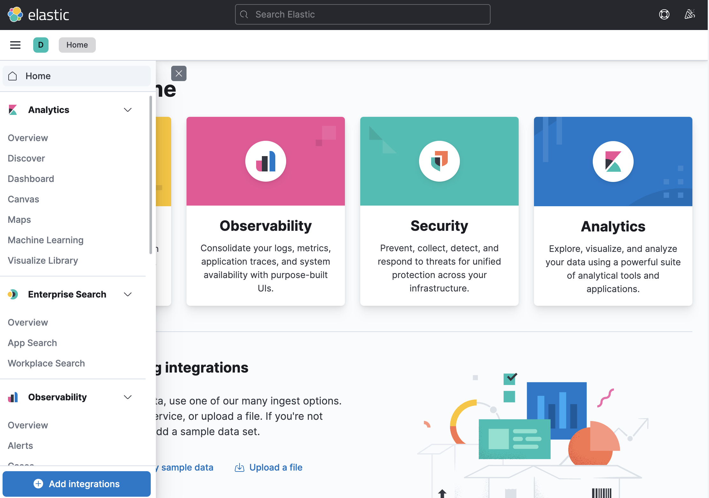
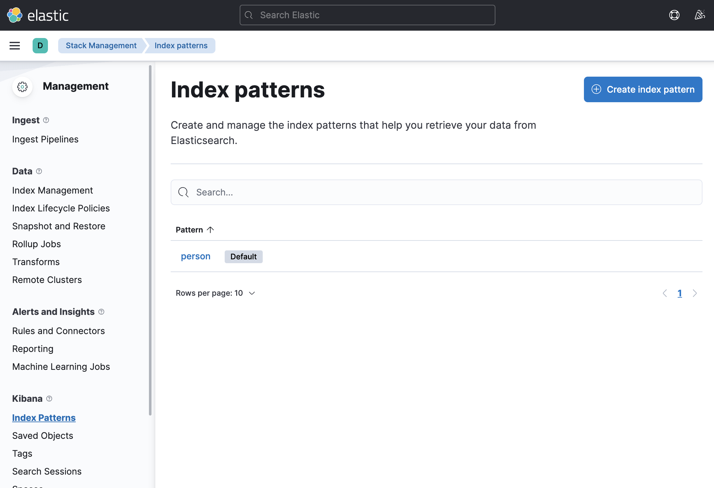

# Table of Contents
[[toc]]

# Kibana
`Kibana`는 ElasticSearch에 저장된 데이터를 도형, 그래프 등으로 보여주는 데이터 시각화 도구다.


## 설치와 설정
Mac OS에서는 Homebrew로 `Kibana`를 설치할 수 있다.
```
$ brew install elastic/tap/kibana-full
```
Homebrew로 Kibana로 설치한 경우 `/usr/local/etc/kibana/kibana.yml`에 설정 파일이 위치한다.
```
$ vim /usr/local/etc/kibana/kibana.yml
```
Kibana와 Elastic Search를 연동하기 위해서 Kibana 설정 파일을 수정해야한다. `kibana.yml`파일에서 `server.port`와 `elasticsearch.hosts`속성의 주석을 풀어주자.
``` {3,33}
path.data: /usr/local/var/lib/kibana/data
# Kibana is served by a back end server. This setting specifies the port to use.
server.port: 5601

# Specifies the address to which the Kibana server will bind. IP addresses and host names are both valid values.
# The default is 'localhost', which usually means remote machines will not be able to connect.
# To allow connections from remote users, set this parameter to a non-loopback address.
#server.host: "localhost"

# Enables you to specify a path to mount Kibana at if you are running behind a proxy.
# Use the `server.rewriteBasePath` setting to tell Kibana if it should remove the basePath
# from requests it receives, and to prevent a deprecation warning at startup.
# This setting cannot end in a slash.
#server.basePath: ""

# Specifies whether Kibana should rewrite requests that are prefixed with
# `server.basePath` or require that they are rewritten by your reverse proxy.
# This setting was effectively always `false` before Kibana 6.3 and will
# default to `true` starting in Kibana 7.0.
#server.rewriteBasePath: false

# Specifies the public URL at which Kibana is available for end users. If
# `server.basePath` is configured this URL should end with the same basePath.
#server.publicBaseUrl: ""

# The maximum payload size in bytes for incoming server requests.
#server.maxPayload: 1048576

# The Kibana server's name.  This is used for display purposes.
#server.name: "your-hostname"

# The URLs of the Elasticsearch instances to use for all your queries.
elasticsearch.hosts: ["http://localhost:9200"]

## 생략...
```
이제 ElasticSearch 서버가 구동된 상태에서 Kibana 서버를 구동하자.
```
$ brew services start elastic/tap/kibana-full
```
```
$ brew services list
Name                  Status  User     File
elasticsearch-full    started yologger ~/Library/LaunchAgents/homebrew.mxcl.elasticsearch-full.plist
kibana-full           started yologger ~/Library/LaunchAgents/homebrew.mxcl.kibana-full.plist
```
`http://localhost:5601`로 접속하면 다음과 같이 Kibana 페이지에 접근할 수 있다.



왼쪽 사이드바에서는 Kibana가 제공하는 다양한 기능을 확인할 수 있다.



## Kibana Management
`사이드바 > Managerment > Stack Management > Kibana > Index Pattterns`로 이동하면 Elastic Search의 Index를 확인할 수 있다.

